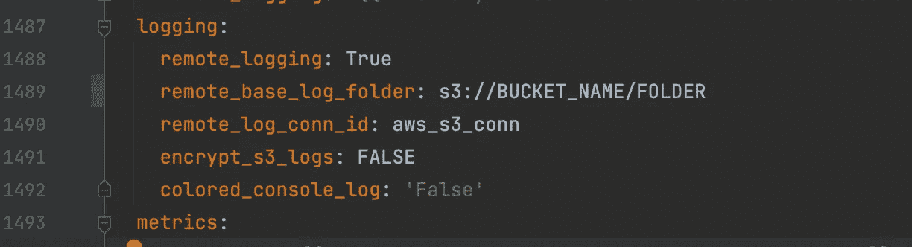

# 在 eks 上安装气流

> 原文：<https://blog.devgenius.io/installing-airflow-on-eks-20439a9e58e7?source=collection_archive---------3----------------------->

本指南将指导您在 amazon eks 集群(即托管 k8s 集群)上安装 apache-airflow。

该设置包括您想要的 python 版本，使用带有 Keda 自动缩放的 Celerykubernetes executor，并使用 Gitsync 获取您的 DAG。

您只需要一个 EKS 集群和一个 aws alb 控制器，这样您就可以从集群外部访问气流。

(我已经使用 eksctl 来启动集群，如果配置正确，这非常容易，并且可以投入生产)

链接在底部。

首先从官方的[气流舵图表网站](https://artifacthub.io/packages/helm/apache-airflow/airflow)下载数值文件(你可以很容易地跟随有例子的行号):

下载默认值

现在，我们将讨论重要的价值观:

气流图像和版本:

在这个例子中，我使用了 python 3.10 airflow image ( airflow 有一个 docker 图像，适用于大多数 python 3 版本 3.7–3.10，如果您确实需要的话，也适用于 python 2……)

[**链接到 docker 图片**](https://hub.docker.com/r/apache/airflow/tags) 气流支持并提供:

如果不希望 k8s 总是提取图像并使用缓存，可以使用 pullPolicy ifNotPresent

所以你需要适应你想要的 python 版本，只需选择正确的图像，例如 2 . 3 . 0——python3.9 会给你 python 3.9。

**使用 SSL 证书的下一个入口配置:**

您需要安装 aws alb 控制器(底部的链接)

注意路径类型——它需要有前缀

并且证书需要在 aws 证书管理器中，您将需要证书的 ARN，它可以从 aws 控制台复制。

此配置将为负载平衡器提供健康检查和直接指向您的 airflow web 服务器的证书。

(如果您不需要 https，只需删除证书注释和监听端口注释，默认为端口 80，因此您不需要它)

**下一个数据库配置:**

(如果您想使用默认的 Postgresql 数据库，请跳过这一步，尽管不建议在生产中使用):

您将需要一个带有 Postgres 的运行中的 RDS 实例，该实例很容易启动，只需记住数据库的凭证(如果您想安装自己的，我猜也是一样的)

这里有两种选择

1-使用包含用户/密码的 K8s 机密

2-只使用图表配置中的用户名/密码，这很简单，但是当你想把你的代码添加到 git 中时很烦人。

第一种选择:

如果您还没有在 airflow 命名空间中创建两个秘密(是的，两个，因为 airflow 的 resultBackendSecretName 需要不同的 URI ),现在就创建一个:

kubectl 创建 ns 气流

现在获取数据库的用户密码，并创建两个秘密:

kubectl create secret generic air flow-metabase-from-literal = connection = PostgreSQL://your username:[yourpassword@airflow-xxx.xxx.rds.amazonaws.com](mailto:airflowcontinueai666@airflow-metastore.cgelll8lobxj.us-east-2.rds.amazonaws.com):5432-n air flow

并且:

kubectl create secret generic air flow-metabase-back end-from-literal = connection = d b+ PostgreSQL://your username:[your password @](mailto:airflowcontinueai666@airflow-metastore.cgelll8lobxj.us-east-2.rds.amazonaws.com)your username:[yourpassword@airflow-xxx.xxx.rds.amazonaws.com](mailto:airflowcontinueai666@airflow-metastore.cgelll8lobxj.us-east-2.rds.amazonaws.com):5432-n air flow

配置值文件:

配置您的 Fernet 密钥:

使用 python3 生成一个:

来自 cryptography.fernet 导入 fernet

fernet_key = fernet . generate _ key()
print(fernet _ key . decode())#你的 fernet _ key

Flask 服务器密钥:

使用 python 生成一个:

`import secrets
secret_key = secrets.token_hex(16)
# example output, secret_key = 000d88cd9d90036ebdd237eb6b0db000`

**启用 Keda 自动缩放并配置图表:**

(如果您的 eks 集群链接中没有安装 Keda):

赫尔姆回购加科达科尔[https://kedacore.github.io/charts](https://kedacore.github.io/charts)

helm repo 更新

kubectl 创建名称空间 keda

helm install keda kedacore/keda \

—命名空间 keda \

—版本“v2.0.0”

启用持久性需要设置为 false

日志记录(为此我使用了 s3 存储桶)

因此，首先在您的帐户中创建一个存储桶。

*   pods 启动后，您需要在 airflow 中添加一个名为 aws_s3_conn 的连接(使用 IAM 角色时，不需要添加凭据，如果您不使用 IAM 角色，则需要添加 aws 密钥 ID 和密码)

配置图表:

**GitSync:**

我使用过 ssh 密钥:

所以首先生成一个 ssh 密钥，并添加公钥作为部署密钥(当您将它添加到 Github 或您使用的任何 git 服务器时，只需要读取权限)

ssh-keygen-t RSA-b 4096-C " your _ email @ example . com "

现在将私钥转换为 64 进制

base64<my-private-ssh-key></my-private-ssh-key>

在 gitSshKey 之后创建一个包含 base 64 密钥补丁的 yaml 文件:

apiVersion: v1
种类:Secret
元数据:
名称:airflow-ssh-secret
数据:
gitSshKey:xxxxxxxxxxxxxxx

并且:

kubectl apply -f yamlfile.yaml -n 气流

现在配置图表:

配置机密和已知主机文件:

ssh-keyscan-t RSA github.com—获取 Github 的 knownHosts 值

# 安装图表:

首先添加回购

掌舵回购添加阿帕奇-气流 https://airflow.apache.org

现在安装它:

头盔升级-安装气流 Apache-气流/气流-f 值. yaml

这就是我没有！

**链接:**

安装 eks 群集(如果您还没有):

[https://eksctl.io/usage/creating-and-managing-clusters/](https://eksctl.io/usage/creating-and-managing-clusters/)

官方气流舵图:

 [## 气流 1 . 6 . 0 Apache-气流/Apache-气流

### 用于部署 Apache 气流的官方 Helm 图表，这是一个以编程方式创作、计划和监控的平台……

artifacthub.io](https://artifacthub.io/packages/helm/apache-airflow/airflow) 

官方 aws alb 控制器安装指南:

 [## 安装 AWS 负载平衡器控制器附加组件

### AWS 负载平衡器控制器管理 Kubernetes 集群的 AWS 弹性负载平衡器。财务总监规定…

docs.aws.amazon.com](https://docs.aws.amazon.com/eks/latest/userguide/aws-load-balancer-controller.html)