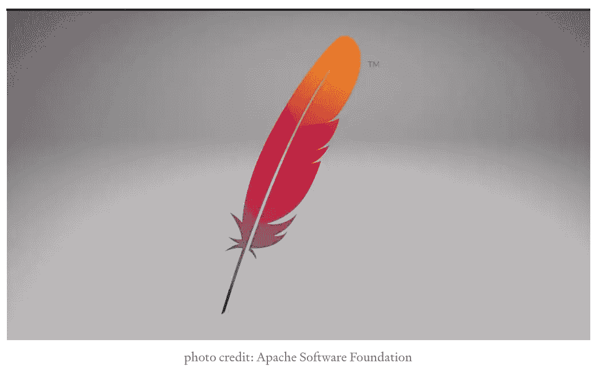
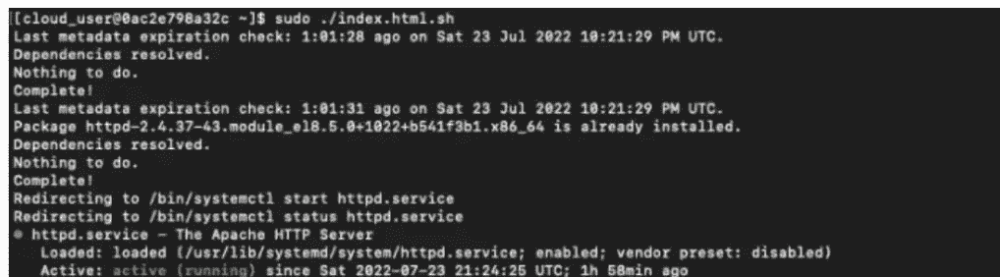

# 使用 CentOs 8 服务器安装 Apache(第 2 部分)

> 原文：<https://blog.devgenius.io/installing-apache-using-centos-8-server-part-2-4592dbfd063d?source=collection_archive---------12----------------------->



> 欢迎来到我的第一篇文章的第二部分&我的第一个项目！为了清晰起见，我决定将基础部分&分离出来，给那些只想找到如何创建 HTML 页面的人。以及如何使用 bash 脚本实现自动化。
> 
> *在我项目的第一部分，我向你展示了我是如何安装 Apache Web 服务器的。这是我上一篇文章中的高级&复杂部分，可以在这里*[](https://medium.com/@janita.gw13/installing-apache-using-centos-8-server-754d5bccb60a)**！所以，不能再拖延了。让我们开始第二部分吧！**

## **先决条件**

*   *CentOS 8 服务器(我用的是云大师游乐场)*
*   *Sudo 命令权限*
*   *对终端的访问*

*在本文的第一部分。我要完成以下任务:*

***步骤 1:更新服务器上的所有软件包***

***第二步:安装一个 Apache HTTP Web 服务器***

***步骤 3:启用 Apache Web 服务器***

***步骤 4:允许网络流量进入机器***

***第五步:获取 IP 地址&测试服务器***

*现在让我们继续我的项目的高级和复杂的部分！*

> *下面是我如何创建一个 HTML 页面以及创建和执行一个 bash 脚本。*

## ***高级:**
创建一个显示“欢迎来到 LUIT — <团队名称>”的 HTML 页面*

```
*sudo vim index.html.sh*
```

> *在文本编辑器中，我插入了以下命令*

```
*<html>Welcome to LUIT - Gold</html>*
```

## ***复杂的** :
创建并执行一个 bash 脚本来完成所有这些工作，从而实现流程的自动化。*

```
*#!/bin/bash
#automatewebserver
sudo yum updatesudo yum install -y httpdsudo service httpd startsudo service httpd statussudo firewall-cmd --permanent --add-service=httpsudo firewall-cmd  --zone=public --permanent --add-service=httpsudo firewall-cmd --reloadcurl -4 icanhazip.com<html>Welcome to LUIT - Gold</html>*
```

> *使用以下命令更新权限*

```
*sudo chmod u+x index.html.sh*
```

> *通过自动化 bash 命令来运行这个脚本*

```
*sudo ./index.html.sh*
```

**

*这就是我们成功地拥有了一个活跃的状态！*

*非常感谢您花时间阅读我的项目！*

# *我们连线吧！*

**

*我的 Linkedin 个人资料:[https://www.linkedin.com/in/janita-williamson-186a1a85](https://www.linkedin.com/in/janita-williamson-186a1a85)*

**

*我的 GitHub 用户名:MrsTorres[https://GitHub . com/MrsTorres/terra form/blob/main/wk20 project . TF](https://github.com/MrsTorres/Terraform/blob/main/wk20project.tf)*

**

*一个视觉日记，记录了我从医疗保健到科技世界的咖啡之旅！@caffeinatedtechie*