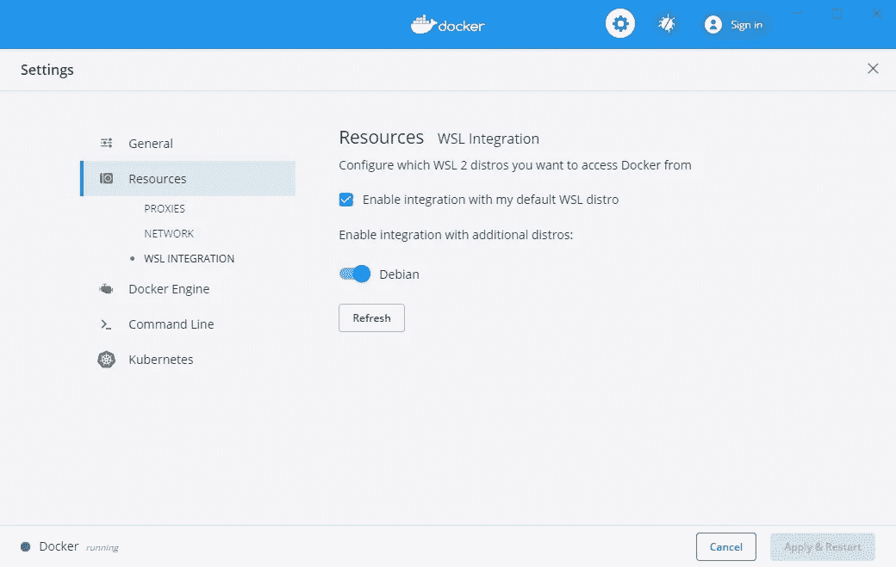

# 在 Windows 10 家庭版上安装 Docker

> 原文：<https://blog.devgenius.io/installing-docker-onwindows-10-home-edition-2e7c1b79d76d?source=collection_archive---------3----------------------->

## WSL2 不仅使在 Windows 中运行 Linux 成为可能


照片由 [Rinson Chory](https://unsplash.com/@nessa_rin?utm_source=medium&utm_medium=referral) 在 [Unsplash](https://unsplash.com?utm_source=medium&utm_medium=referral) 上拍摄

我不会在这篇文章中谈论 Docker。如果你正在阅读这篇文章，我假设你已经知道它，并试图找到如何让它在 Windows 10 家庭版中工作。

关于为什么在 Windows Home 上安装 Docker 不同于在其他地方安装它的一点背景知识。Windows Home edition 没有附带 Docker 运行容器所需的 Hyper-V 功能。Hyper-V 不同于硬件虚拟化，后者通过 Oracle VirtualBox 等工具来简化虚拟机(VM)的运行。

你可能听说过在 Docker 工具箱和 Oracle 虚拟盒子的帮助下在 windows 上运行 Docker。虽然这种方法是 100%可行的，但它淡化了 Docker 的用途，Docker 是一种轻量级的 VM 类环境，称为容器

随着 wsl 2(Linux 2 的 Windows 子系统)的推出，终于可以在 Windows Home edition 上原生安装 Docker 了。背景够了，开始安装 docker 吧

🕐️As 先决条件，你需要在 Windows 10 版本 2004。点击`Windows + R` 并输入`winver` 来检查你的版本。在写这篇文章的时候，Windows 还没有推出 2004 版的定期更新。如果您没有 2004 版，请执行以下操作

前往 Windows 10 [软件下载](https://www.microsoft.com/en-us/software-download/windows10)中心，点击*“立即更新”*。这将把 windows 10 更新到 2004 版。当心两件事，我花了 4 个小时在我的机器上完成这个过程。此外，请务必检查 2004 中是否有任何已知问题会影响到您

🕑您需要首先安装 WSL。为此，以管理员身份打开您最喜欢的终端**并输入以下命令**

```
dism.exe /online /enable-feature /featurename:Microsoft-Windows-Subsystem-Linux /all /norestart
```

🕒现在您可以更新到 WSL2 了

```
dism.exe /online /enable-feature /featurename:VirtualMachinePlatform /all /norestart
```

现在是时候重启你的机器了

🕓返回后，将 WSL2 设置为默认版本。以管理员身份打开终端

```
wsl --set-default-version 2
```

**🕔你现在必须做出艰难的选择。从 Windows [应用商店](https://aka.ms/wslstore)选择你最喜欢的 Linux 发行版**

****

**Meme from [me.me](https://me.me/i/run-linux-on-windows-install-and-run-linux-distributions-side-by-side-21267802)**

**我已经安装了 Debian，因为我在 Mac 上使用的大多数 Docker 映像都是基于 Debian 映像的**

**🕕安装发行版后，通过从 WSL 文档中的[链接](https://docs.microsoft.com/en-us/windows/wsl/wsl2-kernel#download-the-linux-kernel-update-package)下载并安装软件包来更新内核**

**🕖将已安装的发行版设置为使用版本 2。以管理员身份打开终端**并执行以下命令****

```
wsl --set-version <distribution name> <versionNumber>
wsl --set-version Debian 2
```

**🕘从 [Docker Hub](https://hub.docker.com/editions/community/docker-ce-desktop-windows/) 安装 windows Docker。安装完成后，打开 Docker 设置并启用资源中的发行版
设置>资源> WSL 集成**

****

**就这样，你都准备好了。看看码头工人的力量🐳在 Windows ⊞上**

## **来源**

**[https://docs.docker.com/docker-for-windows/wsl/](https://docs.docker.com/docker-for-windows/wsl/)**

**[https://docs.microsoft.com/en-us/windows/wsl/install-win10](https://docs.microsoft.com/en-us/windows/wsl/install-win10)**