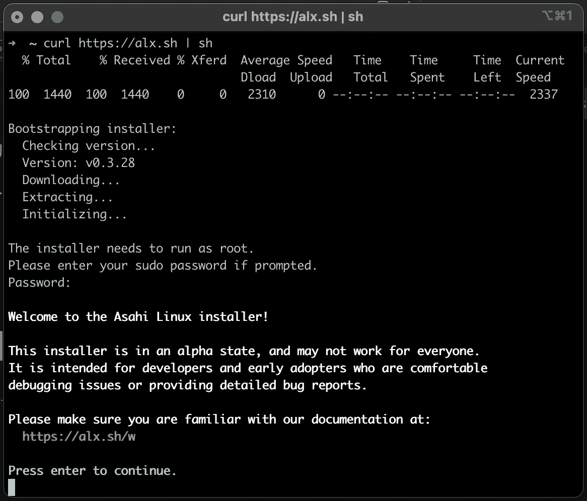
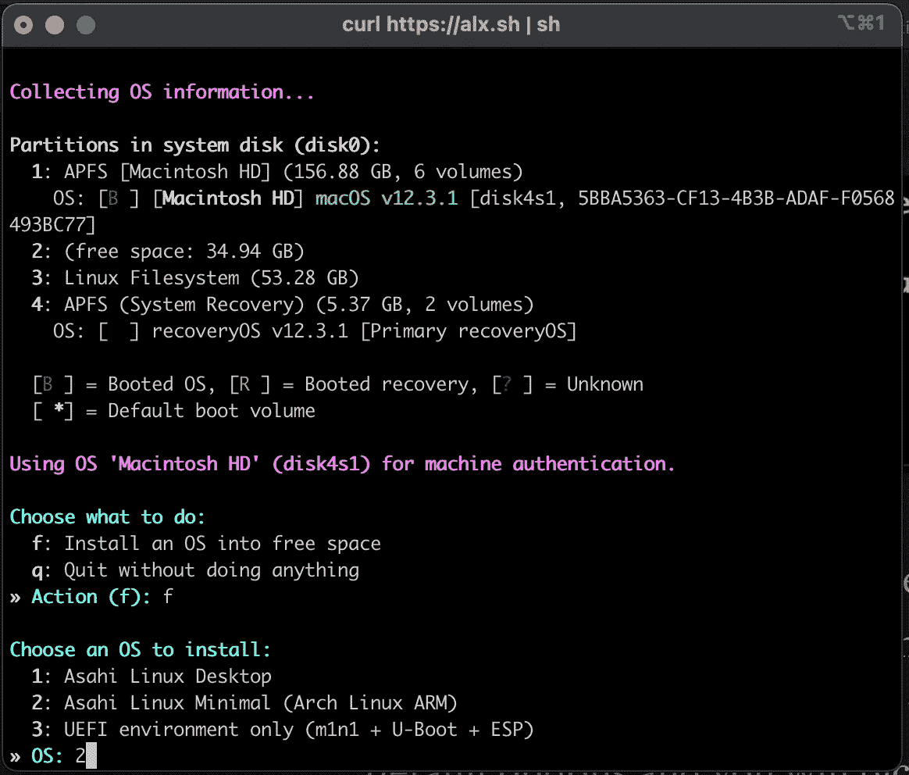
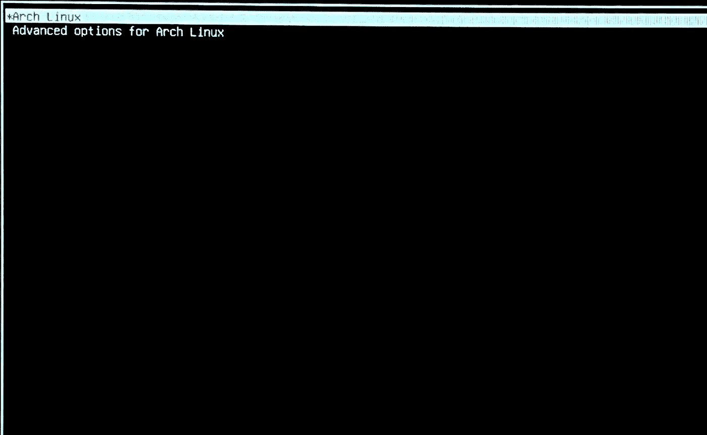

# 在苹果 Macbook Pro M1 安装 Gentoo Linux

> 原文：<https://blog.devgenius.io/installing-gentoo-linux-in-apple-macbook-pro-m1-49e163534898?source=collection_archive---------1----------------------->

很久以前我就想用媒体写我的第一篇文章。所以我决定开始我的作家故事，向你展示如何在 Macbook Pro 2020 上安装 Gentoo Linux，该 Macbook Pro 2020 采用 M1 处理器，由来自 Asahi Linux 项目(旨在将 Linux 引入苹果硅 MAC 的项目)的定制 Linux 内核提供支持。

目前，Asahi 附带了 Arch Linux，但是很少有非官方的安装指南来安装其他 Linux 发行版，比如 Debian 或 Fedora。在本教程中，我们将看到如何利用 Asahi installer 来进行磁盘分区和设置引导过程，然后如何使用 Asahi Linux 来准备和安装 Gentoo Linux，最后一个接一个地交换。

**先决条件:**

*   你有安装 Gentoo Linux 的经验。
*   你熟悉朝日安装程序
*   u 盘:用于存储 stage3 和 portage tar 文件，所以我们不需要互联网连接来获取这些文件。
*   USB 以太网适配器:用于互联网连接，直到我们的基本系统中安装了 Wi-Fi 适配器和 Wi-Fi 配置实用程序。

# 步骤 0 -下载基于 Gentoo 的系统

转到 Gentoo 网站，然后下载 Stage3 tarball 文件(适用于 AArch64 架构)并将其复制到 u 盘上。

# 步骤 1 -安装朝日 Linux 最小环境

让我们开始运行 Asahi Linux 安装程序，打开一个 shell 终端并键入以下命令:

```
**curl** [**https://alx.sh**](https://alx.sh) **| sh**
```

下载安装程序并输入您的管理员密码后，您将看到如下屏幕:



按“回车”继续(如屏幕所示)启动朝日设置，请仔细阅读说明，我发现默认选项适用于常见情况。这超出了本教程朝日安装程序的范围，我假设你将使用默认选项，你将选择操作系统选项:“朝日 Linux Minimal (Arch Linux ARM)”。



在某些时候，安装程序会显示相关的数据，例如创建的磁盘分区的 UUID，然后会要求我们仔细阅读接下来的说明。如果您正确地遵循了安装程序的说明，您的设备将会关闭，您需要等待至少 15 秒钟才能按下电源按钮。

完成 Asahi Linux 安装的剩余步骤，并为您的第一次系统引导做准备。在第一次启动时，您可以使用默认的根证书(root:root)登录 Asahi Linux 安装。

让我们开始为 Gentoo 准备一切。

# 步骤 2 -准备 Gentoo 基础系统

以 root 用户身份登录 Asahi Linux 后，需要安装 u 盘，为 Gentoo 文件创建一个文件夹，并将 stage3 tarball 内容复制到 Gentoo 文件夹中:

```
**#** mkdir -p /mnt/gentoo
**#** mkdir -p /mnt/usb
**#** mount /dev/sda1 /mnt/usb
**#** cd /mnt/gentoo
**#** tar xpvf /mnt/usb/stage3-*.tar.xz —-xattrs-include=“*.*” —-numeric-owner
**#** cd 
```

此时，Gentoo 基础系统文件被安装到 **/mnt/gentoo** 文件夹中。现在是时候从 Asahi 安装中复制一些东西了，特别是内核，它的模块和设备固件。

```
**#** cp -r /boot /mnt/gentoo
**#** cp -r /usr/lib/modules /mnt/gentoo/usr/lib
**#** cp -r /usr/lib/firmware /mnt/gentoo/usr/lib
```

Asahi Arch Linux 对内核模块使用 zstd 压缩算法，不幸的是，Gentoo 在 kmod 和 systemd 中默认不支持 zstd，因此我们的 Gentoo 基础系统需要重新编译，以便能够加载这些内核模块。

让我们开始设置 **make.conf** 文件:

```
**#** nano /mnt/gentoo/etc/portage.conf 
```

让我们调整一下 **COMMON_FLAGS** 变量，我将启用 *"-march=native"* 来指示系统编译器以 M1 特定处理器指令集为目标，这将转化为性能提升:

```
COMMON_FLAGS=“**-march=native** -O2 -pipe”
```

现在，让我们添加 **MAKEOPTS** 变量:

```
MAKEOPTS=“-j4”
```

我经常使用“ **-j8** ”，告诉 make 最多有 8 个并行构建作业，因为我的 Macbook Pro 有 8 个内核，但如果你有更多的内核，可以使用不同的数量。请注意，官方的建议是让尽可能多的 make 作业尽可能多，假设每个作业至少有 2gb 的 RAM 可用，这对于某些包(例如 Chromium)来说非常重要。

最后，让我们添加使用标志变量，我计划在我的 Gentoo Linux 中安装 KDE，所以除了 zstd 支持，我还启用了其他标志。

```
USE=”-gtk -gnome X kde qt5 systemd **zstd**”
```

保存文件，现在让我们在进入 Gentoo 安装之前挂载一些需要的文件系统。

```
**#** mount --types proc /proc /mnt/gentoo/proc
**#** mount --rbind /sys /mnt/gentoo/sys
**#** mount --make-rslave /mnt/gentoo/sys
**#** mount --rbind /dev /mnt/gentoo/dev
**#** mount --make-rslave /mnt/gentoo/dev
**#** mount --bind /run /mnt/gentoo/run
**#** mount --make-slave /mnt/gentoo/run
```

现在，是时候进入 Gentoo 基本系统了:

```
**#** chroot /mnt/gentoo /bin/bash
**#** source /etc/profile
```

在用 zstd 支持重新编译 Gentoo 基础系统之前，让我们从网上安装一个 Gentoo ebuild 库快照。

```
**#** emerge-webrsync
```

然后，更新@world set，它将使用 zstd 支持重新编译我们的系统。根据所选的 stage3 tarball 和网络带宽，此过程可能需要几分钟时间。

```
**#** emerge --ask --verbose --update --deep --newuse @world
```

随着基本系统的更新，让我们继续安装一些我们不久将需要的额外工具。

```
**#** emerge —-ask net-misc/dhcpcd **#** emerge —-ask net-wireless/wpa_supplicant
**#** emerge —-ask net-wireless/iw
```

现在让我们设置根密码:

```
**#** passwd
```

# 步骤 3 -备份阶段 4

基于 Gentoo 的系统已经可以使用了，它将提供一个最小的系统，在这个系统中可以引导一个更复杂的系统。让我们备份我们的系统以便以后使用。

首先，需要一个排除列表来避免备份一些不必要的文件夹:

```
**#** cat << EOF > /stage4.excl
.bash_history
/mnt/*
/tmp/*
/proc/*
/sys/*
/dev/*
/run/*
/stage4.excl
/stage4.tar.gz
EOF
```

现在，备份 Gentoo 基本系统的时间到了(此时通常称为 Stage4，因为它有基本系统+内核):

```
**#** tar cvzf /stage4.tar.gz -X /stage4.excl /
```

这个过程需要几分钟来备份整个系统。之后，我们可以退出 chroot，并将我们的备份复制到 USB 闪存盘:

```
**#** exit
**—- (Back to Asahi Linux)
#** cp /mnt/gentoo/stage4.tar.gz /mnt/usb
```

最后，卸载文件系统并重新启动系统:

```
# umount /mnt/usb
# reboot
```

# 步骤 4 -用 Gentoo 替换 Asahi Linux

下一次引导时，我们将通过按箭头键在 GRUB 引导程序屏幕中停止，这是一个必要的步骤，因为我们需要用我们的 Gentoo 基本系统替换 Asahi Linux 安装，但这不能在 Asahi Linux 运行时完成。



然后，按“e”键编辑 GRUB 配置。GRUB 配置告诉引导装载程序在哪里可以找到 Linux 内核和初始 RAMDISK。默认配置应该如下所示:

```
setparams ‘Arch Linux’
    load_video
    set gfxpayload=keep
    insmod gzip
    insmod ext2
    search —-no-floppy —-fs-uuid —-set=root <UUID>
    echo    ‘Loading Linux linux-asahi ...‘
    *linux   /boot/vmlinuz-linux-asahi* ***root=UUID=<UUID> rw loglevel=3 quiet*** echo    ’Loading initial ramdisk ...’
    initrd  /boot/initramfs-linux-asahi.img
```

编辑' *linux* '条目并删除传递给内核的参数(在前一个块中以粗体显示):

```
setparams ‘Arch Linux’
    load_video
    set gfxpayload=keep
    insmod gzip
    insmod ext2
    search —-no-floppy —-fs-uuid —-set=root <UUID>
    echo    ‘Loading Linux linux-asahi ...‘
    linux   /boot/vmlinuz-linux-asahi echo    ’Loading initial ramdisk ...’
    initrd  /boot/initramfs-linux-asahi.img
```

这将导致内核启动到恢复模式，从 RAMDISK 运行嵌入式环境。挂载 u 盘和朝日根分区:

```
**[rootfs ]#** mkdir -p /mnt/asahi /mnt/usb
**[rootfs ]#** mount /dev/sda1 /mnt/usb
**[rootfs ]#** mount /dev/nvme0n1p5 /mnt/asahi
```

删除朝日 Linux 的所有内容:

```
**[rootfs ]#** rm -Rf /mnt/asahi/*
```

将 Stage 4 tarball 文件的内容提取到 Asahi Linux 分区:

```
**[rootfs ]#** cd /mnt/asahi
**[rootfs ]#** tar xpvf /mnt/usb/stage4.tar.gz —-numeric-owner
```

Symlink 内核模块和固件目录:

```
**[rootfs ]#** chroot /mnt/asahi /bin/bash
—- Chroot Gentoo Linux —-
**#** rm -Rf /lib/firmware
**#** ln -s /usr/lib/firmware /lib/
**#** ln -s /usr/lib/modules /lib/
```

最后，重新启动进入 Gentoo:

```
**#** reboot -f
```

# 步骤 5 -在 Gentoo Linux 中建立网络

重新启动后，您可以使用之前为 root 帐户设置的凭据登录。您可能会注意到没有网络连接，我们需要配置 Gentoo 来获得网络访问。我将展示如何手动启用 Wi-Fi 连接，我假设您已经有足够的经验来完成设置您的 Gentoo 安装。

让我们列出系统中所有可用的网络接口:

```
**#** ifconfig -a
```

在我的例子中，我看到列出了 **wlp1s0f0** 网络接口。调出这个界面:

```
**#** ifconfig wlp1s0f0 up
```

让我们验证接口是否可以扫描网络:

```
**#** iw wlp1s0f0 scan
```

此时，您应该会看到附近的网络。要连接到这些网络之一:

```
**#** wpa_passphrase <SSID> <Password> >> /etc/wpa_supplicant.conf
```

启动 wpa_supplicant 和 dhcpcd 守护程序:

```
**#** wpa_supplicant -B -i wlp1s0f0 -c /etc/wpa_supplicant.conf
**#** dhcpcd wlp1s0f0 
```

此时，您应该已经安装了有效的 Gentoo，并且可以继续阅读手册安装指南。

黑客快乐！