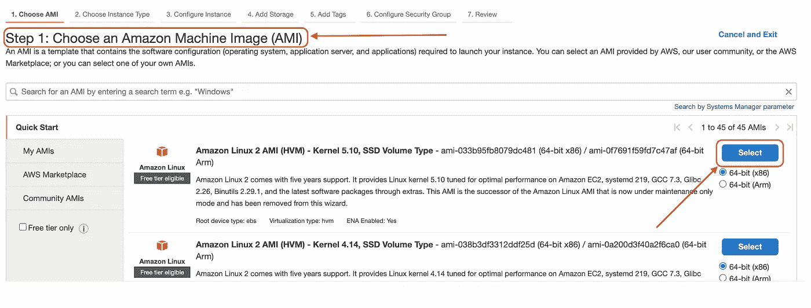
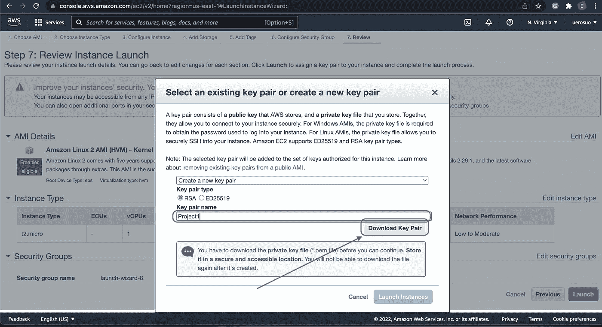
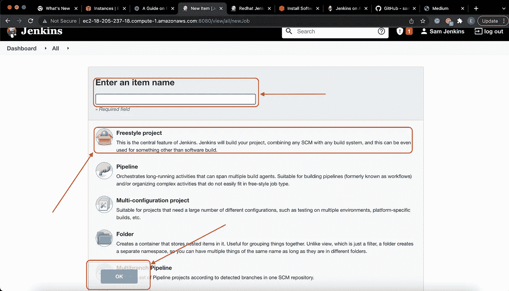

# 在 EC2 实例上安装 Jenkins 并构建您的第一个项目——初学者指南

> 原文：<https://blog.devgenius.io/installing-jenkins-on-an-ec2-instance-and-building-your-first-project-a-beginners-guide-7921108a69bc?source=collection_archive---------1----------------------->


**照片来源:Avi 代码**

在本文中，我将记录我是如何在 EC2 实例上安装 Jenkins 并在 Jenkins 上创建我的第一个项目的

据[**詹金斯**](https://www.jenkins.io/) **，**詹金斯是一款开源的自动化服务器，能够让全世界的开发者可靠地构建、测试和部署他们的软件。

根据 [**TechTarget**](https://searchaws.techtarget.com/definition/Amazon-EC2-instances#:~:text=An%20Amazon%20EC2%20instance%20is,Web%20Services%20(AWS)%20infrastructure.) 的说法，亚马逊 EC2 实例是**亚马逊弹性计算云(EC2)中的虚拟服务器，用于在亚马逊 Web 服务(AWS)基础设施上运行应用程序。**

我将带您完成在一个 **EC2 实例上安装 Jenkins 的过程。**

你需要的工具:

*   访问互联网
*   亚马逊账户
*   端口为 8080 的安全组已打开
*   Jenkins 安装程序
*   Java SDK 11
*   耐心

**步骤 1:设置 EC2 实例:-**

登录 AWS 账户，点击页面右上角的**服务**菜单，会出现下拉菜单，选择**计算**会弹出一个子菜单，选择 **EC2** ，如下图所示。这将带您进入 **EC2** 实例页面。


**亚马逊控制台**

继续**启动实例**。


**启动实例**

一旦我们进入实例页面，第一步是选择 Amazon 机器映像(AMI)，这是设置 EC2 实例的第一步。选择自由层**亚马逊 Linux 2 AMI (HVM) —内核 5.10，SSD 卷类型。**



然后，第二步是选择实例类型，确保选中标记为“Free Tier Eligible”的框，现在单击屏幕右下角的**Next:Configure Instance Details**按钮。


第三步**“配置实例细节”**将保留默认设置，并继续下一步。


第四步是**“添加存储”**，也将保持默认设置不变。继续点击页面右下角的**添加标签**按钮，进入下一步。


第五步是**“添加标签”，**我们将向实例添加一个标签。点击**键**选项正下方的**添加标签**按钮。


在**添加标签**页面上，将空字段标记如下 **Key:** Name， **Value:** Jenkins_Server。点击**下一步:配置安全组**


第六步**【配置安全组】，**点击**添加规则。**


现在，将**协议**设置为 **TCP** ，将**端口**设置为 **8080，**点击**查看并启动。**


查看并启动 **EC2 实例。**


单击启动实例按钮。


选择现有的密钥对或创建新的密钥对。



如上图所示创建一个新的密钥对并启动。


检查启动状态。


向下滚动以查看实例。


现在，该实例已经启动并正在运行。我们将链接(SSH)到我们的 EC2 实例中。

**链接(SSH)到已经创建的 EC2 实例**

首先，从 EC2 实例复制公共 IP 地址。然后在本地计算机上的终端上运行下面的代码，使用 SSH 登录到 EC2 实例:

$ `ssh -i launch.pem ec2-user@3.84.253.47`


然后使用以下命令安装 Java:

`$ which amazon-linux-extras`


`$ amazon-linux-extras`


`$ sudo amazon-linux-extras enable java-openjdk11`


```
[ec2-user ~]$ sudo yum clean metadata && sudo yum install java-openjdk11
```


现在使用下面的命令将 Jenkins 添加到存储库中:

```
[ec2-user ~]$ sudo wget -O /etc/yum.repos.d/jenkins.repo \
    https://pkg.jenkins.io/redhat-stable/jenkins.repo
```


添加 Jenkins CI 中的密钥文件，以便从软件包中启用 Jenkins 安装:

```
[ec2-user ~]$ sudo rpm --import https://pkg.jenkins.io/redhat-stable/jenkins.io.key
```


```
[ec2-user ~]$ sudo amazon-linux-extras install epel
```


**安装詹金斯:**

```
[ec2-user ~]$ sudo yum install jenkins
```


要使 Jenkins 服务在引导时启动，请将 Jenkins 作为服务启动并检查状态:

```
[ec2-user ~]$ sudo systemctl enable jenkins[ec2-user ~]$ sudo systemctl start jenkins[ec2-user ~]$ sudo systemctl status jenkins
```


# **配置詹金斯**

Jenkins 现已安装并运行，请继续配置 Jenkins。为此，请使用浏览器通过管理控制台连接到 Jenkins:

回到您的亚马逊(AWS)帐户，复制公共 IPv4 DNS 地址:


**公共 IPv4 DNS 地址**

`http://<your_server_public_DNS_address>:8080`

将地址粘贴到您最喜欢的浏览器上，然后启动

```
http://ec2-18-205-237-18.compute-1.amazonaws.com:8080
```

这将打开 Jenkins 配置页面，帮助您入门。

键入以下命令在终端上显示初始密码:

```
[ec2-user ~]$ sudo cat /var/lib/jenkins/secrets/initialAdminPassword
```


**初始密码显示命令**

执行命令后，复制显示的字母数字键:


**初始密码显示**

将从您的终端复制的密码粘贴到 Jenkins 配置页面上提供的字段中，然后单击继续。


**詹金斯配置页面**

在“入门”页面上，单击“安装建议的插件”来初始化所需的插件，以帮助执行项目。


**入门**

安装将运行一段时间，之后，它们将加载 Jenkins 管理控制台。


**插件安装**

安装完成后，您会看到下面的提示。创建第一个管理员用户。


**创建第一个管理员**


**入门**

登录到控制台后，配置 Java 路径:

单击控制台页面左侧的“管理 Jenkins”。


**詹金斯仪表盘**

单击全局工具配置按钮。


**管理詹金斯**

**添加 JDK** → **添加 Java 路径** → **取消勾选自动安装框并保存**。


**全局工具配置**

构建您的第一个样本项目

从**仪表盘**点击仪表盘右上角的**新项目**按钮。


**仪表盘**

为项目输入一个**名称**如“我的开发之旅”，选择 F**re style 项目**并点击 **OK** 。



**项目**

从窗格中选择**构建环境**，向下滚动到**添加构建步骤**选择**执行 shell。**


**构建环境**

在**执行 shell** 命令框中输入该命令:**回显“欢迎来到我的 DevOps 之旅”**，点击保存。


**执行外壳**

要检查项目的状态，选择立即构建→构建历史→ #1 →控制台。


**项目状态**


**控制台输出**

**恭喜你！！！！您已经成功构建了您的第一个 Jenkins 项目。**

Yaaaaaaay！！！！我们做到了！！！

现在，请记住，这篇文章不仅是给软件领域的专家看的，即使是新手也可以从中学习到很多东西，这就是为什么我试图用外行和专业的术语把一切都讲清楚，所以如果您有任何问题，可以通过[**Twitter**](http://www.twitter.com/anh01x)**联系我，或者通过**[**GitHub**](https://github.com/uerosuo)**找到我。**

**感谢阅读❤️**

如果你对这个话题有任何想法，请留下评论——我乐于学习和探索知识。

**点击订阅按钮，了解更多关于 DevOps 和云的内容。**