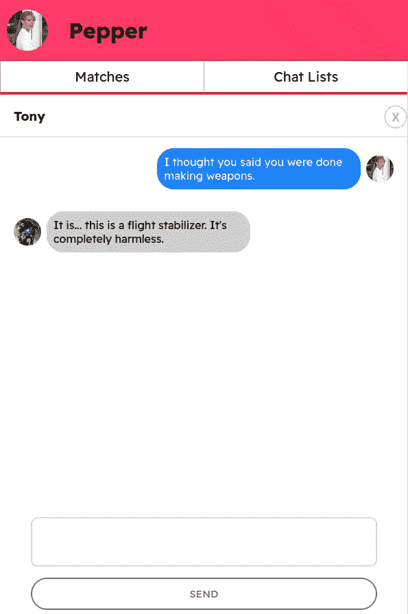
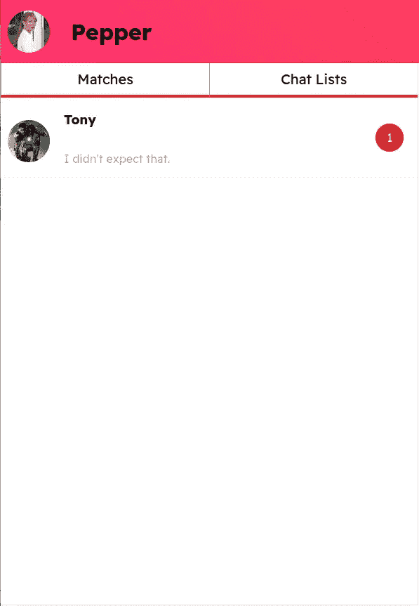

# 将 Action Cable 与 React 和 Ruby on Rails 集成起来，构建一个一对一的聊天应用程序

> 原文：<https://blog.devgenius.io/integrate-action-cable-with-react-and-ruby-on-rails-to-build-a-one-to-one-chatting-app-4f0feb5479e6?source=collection_archive---------0----------------------->

最近，我正在开发一款带有一对一聊天功能的约会应用。一切都按照计划进行，直到我意识到聊天不像发表评论，当有消息传入时需要通知接收者，这意味着我需要找到一种方法使服务器能够与客户端通信，而无需客户端首先发出请求。介绍 Action Cable，这正是我们解决问题所需的技术。

网上有很多关于 Action Cable with React 的文章，但大多数文章使用 React 的方式并不是一个独立的应用程序，我的意思是在这些文章中。React 的 js 文件在 Rails 目录下，比如 app/channels，app/javascript，我很难用这种方式实现 Action Cable。

很少有帖子讨论使用 Rails 作为后端，React 作为前端，但是这些帖子要么讨论的是聊天室，而不是一对一的消息传递，要么没有触及通知的主题。所以，如果你像我一样，想要建立一个一对一的聊天功能，让 Rails 和 React 分别做他们的工作，请继续阅读。

我发现，当人们讨论行动电报时，他们往往会大量引用官方文件，这至少有时会让我更困惑，所以我想从一个初学者的角度谈谈它，我相信如果我能抓住这个想法，你肯定会。

首先，什么是行动电缆？它使用一种不同的协议，称为 WebSockets，与 HTTP 相反(当我们发出 RESTful 请求时，我们很熟悉 HTTP)。当我们使用 HTTP 时，正常的流程是**客户端 A** 发出请求，服务器用数据响应**客户端 A** 。但是如果你想一想，我们需要一个聊天应用程序，当**客户端 A** 发送请求时，我们希望服务器向**客户端 B** 发送数据，HTTP 协议不能够实现这一点。

上面的例子说明了 HTTP 和 WebSockets 之间的关键区别，知道这一点非常有帮助。现在，从整体的角度来看，我们要做的是在服务器中的某个地方(称为**通道**)和前端的某个地方(称为**消费者**)之间建立一个链接(用 Action Cable 的术语来说，称为**连接**)。当服务器收到来自**客户端 A** 的 REST 请求时，在控制器动作中，除了正常的代码之外，我们增加了一个命令，告诉服务器通过我们上面建立的链接(称为**广播**)向**客户端 B** 发送数据。

好了，冗长的概述到此为止，让我们进入一些真正的代码。我假设你熟悉基本的 Ruby on Rails 设置，比如创建新的 Rails 应用程序和使用 Rails generator 创建模型、控制器等等。

首先，按照以下步骤设置操作电缆:

1.  在 gem 文件中取消注释 redis 并运行:`bundle install`
2.  你需要安装 redis-server，安装过程取决于你的系统，通过谷歌搜索 redis-server 和你的系统名可以很容易地找到教程。安装 redis 服务器后，不要忘记运行它。
3.  打开 config/cable.yml 文件，将开发中的适配器更改为 redis，不要担心生产，我会在最后链接一个关于如何配置它以部署到 Heroku 的好帖子。您的 cable.yml 文件应该如下所示:

cable.yml

打开 config/routes.rb 文件，将其更改为如下所示:

routes.rb

`mount ActionCable.server => "/cable"`就像您定义的处理 HTTP 请求的常规路由，不同之处在于它处理 WebSockets 连接。**“cable”**可以是你喜欢的任何关键字，你需要相应地改变你的前端代码，我只是按照惯例把**“cable”**放在这里。

现在我们已经设置好了 action cable，让我们深入了解如何使用它。但是首先，花点时间考虑一下我们如何实现 HTTP 请求和响应。我们首先在 routes.rb 文件中定义一个路由，它指向特定的控制器，该控制器执行我们让它做的任何事情。至于 WebSockets，我们已经定义了路由(**“cable”**)，让我们来设置“控制器”。

在您的终端中，键入:

`rails g channel chats -T`

想想你在创建控制器的时候做了什么，这就变得更容易记住了。T 告诉生成器跳过测试文件。

现在进入 app/channels，你会发现一个名为 chats_channel 的新文件:

初始聊天 _channel.rb

我最终的 chats_channel 是这样的:

最终聊天 _channel.rb

我来解释一下。名称 **ChatsChannel** 很重要，为了让 action cable 工作，我们的前端代码需要连接(订阅 action cable 的术语)到一个通道，在这种情况下，通道名称是 **ChatsChannel。**

`stream_from`仅仅意味着创建一个名为

`chat_#{params[:user_id]}#{params[:recipient_id]}`在 channel **ChatsChannel** 中，你可以选择任何你想要的名字，但是前端需要相应地匹配这个名字。

在我的例子中，任何对带有 **user_id** 和 **recipient_id** 的 **ChatsChannel** 的前端 WebSockets 请求都会初始化一个惟一的(因为 **user_id** 和 **recipient_id** 的组合是惟一的)连接。

为了让你更好地理解 action cable 背后的逻辑，让我们来看看建立一个聊天室应用程序和一对一聊天应用程序之间的区别。

创建聊天室应用程序:

聊天室频道 rb

注意这两个版本的区别，用`chat_#{room_id}`代替`chat_#{params[:user_id]}#{params[:recipient_id]}`，所有加入聊天室的用户都将订阅 **ChatsChannel** ，**和**初始化相同的连接(由于给定了相同的 **#{params[:room_id]** ，**chat _ # { params[:room _ id]}**是相同的)。

总之，为了使 action cable 工作，您需要创建一个从前端连接到的通道，但是每个通道可以有许多连接，这取决于您的需要。对于聊天室应用程序，所有用户都在一个房间里，所以我们只需要每个人一个连接，但对于一对一的聊天应用程序，每个用户都需要有他/她自己的连接，因此，我们需要为特定用户建立唯一的连接。

在这一点上你可能会感到困惑，我们到底在做什么？嗯，记住我们的目标，我们需要我们的服务器发送数据(**主动**)到我们的前端。因此，我们一直在做的是在服务器和前端之间建立一个链接。

现在我们已经(部分)完成了我们的后端部分，让我们把注意力转向前端，就像我前面提到的，我对我的前端使用 React，我假设你对 React 有基本的了解。

首先使用以下命令安装操作电缆:

`npm install actioncable`

将 index.js 更改如下:

索引. js

这里需要注意几件事:

1.  CableApp 和 CableApp.cable 只是约定俗成，没有特别的含义。
2.  actionCable.createConsumer 来自我们刚刚安装的 actionCable 包。它允许我们通过 WebSockets 连接到我们的后端，请注意**ws://localhost:3000/cable**，我们不再使用 **http** ，而是使用 **ws** ，这意味着 WebSockets。3000/后的**电缆**需要与我们在定义路线时所拥有的相匹配。还记得`mount ActionCable.server => "/cable"`吗？
3.  将**线缆**向下传递到 App 组件作为道具。您可以利用 useContext 来避免 prop drilling，但是这超出了本文的范围。

现在我们已经设置了连接到服务器的 WebSockets 路由的前端，下一步将是连接到服务器的通道。

下面是我的 chat.js 文件，它负责显示聊天历史:

聊天. js

最终产品看起来像这样:

为了简单起见，我省略了与主题无关的代码，我将在最后链接我的 GitHub repo 供您参考。

这里需要注意的是:

1.  第一个 useEffect 就像一个普通的函数，它向服务器发出一个请求，询问聊天历史，并使用响应设置状态。
2.  第二个使用效果在这里很重要。`subscriptions.create`来自我们在 index.js 文件中创建的**电缆**。它的功能是连接到后端中特定通道内的连接。它有两个对象，第一个定义它将连接到哪个通道和连接。注意，第一个对象的内容与我们在 **ChatsChannel** 中定义的内容相匹配:

chats_channel.rb

现在我们已经连接了一个连接，第二个对象定义了当服务器发送回一些数据时会发生什么，我们只需使用 spread 操作符设置消息状态。

现在的问题是，我们如何将数据从服务器发送到前端。好吧，我们来考虑一下 app 的流程:Tony 需要先给 Pepper 发一条消息，只有在那之后，Pepper 才会收到消息。让我们首先构建负责发送消息的组件:

聊天输入. js

这里没有什么复杂的，当用户发送消息时，它向后端发出 POST 请求。神奇的事情发生在我们的后端接收 POST 请求时，让我们看看处理这个 POST 请求的控制器:

消息 _ 控制器. rb

message.rb

考虑一下流程:当 Tony 向 Pepper 发送消息时，我们的控制器接收到请求，并且在我们的数据库中创建新记录。然后我们打电话

`ActionCable.server.broadcast`这是一个内置功能，用于向订阅了特定频道的特定连接的消费者广播数据。你问哪个渠道和连接？这将是 Pepper 在她的 Chat.js 组件中订阅的通道和连接。我知道我有点罗嗦，但请允许我更详细地解释一下:

托尼和佩珀都订阅了:

`chat_#{params[:user_id]}#{params[:recipient_id]}`。

但是假设托尼的用户标识是 1，佩珀的用户标识是 2，那么托尼订阅了:`chat_12`，佩珀订阅了:`chat_21`。

看到区别了吗？当 Tony 给 Pepper 发送消息时，我们的控制器收到的是:user_id: 1，recipient_id: 2，它广播到的通道和连接是:`ActionCable.server.broadcast("chat_21", message)`，那就是 Pepper 的连接！因此，Pepper 接收到数据，这就是消息！

现在我们有办法让我们的服务器主动将数据发送到我们的前端，我们的视野被拓宽了，有了这种强大的力量，我们可以实现更多。

在文章的第二部分，我想谈谈通知的实现，下面的图片展示了我正在谈论的内容:

这里的关键是为托尼设置一个【T4 最后一次阅读】属性，该属性与他和佩珀之间的聊天相关联。当 Tony 关闭他和 Pepper 之间的聊天时，我们需要将这个最后读取的属性发送到我们的服务器。所以当我们卸载一个组件时，基本上我们需要做一些事情，这正是 useEffect 的清理功能所做的！让我们来看看完整版的 Chat.js 组件:

聊天. js

正如我们所看到的，我们将补丁请求放在 useEffect 中的 return 函数内，这意味着在组件即将被卸载之前，return 函数将被触发，从而将当前时间发送回服务器。

为了显示未读消息，我们可以向服务器发出一个 fetch 请求，请求获取用户对于某个特定聊天的**最后一次阅读的**，并将消息的 **create_at** 属性与最后一次阅读的进行比较，如果 **create_at** 较大，则为未读消息。

由于这篇文章的长度，我将在这里暂停一下，在另一篇文章中讨论通知。如果你想马上看到我是如何实现整个特性的，请看看我的 repo。

有几点需要注意:

1.  你可能会发现，除了`stream_from`，还有一个`stream_for`，他们基本上是一个东西。但是`stream_from` 期望一个字符串，`stream_for` 期望一个来自模型的散列，[本文](http://laithazer.com/blog/2017/03/25/rails-actioncable-stream-for-vs-stream-from/)详细解释了两者的区别。
2.  您可能还会发现在通道文件中定义了一个接收方法:

chats_controller.rb

记住，WebSockets 就像 HTTP 协议一样，它也可以发送数据！让我们回到 Tony 和 Pepper 之间的聊天，而不是像我一样通过 HTTP POST 请求发送新消息，我们可以通过 WebSockets 协议发送消息，消息将在我们的通道中由 receive 方法接收，而不是处理控制器中的所有逻辑，我们现在可以处理通道中 received 方法中的所有逻辑。

我更喜欢传统的方式，通过 HTTP 发送消息并在控制器中处理逻辑，但这是个人偏好，您可以自己尝试一下，看看您更喜欢哪种方式。

点击 [me](https://github.com/ruokaizhao/dating-app) 进行该项目的 GitHub 回购。

点击 [me](https://medium.com/swlh/deploying-a-rails-react-app-with-actioncable-to-heroku-cb5d42f41a2a) 了解如何在生产中设置 action cable 并将其部署到 Heroku。

这是一个很长的帖子，我已经太啰嗦了，但我只想写下我在这个项目中所学到的所有东西。如果你有任何问题，请留下评论，我会尽快回复你。感谢阅读！