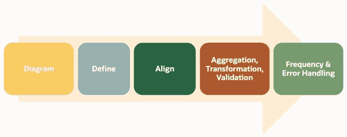
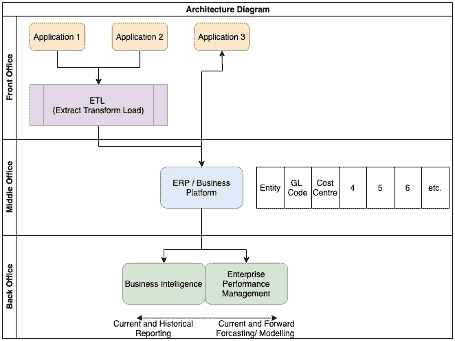
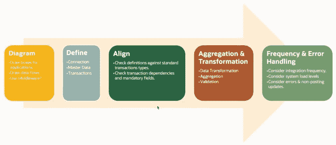

# 成功集成应用程序；降低复杂性的框架

> 原文：<https://blog.devgenius.io/integrate-applications-successfully-a-framework-to-reduce-complexity-e9cce0d6f2f5?source=collection_archive---------40----------------------->

克里斯·阿布尼在 [Unsplash](https://unsplash.com?utm_source=medium&utm_medium=referral) 上的照片

鉴于其广泛的功能范围，ERP /商业会计平台处于全球商业的核心。根据业务类型的不同，这些平台可以在一个应用程序中涵盖广泛的运营和财务流程。然而，对于一些行业，通常是那些具有高度复杂或特殊运营流程的行业，需要将核心业务/会计平台[集成到其他解决方案中](https://tomcurtress.com/erp-jack-of-all-trades-master-of-none-how-to-save-time-and-avoid-unrealistic-expectations-when-selecting-erp-systems)。作为公司内的软件顾问或系统管理员，我们熟悉我们最熟悉的应用程序/业务平台内的解决方案需求或依赖性。然而，集成的话题迫使我们不仅要考虑单个应用程序的需求，还要考虑其他应用程序的需求、功能和技术界限。

本文试图介绍一个框架，我一直用它来剖析所有的集成对话，从而轻松地产生关于项目和成功的集成实现的集成工作文档。在应用程序之间不存在预先构建的集成的情况下，这个框架特别有用。然而，该框架仍然与讨论数据流相关，在数据流中，技术连接的复杂性已经存在，集成仍然更多地是一种配置练习。

# 框架

图片来源:版权所有 Thomas Curtress 2020 保留所有权利。

我把我的框架分解成五个明确的步骤。根据每个数据流的需要，重复第二步到第五步。第一步主要涉及架构图的绘制和高级设计。因此，如果在此过程中需要更改设计或要求，则不经常重复此步骤。

# 图表

许多业务流程的坚定支持者，但是系统架构的可视化不能被低估。作为最低要求，主图必须保持清晰和整洁，尽可能避免使用技术语言，因为在实现和管理业务平台的过程中经常会涉及到多个利益相关者。系统之间的箭头，根据需要是双向的，应该用来表示应用程序之间的数据流。为了进一步分类，我使用了三条泳道。前台系统被定义为业务线或客户交互应用程序。一些例子可以是电子商务平台、组织自行开发的专有平台(常见于金融科技)、资产管理平台(用于管理大型资本支出资产)或客户支持/客户成功工具。

中间办公室是具有核心业务会计输出和流程的流程层。这一层的核心是 ERP/业务平台，但这一层中可能使用的其他应用程序包括发票扫描工具(OCR 应用程序)或对账工具。

图片来源:Thomas Curtress 2020 版权所有。

最后，后台在很大程度上是“报告层”的同义词。然而，我经常发现清楚地区分任何商业智能工具是很重要的，商业智能工具本质上是当前和历史报告工具集。另一方面，EPM(企业绩效管理)工具就其本质而言，是面向未来建模和预测的，但也完成历史分析和趋势的一些元素。

# 规定

现在是时候定义连接类型、主数据和需要在各种应用程序之间流动的事务了。在考虑连接类型时，这可能会因项目阶段而异。在许多场景中，安全、实时的 API 集成当然是一个可实现的目标，但是必须强调的是，这种级别的集成带来了效率。通常，首先使用半自动平面文件方法可以获得相同的最终结果(将数据从一个应用程序传递到另一个应用程序)。通常，真正的业务价值在于以适当详细的级别交付数据，以满足接收应用程序的报告和处理需求。这就避免了用户需要访问多个系统，而这往往会增加混乱，当然也会增加软件许可的成本。

需要在应用程序之间共享的事务在集成项目中很容易识别。在这一部分中，重要的是不要把重点放在映射事务或在源和接收系统之间对齐事务上；这将在下一步出现；我们正在定义集成所需的数据。我们不能忘记事务中存在的相关主数据信息，以及如何和何时将这些信息发送给接收应用程序。例如，如果交易带有新的客户名称，则根据系统默认值在接收系统中创建新的客户记录。然而，可能同样需要的是，在创建某些客户时，必须在任何交易之前将他们发送到接收系统，以便在主数据记录本身上捕获其他所需的或相关的信息。

图片来源:Unsplash

# 排列

最容易的集成场景是源系统和接收系统之间的事务类型相一致。在这一步中，我们必须检查两个应用程序之间交易类型的同质性，如果可能的话。例如，考虑最佳专业服务自动化(PSA)工具和具有项目功能的会计平台之间的数据集成需求。我们可以在 PSA 系统、项目、项目任务、资源、发票和可能的日记帐分录(收入确认/销售成本)以及其他交易类型之间进行调整。除了源系统和接收系统之间可用字段的微小差异，我们可以大体上考虑 1:1 的事务集成。

检查源系统或接收系统中的事务依赖关系同样重要。重要的是，一旦接收到事务或数据，就检查自动动作和依赖性。如果我们对以前集成的事务进行更新，接收系统创建了哪些相关的事务/记录，这些事务/记录可能不会被更新(取决于应用程序功能)。通常，这些依赖性是为了使用过程变更和/或增加的严格性而迎合的。

例如，考虑将时间表集成到会计平台中，该平台允许创建客户发票和过账销售成本日志。如果要进行时间表更新(可能顾问输入不正确)，发票可能已经发给客户，或者月末活动接近完成时日志已经过账。因此，在设计面向未来的集成时，考虑流程和功能依赖性非常重要。

我们必须注意源系统和接收系统之间不同的交易类型/数据。下一节将介绍如何处理这些事务。

# 聚合、转换和验证

在这里，我们讨论了成功集成所需的容量、转换逻辑和错误例程。考虑到上一节，发送和接收系统之间的所有交易类型和主数据可能是一致的。然而，在接收应用程序中可能不需要实时或相同映射的数据，或者这样做需要提高数据库性能，这可能会带来令人望而却步的商业成本。因此，我们可以考虑通过聚合进行集成，比如每天或每周聚合一次提要。聚合级别很大程度上由接收系统所需的报告频率来定义。当遵循每周报告模式时，是否有必要进行每日馈送？

在许多情况下，源系统和接收会计平台之间的交易或数据类型不一致。因此，集成对话中最常见的话题领域和术语之一是“ETL”；提取、转换、加载。这包括规划数据提取、将数据转换为适当的形式以及按计划导入接收系统的流。当源系统不是“会计感知的”,因而产生会计所需的数据，但不一定是会计平台的现成格式时，通常需要这样做。例如，根据两条数据的组合，定义基础交易的总帐代码。同样，出于报告目的，可能客户地址和销售单位的组合定义了交易应关联的区域。因此，我们需要确保这个转换逻辑被编码到集成中。

在有复杂 ETL 需求的地方，中间件技术通常被用作配置和管理集成的工具集。从发送和接收应用程序的依赖性中分离出来，中间件技术可以极大地帮助图形化地配置转换逻辑。不同类型的连接点可以针对源和接收应用进行建模，例如，数据的直接数据库提取，随后是转换例程，并使用日志条目 API 加载到会计平台中。

图片来源:Unsplash

# 频率和错误处理

最后，考虑了上述所有两个关键要素。集成频率必须考虑到集成运行时接收系统中发生的其他活动/系统负载。例如，如果每天需要 1:1 的数据输入，那么考虑到数据量，在工作时间之外，比如说在总部，运行这种集成似乎是合理的。但是，必须考虑到其他办公室可能在世界其他时区进行交易，大量数据的加载可能会降低其他人使用系统、运行报告和加载交易等的速度。例如，谨慎的做法可能是将整合频率分成三次或四次日内运行，而不是一次性加载大量数据。

到目前为止，本文计划了一个系统到另一个系统之间的数据完全接受，但是如果事情没有按计划进行会发生什么呢？拥有错误处理例程很重要。如果使用中间件应用程序，错误处理例程通常是内置的可配置功能，但是如果构建手动集成，则必须进行编码。

例如，如果一个事务与必需的字段有 90%的匹配，但是有一个字段缺少数据，我们该如何处理这个例程？如果出错，我们应该允许交易过账吗？或者，我们是否应该接受在缺失字段中带有‘9999’或其他显著值的事务，并允许对缺失数据的事务进行更新？必须考虑并记录所有这些验证领域，以确保成功集成。

# 结论

每种情况和集成场景都是不同的，必须根据业务价值和需求来考虑。两个不同的公司，交付功能上相同的集成，可能得到看起来完全不同的集成设计，并且每个都被视为成功的集成解决方案。然而，重要的是，整合的话题没有被笨拙地回避，没有被计划，而是被过度简化了。它必须以一种合乎逻辑的方式来考虑，我发现这个框架，对我来说，已经做到了这一点。

图片鸣谢:托马斯·柯崔斯 2020。保留所有权利。