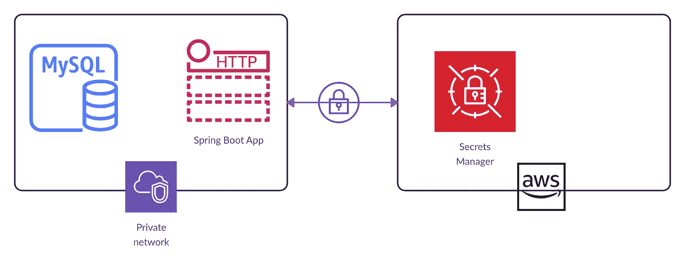
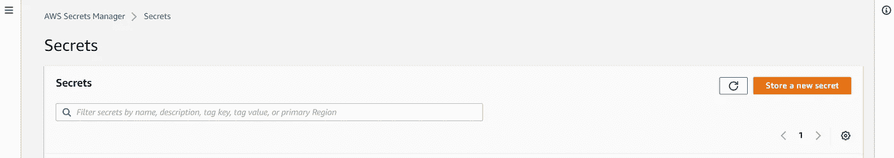
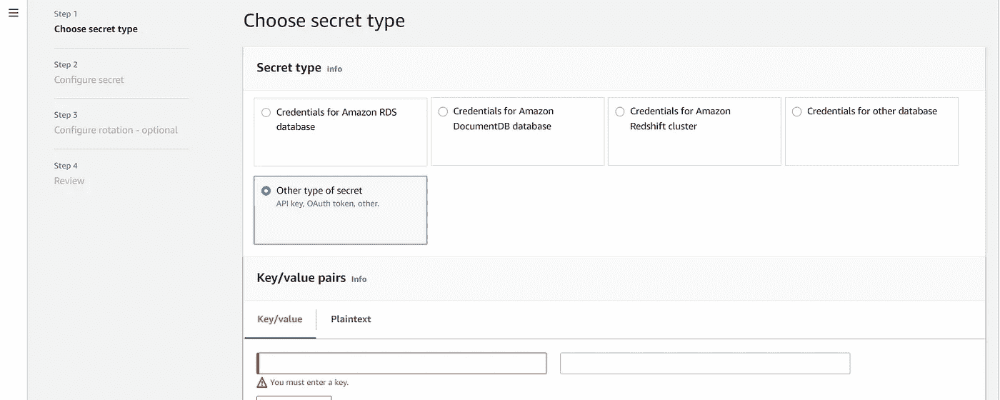

# 将 AWS Secret Manager 集成到 NodeJS 应用程序中

> 原文：<https://blog.devgenius.io/integrate-aws-secret-manager-in-your-nodejs-application-c167115eec3e?source=collection_archive---------1----------------------->



Pic Credit K21 学院

在上一篇[博客](http://require("./config/env.config"); const express = require("express");  /**  * Remaining codes ...  */)中，我解释了如何在 NodeJS 应用程序中集成不同的环境变量文件。在这篇博客中，我将向您展示如何在 NodeJS 应用程序中添加 AWS secret manager，以便直接从 AWS 获取机密。

## 目录

1.  安装 AWS Cli
2.  配置 AWS 机密
3.  如何在 AWS secret manager 中创建秘密？
4.  向您的应用程序添加 Secret manager 代码片段
5.  呼叫秘密管理器代码片段

**1。如何安装 AWS Cli？**

要开始使用，您必须在系统上安装 AWS cli。按照这个[链接](https://docs.aws.amazon.com/cli/v1/userguide/install-windows.html)在 windows 系统上安装 AWS cli(你也可以找到其他操作系统的链接)。现在下载 MSI 文件。现在运行下载的 MSI 安装程序。安装完成后，您可以通过键入以下命令来确认安装

```
C:\Users>aws --version
aws-cli/2.7.31 Python/3.9.11 Windows/10 exe/AMD64 prompt/off
```

**2。如何在你的机器上配置 AWS Secrets？**

我假设你已经有了 AWS 访问密钥 ID 和密码。如果您没有这些证书，那么您可以点击此[链接](https://aws.amazon.com/blogs/security/wheres-my-secret-access-key/)下载您的 AWS 证书。现在，要配置 AWS 凭据，请键入以下命令

```
C:\Users>aws configure
AWS Access Key ID [****************34Xe]:<type your Access Key ID>
AWS Secret Access Key [****************sdE4]:<type your Secret Access Key>
Default region name [ap-south-1]: <enter default region>
Default output format [None]:
```

完成上述步骤后，您可以通过键入以下命令进行确认

```
C:\Users>aws configure list
```

该命令将给出您在机器上设置的配置列表。

**3。如何在 AWS secret manager 中创建秘密？**

现在，要在 NodeJS 应用程序中获取秘密，必须将它添加到 AWS secret manager 中。要添加机密，请转到 AWS，然后在搜索框中键入 AWS secret manager，并在搜索结果中单击 AWS secret manager。它将打开 AWS 秘密管理器页面。



现在，您可以单击存储一个新的秘密，并选择秘密类型作为其他类型的秘密，并添加秘密作为键值对



**4。将 Secret manager 代码片段添加到您的应用程序中**

完成上述所有步骤后，在 NodeJS 应用程序中添加以下代码。您可以将它添加到 **config/env.config.js** 文件中(您可以将代码块放在应用程序中的任何地方，但是我喜欢更有条理和更好的名称:)

```
var AWS = require('aws-sdk'),
    region = "ap-south-1",
    secret,
    secretName="your-aws-secret-name", // You can load this secret based on the environment
    decodedBinarySecret;// Create a Secrets Manager client
var client = new AWS.SecretsManager({
    region: region
});client.getSecretValue({SecretId: secretName}, function(err, data) {
    if (err) {
        if (err.code === 'DecryptionFailureException')
            // Secrets Manager can't decrypt the protected secret text using the provided KMS key.
            // Deal with the exception here, and/or rethrow at your discretion.
            throw err;
        else if (err.code === 'InternalServiceErrorException')
            // An error occurred on the server side.
            // Deal with the exception here, and/or rethrow at your discretion.
            throw err;
        else if (err.code === 'InvalidParameterException')
            // You provided an invalid value for a parameter.
            // Deal with the exception here, and/or rethrow at your discretion.
            throw err;
        else if (err.code === 'InvalidRequestException')
            // You provided a parameter value that is not valid for the current state of the resource.
            // Deal with the exception here, and/or rethrow at your discretion.
            throw err;
        else if (err.code === 'ResourceNotFoundException')
            // We can't find the resource that you asked for.
            // Deal with the exception here, and/or rethrow at your discretion.
            throw err;
    }
    else {
        // Decrypts secret using the associated KMS key.
        // Depending on whether the secret is a string or binary, one of these fields will be populated.
        if ('SecretString' in data) {
            secret = JSON.parse(data.SecretString);

            // Add all secret which is present on AWS to process.env 
            // which will be available in all over application
            for(const envKey of Object.keys(secret)) {
                process.env[envKey] = secret[envKey];
            }
        } else {
            let buff = new Buffer(data.SecretBinary, 'base64');
            decodedBinarySecret = buff.toString('ascii');
        }
    }

    // console log in case of error
    console.log(err);
});
```

在这个代码片段中，我使用了 aws-cli 节点包，它主要用于从 NodeJS 应用程序执行任何 aws 操作。现在我正在定义秘密名称和地区。在它下面，我正在创建 AWS secret manager 的一个实例。在下一行中，我将调用 **getSecretValue** 函数，该函数将 SecretId 作为参数，这将是您在 AWS Secret manager 中创建的秘密名称。 **getSecretValue** 是一个异步函数，在回调函数中有两个参数 err 和 data。我正在处理基于错误类型的错误。如果我在 else 中没有得到任何错误，我将检查数据是否有 **SecretString** ，如果有，那么从数据中解析 SecretString，并将所有键值对添加到 process.env 。这一行将确保无论什么是目前在您的秘密经理，将可在您的所有应用程序。

**5。呼叫秘密管理器代码片段**

现在出现了最后一个问题，在哪里调用这个秘密管理器代码片段？在调用任何包或文件之前，您必须调用这个代码片段。所以更好的地方是你的 NodeJS 启动文件，你可以把它命名为 index.js 或者 server.js 或者 app.js。对我来说，它是 index.js，所以你可以这样调用它

```
require("./config/env.config");
const express = require("express");/**
 * Remaining codes ...
 */
```

**结论**

有时在。NodeJS 应用程序的 env 文件。所以最好将它添加到 AWS Secret Manager 中，这样，如果没有您的 AWS 凭证，就没有人会得到凭证。感谢阅读。快乐编码。

你喜欢这篇文章吗？如果有，通过 [**订阅解码，我们的 YouTube 频道**](https://www.youtube.com/@codingwithkrpajay?sub_confirmation=1) **获取更多类似内容！**

同样的博客也将在 https://ajaykrp.me/推出。