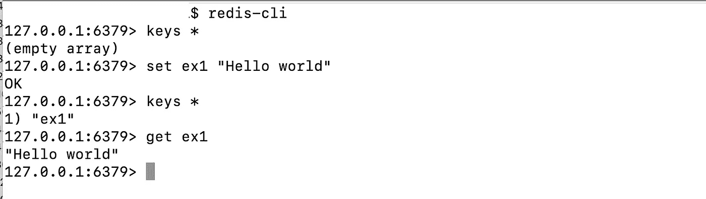
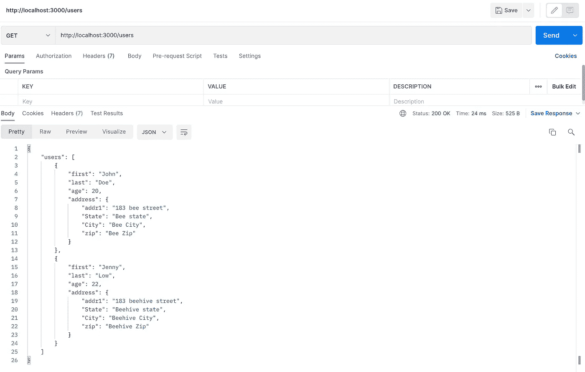
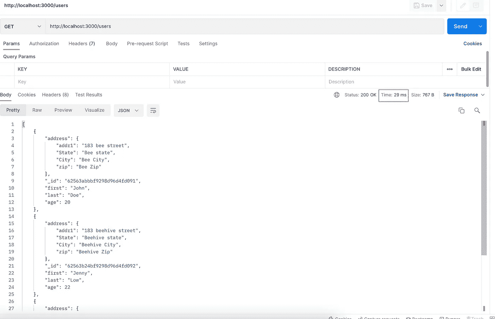
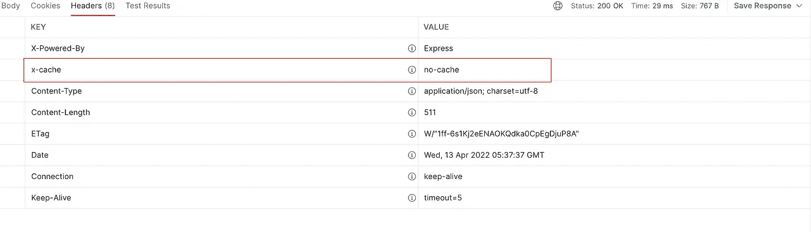
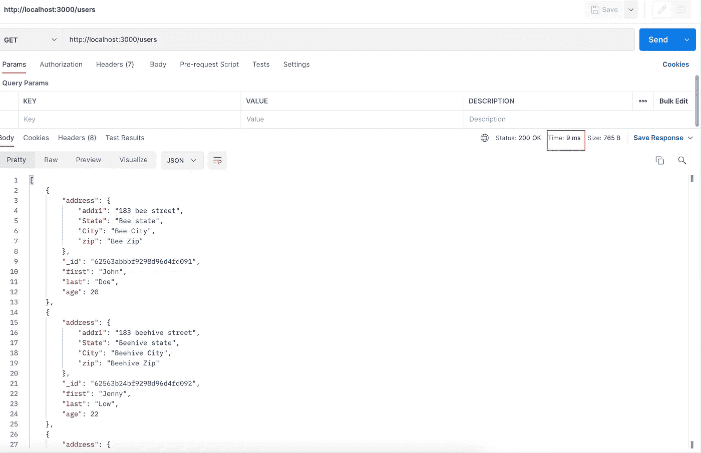
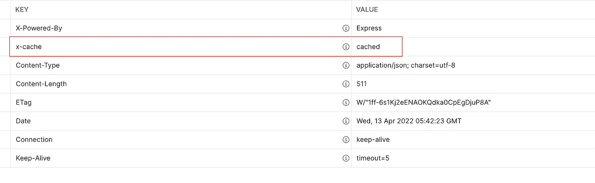
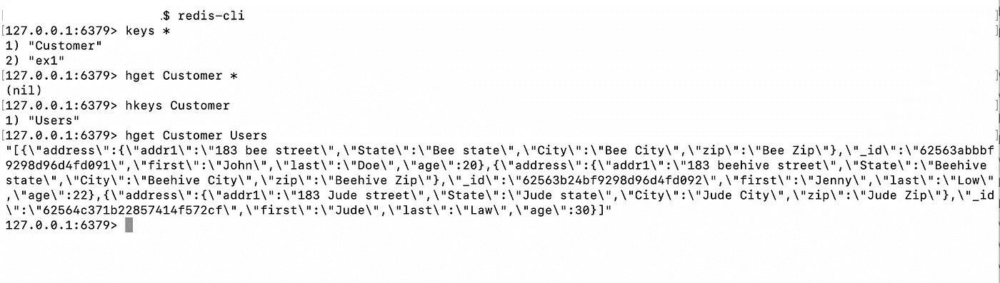
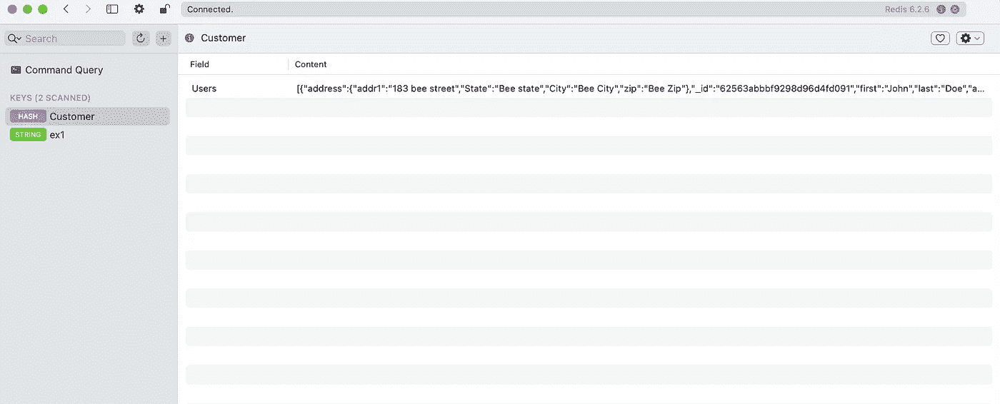

# 将 NodeJS 应用程序与 Redis 集群集成

> 原文：<https://blog.devgenius.io/integrate-nodejs-application-with-redis-cluster-31baa573a43c?source=collection_archive---------0----------------------->

NodeJS 是一个平台，它使传统的前端开发人员能够探索 API 的世界，而不需要太多的学习曲线。它是为我们的应用程序创建轻量级 API 的伟大框架。对于大多数不需要大量 CPU 密集型操作的网站/移动应用程序，NodeJS 是 API 的绝佳选择。

最近，我设计了一个获取客户记录的 api，我希望通过缓存它们，在下一个会话中更快地检索相同客户的后续数据。我试过 LRU 缓存，它非常适合在内存中缓存数据。

但是当我们在生产中需要大量的缓存时，在内存中进行缓存并不是一种有效的方法。雷迪斯来了。

**什么是 Redis？**

Redis 是一个开放源码的内存数据库，用于缓存和许多基于键值对的应用。在保存任何特定的键值时，我们可以指定 TTL(生存时间),或者如果我们不指定任何内容，则可以无限期地保存它。它将保留在 Redis 中，直到我们删除或重启服务器。

有多个客户端用于连接 Redis。我将在这里使用 io-redis。

在这个例子中，我将连接本地 redis 服务器。我将分享连接到集群的细节。

所有功能在单个服务器或集群之间完全相同。唯一的区别是建立连接。

1.  首先，我们需要在本地机器上安装 Redis 服务器。因为我在这里使用 Mac，所以我用 brew 来安装它。[https://redis . io/docs/get-started/installation/install-redis-on-MAC-OS/](https://redis.io/docs/getting-started/installation/install-redis-on-mac-os/)
2.  安装后，我们可以通过 redis-cli 连接到 redis

*   $ redis-cli
*   keys *:这将列出数据库中所有可用的键
*   设定<key name="">T5 例如设定 ex1《你好世界》</key>
*   得到<key name="">例如，得到 ex1</key>

3.通过以上步骤，本地服务器现在已经为 Redis 数据库做好了准备。

4.让我们使用 ExpressJS 创建一个示例节点 JS 应用程序。开放终端和

*   mkdir 节点-redis-cluster
*   cd 市场目录
*   npm 初始化

5.安装完成后，安装 express & body-parser

*   npm 快速安装
*   npm 安装主体-解析器

6.将目录创建为 src，将文件创建为 index.js

7.修改 index.js 文件，添加一个包含一些测试数据的 users 数组，添加一个 get 端点来获取用户数据，如下所示

8.修改 package.json 文件

…

> "脚本":{
> 
> " test": "echo \ "错误:未指定测试\" && exit 1 "，
> 
> " start": "node src/index.js "
> 
> }

…

并使用下面的命令运行应用程序

> npm 开始

9.现在我们可以打开 postman 并尝试我们刚刚创建的 api。

http://localhost:3000/users ，它将返回用户的详细信息

我们的 api 已经准备好了本地数据。现在我们将添加一个 MongoDB 来首次读取数据，然后使用 Redis 作为未来请求的缓存。

**Mongo DB**

我使用 docker 在本地运行我的 mongodb 服务器，但是它也可以在本地安装。

> 码头工人拉蒙戈
> 
> docker run-name mongod b-d-p 27017:27017 mongo

我们也可以安装任何 mongo UI 并连接到它(我正在使用 MongoDB Compass)

如果您在本地安装，我们可以打开终端并键入

*   蒙戈

这个命令将打开 mongodb cli。

在 docker 的情况下，我们可以 ssh 到容器中并做同样的事情

> *docker exec-it MongoDB/bin/sh*

要列出所有数据库

*   显示数据库

创建新的或现有的数据库

*   使用客户

现在以用户身份创建一个集合，并插入一些测试数据

下面的命令文件中提到了数据插入命令

[https://github . com/codedaemon 12/nodejs-redis-cluster/blob/main/src/mongo-connector/mongo-commands . txt](https://github.com/codedaemon12/nodejs-redis-cluster/blob/main/src/mongo-connector/mongo-commands.txt)

现在我们的数据库已经准备好了，所以我们现在可以安装节点 JS 依赖项和函数来访问这个集合并在 api 调用中返回。

让我们安装 mongoose 并添加模型和连接细节

因此，最终的 index.js 文件如下所示

为用户集合添加模型。

现在我们可以运行应用程序，并再次点击 postman 来获取数据。数据将从 MongoDB 数据库返回。

在下一步中，我们将需要安装 ioredis 作为一个依赖项。完成后，为 redis 方法添加一个文件作为 cacheHelper.js，如下所示

[https://github . com/codedaemon 12/nodejs-redis-cluster/blob/main/src/cache handler . js](https://github.com/codedaemon12/nodejs-redis-cluster/blob/main/src/cacheHandler.js)

让我们在 index.js 中导入这个文件。在 Redis 中，我们可以存储一个键值对。它还支持哈希映射。

哈希映射就像字典一样，我们可以创建一个映射名称，在同一个映射中，它可以存储一个单独的键值对。

在我们的例子中，我们可以为数据库名创建一个散列映射，并将每个集合存储为键名。

初始化 redis 缓存

> RedisCache.initializeRedis()

并将 get 函数修改如下

连接到本地 Redis 数据库和集群的连接方法是不同的。所以使用一个环境变量在本地和集群之间使用相同的连接。因此，在终端中设置环境变量

> export LOCAL_REDIS=true

再次运行应用程序，并再次点击邮差的 api

让我们注意一下响应和响应头的时间:

> 时间:29 毫秒
> 
> x 缓存:无缓存

现在再次点击 api，检查响应时间和响应头

> 时间:9 毫秒
> 
> x 缓存:已缓存

时间减少了 20 毫秒

我们可以转到 redis-cli 并运行下面的命令来检查缓存值

*   redis-cli
*   钥匙*
*   hkeys 客户
*   hget 客户用户

提示:为 GUI 视图安装 Medis(一个 redis 客户机)

整个应用程序可以从下面下载

 [## GitHub-codedaemon 12/nodejs-redis-cluster

### 此时您不能执行该操作。您已使用另一个标签页或窗口登录。您已在另一个选项卡中注销，或者…

github.com](https://github.com/codedaemon12/nodejs-redis-cluster.git)