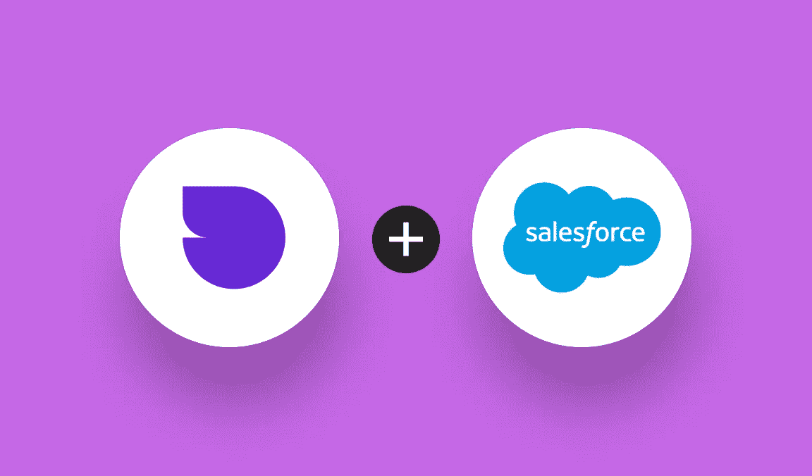
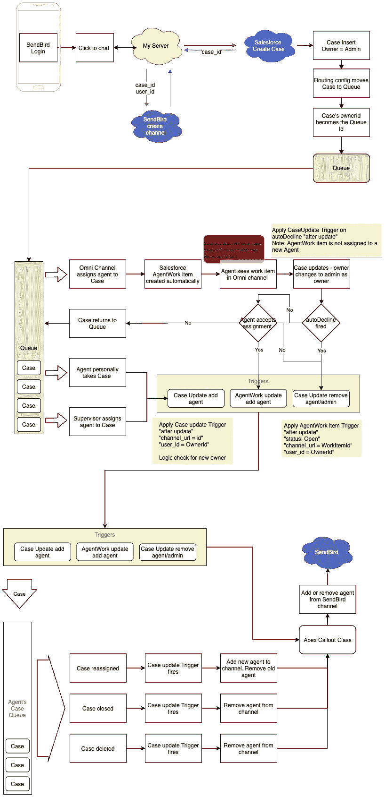
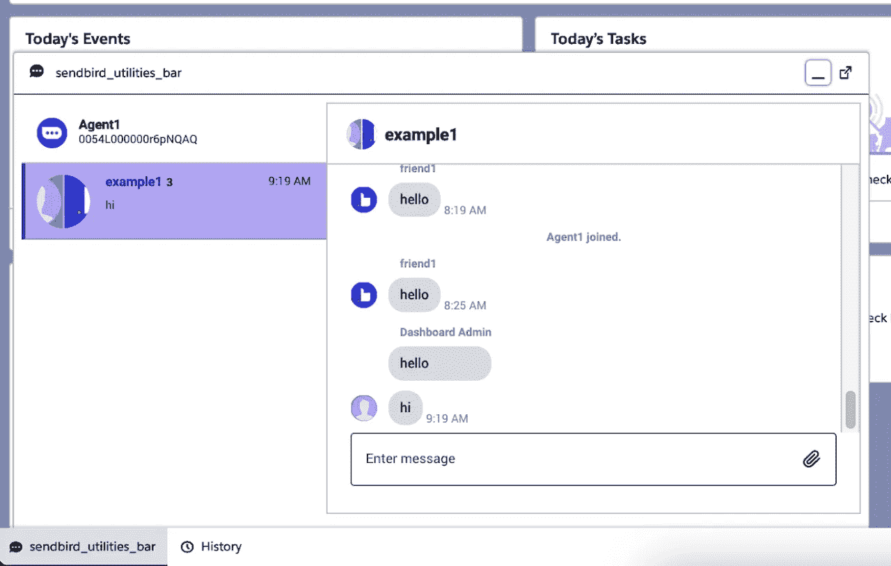
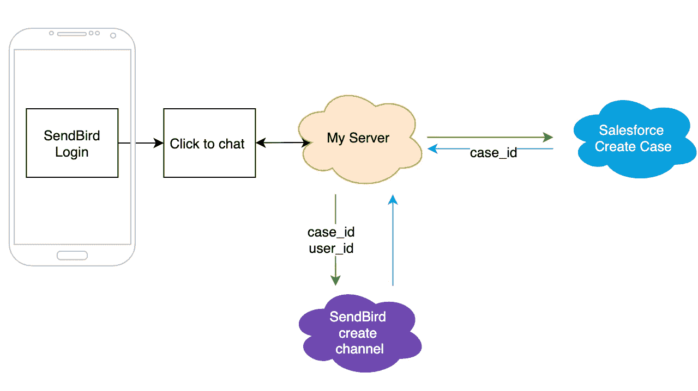
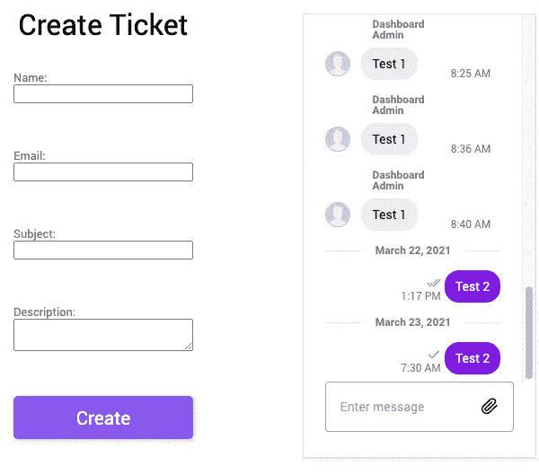
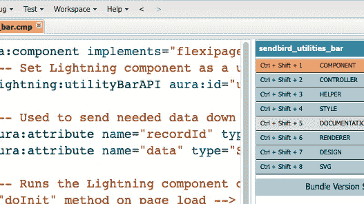
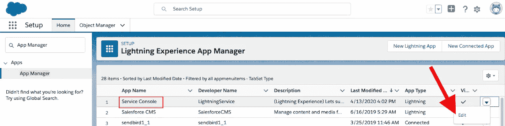
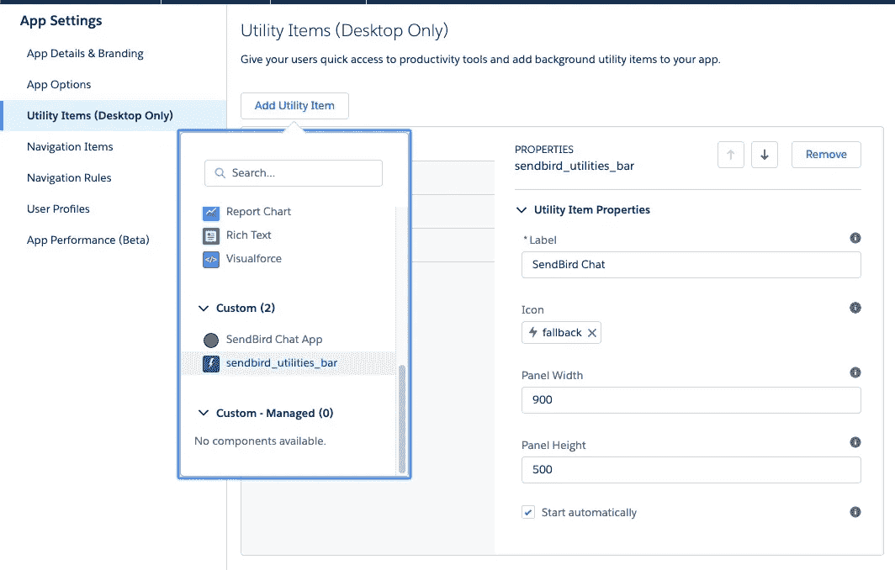
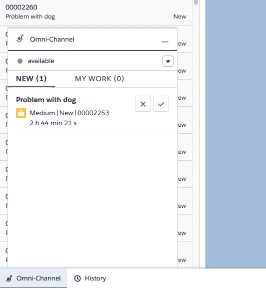

# 如何将 Sendbird Chat 与 Salesforce 集成

> 原文：<https://blog.devgenius.io/integrate-sendbird-chat-with-salesforce-5bf74898548d?source=collection_archive---------5----------------------->

杰森·奥尔肖恩
解决方案工程师| [仙鸟](https://www.sendbird.com)

*如果您正在寻找关于 Swift、Kotlin、React 等更多的教程，请查看我们的* [*开发者门户*](https://sendbird.com/developer/tutorials) ***。***

*别忘了查看一下*[*JS ui kit sales force 沙箱*](https://codesandbox.io/s/salesforce-lightning-container-8zudy) *和* [*JS 客户端沙箱*](https://codesandbox.io/s/customer-service-k0owd?file=/src/const.js) *。下面是应用内聊天* *的* [*演示。*](https://sendbird.com/demos/in-app-chat)

# 介绍

本教程展示了如何将 Sendbird SDK 集成到 Salesforce 中，并实现 Salesforce 代理界面和客户端应用程序之间的实时通信。如果您没有 Salesforce 帐户，[注册一个开发者组织](https://developer.salesforce.com/signup)。

## 集成图

下面是将 Sendbird 集成到 Salesforce 的地图。

## 代理聊天界面

本文档提供了将代理聊天窗口添加到 Salesforce 案例的见解。代理聊天窗口位于 Salesforce 中并连接到 Salesforce。它可以与 Sendbird 实时通信，实现实时聊天体验。

## 客户创建了一个新的 Salesforce 案例和一个 Sendbird Group 渠道

让我们引导您完成创建新的 Salesforce 案例和 Sendbird Group 渠道的可能流程。我们将使用客户端应用程序、服务器来处理对 Salesforce 的 API 请求，并使用平台 API 来处理对 Sendbird 的请求。

# 第一步。创建 Salesforce 案例和相应的 Sendbird 组渠道

客户访问**客户端应用程序**并使用 web 服务器创建一个 Salesforce 案例和一个相应的 Sendbird 组渠道(一个票据)。

*   用户的设备调用 web 服务器，并且**创建新的 Salesforce 案例**。
*   案例创建回调返回案例 ID，并调用 Sendbird 平台创建新的群渠道(客户邀请+渠道 URL =案例 ID)。
*   web 服务器向客户返回一个 Sendbird 通道，让客户在其中聊天。
*   下面是一个节点网络服务器的例子。

当服务器设置好后，调用端点/createticket。

*   在 Salesforce 中检查是否创建了案例。
*   请在 Sendbird 仪表板中查看该频道和被邀请的用户。

设置完成后，从 Postman 调用端点/createticket，并在 Salesforce 和 Sendbird 仪表板中检查服务器是否正在为用户创建 Salesforce 案例和 Sendbird 通道。

1.1 接收并处理来自用户设备的创建票证请求。

1.2 从 Salesforce 获取访问令牌( [**SF_TOKEN 解释**](https://www.google.com/url?q=https%3A%2F%2Ftrailblazers.salesforce.com%2Fanswers%3Fid%3D90630000000glADAAY&sa=D&sntz=1&usg=AFQjCNHWrVc4XgOEEgrU9Uw0xBfxXHN4DQ) )。

1.3.创建 Salesforce 案例。

1.4.使用 Salesforce 案例 ID 作为渠道 URL 在 Sendbird 中创建渠道。此外，使用用户的 Sendbird user_id 邀请用户

1.5.创建一个客户端应用程序来调用上述 web 服务器

有一个基本的[客户端应用程序](https://www.google.com/url?q=https%3A%2F%2Fcodesandbox.io%2Fs%2Fcustomer-service-k0owd%3Ffile%3D%2Fsrc%2Fconst.js&sa=D&sntz=1&usg=AFQjCNFoIm4tmHj-xpqvhAAIfZy27v4ktQ)使用 Sendbird UIKit 消息视图。

*   用户完成一个表单，并向端点请求创建票证，返回一个通道 URL。

# 第二步。将 Sendbird UIKit 作为实用工具栏小部件添加到 Salesforce

本节描述包含 Sendbird[**JavaScript UIKit**](https://codesandbox.io/s/salesforce-lightning-container-8zudy)的 Salesforce [**Lightning 容器**](https://www.google.com/url?q=https%3A%2F%2Fdeveloper.salesforce.com%2Fdocs%2Fatlas.en-us.lightning.meta%2Flightning%2Fcontainer_overview.htm&sa=D&sntz=1&usg=AFQjCNHJnELGb3Q2xwoQUuzwwg0PAbGGRQ) 的实现，以创建一个 [**实用程序栏**](https://www.google.com/url?q=https%3A%2F%2Fgist.github.com%2Fsupertopoz%2F0a1ccb8d86b05e509093e4b12a80842f&sa=D&sntz=1&usg=AFQjCNGq-aNtoKbCpE8z2SJtzfcT7RJ3VA) 小部件。对于 Salesforce Lightning 组件的高级概述，请尝试这篇关于 Salesforce Lightning 容器的 [**博客文章**](http://www.google.com/url?q=http%3A%2F%2Fsimpluslabs.com%2Fwhat-is-lightning-component-and-lightning-bundles%2F&sa=D&sntz=1&usg=AFQjCNEbv54NATuKjV3ltHr9Tn4310wAnQ) 和本指南**。下面是一个[T21 视频](https://youtu.be/G-SQqNCJ-wM)的例子。**

****

**词汇表:**

****实用工具栏小工具:****

**Salesforce“Lightning 组件”显示在 sales force 底部的实用程序栏中。**

**闪电容器:**

**iframe HTML 和 JavaScript 代码作为静态资源加载到 Salesforce 中，并编译为实用工具栏小部件中的视图。**

**2.1.创建一个包含 Lightning 容器的空实用工具栏小部件**

1.  **在 Salesforce [开发者控制台**中**开发者控制台](https://www.google.com/url?q=https%3A%2F%2Fhelp.salesforce.com%2FarticleView%3Fid%3Dcode_dev_console.htm%26type%3D5&sa=D&sntz=1&usg=AFQjCNEO-13FnCv1GxsZ1Dd0YfbM5mCp6w)**
2.  **文件→新建→ Lightning 组件**
3.  **Name = "sendbird_utilities_bar "**
4.  **忽略组件配置**
5.  **点击→“提交”**

****

**2.2.添加实用程序栏小部件代码**

**将 aura:component 设置为一个实用程序栏，并提供一个 aura:id**

**[**sendbird _ utilities _ bar . CMP**](https://www.google.com/url?q=https%3A%2F%2Fgist.github.com%2Fsupertopoz%2F0a1ccb8d86b05e509093e4b12a80842f%23file-sendbird_utilities_bar-cmp-L1&sa=D&sntz=1&usg=AFQjCNHk84IQL77Z37a5keZv9br78TnxhQ)**

**2.3.上传一个准系统 Lightning 容器**

**这一步的目的是上传一个准系统的 Lightning 容器来检查所有的工作。我们稍后将使用相同的资源来上传 UIKit 代码。**

1.  **创建一个简单的 index.html 文件**

**2.将 index.html 归档成一个。zip 文件(名称并不重要)。**

**3.在 Salesforce 的 [**静态资源**](https://www.google.com/url?q=https%3A%2F%2Fdeveloper.salesforce.com%2Fdocs%2Fatlas.en-us.pages.meta%2Fpages%2Fpages_resources_create.htm&sa=D&sntz=1&usg=AFQjCNE0DRGWiEL75XC4UOFFIcHzAWOCPQ) 中创建一个名为“sendbird_bar”的新资源。**

**4.上传。zip 文件，并将“缓存控制”设置为“公共”**

**5.点击“保存”**

****备注:****

*   **Index.html 应该永远处于。压缩文件**
*   **上传文件后，请务必点击“保存”。**
*   **Salesforce 保存资源名称，而不是的名称。zip 文件。**
*   **您在 Lightning 组件中使用的所有代码和资产都需要包含在。zip 文件。任何外部代码依赖项都将不起作用，即使它们被列入 CSP 可信站点列表中。**

**2.4.引用实用工具栏小部件中的静态资源“sendbird_bar”**

1.  **向实用工具栏小部件添加 lightning:container 标记。光环:id 应该是“SendBird_Bar”。**
2.  **引用静态资源。"!$ resource . sendbird _ bar+'/index . html ' } "。注意，sendbird_bar 是保存的“静态资源”，而不是上传的名称。zip 文件。**

**sendbird_utilities_bar.cmp**

**2.5.添加要在 Salesforce 中显示的实用工具栏小组件**

**在 Salesforce 中，单击“设置”并搜索“应用程序管理器”以设置实用程序栏小部件将出现的位置。这里的“服务控制台”用于显示实用程序栏小部件。**

**在名为服务控制台的应用程序中，单击“▾”和“编辑”。**

****

1.  **在应用程序设置中，单击“实用工具项目(仅限桌面)”**
2.  **单击“添加实用工具项目”**
3.  **在“自定义”下，选择“sendbird_utilities_bar”**
4.  **设置宽度 900 高度 500**
5.  **将图标设置为“聊天”**
6.  **重要的“自动启动”应该被选中**
7.  **点击→“保存”**
8.  **导航到您设置的要在其中显示实用工具栏微件的服务(服务控制台)。应该有一个可点击的实用工具栏小部件。这些说明假设登录 Salesforce 的用户拥有查看小组件所需的权限。**

****

**2.6.下载 Lightning 容器的示例 UIKit**

**这里 有一个带注释的样本 Sendbird UIKit Lightning 容器 [**。**](https://codesandbox.io/s/salesforce-lightning-container-8zudy)**

1.  **在代码沙箱中，单击文件“导出到 zip”。**
2.  **在您喜欢的 JS 代码编辑器中打开文件，并运行 npm install(根目录)。**
3.  **在根目录中运行 npm start 以在浏览器中打开和示例。在为 Salesforce 构建生产构建之前，可以发送和接收消息并进行修改。**

****注:**(2021 年 3 月 8 日)那边[是 packet Bundler](https://www.google.com/url?q=https%3A%2F%2Fstackoverflow.com%2Fquestions%2F66459081%2Fparcel-semver-bug&sa=D&sntz=1&usg=AFQjCNGxO-gE1Q9riQfJBHkyTcp7BfqaWg)1 . 12 . 4 版本的一个 bug。从代码沙箱下载之前，检查包捆绑器版本是否为 1.12.3**

**2.7.授予 Sendbird 在 Salesforce 中操作的权限**

**更新 Salesforce CSP 文件以包括以下 URL(选择您自己的名称)。此外，在添加 UIKit Lightning 容器(见下文)后，检查 Salesforce 浏览器开发人员控制台的连接错误。**

*   **Salesforce →设置→搜索→ "CSP 可信站点"**
*   **添加“新可信站点”(允许所有 CSP 指令):[https://sendbird.com](https://sendbird.com)和[https://{您的](/{your)地区代码或字母“API”} . sendbird . com【例如，[https://eu-1.sendbird.com](https://eu-1.sendbird.com)或[https://api.sendbird.com](https://api.sendbird.com)**
*   **[https://{您的](/{your)地区代码或字母“API”}-p . sendbird . com【例如，[https://eu-1-p.sendbird.com](https://eu-1-p.sendbird.com)或[https://api-p.sendbird.com](https://api-p.sendbird.com)**
*   **wss://sendbird.com**
*   **wss://ws.sendbird.com**
*   **[https://API-{ YOUR _ APP _ ID } . send bird . com](https://api-{YOUR_APP_ID}.sendbird.com)**
*   **WSS://ws-{ YOUR _ APP _ ID } . send bird . com**
*   **Salesforce →设置→搜索→“CORS ”:添加“新”允许来源列表，添加 [https://*.sendbird.com](/*.sendbird.com)**

**2.8.准备实用程序栏小部件以初始化 UIKit Lightning 容器**

**Lightning 容器需要向 Utilities Bar 小部件传达就绪状态。**

*   **在 Lightning 容器中，当 UIKit Lightning 容器加载后，向实用程序栏小部件发送一个 LLC 消息([**)NPM LLC 库**](https://www.google.com/url?q=https%3A%2F%2Fwww.npmjs.com%2Fpackage%2Flightning-container&sa=D&sntz=1&usg=AFQjCNFtuBSq3fm_YczxenVh95WrfRnqtQ) )。**
*   **加载是异步的，所以包括 LLC 消息重试逻辑。**
*   **实用工具栏小部件应使用 Salesforce 代理的 id 进行响应。**
*   **Lightning 容器侦听响应并呈现 UIKit。**

**向实用程序栏小部件发送一条消息，并包含重试逻辑。当实用工具栏小组件返回 Salesforce 代理的 user_id 时，清除 messageHandler 中的重试间隔。**

**lightningContainer 索引. js**

**实用程序栏小部件 onMessage 处理程序调用 handleMessage**

**sendbird_utilities_bar.cmp**

**Utilities Bar 小部件的 handleMessage()方法监听来自 Lightning 容器的所有消息。因此，有条件地处理“就绪”消息。**

**send bird _ utilities _ bar controller . js**

**实用工具栏小部件中的 helper.initUIKit()向 Lightning 容器发送消息。**

**" Sendbird_Bar" =闪电:容器的光环:id**

**send bird _ utilities _ bar helper . js**

**Lightning 容器从 LLC.addMessageHandler()中的实用工具栏小部件接收消息**

**停止重试逻辑并呈现 UIKit。**

**lightningContainer 索引. js**

**2.9 将 Lightning 容器加载到 Salesforce**

1.  **npm 运行构建**

**2.构建将输出到 dist 文件夹。**

**3.压缩 index.html，。js 和。css 合二为一。zip 文件。**

**4.上传。压缩到上面的准系统示例中创建的静态资源。**

**5.打开实用工具栏小部件。假设您在 Sendbird 中以用户身份创建了 Salesforce 代理，则 Sendbird UIKit 应使用 Salesforce 代理的 ID 连接到 Sendbird。**

**2.10 可选但重要的附加功能**

*   **在 sales force-link 中通知新收到的 Sendbird 消息。**
*   **从基于 send bird Channel-link 的实用工具栏小部件中打开案例。**

# **第三步。监听 Salesforce 案例分配并设置 Sendbird 组渠道成员**

**创建案例后，Salesforce 代理将获得该案例的所有权，并被邀请到相应的 Sendbird 渠道。Salesforce 的触发器监听个案所有权更改并调用 Salesforce Apex 标注。**

**3.1.倾听手动案例分配。**

*   **当案例所有者发生变化时，Apex 触发器会听到所有权的变化。**
*   **从 Apex 案例更改触发器调用 Apex 标注。**
*   **从 Sendbird 通道中删除旧代理。**
*   **将新代理添加到 Sendbird 通道。**
*   **案例所有人变更为代理人。如果案例所有者 ID 以“005”为前缀(005 总是以代理 ID 为前缀)。使用 Salesforce 标注邀请代理加入 Sendbird 渠道。**
*   **如果新案例代理的**与当前登录的代理的**不同:1)使用 Salesforce 标注从 Sendbird 组渠道中删除以前的案例所有人代理。2)使用 Salesforce 标注邀请代理加入 Sendbird 渠道。**
*   **如果案件所有人决定**不做代理**，比如转到队列。**
*   **使用 Salesforce 标注从 Sendbird 组渠道中删除以前的个案所有人代理。如果案例所有者 ID 以“005”为前缀(005 总是以代理 ID 为前缀)**
*   **Salesforce 开发人员控制台–>新建–> Apex 触发器–> Name = " assign agent " & s object = " Case "**

**AssignAgent.apxt**

**3.2.通过 Salesforce Omni 渠道收听自动案例分配(推荐)**

**Salesforce 的 omnichannel 可以在代理有新案例需要处理时指示他们:**

*   **Omni Channel 检测到个案分配，然后 Salesforce 自动创建 AgentWork 对象。**
*   **AgentWork 对象被分配给代理**
*   **代理在全渠道界面中选择接受或拒绝。**
*   **当代理单击接受或拒绝时，AgentWork 触发器会听到该事件。**
*   **如果座席接受了 Salesforce Callout 的个案呼叫以加入与该个案关联的 Sendbird 组渠道。**
*   **对于设置全渠道路由，这里有一个分步指南**。****

********

****Salesforce 开发人员控制台–>新–> Apex 触发器–> Name = " AgentOmniChannel " & s object = " agent work "****

****代理频道..apxt****

****3.3.用于分配 Sendbird 渠道成员资格的 Salesforce 标注****

****下面的 Salesforce 标注充当 Salesforce 内置的一种后端 web 服务器。因为标注在 Salesforce 的后端运行，所以调用 Sendbird 平台 API 端点是安全的。****

*   ****[**Salesforce 标注类**](https://www.google.com/url?q=https%3A%2F%2Fdeveloper.salesforce.com%2Fdocs%2Fatlas.en-us.apexcode.meta%2Fapexcode%2Fapex_callouts.htm&sa=D&sntz=1&usg=AFQjCNHpbq5lKVGPeK1n4Y5H_J5kUJI_jA) 包含两个方法，当前面提到的 Salesforce 触发器运行时调用这两个方法。****
*   ****[**邀请用户**](https://www.google.com/url?q=https%3A%2F%2Fdocs.sendbird.com%2Fplatform%2Fgroup_channel%233_invite_as_members&sa=D&sntz=1&usg=AFQjCNEvYubHzmJskvRY32xxqvY0JVnjig) 加入仙鸟群频道****
*   ****[**从仙鸟群频道中删除用户**](https://www.google.com/url?q=https%3A%2F%2Fdocs.sendbird.com%2Fplatform%2Fgroup_channel%233_leave_a_channel&sa=D&sntz=1&usg=AFQjCNEd_9VTaprLwSsRKdQE3MJLpfmx7w) 。****

****Salesforce 开发人员控制台–>新–> Apex Class –> Name = " sendbirdloutals "****

****SendbirdCallOuts.apxc****

# ****结论****

****恭喜你！您刚刚将 [**Sendbird Chat**](https://sendbird.com/docs/chat) 添加到您的 web 或移动应用程序中，以便您的用户可以与 Salesforce 代理进行实时交流。他们会对这种全新的、引人入胜的支持体验感到非常高兴！接下来，请查看我们的语音和视频 [**Sendbird Calls**](https://sendbird.com/features/voice-and-video) 产品，让您的语音和视频支持更上一层楼。在此期间，快乐支持建设！****