# 集成 Django 和 React

> 原文：<https://blog.devgenius.io/integrating-django-with-react-ff596e764bdc?source=collection_archive---------5----------------------->

在这篇简短而全面的文章中，我将带您了解将 Django 后端应用程序与 React 前端集成的完整过程。

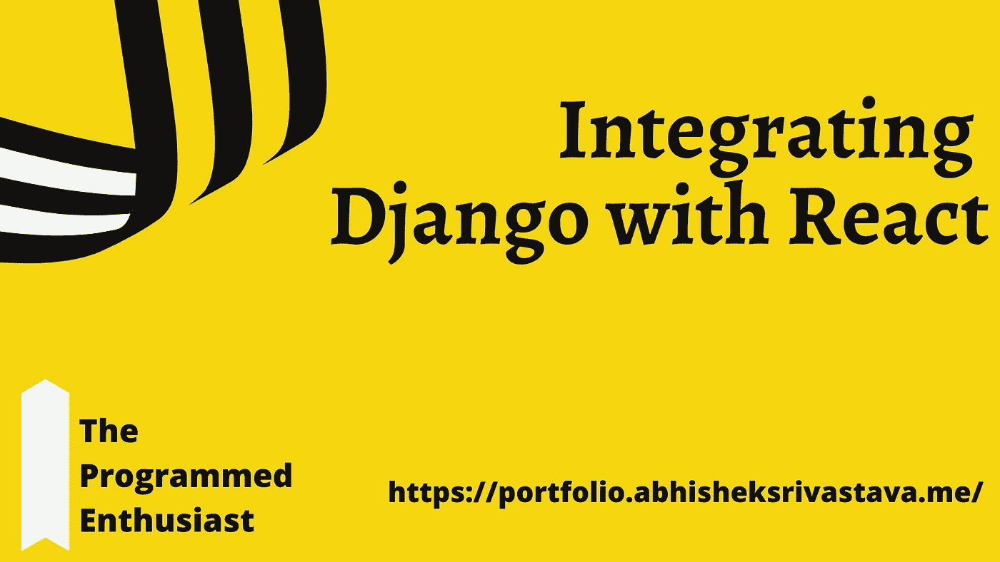

希望它能帮助您理解 Django 强大的内置特性，因为当您第一次开始时很难理解。源代码将在文章末尾提供。

**先决条件:-**

*   熟悉 **Django** 及其文件结构。
*   React 的基础。

**目标:-**

创建一个 *Hello-World App* 了解 *Django 的链接过程并做出反应。*

> 注意:因为有许多方法可以完成同样的任务，所以在本文中我将讨论我认为最合适和最方便的一种。

所以，让我们开始吧！

# 初始设置

我假设你已经安装了 Django。您可以通过在终端提示符下运行以下命令来检查 Django 的安装版本(由$前缀表示):

```
$ python -m django --version
```

创建项目

```
$ django-admin startproject django_react
```

目前，我的文件目录看起来是这样的:

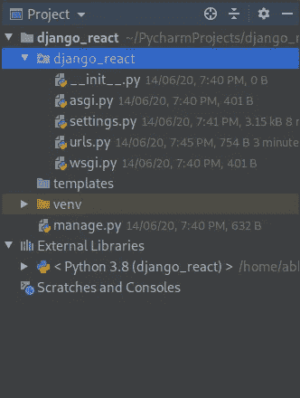

让我解释一下上面图像的目录和文件:-

*   这是我们主要的 django 项目。
*   **templates** :这是我们模板的默认位置(尽管随着我们的进行会有所改变)。
*   这是我们工作的虚拟环境。
*   其余的是基本的 Django 文件，我想你应该很熟悉。

现在，是时候打开我们的 React 应用程序了。

在终端提示符下运行以下命令(由$前缀表示):

```
$ cd ~/PycharmProjects/django_react
```

这个命令将确保您位于正确的目录中(在这个示例中，我将使用 pycharm)。

创建一个名为“前端”的反应应用程序

```
$ cd ~/PycharmProjects/django_react
```

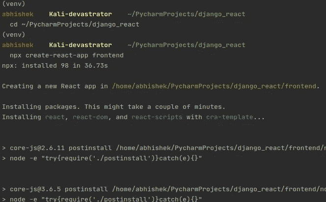

获取所有文件需要一些时间，一旦你完成了，我们就可以开始了。

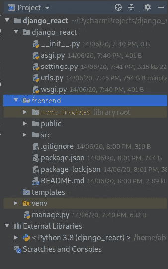

在这里，你会注意到我们有一个名为前端的应用程序，它包含了我们所有的 react 文件。

# **连接部件**

我们需要做的是把两件事联系起来:—

*   连接我们的模板。
*   连接 React 静态资产。

首先，我们将在 django_react 目录下的 settings.py 文件中编辑一些配置。

在模板列表中添加路径

```
os.path.join(BASE_DIR, 'frontend/build')
```

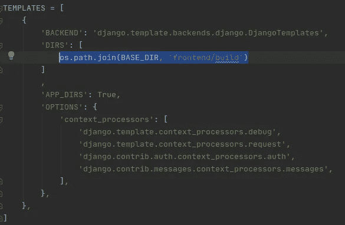

现在编辑 django_react 目录中的 urls.py 文件。

```
from django.views.generic import TemplateView
```

为我们的 frontend/public/index.html 文件创建一个 URL 模式

```
path('', TemplateView.as_view(template_name='index.html')),
```

到目前为止，我们已经连接出了模板，现在是时候处理静态资产了。

下入 out settings.py 文件，对 STATICFILES_DIRS 进行如下修改。

```
os.path.join(BASE_DIR, 'frontend/build/static')
```

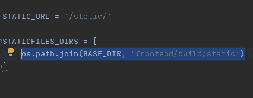

现在是最后一个构建命令，启动~/django_react/frontend 目录中的终端

```
$ npm run build
```

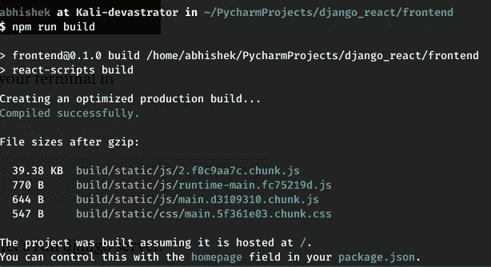

现在，一切都配置好了，让我们运行 Django 服务器。

```
$ python manage.py runserver
```

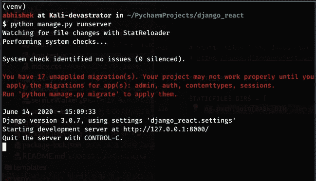

请访问 [http://127.0.0.1:8000/](http://127.0.0.1:8000/)

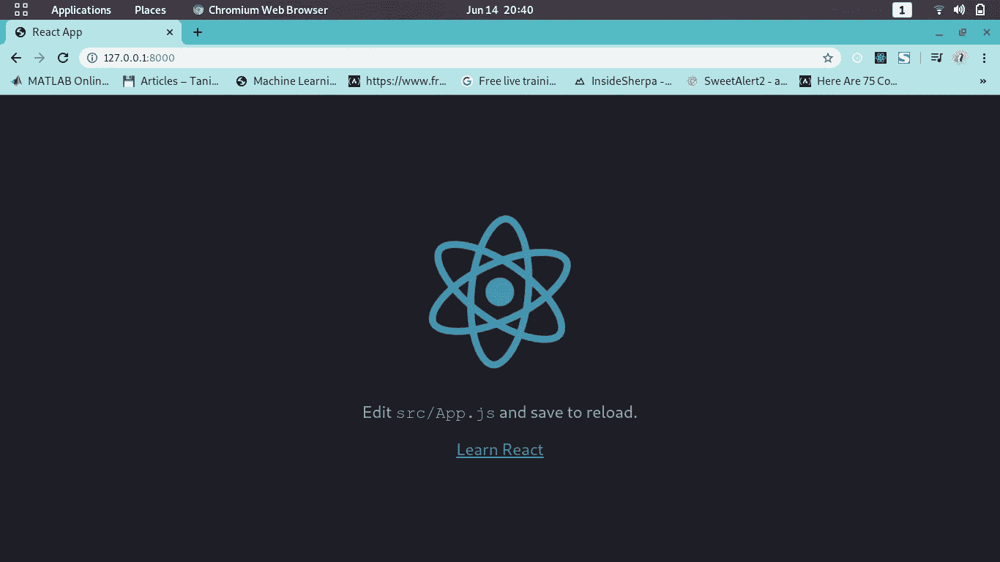

> 恭喜你！！，你已经完美的配置好了一切。

> 如果你没有看到这个屏幕，我建议你回去看看，以防你错过了什么。

让我们把它转换成一个 *Hello-World 应用程序*

在 frontend/src/App.css 中编辑 App.js 文件

```
import ***React*** from 'react';
import logo from './logo.svg';

function App() {
  return (
    <div className="App">
        <h1>Hello World</h1>
    </div>
  );
}

export default App;
```

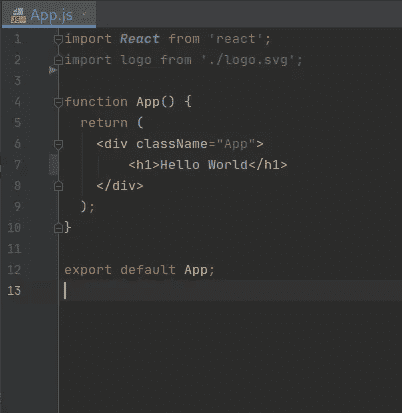

> 注意，我删除了 ***导入。/app . CSS '；*T5 本出自 App.js**
> 
> **调试提示**:如果您没有找到下面的页面，您可以再次执行 *run npm build* 命令，然后启动服务器

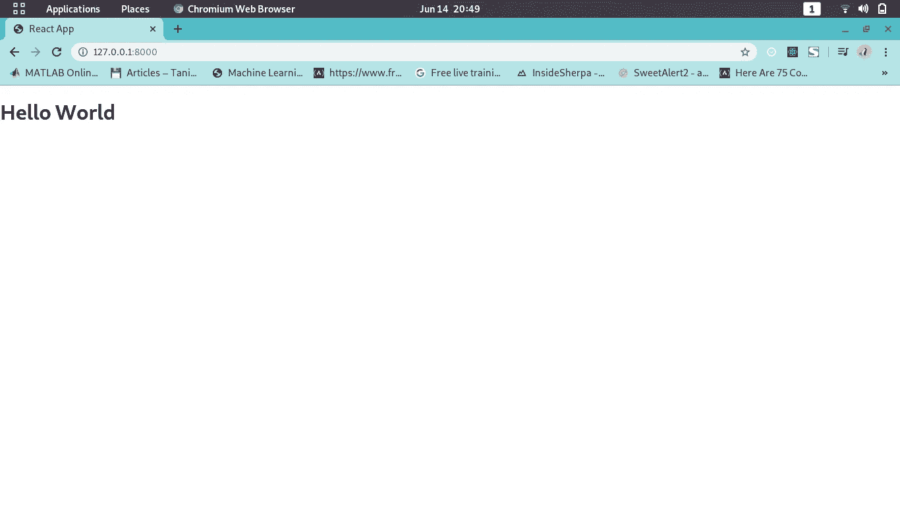

> 这就是了！！你完成了你的目标。非常非常祝贺！

# 结论

这就是了。把你的 Django App 和 React App 链接起来的完整过程。

> 源代码→[https://github.com/abhishek2x/django_react](https://github.com/abhishek2x/django_react)

希望这篇教程帮助你理解了 Django + React 的工作流程。使用这种松散耦合的模式可以为应用程序添加许多样板文件和抽象，但它也是一种可预测的、熟悉的模式，通常在许多框架中使用，并且是开发人员需要了解的一个重要概念。

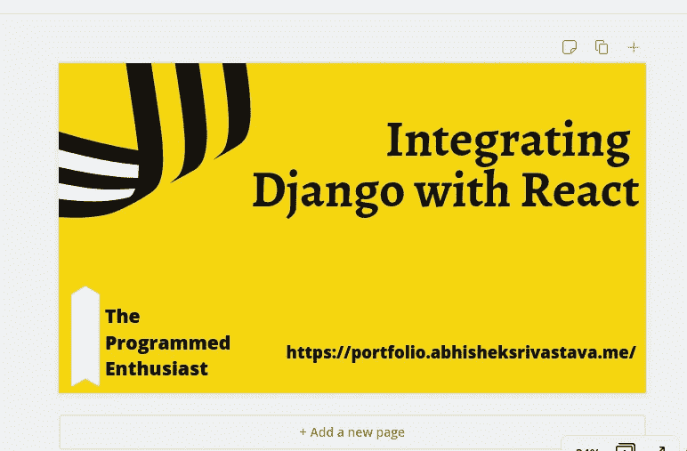

如果你想讨论什么，请随时联系我。

如果您能发送您的反馈和建议，我将非常高兴。此外，我喜欢交新朋友，我们可以成为朋友，只要给我发电子邮件。

> *Web:*[*https://portfolio . abhisheksrivastava . me*](https://portfolio.abhisheksrivastava.me) *insta gram:*[*https://www.instagram.com/theprogrammedenthusiast/*](https://www.instagram.com/theprogrammedenthusiast/) *LinkedIn:*[*https://www.linkedin.com/in/abhishek-srivastava-49482a190/*](https://www.linkedin.com/in/abhishek-srivastava-49482a190/) *Github:*[*https://github.com/abhishek2x*](https://github.com/abhishek2x) *邮箱*

[](https://github.com/abhishek2x) [## abhishek2x -概述

### 在 GitHub 上注册你自己的个人资料，这是托管代码、管理项目和构建软件的最佳地方…

github.com](https://github.com/abhishek2x) [](https://portfolio.abhisheksrivastava.me) [## Abhishek Srivastava |作品集

### 一个天生的企业家，一个充满激情的开发者，一个技术爱好者，开源贡献者。

portfolio . abhisheksrivastava . me](https://portfolio.abhisheksrivastava.me)