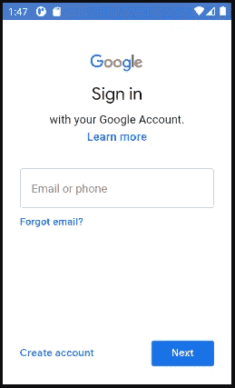

# 将 Google 登录集成到 Android 应用程序中

> 原文：<https://blog.devgenius.io/integrating-google-sign-in-into-android-app-70d582f4eed8?source=collection_archive---------0----------------------->


由 [Pathum Danthanarayana](https://unsplash.com/@pathum_danthanarayana?utm_source=medium&utm_medium=referral) 在 [Unsplash](https://unsplash.com?utm_source=medium&utm_medium=referral) 上拍摄的照片

几乎每个 Android 应用程序都需要用户登录，原因有很多。它可以用于验证用户凭证、用户身份验证、获取用户的基本配置文件细节等..我们不必为注册编写自己的实现代码，我们可以使用 Google 登录按钮，享受 Google 登录 API 提供的功能。

在本文中，我们将看到 Google Sign-In 的基本实现，它让用户登录，并在验证用户身份后将用户带到下一个屏幕。本文使用的编程语言是 Kotlin。

## **添加梯度依赖关系**

在您的应用程序级`build.gradle`文件中，将 Google Play 服务声明为依赖项

```
 dependencies {
        implementation 'com.google.android.gms:play-services-auth:18.0.0'
    }
```

## **认证客户端并配置 Google API 控制台项目**

Google Play 服务要求我们提供签名证书的 SHA-1，以便 Google 可以为我们的应用程序创建 OAuth2 客户端和 API 密钥。使用此[链接](https://developers.google.com/identity/sign-in/android/start-integrating#configure_a_project)并点击配置项目。输入项目名称，选择和 id，输入包名称和 SHA-1 证书。

去安卓工作室找 SHA-1。

1.  打开 Android Studio
2.  打开您的项目
3.  点击 Gradle(从右侧面板，您会看到 Gradle 栏)
4.  点击刷新(点击 Gradle 栏中的刷新，您将看到您的项目的列表 Gradle 脚本)
5.  单击您的项目(您的项目名称表单列表(根))
6.  点击任务
7.  点击安卓
8.  双击 signingReport(你会在运行栏中得到 SHA1 和 MD5(有时会在控制台中))

## 配置 Google 登录和 GoogleSignInClient 对象


在你的应用布局中添加一个“登录”按钮，启动登录流程，并注册你的按钮的`OnClickListener`以在点击时登录用户。

1.  在登录活动的`onCreate`方法中，要配置 Google 登录来请求用户的 ID 和基本配置文件信息，创建一个带有`DEFAULT_SIGN_IN`参数的`[GoogleSignInOptions](https://developers.google.com/android/reference/com/google/android/gms/auth/api/signin/GoogleSignInOptions.Builder#GoogleSignInOptions.Builder())`对象。要请求用户的电子邮件地址，使用`requestEmail`选项创建`GoogleSignInOptions`对象。

2.用你指定的选项创建一个`GoogleSignInClient`对象。

## **检查现有的登录用户**

在登录活动的`onStart`方法中，检查用户是否已经使用 Google 登录了您的应用程序

如果`account != null`，用户已经用 Google 登录了你的应用。使用如下所示的意图启动您的 UserProfile 活动。

## 启动登录流程

如果`account == null`，用户尚未使用 Google 登录您的应用程序。现在，用户必须点击谷歌登录按钮登录。处理登录活动上的登录按钮点击。

通过调用`signIn()`，我们使用通过调用*Google sign client*对象上的`[getSignInIntent](https://developers.google.com/android/reference/com/google/android/gms/auth/api/signin/GoogleSignInClient#getSignInIntent())`方法获得的意图启动登录屏幕，并通过调用`startActivityForResult`启动登录



意向提示用户选择一个 Google 账户登录。

用户登录后，我们可以在活动的`onActivityResult`方法中为用户获取一个`[GoogleSignInAccount](https://developers.google.com/android/reference/com/google/android/gms/auth/api/signin/GoogleSignInAccount)`对象。

`GoogleSignInAccount`对象(account)包含登录用户的信息，比如用户名。我们还可以通过`[getEmail](https://developers.google.com/android/reference/com/google/android/gms/auth/api/signin/GoogleSignInAccount#getEmail())`获得用户的电子邮件地址，通过`[getId](https://developers.google.com/android/reference/com/google/android/gms/auth/api/signin/GoogleSignInAccount#getId())`获得用户的 Google ID(供客户端使用)，通过`[getIdToken](https://developers.google.com/android/reference/com/google/android/gms/auth/api/signin/GoogleSignInAccount#getIdToken()).`获得用户的 ID 令牌，以获得 ID 令牌并通过后端服务器进行认证，请参考[这里的](https://developers.google.com/identity/sign-in/android/backend-auth)。

## 获取配置文件信息

现在，我们通过 intent 导航到 UserProfile 活动，我们还可以传递`GoogleSignInAccount`对象“帐户”来检索 UserProfile 活动中的用户详细信息，或者我们可以通过检查现有登录用户并在 UserProfile 活动的 XML 布局文件中创建的 TextView 字段中显示用户详细信息来再次获取`GoogleSignInAccount`对象，如下所示。

## 注销用户:

在 UserProfile 活动的 XML 文件中创建一个注销按钮，并配置`onClick`方法来调用`[signOut](https://developers.google.com/android/reference/com/google/android/gms/auth/api/signin/GoogleSignInClient#signOut())`，这将清除连接到应用程序的帐户，要再次登录，用户必须再次选择他们的帐户。使用 intent 导航回 SignInActivity 并完成当前活动。