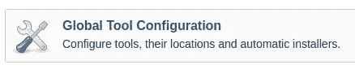

# 将 Jenkins 与 Nodejs 项目集成。

> 原文：<https://blog.devgenius.io/integrating-jenkins-with-a-nodejs-project-219d249b1fb2?source=collection_archive---------1----------------------->

Jenkins 最初是作为构建和发布工具而构建的。这些年来，社区已经逐渐变成了用于**持续集成**和**持续部署**的工具(CI/CD)。Jenkin 在设置 DevOps 时作为核心引擎工作得很好。从本地存储库中取出代码，进行测试，并根据结果给出反馈。

在这里，我将向您展示向 Jenkins 中的项目添加节点 js 的步骤。开始之前，这里是先决条件。

1.  詹金斯安装了。
2.  Github 帐户
3.  知识讲座/命令行

**第一步**
Jenkins 的伟大之处在于它拥有一个由社区支持的庞大的图书馆。这些插件使项目有一个合适的环境来处理。要运行 Nodejs，您必须安装一个 Nodejs 插件。
插件面板可以通过
管理 Jenkins >管理插件
访问，从这里选择可用选项卡。不用滚动列表，只需在右上角搜索 N **odejs** 即可。
选择并安装插件。这可能需要一些时间。

**步骤 2**
安装完成后，您必须在 Jenkins 中配置 Nodejs。为此，请回到“管理詹金斯”。然后**全局刀具配置**。向下滚动到 NodeJS，选择“添加 Nodejs”。文件，并选择想要的 nodejs 版本。保存设置。

**第三步。**

回到主页。在左侧，菜单选择**新项目**或**创建新工作**。这将提示一个带有选项列表的页面。在顶部输入 Nodejs 应用程序的名称，然后选择“自由式项目”。选择表格底部的 Ok 按钮完成。

**第四步**下一步是构建项目。选择“立即构建”以提示项目构建。

Jenkins 将项目保存在默认的工作空间中。查看此移动到工作区的查看光盘..

