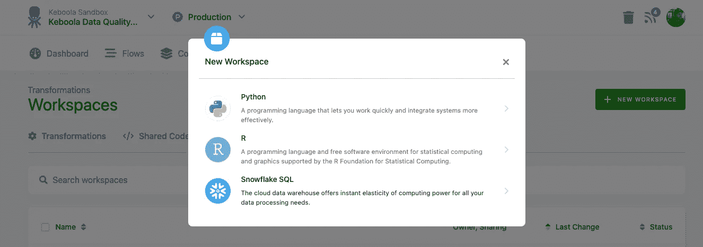
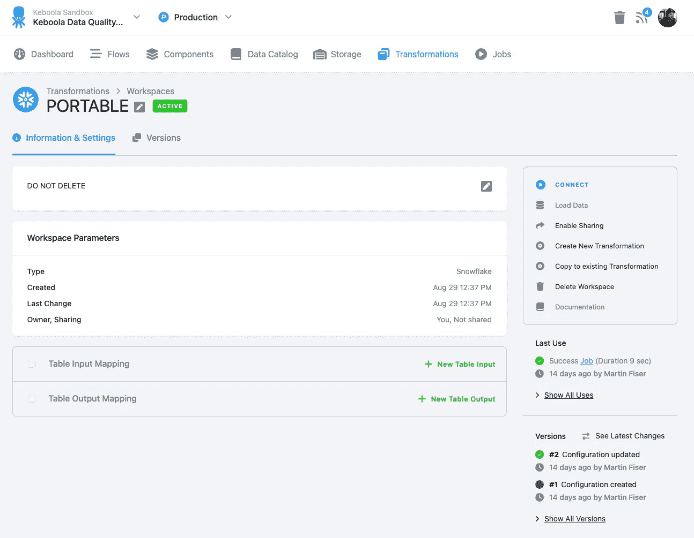
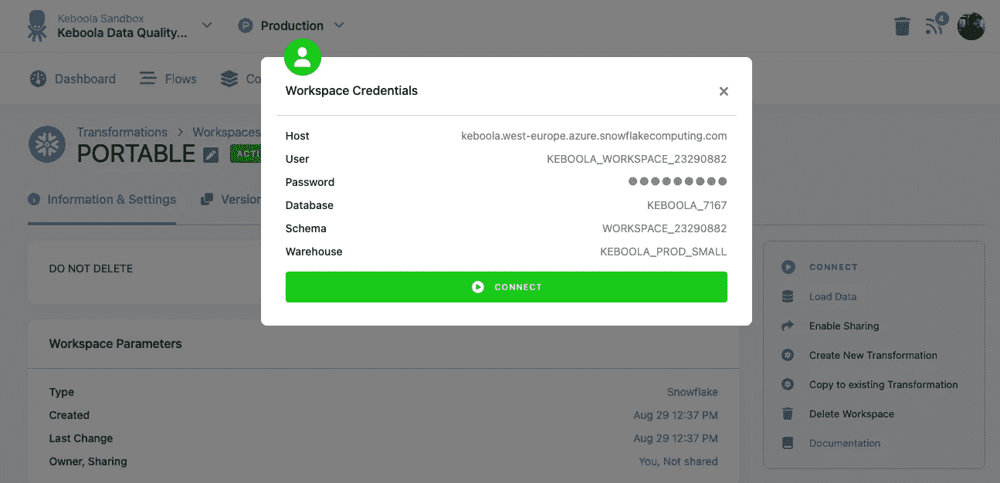
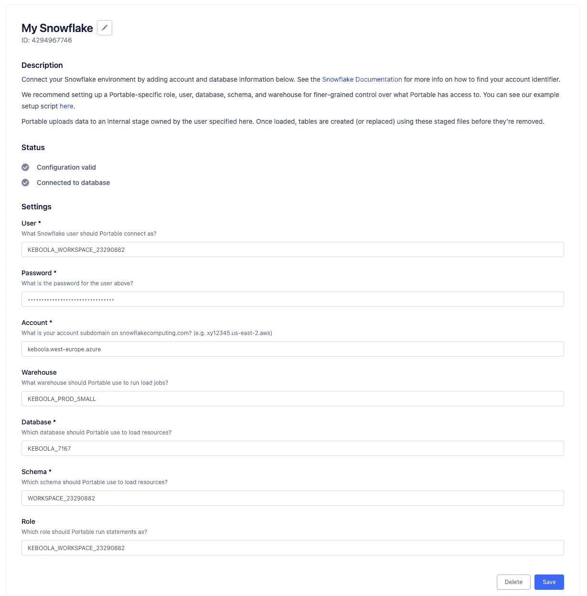
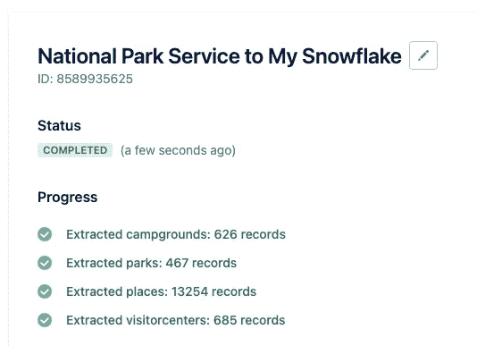
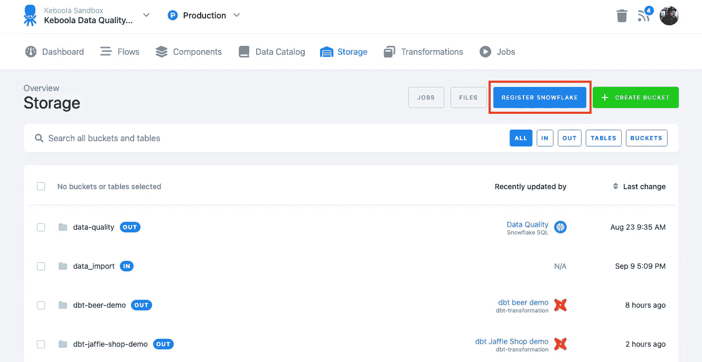
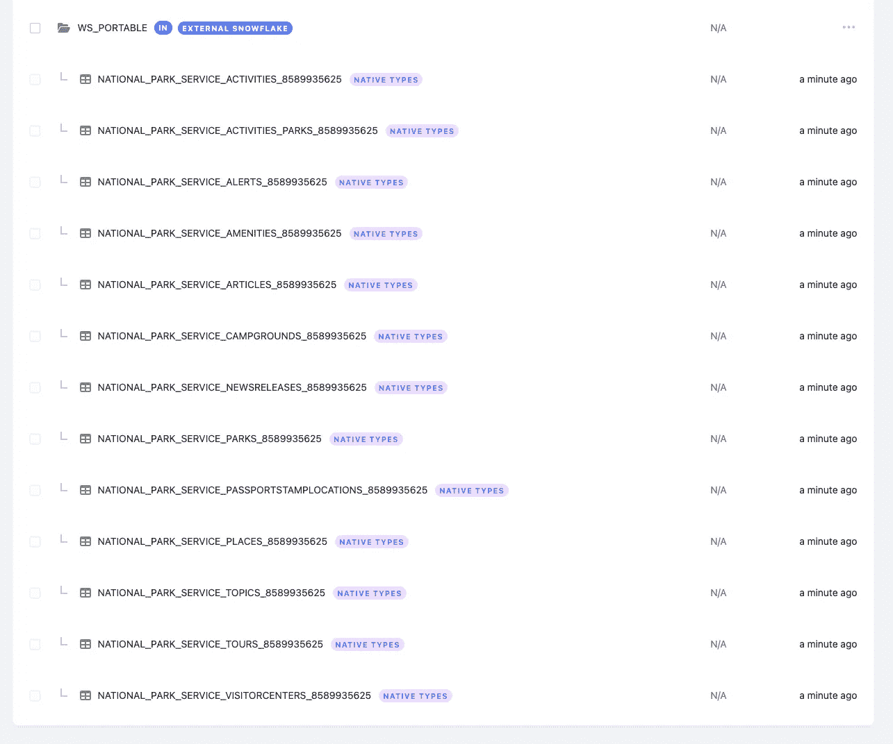

# 将 Keboola 与第三方数据工具集成—keboo la 的可视化教程<> Portable.io 集成

> 原文：<https://blog.devgenius.io/integrating-keboola-with-3rd-party-data-tools-visual-tutorial-for-keboola-portable-io-7832695ee345?source=collection_archive---------6----------------------->

[Keboola](http://www.keboola.com) 团队最近推出了一系列简洁的功能，旨在开放我们的[一体化平台](https://www.keboola.com/product/overview)，以促进与第三方工具的无缝集成，如数据加载器、数据质量&观察工具等。

因为我们真的很喜欢 [Portable.io](https://portable.io) 的团队、焦点和产品故事，我很乐意通过一个关于如何使用 Keboola 和 Portable hand-to-hand 的图像指南来展示新功能。

**科布拉❤️便携. io**

对于那些不了解 Portable 的人来说，它是一个数据加载器服务，专注于长尾数据源，作为统一价格的交钥匙解决方案。

> “便携式:到处都找不到的 ELT 连接器”

Keboola 和便携有很大的协同作用。鉴于 [Keboola](http://keboola.com) 是一个提供 E(T)LT 的平台，同时提供托管连接器和[自助式开发门户](https://components.keboola.com/)，一些客户喜欢维护连接器的服务，并且没有团队能够设计他们自己的连接器来“隐藏”数据源，也就是“长尾”。

*免责声明:Portable.io 仅服务于美国境内的客户，尽管将来可能会有所改变。*

**让我们开始吧——我们将使用 Portable 将数据从国家公园管理局 API 连接到 Keboola，以支持无缝分析。所有这些都无需编写一行代码！**

让我们创建一个新的 SQL 工作区。只需点击一个按钮，分析师和数据人员就可以拥有一个独立于生产数据和配置的专用环境来处理数据、开发和测试代码。工作区由平台自动提供，然后可以由其他系统使用，因为它们只是 project DB 后端中具有写访问权限的新模式。

[+ NEW WORKSPACE]按钮让用户用各种后端语言创建工作区。

在基础架构调配之后(您可以检查它，因为它被表示为标准作业)，我们可以检查工作区屏幕:

Keboola 雪花工作区

作为最佳实践，我们将描述工作区配置(代码/配置旁边的文档)，我建议确保团队中的其他人不会删除它。

通过单击“connect ”,我们获得了带有 set schema 的雪花数据库的凭证:

提供的连接字符串

然后，我们可以在可移植设置中使用该模式:

Portable.io 环境配置

让我们配置我们的第一个数据源，即国家公园管理局的演示源，并运行流作业。

通过 Portable.io 提取数据

一旦作业完成(通过手动或预定触发)，我们就可以检查数据。窍门来了——我们已经发布了一个测试版的**外部表**特性，它允许我们将模式“注册”为平台存储中的本地存储桶[。我认为这个特性最像 linux 的“挂载”特性。](https://help.keboola.com/storage/)

Keboola 中的外部存储功能

输入工作区凭据后，我们可以看到存储中的表。瞧！我们只是集成了一个外部数据工具，而没有要求 DBA 提供凭证，尽管仍然以安全的方式完成，由我们的可审计元数据层完全记录。

从便携式设备加载的数据出现在 Keboola 存储器中。

[工作区](https://help.keboola.com/transformations/workspace/)最常见的用途是安全的 SQL 转换开发环境，要么是 Keboola SQL，要么是作为 dbt 的开发环境，或者仅仅是用于数据探索。**在本文中，我展示了如何将工作区用作便携设备的“登陆区”(充当外部数据加载器)。**

我认为这个功能，以及一系列令人兴奋的新功能，确实对 Keboola 平台的开放性产生了很大的影响，允许用户集成第三方工具(强烈建议查看 [Portable.io](https://portable.io/) ！).

> 要测试提到的新功能，请在支持票中发送请求。

接下来，我想我应该多写一点关于对存储的只读访问，特别是在… dbt 支持的上下文中。

敬请期待！