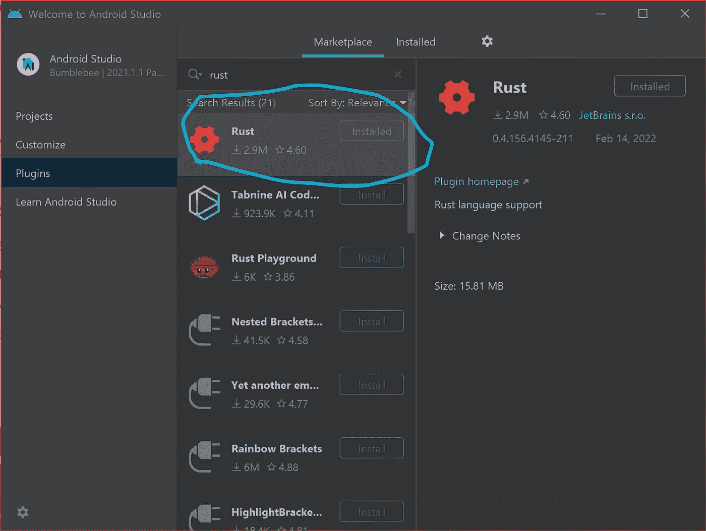
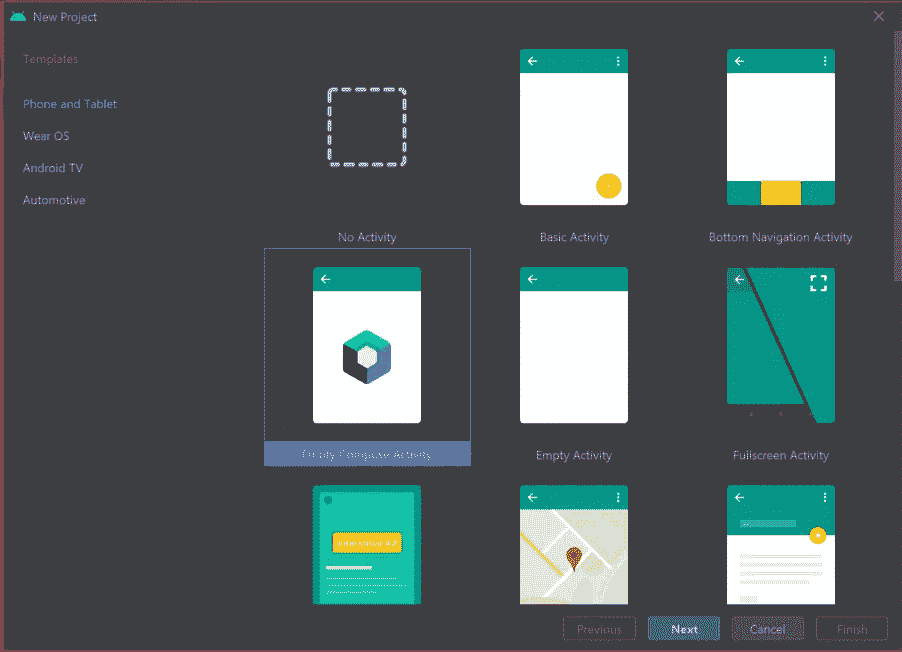
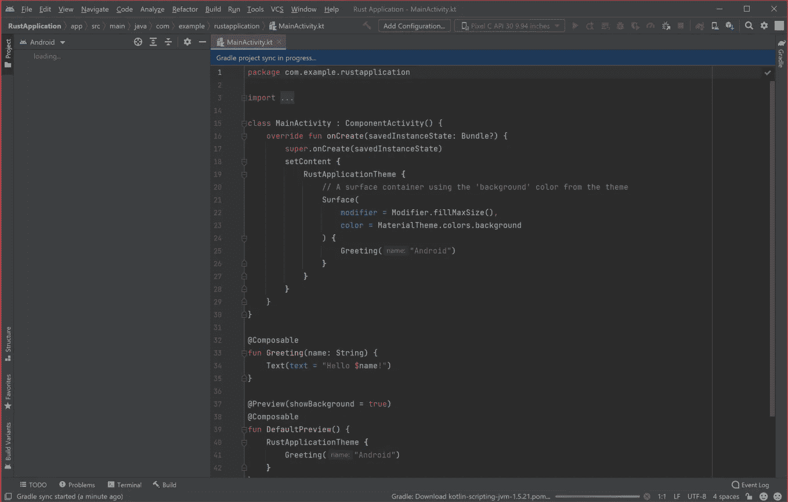
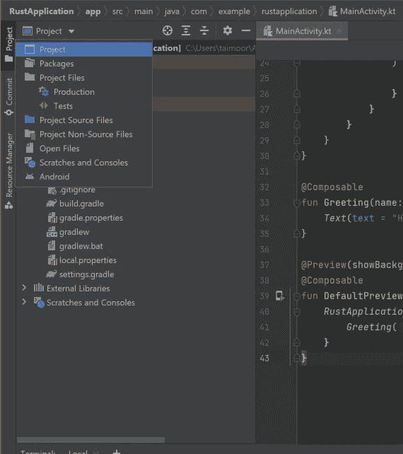
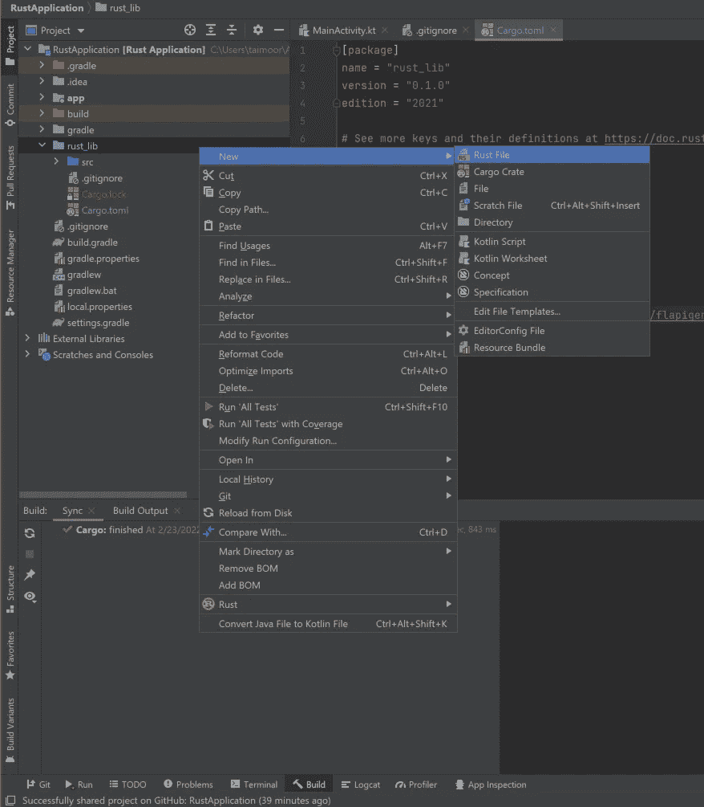

# Rust 与 Android 开发的集成

> 原文：<https://blog.devgenius.io/integrating-rust-with-android-development-ef341c2f9cca?source=collection_archive---------0----------------------->


[**Rust**](https://www.rust-lang.org/) 是一种通用的系统编程语言，已经存在很长时间了。作为一种系统编程语言，它可以用来执行类似于语言 **C** 和 **C++** 的任务，但具有更高的内存安全性。这使得 Rust 可以用于在包括 Android 在内的众多操作系统上编写程序或脚本。你可能想知道这怎么可能，是否有一个简单的方法可以做到这一点。嗯，这就是这篇文章的内容！

目前，没有太多关于如何为 android 应用程序编写 Rust 代码的信息。Google [在这里](https://source.android.com/setup/build/rust/building-rust-modules/overview)提供了一些信息，但是对于初学者来说理解起来很复杂。本演练的目标是为 Rust 代码与 android 开发的集成提供一个简单而有效的指南，并最终成为**最佳指南。不需要事先了解 C 或 C++或 JNI！**

我们将使用 [Android Studio](https://developer.android.com/studio) 。让我们从设置它开始。

# 设置🌱

## Rust 插件⚙️

首先，我们需要 Rust 插件。打开 Android Studio。将会打开一个类似如下所示的对话框。选择插件选项卡，搜索“Rust”，然后安装 JetBrains 的官方 Rust 插件。或者，如果你已经打开了一个项目，点击 Android Studio 左上角的文件并选择设置。点击插件。

> Rust 插件要求在您的系统上安装 Rust。你可以按照这个 [**链接**](https://www.rust-lang.org/tools/install) 在你的系统上安装 Rust。



## 创建空应用程序📱

现在让我们创建一个新的空应用程序。首先完成标准的新项目设置。



让我们将项目命名为 Rust 应用程序，然后单击 finish。

将会出现一个类似如下所示的窗口。



## 合并货物项目💼

下面我们再来添加一个[货物项目](https://doc.rust-lang.org/cargo/)，这里跟随教程提供的[](https://doc.rust-lang.org/cargo/guide/creating-a-new-project.html)**。要嵌入一个 Rust 项目，只需在 Android Studio 中点击**终端** **，输入`cargo new rust_lib --lib`，然后回车即可。****

```
C:\Users\USER1\AndroidStudioProjects\RustApplication>**cargo new rust_lib --lib**
```

**这将创建一个新的库，因此可以在我们的应用程序中使用它。我们把图书馆命名为`rust_lib`。记下文件夹的创建位置。**

**要在 Android Studio 中查看该文件夹，请导航到项目窗格，并从下拉菜单中选择项目，而不是 Android。**

****

**然后您会看到一个名为`rust_lib`的新文件夹。这个文件夹默认包含一个新的`git`库，一个`Cargo.toml`文件，和一个包含`lib.rs`的`src`文件夹。现在让我们修改我们刚刚使用`Cargo.toml`文件创建的[类型的库](https://doc.rust-lang.org/cargo/reference/cargo-targets.html#configuring-a-target)。对于移动应用程序开发，库应该是动态的。**

**将以下内容添加到`Cargo.toml`文件的内容中。**

```
[lib]
name = "rust_lib"
crate-type = ["cdylib"]
```

**点击查看要点[。](https://gist.github.com/Kofituo/e02bd971b75866103438961e98e3711f)**

## **添加相关性🧶**

**让我们添加一些依赖项来创建必要的文件，以便将我们的 rust 代码链接到 Android 终端，这是一个平稳的过程。**

**使用“ ***** ”获取依赖关系的最新版本。**

**`[**flapigen**](https://crates.io/crates/flapigen)` 是主要的构建依赖，用于从我们的 rust 代码中生成适当的代码，以便在我们的 android 应用程序中使用。使用一个接口文件，但是每次代码改变时都要修改接口文件，这可能会很乏味。这就是`[**rifgen**](https://crates.io/crates/rifgen)` 的由来。它使得创建接口文件变得如此容易。**

**额外的依赖项用于日志记录。**

## **创建构建文件📄**

**如前所述，flapigen 和 rifgen 是构建依赖项，并与`[build.rs](https://doc.rust-lang.org/cargo/reference/build-scripts.html#build-scripts)`文件交互。右击`rust_lib`文件夹并选择新建>锈文件。**

****

**将文件命名为`build.rs`。**

**按照`[flapigen](https://dushistov.github.io/flapigen-rs/java-android-example.html)`和`[rifgen](https://docs.rs/rifgen/latest/rifgen/)`给出的教程，我们的`build.rs`应该看起来如下:**

**build.rs**

**你可能想知道`build.rs`里发生了什么。`flapigen`将界面文件中的内容转换成`java_glue` rust 文件。所以我们首先为接口文件(`in_src`)指定源文件，然后是输出文件(`java_glue.rs`)。`java_glue.rs`的目录必须与`OUT_DIR` 环境变量相同。之后，使用`rifgen`生成接口文件，根据我们添加 rust 项目的语言指定我们的偏好。`Generator::new`的最后一个参数指定包含我们的 rust 代码的文件夹的开始位置，而`generate_interface`函数采用接口文件的路径。即`in_scr`。`java_folder`指定了创建的 java 文件应该放在哪里。调用`swig_gen.expand`告诉`flapigen`生成适当的文件。当我们在 Gradle 构建中使用这些参数时，请注意它们。**

**最后，在`rust_lib/src`文件夹中创建一个名为`java_glue.rs`的文件，并放入以下内容:**

**并补充:**

```
mod java_glue;
pub use crate::java_glue::*;
```

**到您的`lib.rs`文件。这样做可以将您的 rust 代码与生成的代码连接起来。**

## **添加 Android 工具链和链接器⛓**

**为了给 android 编译 Rust，我们需要给`rustup`添加 android 工具链。为此，只需在终端中运行以下命令:**

```
>**rustup default nightly** >**rustup target add aarch64-linux-android armv7-linux-androideabi**
```

**由于`rifgen`机箱在夜间工作，你必须先在夜间安装 Rust。**

**然后分别为 64 位和 32 位 android 版本添加 rust 工具链和标准库。现在，让我们添加[编译器连接器](https://en.wikipedia.org/wiki/Linker_(computing))。应该添加到`rust_lib/.cargo/config.toml`文件中。**

**右键单击`rust_lib`文件夹，创建一个名为`.cargo`的新目录，然后在`.cargo`目录中创建一个名为`config.toml`的新文件。**

**合适的连接器随 **Android NDK** 一起提供，因此应该在继续之前[下载](https://developer.android.com/studio/projects/install-ndk#default-version)。**

**将以下内容添加到您创建的配置文件中。**

**用 ANDROID SDK 路径(或包含 NDK 包的文件夹)替换 **ANDROID SDK** 。此外，用您的操作系统版本替换**操作系统版本**。例如，在我的 Windows pc 上，完整路径是:**

```
[**target.aarch64-linux-android**]
linker = "**C:\\Users\\taimoor\\AppData\\Local\\Android\\Sdk\\**ndk-bundle\\toolchains\\llvm\\prebuilt\\**windows-x86_64**\\bin\\**aarch64-linux-android21-clang++.cmd**"
```

**注意 Windows 版本末尾的`.cmd`。**

> **如果您使用的是 NDK v25 的 Mac OS，您可能会面临一个问题。如果您确实面临一个问题，您可以尝试以前版本的 NDK。或者，您可以[联系 more 以获得更多帮助](https://www.upwork.com/freelancers/~0196d30a485de56f48)。**

## **使用 Gradle 实现自动化构建🐘**

**每当我们想要测试应用程序时，Gradle 可以用来自动运行`cargo build`。这将导致我们在 Rust 端所做的更改自动更新到我们的应用程序中。**

**build.gradle**

**注意，这是**应用程序或模块级**梯度文件，而不是项目级梯度文件。添加线路 **20 至 27** 和线路 **65 起**。从第 65 行开始，只要我们运行应用程序，Gradle 就会运行 cargo build。运行 cargo build 命令后，我们复制 java 文件和动态库文件(。**所以**)创建并粘贴它们到 Android 可以读取并在我们的 Kotlin 代码中使用的目录中。**

**应用程序现在应该可以运行了😄。如果你在运行它的时候有困难，请在下面留下你的评论或者发邮件给我，地址是*otukof@gmail.com*！**

## ****奖励部分:伐木**📃**

**让我们快速实现日志记录来帮助调试 Rust 代码。在`lib.rs`文件中，添加以下内容:**

**我们使用`[android_logger](https://docs.rs/android_logger/0.10.1/android_logger/index.html)`箱生成日志，然后调用`[log_panics::init()](https://docs.rs/log-panics/2.0.0/log_panics/fn.init.html)`将所有 panics 重定向到日志中，而不是打印到标准错误中。注意属性`#[generate_interface]`。这告诉`rifgen`我们将从 Kotlin 调用这个函数，因此它应该将这个方法调用添加到接口文件中。**

## **从 Kotlin 加载库📲**

**现在我们已经设置了铁锈面，让我们继续 Kotlin 面。我们现在将从单例加载库:**

**主活动. kt**

**为我们创建的日志类添加各种导入。请注意，即使我们将函数命名为`initialise_logging`，我们也可以将其用作`initialiseLogging`。这是因为我们在设置`rifgen`的时候指定了 CamelCase。**

**运行程序，查看记录的 Rust 代码中的信息。**

# **后续步骤🍀**

**本系列的第一部分到此结束。在下一部分中，我们将把 Rust 代码与一些 GUI 混合起来，以完成这个演练。请订阅，以便在该系列的第二部分发布时获得通知。**

# **参考**

## **如果你需要任何帮助，或者你正在做的项目需要更多的帮助，让我们在 Upwork 上联系起来！**

## **[我也编辑图像(修图、合成、图像增强等。)所以随时联系我！😄😄](https://www.upwork.com/freelancers/~0196d30a485de56f48)**

## **[储存库](https://github.com/Kofituo/RustApplication/tree/FirstPart)**