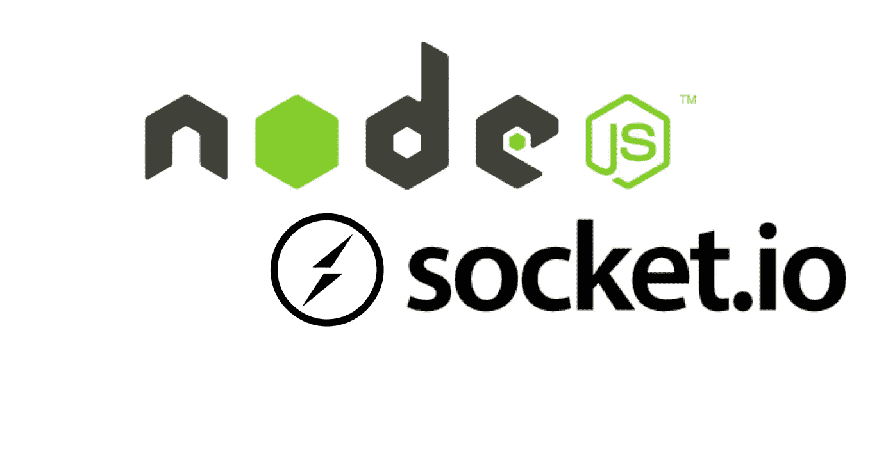

# 在 NodeJS 应用程序中集成 Socket.io

> 原文：<https://blog.devgenius.io/integrating-socket-io-in-nodejs-application-8e6da4f5930e?source=collection_archive---------1----------------------->



pic Credit @bitsrc.io

在这篇博客中，我们将在 NodeJS 应用程序中使用 socket.io。如果你以前没听说过 socket.io

> 插座。IO 是一个用于实时 web 应用程序的事件驱动库。它支持 web 客户端和服务器之间的实时双向通信。

你可以从他们的官方[网站](https://socket.io/)了解更多。

我们将建立简单的聊天应用程序。以下是我们将涉及的要点

1.  带有 socket.io 的 NodeJS 服务器
2.  客户端应用程序监听 socket.io
3.  聊天 Ui 和触发 socket.io 事件

## **将 Socket.io 与 NodeJS 应用集成**

我们将按照以下步骤在 NodeJS 应用程序中添加 socket.io

*   首先在 express-generator 的帮助下创建 NodeJS 应用程序，如果您没有安装 express generator，那么您可以通过键入以下命令来安装它

```
npm install -g express-generator
```

*   现在生成以 hbs(车把)为前端模板的 NodeJS app。

```
npx express-generator --view=hbs -d chat
```

*   上面的命令将为您创建一个节点应用程序，包含所有必需的依赖项。现在转到`chatting_app`目录，键入以下命令

```
cd chatting_app
npm i
npm start
```

App 默认会在端口`3000` 启动。可以在浏览器中打开 [http://localhost:3000](http://localhost:3000) 。

*   现在，我们将在应用程序中添加 socket.io。让我们首先安装 socket.io

```
npm install socket.io --save
```

*   在项目中创建一个`helper` 文件夹，在助手文件夹下创建`socket.helper.js`文件，并将下面的代码粘贴到这个文件中。

```
const io = require("socket.io")();
const socketapi = {
    io: io
};

// Add your socket.io logic here!
io.on("connection", function (socket) {
    console.log("A user connected");

    socket.on("message", (data) => {
        console.log("message from client", data);
        // broadcast received message to all other clients
        socket.broadcast.emit("message", {message: "Hello from server: " + data.message})
    });

    socket.on("end", () => {
        console.log("user left");
    })
});
// end of socket.io logic

module.exports = socketapi;
```

*   在上面的代码中，我正在监听我们将从客户端接收的**消息**事件。因此，当我们收到消息事件时，它也会有一些数据，我们将借助回调函数来获取这些数据。
*   现在，我们将从客户端向所有其他连接到应用程序的客户端广播收到的消息。
*   现在打开`bin/www`文件，修改如下

```
#!/usr/bin/env node

/**
 * Module dependencies.
 */

var app = require('../app');
var debug = require('debug')('chatting-app:server');
var http = require('http');
const socketapi = require("../helpers/socket.helper"); // added this line

/**
 * Get port from environment and store in Express.
 */

var port = normalizePort(process.env.PORT || '3000');
app.set('port', port);

/**
 * Create HTTP server.
 */

var server = http.createServer(app);
socketapi.io.attach(server); // added this line

/**
 * Listen on provided port, on all network interfaces.
 */
//... 
```

*   在上面的代码中，我们将 socket.io 服务器连接到 NodeJS 服务器。

现在，通过进行上述更改，您已经成功地将 socket.io 集成到了 NodeJS 应用程序中。Socket.io 服务器也在监听与 NodeJS 服务器运行相同的端口。

## 在前端添加 Socket.io

首先用下面的代码更新您的 **layout.hbs** 文件。在这里，我添加了 jQuery、Socket.io 客户端库和自定义 javascript 文件，我们将在其中编写 socketIo 代码。

```
<!DOCTYPE html>
<html>

<head>
  <title>{{title}}</title>
  <link rel='stylesheet' href='/stylesheets/style.css' />
  <script src="https://ajax.googleapis.com/ajax/libs/jquery/3.6.0/jquery.min.js"></script>
</head>

<body>

  {{{body}}}

  <script src="/socket.io/socket.io.js"></script>
  <script src="/javascripts/index.js"></script>
</body>

</html>
```

现在用下面的代码更新 **index.hbs** 。在这里，我添加了一个 div 元素，我将在其中显示从服务器收到的所有消息，并添加了一个输入框，我们将在其中键入消息。

```
<div id="main">
    <div class="messages"></div>
    <input id="message" placeholder="Enter your message">
</div>
```

现在在 **public/javascripts** 文件夹下创建 **index.js** 文件，并在其中添加以下代码。这里我添加了 io()构造函数，它将尝试监听 socketIo 服务器，默认情况下，它将监听默认的 post 和主机，即 [http://localhost:300](http://localhost:300) 0。

在下一行中，我添加了两个选择器 1。对于消息输入框和 2。消息类选择器。在下一行，我添加了模糊事件(当一个对象失去焦点时，这个事件将被触发)并向服务器发送消息。

现在我正在监听我们在 NodeJS 后端触发的 socket.io 消息事件。在回调中，它将包含我们在后端触发事件时发送的数据。

```
const socketIo = io();

const message = $("#message"); // input selector on id
const messages = $(".messages"); // messages div selector on class

message.on("blur", function () {
    const val = message.val();
    // val is not empty 
    if (val) {
        // emit message to server
        socketIo.emit('message', { message: val });
    }
})

// Receive message from the server
socketIo.on("message", function (data) {
    messages.append(`<p>${data.message}</p>`)
})
```

这里有两个窗口，当我在一个窗口中输入任何东西时，你会在除当前窗口之外的所有其他窗口中看到这条消息，反之亦然。

**第二个窗口**


窗口 2

**第一个窗口**


窗口 1

可以在多个窗口打开 [http://localhost:3000](http://localhost:3000) 并尝试测试。你会收到从一个窗口发送到另一个窗口的消息。

## 结论

在这篇博客中，我们看到了如何将 socket.io 集成到 NodeJS 应用程序中。这里我举了一个简单例子来构建聊天应用程序。但是你可以用 socket.io 做很多好事情，比如构建通知功能，多人游戏等等。

感谢你阅读这篇博客，希望你会喜欢。如果是的话，请鼓掌并跟随我看更多这样的博客。**我有自己的 YouTube 频道，我在那里创建基于 NodeJS 的项目，你可以在这里** **查看** [**。同样的博客也将在 https://ajaykrp.me/**](https://www.youtube.com/channel/UCvEB7wXUEXGFE9lCx0USR3Q)推出