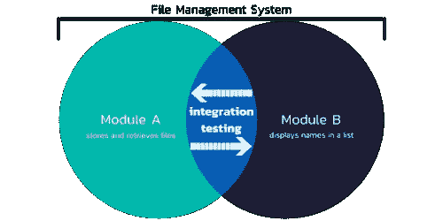

# 集成测试

> 原文：<https://blog.devgenius.io/integration-testing-61647c75b1ec?source=collection_archive---------38----------------------->

所以当人们问什么是集成测试时？怎么考？我们为什么要做这种测试？你想知道这是否真的是一种重要的测试类型，要对提供给你测试的产品进行测试。

所以我现在想为你做的就是用一种直接的方式给你，让你对这件事有更多的了解。

# 什么是集成测试？

> 集成测试是软件测试中的一个阶段，在这个阶段，单个的软件模块被组合起来，作为一个组进行测试。进行集成测试是为了评估系统或组件是否符合指定的功能要求。它发生在单元测试之后和验证测试之前。如 ***维基*所述**

# 集成测试是怎么做的？

集成的含义很简单，就是一个接一个地组合单元测试模块，并测试组合单元的功能。通常，集成测试是在单元测试之后进行的。因此，在开始时，您会得到基于模块的测试，但在集成测试中，所有模块都组合在一个版本(应用程序版本)中，或者一次性测试贯穿整个产品，以查看模块组合是否有任何副作用。

## 开始集成测试的简单步骤:

*   准备测试集成计划
*   决定集成测试方法的类型
*   设计测试用例、测试场景和测试脚本
*   将选择的模块部署在一起，并运行集成测试
*   跟踪缺陷并记录测试结果
*   重复上述步骤，直到整个系统测试完毕

# 集成测试的挑战

*   管理集成测试有时很困难，因为各种各样的因素，如数据库、平台、环境等
*   将新系统集成到遗留系统或者集成两个遗留系统需要大量的测试工作和变更
*   由两家不同公司开发的两个系统之间的兼容性较差，这对程序员来说是一个挑战

有太多不同的方法和排列来测试集成系统

# 为什么集成测试很重要？

集成测试的自顶向下或自底向上的方法，测试在开发的非常早期的阶段开始，并且在周期的早期而不是晚期发现错误。

*   对开发周期的信心很高。
*   易于与日常构建集成，易于在开发环境中测试
*   创建正确的测试在开发人员和测试工程师之间提供了精确的反馈机制。
*   与端到端测试相比，测试运行速度更快。
*   代码覆盖率更高，容易跟踪。
*   大多数单元测试案例、否定案例和简单案例可以在早期阶段编写，并在每次构建时执行。它也有助于更好的测试覆盖率，并改善测试差距。
*   测试更加可靠，也更容易隔离故障。
*   主要帮助在端到端测试期间构建实时用例。
*   集成测试捕捉系统级的问题，比如数据库模式损坏、错误的缓存集成等等。

# 开始集成测试的步骤

*   了解您的应用程序的架构。
*   识别模块
*   了解每个模块的功能
*   了解数据如何从一个模块传输到另一个模块。
*   了解数据是如何输入和接收到系统中的
*   隔离应用程序以满足您的测试需求。
*   确定并创建测试条件
*   一次考虑一个条件，并写下测试用例。

在下面的图片中，我只是想简单地向你展示一下集成测试的概念，以便你更好地理解这个概念。

如果您正在寻找我们的服务，请点击下面的网站:

[StackedQA 网站](https://www.stackedqa.com/)

查看我们的社交媒体:

[脸书](https://www.facebook.com/StackedQA)，[推特](https://twitter.com/stackedqa)， [Instagram](https://instagram.com/stackedqa) ，&Linkedin