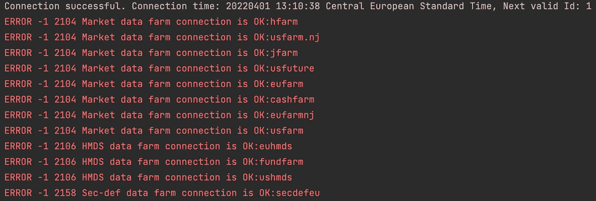
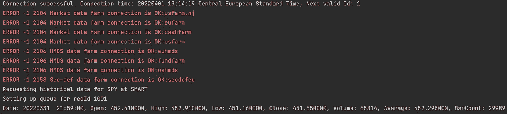
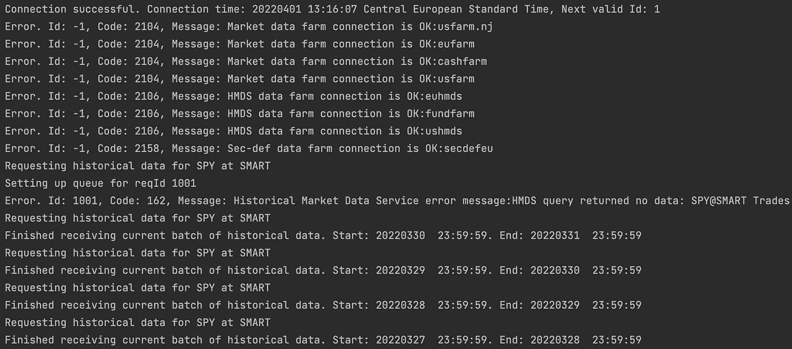

# Python 的交互式代理 API

> 原文：<https://blog.devgenius.io/interactive-brokers-api-for-python-d53eb80cc2b9?source=collection_archive---------2----------------------->

**使用 IB API 和 Python 请求高分辨率的历史市场数据。**

通过这篇文章，你将学会如何:

*   构建一个自定义类，它(1)使用`EClient`方法从 TWS API 请求东西，并且(2)覆盖`EWrapper`方法来处理从服务器接收的数据；
*   将数据放在一个队列中，然后在数据流结束时从队列中取出数据，将其存储为类属性；
*   减轻 IB API 的限制，触发多个请求，将返回的原始数据聚集到 Pandas DataFrame 中，并将其导出到一个文件中。

这篇文章不会解释什么，但这是一个需要事先解决的先决条件:

*   安装 TWS API 源码；
*   交易者工作站或 IB 网关的配置以接受您的连接；
*   通过 InteractiveBrokers 为您选择的工具订阅市场数据。

我之所以不详细介绍后面几点，是因为在官方文档([https://interactive brokers . github . io/tws-API/initial _ setup . html](https://interactivebrokers.github.io/tws-api/initial_setup.html))和 IB 的官方 YouTube 频道([https://www.youtube.com/playlist?)中有足够的信息 list = pl 71 vnxrerkuppremb 3 Z1 wgx 6 fotczmah 1](https://www.youtube.com/playlist?list=PL71vNXrERKUpPreMb3z1WGx6fOTCzMaH1))。

**动机**

所以你想出了一个投资理论，并希望对其进行现实核查，尽可能真实地反映当前的市场状况。你想知道你是否能够在期望的价格水平上开仓/平仓，并确定是否有足够的流动性。你还想评估滑点和佣金对 PnL 的影响。如果这些是你的目标，那么你需要忘记来自你通常的免费提供商的每日 OHLC(V)数据点；为了对这种数据质量有信心，您将需要更健壮的东西。

这可能也会让你付出代价，但高质量的数据是绝对必要的，这样才能操作哪怕是最简单的投资策略。你可以选择向你的经纪人购买历史价格和交易量信息。如果这个代理恰好是 InteractiveBrokers，那么在这个小故事结束时，您应该有一个现成的输入来测试您的策略。

**简而言之**

我们的应用程序的结构非常简单:

1.  我们导入所需的模块；
2.  我们创建了一个自定义的 *IBDataApp* 类，它继承了 IB API Python-native `EWrapper`和`EClient`类，我们覆盖了选定的原生方法，并在线程和队列的帮助下添加了自定义方法；
3.  我们在 main 函数中实例化我们的自定义类，并使用它的方法从 IB 服务器请求数据，用于在日期时间范围内循环的金融工具合同。
4.  最后，我们将从 IB 服务器接收到的存储数据导出到一个带有 Pandas 的文件中。

我需要在这里声明，我不保证以上是最佳的，甚至是特别正确的设置方式。但是这种方法对我和我的能力有效，而且似乎达到了目的。根据您的需要，您可能想要考虑创建两个额外的自定义类，分别继承`EWrapper`和`EClient`，如参考指南中所建议的那样([https://interactive brokers . github . io/tws-API/client _ wrapper . html](https://interactivebrokers.github.io/tws-api/client_wrapper.html))。

***‘你好！有人在吗？* -沟通是关键**

如果您想知道什么是`EWrapper`和`EClient`生物，那么要理解我们的应用程序是如何实现的，您应该知道的是它们以下列方式促进了我们和 InteractiveBrokers 之间的交换:

*   *EWrapper* —我们从 TWS 接收信息(或者，具体到我们的情况，市场数据)的界面；它是一个类，我们覆盖它的方法，这样它们就可以做我们想让它们做的事情，而不是执行默认的逻辑；
*   EClient —一个套接字类，通过它我们向 TWS 发送贪婪的请求；不需要重写，我们只是调用它的函数来发送消息。

***‘你在接收我吗？’——*初遇**

枯燥的理论已经说得够多了，为什么我们不做些改变呢！好吧，让我们从与 TWS 建立联系开始，并验证它是否成功。这里有一个例子。

```
*# Import required modules*
from ibapi.client import EClient
from ibapi.wrapper import EWrapper

from threading import Thread

import time *# Create a custom class*
class IBDataApp(EWrapper, EClient):
    def __init__(self, host, port, clientId):
        EWrapper.__init__(self)
        EClient.__init__(self, self)

        *#Open client socket*
        self.connect(host=host, port=port, clientId=clientId)

        *# Create a thread with a new activity pointing to client run function*
        thread = Thread(target=self.run)
        thread.start()
        setattr(self, "_thread", thread) *# Override native EWrapper method which is triggered on successful connection with the server*
    def nextValidId(self, orderId):

        print("Connection successful. Connection time: %s, Next valid Id: %d" % (
            self.twsConnectionTime().decode("ascii"), orderId
        ))

if __name__ == "__main__": *# Instantiate our custom class and pass required arguments*
    app = IBDataApp("localhost", 7497, 0)

    time.sleep(2)

    app.disconnect()
```

虽然仅仅建立一个有效的连接看起来太费力了，而且从功能的角度来看也没什么别的事，但是我们为进一步的开发打下了坚实的基础。所以我们来拆开看看。

如果 IBApi 源代码安装成功，您会立即得到反馈。除非您的 IDE 因为前两次导入而出现错误，否则应该没问题。除了来自`ibapi`模块的`EWrapper`和`EClient` 类之外，我们还需要来自 Python 自己的`threading`库和`time`模块的`Thread`类。

接下来，我们的自定义`IBDataApp`类被创建。注意，它继承了两个 IB API 本地类，并在它的`__init__`方法中初始化它们，试图打开一个调用`connect`函数的套接字并创建一个单独的线程。该线程所做的是启动`run`功能，保持与服务器的连接，允许消息被处理，并在无限循环中触发回调。

目前我们只覆盖一个`EWrapper`方法——`nextValidId`——它在成功连接到 TWS 时自动触发。我们告诉它打印一些文本到控制台，包括连接时间和下一个有效的订单 id，这样我们就知道了

最后，我们来看程序的主函数，在这里我们实例化我们的自定义类，传递打开与 TWS 的连接所需的参数，包括:

*   IP 地址，
*   端口号(根据您使用 TraderWorkstation 还是 IB Gateway 以及您是使用纸质帐户还是真实帐户进行连接而有所不同)，以及
*   客户端 Id。

我们使用`sleep`函数来告诉程序在断开连接之前等待几秒钟，因为不能保证与 IB 服务器的连接会是即时的。另外，当你期望一个大的有效载荷时，给它一点时间是谨慎的。

运行这段代码后，我们应该会得到类似于下面截图中显示的内容。在控制台打印出显示连接时间和下一个有效订单 id 的自定义字符串之后(自动返回的三个内容中的两个；第三个是帐户列表)，它也抛出一堆错误，但不用担心。错误是与 TWS 沟通的默认媒介。



***【排队】* -将数据排队**

既然我们能够连接到 TWS，让我们试着得到我们真正想要的。在这一步中，我们的程序将被扩展，这样它可以向服务器发送数据请求，然后通过将返回的消息放入队列来处理它的响应。最后，队列将被清空，数据被赋给一个变量。我用下面的片段来解释。

```
*# Add the following to our imports*
from ibapi.contract import Contract
import queue *"""In the __init__ method include a class attribute that will hold queues"""*
self.data_queue_dict = {} *"""Create a custom function in IBDataApp class which sends a data request and sets up a queue in anticipation of incoming response"""* def request_historical_data(self, reqId, contract, endDateTime,
                            durationStr, barSizeSetting, whatToShow,
                            useRTH, formatDate, keepUpToDate):

    print(f"Requesting historical data for {contract.symbol} at {contract.exchange}")

    self.reqHistoricalData(
        reqId=reqId,
        contract=contract,
        endDateTime=endDateTime,
        durationStr=durationStr,
        barSizeSetting=barSizeSetting,
        whatToShow=whatToShow,
        useRTH=useRTH,
        formatDate=formatDate,
        keepUpToDate=keepUpToDate,
        chartOptions=[]
    )

    if reqId not in self.data_queue_dict.keys():

        print("Setting up queue for reqId %d" % reqId)
        self.data_queue_dict[reqId] = queue.Queue()

    return reqId *"""Override native EWrapper method in IBDataApp class to handle incoming messages"""*
def historicalData(self, reqId, bar):
    self.data_queue_dict[reqId].put(bar) *"""In the main function (1) create a contract object, (2) invoke the custom function created above and (3) retrieve data from the queue to a list"""**# (1)*
contract = Contract()
contract.symbol = "SPY"  *# Security symbol*
contract.secType = "STK"  *# Security type*
contract.currency = "USD"  *# Security traded currency*
contract.exchange = "SMART"  *# Exchange**# (2)*
reqId = app.request_historical_data(
    reqId=1001,  *# Discretionary Id associated with the request*
    contract=contract,  *# Contract defined above*
    endDateTime="20220331 23:59:59",  *# End time of the final data point to be returned*
    barSizeSetting="1 min",  *# Data resolution*
    durationStr="1 D",  *# How far back we want our data*
    whatToShow="TRADES",  *# What prices to return*
    useRTH=1,  *# 0 to include data outside regular trading hours*
    formatDate=1,  *# 1 for datetime, 0 for timestamp*
    keepUpToDate=False  *# True to stream live market data*
)time.sleep(2)  *# Patiently wait for complete payload**# (3)*
historical_data = []
*# Pull data stored in a queue until it's empty and append to a list*
while not app.data_queue_dict[reqId].empty():
    historical_data.append(app.data_queue_dict[reqId].get())

print(historical_data[-1])  *# Print last item in the list*
```

在上面的(1)中，我们定义了请求数据的工具。从`ibapi`模块导入的`Contract`类用于此目的。对于像 SPY 这样的普通证券，只需要指定少数属性(即符号、类型、货币和兑换)。然而，对于更复杂的产品，你需要向 TWS 提供更多的数据(如期货合约月份或期权执行价格)。有关合同规范的更多详细信息，请访问文档或在 IBApi 附带的 *ContractSamples.py* 中查找样本。

我们将契约对象传递给`EClient`类的`reqHistoricalData`函数，我们将它烘焙到我们的自定义`request_historical_data`方法中，并在主函数中调用——参见(2)。需要注意的重要一点是，TWS 从指定的`endDateTime`开始向后工作，直到一个远离它的点`durationStr`。但是，返回的数据按升序排序，最近的条形尽可能靠近`endDateTime`。

因为我们追求的是高分辨率的市场数据，所以让我们把注意力转向`barSizeSetting`。这是 TWS 允许客户端应用程序指定它将返回的条形间隔的地方。选项的范围从 1 秒到 1 个月，并且该选择需要考虑可以传递到函数中的时间段长度(参见 IB API 文档中的历史数据限制)。这意味着，为了获得跨越更长时间的数据，客户端应用程序需要发出更多的请求。但是稍后会详细介绍，因为首先我们的程序需要处理作为`reqHistoricalData`结果的输入消息。

这就是队列发挥作用的地方。它的作用是从信息流中收集服务器响应，一条条的市场数据。稍后可以按照 FIFO(先进先出)顺序从队列中检索这些数据。在`request_historical_data`方法中创建一个队列的新实例，并将其添加到`data_queue_dict`字典*中。正如我们给程序一些时间来连接 TWS 一样，我们现在在服务器传输数据的时候多等几秒钟，然后我们从队列中取出数据放入一个列表中(参见代码块中的 3)。

**虽然在这个简单的例子中，用一个能够容纳多个队列的字典来武装我们的自定义类并不是必须的，但事实证明，例如，当多个乐器的数据被流化时，它是非常宝贵的。*



**包好一切**

这一节通过展示如何(1)协商 IB 的历史数据限制和(2)使请求的数据可重用来完成事情。请注意，这一次，该程序不仅进行了扩展，还在几个地方进行了重组。请参见下面的更改。

```
*# Starting with a new batch of imports as usual*
from dateutil import parser
import pandas as pd *# Adding new attributes to custom class' __init__ method*
self.datetime_list = list()
self.open_list = list()
self.high_list = list()
self.low_list = list()
self.close_list = list()
self.volume_list = list()*# Override EWrapper function triggered when data stream finishes*
def historicalDataEnd(self, reqId, start, end):

    print(f"Finished receiving current batch of historical data. Start: {start}. End: {end}")

    *# Pull the data from queue inside custom class instead of the main function*
    while not self.data_queue_dict[reqId].empty():

        bar_data = self.data_queue_dict[reqId].get()

        self.datetime_list.append(parser.parse(bar_data.date))
        self.open_list.append(bar_data.open)
        self.high_list.append(bar_data.high)
        self.low_list.append(bar_data.low)
        self.close_list.append(bar_data.close)
        self.volume_list.append(bar_data.volume) *# Override EWrapper error function*
def error(self, reqId, errorCode, errorString):

    error_msg = f"Error. Id: {reqId}, Code: {errorCode}, Message: {errorString}"

    print(error_msg) *# Add custom function to aggregate the data into a Pandas DataFrame*
def data_to_dataframe(self):

    data = {
        "open": self.open_list,
        "high": self.high_list,
        "low": self.low_list,
        "close": self.close_list,
        "volume": self.volume_list
    }

    dataframe = pd.DataFrame(data, index=self.datetime_list)
    dataframe.sort_index(inplace=True)

    return dataframe*# Loop data requests in the main function over the specified datetime range*
dt_range = pd.date_range(start="20220328 23:59:59", end="20220401 23:59:59", freq="24H")

for dt in dt_range[::-1]:
    reqId = app.request_historical_data(
        reqId=1001,
        contract=contract,
        endDateTime=dt.strftime("%Y%m%d %H:%M:%S"),
        barSizeSetting="1 min",
        durationStr="1 D",
        whatToShow="TRADES",
        useRTH=1,
        formatDate=1,
        keepUpToDate=False
    )

    time.sleep(2)

app.disconnect()*# Export data to an HDF file*
df = app.data_to_dataframe()
df.to_hdf("my_historical_data.h5", key="df", mode="w")
```

我们从`dateutil`模块导入了一个`parser`，以便轻松地将服务器返回的字符串转换为实际的日期时间，这样它们以后就可以用作 DataFrame 索引。我们还导入 Pandas 来创建一个日期时间范围，以便循环，并在以后聚合和导出历史数据。

随着导入的结束，焦点转移到了自定义的`IBDataApp`类，该类现在配备了许多新的属性，每个属性对应一个将从 IB 中流出的数据数组。当然，没有什么可以阻止您将数据写入到单个属性中，但是为了透明起见，我选择用许多单独的属性来完成。

如果不是因为`EWrapper's` `historicalDataEnd`函数，知道什么时候告诉程序从队列中取出数据并存储在类属性中要复杂得多。每当当前数据流结束时就会触发它，这是将结果有效负载(分别针对每个请求)添加到占位符列表的绝佳位置。

因为有时 TWS 会发回我们需要处理的错误，所以我们覆盖了本机的`error`方法。然而，在这个示例中，它只是格式化消息，并在我们想要处理特定错误时充当占位符。

`IBDataApp`类的最后一个扩展是`data_to_dataframe`函数。它收集包含历史数据的列表，并根据这些列表创建一个字典，该字典又被用作 DataFrame 输入。`datetime_list`被排除在字典之外，因为它单独用作数据帧的索引。后者仍然需要排序，否则日内棒线将以升序显示，而日内棒线以降序显示。

为了让整个练习顺利完成，我们用 Pandas 的`date_range`函数创建了一个日期时间范围，并对结果数组进行循环，其中每一项也是前面讨论过的`endDateTime`参数。我们做的最后一件事是将`data_to_dataframe``函数的输出赋给一个变量，并将其写入一个 HDF 文件。



所以你有它！一个简单的程序，可以获得任何分辨率的历史数据(只要它符合 IB 的预设)，以随时可用的格式打包，用于后续的时间序列分析或策略回溯测试。你可以在这里下载完整的代码。