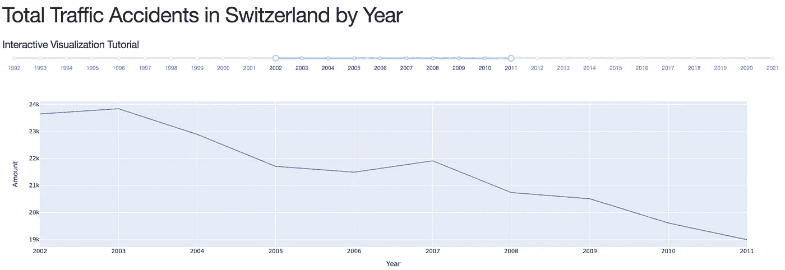

# 使用 Plotly 和 Dash 的交互式数据可视化(第 1 部分)-入门

> 原文：<https://blog.devgenius.io/interactive-data-visualisation-with-plotly-and-dash-part-1-f9be5782ee3b?source=collection_archive---------7----------------------->


由[卡洛斯·穆扎](https://unsplash.com/@kmuza?utm_source=unsplash&utm_medium=referral&utm_content=creditCopyText)在 [Unsplash](https://unsplash.com/s/photos/data-visualization?utm_source=unsplash&utm_medium=referral&utm_content=creditCopyText) 上拍摄的照片

# 介绍

就在最近，我完成了经济学学士学位。看到数据将成为我可能从事的任何工作不可或缺的一部分，我还通过完成 Datacamp 数据分析师认证([http://datacamp.com](http://datacamp.com))学习了数据分析和可视化的基础知识。在写关于数据增强对瑞士德语自动语音识别的影响的学士论文时，我爱上了 Wandb([https://wandb.ai/site](https://wandb.ai/site))提供的交互式可视化工具。

我的模型训练的这些图形表示帮助我看到发生了什么。因此，他们加快了开发速度，使得在给定的时间框架内撰写学士论文获得切实的成果成为可能。看到交互式可视化帮助我变得更有效率，我想知道我是否可以创建我自己的。

# 什么是 Plotly 和 Dash？

Dash 文档将 Dash 描述为:“基于 Plotly.js 和 React.js 编写，Dash 是构建和部署具有定制用户界面的数据应用程序的理想选择。它特别适合任何与数据打交道的人。

通过几个简单的模式，Dash 抽象出了构建具有交互式数据可视化的全栈 web 应用程序所需的所有技术和协议。”——[https://dash.plotly.com/introduction](https://dash.plotly.com/introduction)

“`[plotly](https://plotly.com/python/)` [Python 库](https://plotly.com/python/)是一个交互式、[开源](https://plotly.com/python/is-plotly-free)绘图库，支持 40 多种独特的图表类型，涵盖了广泛的统计、金融、地理、科学和三维用例。”—[https://plotly.com/python/getting-started/](https://plotly.com/python/getting-started/)

将这两者放在一起，可以用很少的样板代码开发基于浏览器的交互式可视化。基本上就是我要找的。

# 数据

与任何可视化项目一样，我们需要一些数据来可视化。为此，我一直在摆弄来自 [https://opendata.swiss](https://opendata.swiss/de) 的数据集。它通过一个中央目录向公众开放政府数据。该目录还提供了关于如何清楚简明地利用数据的信息。

在所有提供的数据集里，我偶然发现了一些关于瑞士交通事故的数据集。作为一个狂热的自行车爱好者，这些数据看起来足够有趣，可以作为创建交互式可视化的起点。

对于这个项目，我下载了一个 CSV 文件，其中包含事故严重程度、事故发生的道路类型以及事故发生在哪个州(瑞士是由州组成的联邦……)的信息。为简单起见，数据按年份汇总。

数据由[BFS 联邦统计局](https://opendata.swiss/de/organization/bundesamt-fur-statistik-bfs)提供，可通过以下链接找到:[https://open data . Swiss/en/dataset/strassenverkehrsunfalle-un falle-MIT-personenschaden-nach-un falltyp 2/resource/026 f80d 4-b600-42dc-90e 0-9 ACC 900 c7c a3](https://opendata.swiss/en/dataset/strassenverkehrsunfalle-unfalle-mit-personenschaden-nach-unfalltyp2/resource/026f80d4-b600-42dc-90e0-9acc900c7ca3)。

有了数据，我们终于可以开始创建一个交互式的可视化。

# 准备

我到底想做什么？

如前所述，我想保持事情简单。有了数据，我想创建一条线，用户可以在这里选择要显示的时间范围。为了弄清楚需要做什么，我喜欢创建一个 Jupyter 笔记本。当然，我将从导入熊猫开始，为了检查我是否可以正确显示数据，我还将导入 Plotly express。

```
import pandas as pd
import plotly.express as px
```

CSV 文件有一个非标准的分隔符，编码有点不可靠。为了正确显示所有内容，我使用了以下导入:

```
df = pd.read_csv(‘Unfall_nach_Kanton.csv’, encoding=’unicode_escape’, delimiter=’;’)
```

有一点是显而易见的，那就是年份列。每一年都有单独的列，因此照原样使用会很棘手。理想情况下，我想要一个以年份为值的列。幸运的是，熊猫。熔化函数正是这样做的。

```
df = df.melt(id_vars=[‘Unfallschwere’, ‘Kanton’, ‘Strassenart’, ‘Unfallort’], var_name=’Year’, value_name=’Amount’)
```

最后，我只对每年的事故总量感兴趣(截至目前)。一个简单的。groupby 将数据按年份分组，并对数量求和，这将为我提供一个数据框架，用于这个简单的示例。

```
line_df = pd.DataFrame(df.groupby([‘Year’])[‘Amount’].sum())
line_df.reset_index(inplace=True)
```

使用 Plotly express(作为 px 导入)进行的快速测试表明，我可以绘制一条按年份绘制的事故总数线。

```
px.line(line_df, x=’Year’, y=’Amount’)
```

太好了。让我们来互动一下。

# 破折号

Dash 将处理在浏览器中显示 python 代码的大量复杂性。在其最简单的形式中，Dash 将为您提供一种初始化应用程序、为所述应用程序创建布局并运行它的方法。如果您还没有安装 Dash 和 Plotly:

```
pip install dash
```

这也带来了`plotly`图形库。该库正在积极开发中，请经常安装和升级。

# 基本应用布局

玩了一会儿 Dash 之后，我设计了一个基本的设置。这样我就能记住所有东西的去向，希望不会搞得太乱。无论如何，我已经在下面提供了我的基本模板(在这种情况下，数据已经被导入):

这里需要注意一些事情。

1.  文件另存为。py 而不是 Jupyter 笔记本
2.  我已经插入了转换数据集的代码
3.  布局部分将负责在哪里显示什么。把它想象成一个需要元素来展示任何东西的网页。
4.  回调部分是创建大部分交互逻辑的地方。
5.  运行该应用程序会启动一个服务器，您将能够在本地浏览器中检查您的工作。默认情况下，服务器将是 [http://127.0.0.1:8050/](http://127.0.0.1:8050/)
6.  当您运行这段代码时，您将看不到任何东西…
7.  在本教程中，我们将不使用 dash_bootstrap_components。从代码中删除那一行就可以了。

# 应用程序布局

通常，我倾向于对应用程序的样子做一个粗略的草图。在这种情况下，我认为列出待办事项就足够了:

*   标题和描述
*   显示瑞士每年交通事故总量的折线图
*   用户可以选择要显示的时间范围(默认为所有数据)的滑块

为了显示任何内容，我将从标题开始。Dash 提供了可以在你的应用中使用的 HTML 元素。这些组件可通过以下方式访问:

```
from dash import html
```

这些都是很容易使用的元素。没有任何 HTML 知识，你会走得很远。Dash 将在后台将这些组件转换成浏览器可读的格式。

要添加标题和描述，我将添加一个 html。H1 和 html。H5 将布局作为主 html 的子元素。Div:

如果你回到浏览器，你会看到应用程序已经自动更新。所以不需要重新运行代码。如果你在代码中犯了一个错误，你的应用将会崩溃，你需要重新运行它并刷新你的浏览器。

接下来，我们将为我们的可视化添加一个居住的地方。这是通过从 Dash 核心组件中添加一个图形组件来完成的。

```
from Dash import dcc
```

图的 id 应该是你能记住的(并且是唯一的)，因为这是我们稍后将添加回调以与图交互的地方。为了完成布局的 TODO 列表，我还将添加一个范围滑块。

dcc.RangeSlider 有几个特点。

*   首先，我使用已经导入的数据定义了一个最小值和最大值。
*   marks 参数负责标记的外观。这有时可能有点复杂…基本思想是将一个字典传递给范围滑块，其中包含所有应该显示为文本的值。
*   value 参数负责向用户显示默认值。与 TODO 列表相反，默认值是整个范围，我选择了一个较小的范围。这为用户提供了一个视觉提示，即滑块可以是交互式的。
*   id 是我将用来从用户那里获得输入的 id。

# 互动

到目前为止，还没有发生太多的事情。这就是回调发挥作用的地方。回调允许对浏览器中呈现的内容进行交互和动态更新。您可能已经注意到，目前没有显示任何数据。

前两行告诉 Dash 在哪里收集和放置什么信息。输出(从 Dash 导入)指的是用于标识图形的 id(DCC)。图)。输入(从 Dash 导入)告诉应用程序在哪里可以找到输入信息。这将返回一个值，在本例中是一个值列表。

输入值作为 year_range 传递给函数“update_figure”。范围选择器返回要处理的值的列表。使用这个列表，我创建了一个新的数据帧，其中只包含该范围内的值。

然后，更新的 DF 用于绘制图形。

为了使过渡漂亮，fig 的 update_layout 属性用于创建一个轻微的延迟。

最后，该数字被传递回输出。这然后被传递到 dcc。要在屏幕上显示的图形对象。我还在应用程序中添加了一个外部样式表，只是为了让一切看起来更漂亮。

到目前为止，应用程序应该是这样的:



交互式可视化的屏幕截图

这不是有史以来信息量最大的图表。在第 2 部分中，我将探讨以一种有用的方式展示更多信息的方法。

下面是最终的代码: