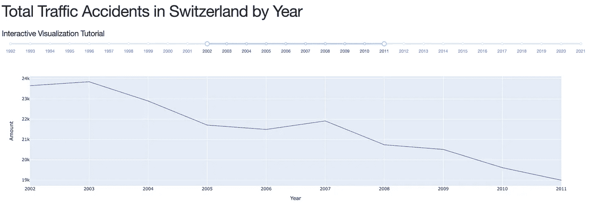

# 使用 Plotly 和 Dash 的交互式数据可视化(第 2 部分)——增加关键见解

> 原文：<https://blog.devgenius.io/interactive-data-visualization-with-plotly-and-dash-part-2-adding-key-insights-eb0b00366393?source=collection_archive---------6----------------------->


约翰·施诺布里奇在 [Unsplash](https://unsplash.com/s/photos/data-analytics?utm_source=unsplash&utm_medium=referral&utm_content=creditCopyText) 上的照片

# 目前为止发生了什么

在这个系列的[第一部分](/interactive-data-visualisation-with-plotly-and-dash-part-1-f9be5782ee3b)中，我看了使用 Dash 和 Plotly 获得一个基本的交互式可视化所需要的东西。为此，我介绍了 [Dash 和 Plotly](https://plotly.com/dash/) 是什么和做什么。然后，我继续获取一些数据，并讲述了如何使用这些数据。

这包括在 [Jupyter 笔记本](https://jupyter.org/)中进行操作，以获得对数据(由[BFS 联邦统计局](https://opendata.swiss/de/organization/bundesamt-fur-statistik-bfs)提供)的基本理解，转换数据并测试它是否会按预期显示。

接下来的步骤涉及到对应用程序本身的基本理解。在这里，我查看了应用程序显示下载数据的简单布局，以及用户选择应该显示的时间范围的方式。

最后，为了将所有东西联系在一起，我编写了一个回调函数来使(公认简单的)可视化具有交互性。所有这些步骤让我在本地浏览器上运行了一个应用程序:



第 1 部分中的[互动应用布局](/interactive-data-visualisation-with-plotly-and-dash-part-1-f9be5782ee3b)

# 有什么计划？

在这个系列中，我想看看 Plotly express 提供的几种不同类型的可视化。Plotly express 有超过 30 种功能用于创建不同类型的图形。看一下什么是可能的似乎是合适的。这将包括创建更多的回调来支持各种可视化。也意味着要处理一些 CSS(不用担心)。

Dash HTML 元素还允许我显示回调生成的关键数字。我将使用这个特性为用户显示附加信息。这也是这部分教程的重点。

在第一部分，我提到我喜欢勾画出应用程序应该是什么样子。我不是最好的素描画家，但我有个想法:


应用布局草图

布局的顶部仍应包含用户可选择的年份范围。此外，我想计算所选范围内事故数量的百分比变化。由于数据包含有关事故严重程度和事故发生在何种道路上的信息，我也想显示这些信息。

*对于第 3 部分，我将看看应用程序的底部:*

*在应用程序的底部，我想深入查看数据。在这里，用户应该能够输入一个州(瑞士联邦的一个成员国)。该应用程序应显示一个条形图显示所选年份的事故类型总数，一个饼图显示道路类型的事故百分比，最后，一个县的时间序列(取决于顶部的选择)。*

幸运的是，我不必从头开始，我将在第 1 部分的代码基础上构建:

# 添加关键见解

让我们从草图的顶部开始。在这里，我想对应该随着用户改变时间框架而更新的数据添加一些见解。我从创建一个单独的 html 开始。上半部分的 Div 包含另外两个 html.Divs，一个用于左边(包含我们在第 1 部分中已经制作的图形和滑块),另一个用于右边，应该显示一些细节。

Dash 允许 CSS 样式作为字典传递。老实说，我对这是如何工作的没有信心，我将坚持我所知道的。

最外面的 Div 跨越了可用的宽度。这可以通过向 Div 传递一个样式参数来实现:

```
html.Div(children=[], style={‘width’: ‘100%’})
```

老实说，我从各种[堆栈溢出](https://stackoverflow.com/)片段中窃取了 div 样式的其他部分，并使其工作起来……

这里需要注意的一点是:

与`display: inline`相比，主要的区别是`display: inline-block`允许在元素上设置宽度和高度。

同样，使用`display: inline-block`，顶部和底部的边距/填充被考虑，但是使用`display: inline`却没有。

与`display: block`相比，主要的区别在于`display: inline-block`没有在元素后添加换行符，因此该元素可以与其他元素相邻。”——[https://www.w3schools.com/css/css_inline-block.asp](https://www.w3schools.com/css/css_inline-block.asp)

现在布局的代码是这样的:

注意到上半部分的右侧看起来很简单吗？HTML 元素中没有子元素。

这种简单性是由于回调完成了所有繁重的工作。Dash 允许通过回调将子元素传递给 HTML 元素。有了这些知识，就有可能创建动态文本。

# 动态文本的回调

让我们仔细看看。

第一个回调向 html 输出一个子元素。id 为“delta_percent”的 H5 元素。输入与图相同(年范围选择器)。

当用户更改一个值时，回调计算第一年和去年的事故数量。为此，它使用了与图中相同的数据框架，因为所有金额都已经合计。然后，它将这一差异表示为百分比值。

范围滑块允许在年份之间选择值。浮点值扰乱了从数据帧中选择起始值和结束值。由于这个原因，输入值被转换成一个 int，应该可以提取值。

最后，我使用 Python f-string 来格式化信息。这个 f 字符串被传递给 html。H5 元素作为子元素，可以在浏览器中呈现。这是目前为止所有(新)回调背后的基本思想。

来自[文档:](https://dash.plotly.com/basic-callbacks)

“我们还可以一次更新几个输出:在`app.callback`中列出您想要更新的所有属性，并从回调中返回那么多项。如果两个输出依赖于同一个计算密集型的中间结果，例如一个缓慢的数据库查询，这就特别有用。

但是:

提醒一句:组合输出并不总是一个好主意，即使你可以:

*   如果输出依赖于一些(但不是全部)相同的输入，那么将它们分开可以避免不必要的更新。
*   如果输出具有相同的输入，但是它们使用这些输入执行非常不同的计算，那么保持回调的分离可以允许它们并行运行。"

就个人而言:

我喜欢分别编写每个回调函数，这样我的代码更容易阅读(至少对我来说是这样)。这也使调试变得简单了一些，因为我可以看到哪个元素没有按照我想要的方式运行。

总之，这是在应用程序中插入关键见解后的应用程序外观:


具有关键见解的 Dash 应用程序

在第 3 部分中，我将处理不同种类的可视化和用户输入。如果有什么你想让我看的，告诉我。

以下是目前为止的代码:

[https://gist . github . com/sccasutt/532 a5df 74445 efade 0 c 57157063 c 5466](https://gist.github.com/sccasutt/532a5df74445efade0c57157063c5466)

祝你愉快。