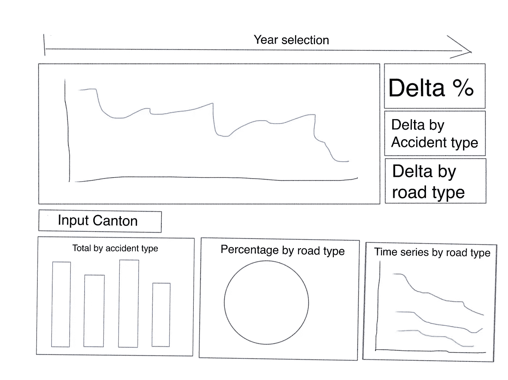
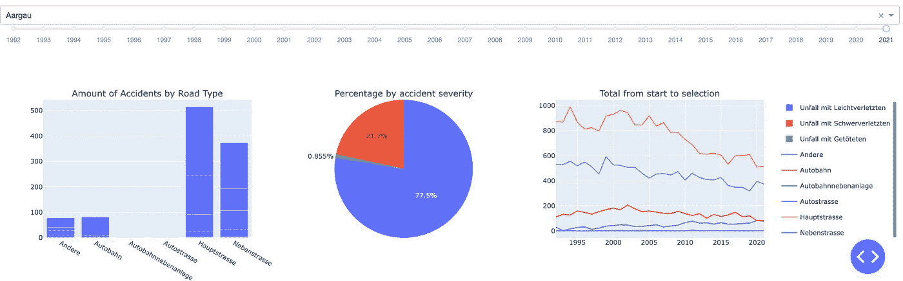

# 用 Plotly 和 Dash 实现交互式数据可视化(第 3 部分)——用 Plotly Express 添加支线图

> 原文：<https://blog.devgenius.io/interactive-data-visualization-with-plotly-and-dash-part-3-adding-subplots-with-plotly-express-43f263d4b166?source=collection_archive---------4----------------------->


由[卢卡斯·布拉塞克](https://unsplash.com/@goumbik?utm_source=unsplash&utm_medium=referral&utm_content=creditCopyText)在 [Unsplash](https://unsplash.com/s/photos/data-dashboard?utm_source=unsplash&utm_medium=referral&utm_content=creditCopyText) 拍摄的照片

# 概述

在第 1 部分中，我看了如何用[破折号和](https://dash.plotly.com/)开始跑步。如果您从未使用过这些库，这可能是一个不错的起点。教程的第一部分介绍了为什么以及如何启动和运行。为了让事情尽可能简单，我检查了数据收集和转换过程，向 Dash 应用程序添加了一个简单的聚合线图，并创建了一个回调，允许用户选择要检查的时间范围。

第 2 部分使用了一些诡计来为应用程序增加重要的交互洞察力。Dash 允许将子元素从应用回调传递到应用布局中的 HTML 元素。我利用这个功能来创建包含百分比值和类别的文本块，从而为用户生成关键的洞察力。

第三部分也是最后一部分将根据我在第二部分中画的草图利用支线剧情来完成这个应用。

# 警告

这将会很有趣:

“目前，Plotly Express 不支持创建具有任意混合支线剧情的人物，即具有不同类型支线剧情的人物。Plotly Express 只支持[小面剧情](https://plotly.com/python/facet-plots/)和[边缘分布支线剧情](https://plotly.com/python/marginal-plots/)。要制作带有混合支线剧情的图形，结合使用`[make_subplots()](https://plotly.com/python/subplots/)`功能和[图形对象](https://plotly.com/python/graph-objects/)——[见文档](https://plotly.com/python/mixed-subplots/)

有一种方法可以让支线剧情和 Plotly express 一起工作。既不好看也不超级实用。

那么，为什么我要在本教程中加入一种黑客的做事方式呢？

对我来说，失败是学习的一部分。通过实现文档中所说的不可能实现的东西，我学到了很多关于 Plotly 和 Dash 的不同特性是如何一起工作的(以及局限性在哪里)。

# 让我们用“错误的”方式做事:-)

第 2 部分中的草图展示了将添加到应用程序中的三种不同的可视化效果，用户可以选择一个州(瑞士联邦成员国的瑞士名称)来查看有关数据的更多细节。



应用程序应该是什么样子

以防你错过，这是目前为止的代码:

该应用程序底部的想法是包括三个支线剧情，可以根据用户的选择进行更新。

瑞士有 26 个州。因为有这么多，我决定有一个可搜索的下拉菜单来输入选择。选择州的单个框释放了大量的屏幕空间，尤其是与单选按钮相比。默认情况下，Dash 下拉列表(来自 Dash core components)是可搜索的，并且只允许单个选择(这可以通过在初始化 dcc 时设置 *multi=True* 来更改)。下拉菜单)。

对于用户可以选择的选项，通过迭代数据集的唯一值来传递字典(并按名称排序)。从这个迭代开始，第一个值被设置为默认值。

然后，第二个范围滑块被添加到应用程序布局中。与第一个滑块(在应用程序的顶部)相反，这个滑块最初只允许通过传递一个值来选择一个值。

最后一个 dcc。图形对象完成了应用程序的布局。这个最终的对象将接收一个基于用户输入的图形，该图形具有三个子图形。因为这个图形将处理支线剧情，所以在布局中不需要定义更多的东西。

应用程序下半部分的布局代码:

# 情节紧凑的支线剧情(或不要做什么)

首先需要做的是导入支线剧情:

```
from plotly.subplots import make_subplots
```

导入完成后，可以定义用于生成图形的回调。输入将从我刚才添加到布局的用户选择。所有内容都被计算出来，并作为一个数字传递给回调输出。

制作支线剧情时，需要定义支线剧情的规格。这是通过向 specs 参数传递一个字典数组来实现的。在子情节初始化中，也可以指定不同子情节的标题。

Plotly express 抽象出了许多创建情节的复杂性。另一方面，Make_subplots()使用较低级别的图形对象来创建支线剧情。“由 Plotly Python 库创建、操作和渲染的图形是由树状数据结构表示的[，这些数据结构被自动序列化到 JSON 以供 Plotly.js JavaScript 库渲染。这些树由称为“属性”的命名节点组成，其结构由 Plotly.js 图形模式定义，该模式以](https://plotly.com/python/figure-structure/)[机器可读形式](https://raw.githubusercontent.com/plotly/plotly.js/master/dist/plot-schema.json)提供。`plotly.graph_objects`模块(通常作为`go`导入)包含一个自动生成的 Python 类的[层次结构，该层次结构表示该图模式中的非叶节点。术语“图形对象”指的是这些类的实例。](https://plotly.com/python-api-reference/plotly.graph_objects.html#graph-objects)

在`plotly.graph_objects`模块中定义的主要类是`[Figure](https://plotly.com/python-api-reference/generated/plotly.graph_objects.Figure.html)`和一个兼容`[ipywidgets](https://plotly.com/python/figurewidget/)` [的名为](https://plotly.com/python/figurewidget/) `[FigureWidget](https://plotly.com/python/figurewidget/)`的变体，它们都表示完整的图形。这些类的实例有许多方便的方法，用于 python 化地[操作它们的属性](https://plotly.com/python/creating-and-updating-figures/)(例如`.update_layout()`或`.add_trace()`，它们都接受[“神奇下划线”符号](https://plotly.com/python/creating-and-updating-figures/#magic-underscore-notation))以及[呈现它们](https://plotly.com/python/renderers/)(例如`.show()`)和[导出它们到各种格式](https://plotly.com/python/static-image-export/)(例如`.to_json()`或`.write_image()`或`.write_html()`)。”— [来自文档](https://plotly.com/python/graph-objects/)

**文档还告诉我们，用 Plotly Express 创建的可视化将它们的图形对象存储在一个. data 属性中…有趣…**

所以如果我遍历。数据属性，并将存储的图形对象作为轨迹添加到子情节中，条形图会显示在子情节中吗？

简而言之，是的

同样的想法被用来在应用程序的底部添加一个饼图和一个折线图:

# 为什么不用这个？

主要原因是清晰度。上面的最后一行代码

```
fig.update_layout(showlegend=False)
```

关闭支线剧情中的所有图例。这使得可视化比必要的更难阅读。打开图例时，图例被分组并像单个图例一样阅读。



打开图例的应用程序

这可以通过将图例分组并为每个支线剧情使用不同的颜色来部分缓解。这些解决方法似乎不是最佳的，特别是因为修复这个问题可能需要更少的代码。

# 简单的解决办法

简单的解决办法是创建三种不同的 html。每个可视化的 Div 元素。根据样式，这将减少所需的代码量(在本例中)。

# 收尾工作

该应用程序在本地计算机上应该是这样的:


最终应用的屏幕截图

完整的代码，如果你想自己玩的话:

本教程系列到此为止。

我希望你有美好的一天。