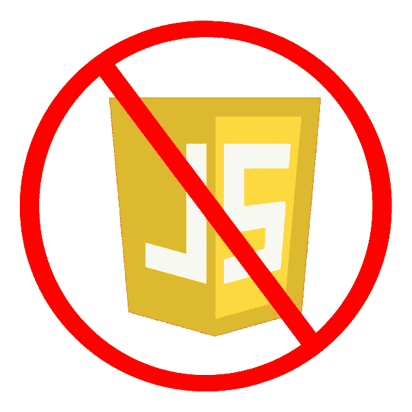

# 交互式服务器呈现的 web 应用:你不需要 JavaScript

> 原文：<https://blog.devgenius.io/interactive-server-rendered-webapps-you-dont-need-javascript-32fa847c6a1a?source=collection_archive---------2----------------------->



如果你是一个前端开发人员，喜欢了解最新的 [JavaScript](https://developer.mozilla.org/en-US/docs/Web/JavaScript) 生态系统，你总是在一个疯狂的旅程中。生态系统以惊人的速度前进，有时一路上会出现瓶颈。构建一个现代的 JavaScript 前端通常涉及到[一层又一层的工具](https://blixtdev.com/you-dont-need-webpack-3-better-alternatives-for-building-your-javascript/)、[越来越不透明的框架](https://blixtdev.com/all-about-reacts-new-use-hook/)，以及各种各样的配置和兼容性问题。

我要告诉你一个小秘密:**你不需要编写 JavaScript 来构建丰富的交互式 web 应用** *。新一代框架让你可以编写看起来和感觉上都像单页应用程序(spa)的 web 应用程序，但是完全由服务器驱动——没有 JavaScript。*这种方法是由 [LiveView](https://hexdocs.pm/phoenix_live_view/Phoenix.LiveView.html) 为 [Elixir](http://elixir-lang.org) 中的 [Phoenix framework](http://phoenixframework.org) 首创的，但现在也为各种其他语言和框架实现。

为了避免给人留下讨厌 JavaScript 的印象，我会注意到我几乎每天都在项目中使用 JavaScript，尤其是那些严重依赖浏览器 API 的项目。这里的重点不是你应该*永远不要*使用 JavaScript 来构建 webapp，只是*大多数 web app 不需要服务器+客户端 app 的方法。*在本帖中，我们将关注交互式服务器渲染方法，为什么它如此强大，以及一些用多种语言提供这种功能的框架。

# 交互式服务器呈现的 web 应用程序是如何工作的？

尽管具体细节会因框架而有所不同，LiveView 和类似的产品就像普通的服务器渲染 HTML 方法一样工作，除了当应用程序状态改变时，它们向客户端发送动态更新而无需重新加载页面。

LiveView 基于当前服务器状态使用简单的声明性 HTML 呈现。当客户机状态改变时，HTML 模板被重新呈现，任何改变都以小而紧凑的差异发送给客户机。神奇的事情发生在后台，客户端和服务器之间有一个持久的 websocket 连接。

当然，客户端有一些 JavaScript 来维护 websocket 连接并管理更改，但是这些都是内置在框架中的，不需要开发人员编写一行 JavaScript。

让我们快速看一个例子，取自 LiveView 文档，但为了演示的目的进行了简化。这里我们构建了一个简单的恒温器组件:

```
defmodule MyAppWeb.ThermostatLive do 
  use Phoenix.LiveView 

  # Set initial view state 
  def mount(_params, %{}, socket) do 
    {:ok, assign(socket, :temperature, 0)} 
  end 

  # Respond to "increment" event, update state 
  def handle_event("increment", _value, socket = %{assigns: assigns) do 
    {:noreply, assign(socket, :temperature, assigns.temperature + 1)} 
  end 

  # Render the view 
  def render(assigns) do 
    ~H"""
    <div> 
      Current temperature: <%= @temperature %> 
      <button phx-click="increment">+</button> 
    </div>""" 
  end 
end
```

如果您不熟悉 Elixir，语法和约定可能会有点奇怪，但它的要点很简单:我们有一个带有初始状态的 LiveView(在 LiveView 中称为`assigns`)，一些通过`handle_event`修改状态的事件处理，以及一个在`render`函数中的模板。特殊的`phx-click`属性将按钮点击绑定到后端事件。一旦这个视图呈现在客户机上，任何时候`temperature`赋值发生变化，客户机都会自动更新新的 HTML。

这个简单的例子展示了如何在没有 JavaScript 代码的情况下实现基本的交互性。我们可以很容易地将这种想法推广到具有附加状态、模板和子组件的更复杂的交互中。

# 包含一小部分代码的交互式 web 应用程序

使用像 LiveView 这样的交互式服务器渲染方法并不是为了避免 JavaScript 而避免 JavaScript:它是关于编写比单独构建服务器和客户端应用少得多的代码。让我们来看看一些你*不必*用交互式服务器渲染方法编写的代码:

*   客户端状态管理
*   服务器 API
*   API 客户端
*   客户机/服务器同步逻辑(包括轮询或基于套接字的“推送”)
*   重复的数据模型
*   重复的验证逻辑

虽然不是每一个基于 JS 的前端都要求你实现列表中的每一项，但是这些都是你需要为大多数单页面应用程序构建和维护的。其中一些项目可能很简单，许多可以借助框架或外部库，但尽管如此，这些基本上都是需要在传统的客户端单页面应用程序中构建和维护的东西。

通过采用交互式的、服务器呈现的方法，您可以实现相同的功能，同时编写和维护更少的代码。

# 框架

交互式服务器呈现方法有多种不同的语言和框架。虽然它们在方法上有所不同，工作方式可能与 LiveView 不完全相同，但它们都实现了相同的核心概念:消除了对基于 JavaScript 的独立前端的需求。

# 灵药的实时视图

开始这一切的服务: [LiveView](https://hexdocs.pm/phoenix_live_view/Phoenix.LiveView.html) ，作为[凤凰框架](http://phoenixframework.org)的一部分，用于[仙丹语言](http://elixir-lang.org)。甚至在 LiveView 之外，Phoenix 和 Elixir 提供了惊人的生产力和坚如磐石的高性能基础，所以如果你还没有挑选出另一种语言或框架，我肯定会把 Phoenix 作为我的首选。

[](https://github.com/phoenixframework/phoenix_live_view) [## GitHub-phoenix framework/phoenix _ live _ view:丰富的实时用户体验，通过服务器渲染…

### 通过服务器渲染的 HTML-GitHub-phoenix framework/phoenix _ live _ view:Rich…

github.com](https://github.com/phoenixframework/phoenix_live_view) 

# Blazor for C#

如果你在[工作。NET 生态系统](https://dotnet.microsoft.com/en-us/)，你可以从 [Blazor](https://dotnet.microsoft.com/en-us/apps/aspnet/web-apps/blazor) 获得类似的功能。Blazor 允许你完全用 C#编写 web-app 组件逻辑。除了服务器渲染的方法，Blazor 还支持基于 C#的组件通过 [WebAssembly](https://webassembly.org) 在客户端运行。

[](https://github.com/dotnet/aspnetcore) [## GitHub-dot net/aspnetcore:ASP.NET 核心是一个跨平台的。NET 框架来构建现代…

### ASP。NET Core 是跨平台的。NET 框架，用于在 Windows、Mac 或……上构建基于云的现代 web 应用程序

github.com](https://github.com/dotnet/aspnetcore) 

# Java 的 Vaadin

对于 [Java](https://www.java.com/en/) 开发者来说， [Vaadin](https://vaadin.com) 框架让你“从 UI 组件构建你的应用，而无需接触 HTML 或 JavaScript”。

[](https://github.com/vaadin/platform) [## GitHub-vaadin/platform:vaa din platform 10+是一个基于 vaa din 的 Java web 开发平台…

### Vaadin platform 10+是一个基于 Vaadin web 组件的 Java web 开发平台。如果你不知道去哪…

github.com](https://github.com/vaadin/platform) 

# PHP 的 LiveWire

如果你使用 [PHP](https://www.php.net) 作为你的后端，你也可以使用 [LiveWire for Laravel](https://laravel-livewire.com) 来扩展它以覆盖交互式前端。

[](https://laravel-livewire.com/docs/2.x/quickstart) [## 快速入门| Livewire

### 包括 PHP。包括 JavaScript(在将使用 Livewire 的每个页面上)。运行以下命令以…

laravel-livewire.com](https://laravel-livewire.com/docs/2.x/quickstart) 

# JavaScript 的火山口:

等等——整篇文章不都是在说*而不是*使用 JavaScript 吗？是的，但这并不是专门为了避免 JS，而是为了不构建和维护单独的客户端应用程序。如果你想利用交互式服务器渲染的方法，但是*希望*在后端使用 JavaScript，你可以！ [Caldera](https://github.com/calderajs/caldera-react) 让我们用服务器端执行 React 来构建前端。

[](https://github.com/calderajs/caldera-react) [## GitHub-calderajs/caldera-React:React 的服务器端执行🌋

### Caldera 是 React 的服务器端执行环境。可以把它想象成 Phoenix LiveView - all 的 Node.js 模拟版…

github.com](https://github.com/calderajs/caldera-react) 

# 概述

这些交互式服务器呈现的方法是目前 web 开发中最好的保密方法。LiveView 和类似的框架可以让你用传统单页应用程序的一小部分时间和精力来构建 web 应用程序。本质上，这种方法通过让你构建一个*应用而不是两个*应用(前端和后端)来加速开发，并避免 JavaScript 生态系统的复杂性。**

如果您想了解更多关于这种方法的信息，或者想直接使用 LiveView 构建应用程序，请查看以下内容！

[](/why-your-next-frontend-might-be-the-backend-b43ff1ca9720) [## 为什么你的下一个 Web 应用前端可能是后端

### LiveView 和其他实时服务器端渲染 HTML 技术如何改变前端的编写方式

blog.devgenius.io](/why-your-next-frontend-might-be-the-backend-b43ff1ca9720) [](https://betterprogramming.pub/real-time-chat-with-phoenix-liveview-in-fewer-than-50-lines-of-code-1b2cf8af7301) [## 用不到 50 行代码构建与 Phoenix 和 LiveView 的实时聊天

### Phoenix 和 LiveView 如何简化客户端之间可扩展的实时通信

better 编程. pub](https://betterprogramming.pub/real-time-chat-with-phoenix-liveview-in-fewer-than-50-lines-of-code-1b2cf8af7301) 

*原载于 2022 年 11 月 17 日 https://blixtdev.com*[](https://blixtdev.com/you-dont-need-javascript-to-build-rich-interactive-webapps/)**。**

*乔纳森写了一些关于创业、软件工程和健康科学的文章。如果你喜欢这篇文章，请考虑加入 Medium 来支持 [*乔纳森和其他数以千计的作者*](https://javascript.plainenglish.io/@jonnystartup/membership) *。**