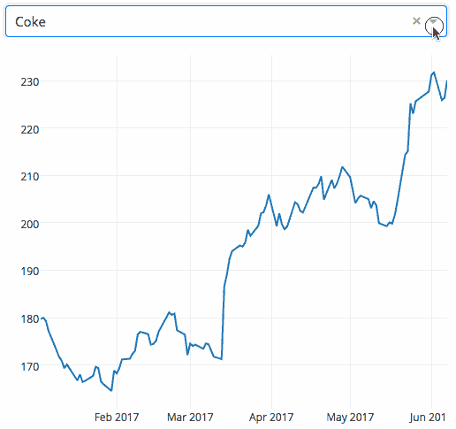
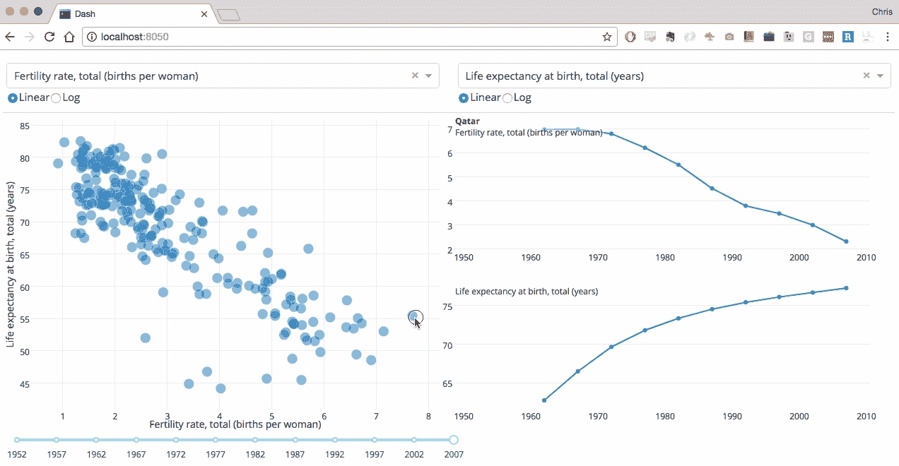

# 使用 Python 的交互式可视化

> 原文：<https://blog.devgenius.io/interactive-visualizations-with-python-a4721aec5c77?source=collection_archive---------12----------------------->

## "想象给了你一些你不知道的问题的答案."—本·施奈德曼

卢克·切瑟在 [Unsplash](https://unsplash.com?utm_source=medium&utm_medium=referral) 上的照片

今天，我们使用的一切都有大量的信息，大公司依赖并受益于这些信息来做出良好的决策，使他们得以发展。

然而，事实上，我们每个人作为用户产生太多的信息，可能是不够的，因为它是无用的或无组织的，所以它将取决于清理和转换，以正确使用。

然而这还不够。

**数据可视化**是一种表示信息的图形方式，它为我们提供了一种可访问的方式来理解行为模式、偏好、趋势和其他对我们这些开发者、数据科学家或企业家有用的信息。

虽然多种工具允许我们创建这些视觉元素，但这次我将介绍一个名为[***Dash***](https://dash.plotly.com/)***的 Python 库。***

# 破折号

Dash 是一个基于 Flask、Plotly.js 和 React.js 编写的 Python 框架。它是一个旨在创建专注于数据可视化的 web 应用程序的库，它非常完整，即使你不知道 React，也可以仅使用 Python 制作一个完整的应用程序。

> 下面是一个简单的 Dash 应用程序的例子，它将一个下拉菜单绑定到一个 D3.js Plotly 图形。当用户在下拉列表中选择一个值时，应用程序代码将数据从 Google Finance 动态导出到 Pandas 数据框架中。

Dash 应用程序的基本示例

Dash 应用程序由两个不同的部分组成，第一部分描述应用程序的外观，另一部分描述其组件的交互。

这个库提供了几个模块，通过 Python 我们可以生成不同的 HTML 元素、容器、按钮、文本字段，最重要的是 ***图形*** 。我们用来创建应用程序的每一个类都是我们所知的 [**布局**](https://dash.plotly.com/layout) 。

在*交互*的情况下，Dash 提供了一些函数，这些函数将作为 [**回调**](https://dash.plotly.com/basic-callbacks) ，当我们的元素的任何属性发生变化时，这些函数将自动执行。

前面的例子只用了 43 行代码:

因为它是使用 Flask 微框架构建的，所以它允许以一种非常简单的方式来提升您的服务器。每个设置或扩展都可以用来创建更复杂的应用程序。

正如他们在[公告](https://medium.com/plotly/introducing-dash-5ecf7191b503)中提到的那样，能够使用 React 来“实时”构建元素的良好交互是非常棒的，而且比这更容易创建，因为 Dash 为那些可能不是 web 开发专家的人利用了这两个库，并且可以从 Python 中做任何事情。

使用 [Python Dash](http://dash.plotly.com/) 的反应式网络应用

正如我在开始时提到的，有许多数据可视化工具，有些比另一些更复杂。然而，知道优点或局限性并选择对你有用的总是好的。

请记住，您可以使用 Dash 创建任何类型的应用程序。看看他们的 [**画廊**](https://dash-gallery.plotly.host/Portal/) 。

## 额外资源

 [## Python 数据可视化基础

### 不到 5 分钟的逐步介绍

towardsdatascience.com](https://towardsdatascience.com/the-basics-of-data-visualisation-with-python-23188aa9fc1a)  [## 如何用 Python 创建交互式可视化

### plotly express 简介

towardsdatascience.com](https://towardsdatascience.com/how-to-create-interactive-visualisations-in-python-4af42cf83ba4)