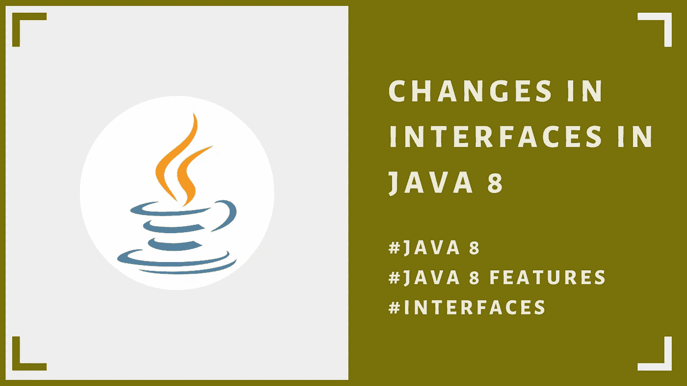

# Java 8 中的接口变化

> 原文：<https://blog.devgenius.io/interface-changes-in-java-8-feae3ab6970d?source=collection_archive---------7----------------------->

让我们了解一下 java 8 之后的变化



嗨，伙计们！这是下一篇基于 **Java 8 特性**的文章。对你来说这是一篇很短的文章。都是 Java 8 以后的接口。

你可能已经知道了接口..对吗？

通常引入接口是为了实现 2️⃣的主要目标。

1.  实现松耦合实现的完全抽象。
2.  用不同的方式实现多重继承，因为 Java 不支持使用类的多重继承。

# 接口方法

*   它们是含蓄的**公共抽象**
*   没有任何实现(Java 8 之前)
*   当任何类实现接口时，它们**必须被覆盖**
*   发生重写时，访问修饰符必须是公共的(逻辑是重写时访问修饰符需要比抽象方法高一级。因为接口方法在默认情况下是公共的，所以我们必须使用 public)

# Java 8 有什么新特性？

现在我们有了另一个 2️⃣类型的接口方法…

1.  静态方法
2.  默认方法

让我们一个一个地了解它们。

# 静态方法

如果我们希望在我们的接口中有一个方法，它不能在派生类中被重写，那么我们可以使用一个接口。按照惯例，在 Java 中我们不能覆盖静态方法。这几乎就像一个 ***实用方法*** 。并且您可以在没有对象 实例的情况下 ***使用该方法，因为它是静态的。我们可以使用静态方法根据类的属性执行一些逻辑。***

让我举个例子…

```
public class java8Interfaces {
    public static void main(String[] args) {
        Car car = new Lamborghini("Lambo", "2010");
        car.drive();
        String condition = Car.*getCondition*(car.getCarType());
        System.out.println(condition);
    }
}

class Lamborghini extends BaseCar implements Car {
    Lamborghini(String name, String year) {
        super(name, year);
    }
    @Override
    public void drive() {
        System.out.println("Lamborghini::drive()");
    }
    @Override
    public String getCarType() {
        return "Lamborghini";
    }
}

class Corolla extends BaseCar implements Car {
    Corolla(String name, String year) {
        super(name, year);
    }
    @Override
    public void drive() {
        System.out.println("Ferrari::drive()");
    }
    @Override
    public String getCarType() {
        return "Ferrari";
    }
}

class BaseCar {
    private final String name;
    private final String year;
    BaseCar(String name, String year) {
        this.name = name;
        this.year = year;
    }
    public String getName() {
        return name;
    }
    public String getYear() {
        return year;
    }
}

interface Car {
    void drive();
    String getCarType();
    static String getCondition(String name) {
        String condition;
        if (name.equals("Lamborghini")) {
            condition = "Sports Car";
        } else {
            condition = "Normal Car";
        }
        return condition;
    }
}
```

正如您在这里看到的， **getCondition** 方法是根据定义的汽车类型执行通用逻辑的方法。这更像是一种实用的方法！


静态方法的结果

# 默认方法

因此，在 Java 8 之前，当我们用一个接口实现一个类时，我们必须实现所有的方法。

> 当我们通过继承为接口中所有派生类提供一个公共方法时，会发生什么？

同样，我们必须重写公共方法，即使实现总是公共的！这导致了派生类中的代码重复！！！

让我举个例子…

```
public class java8Interfaces {
    public static void main(String[] args) {
        Car car1 = new Lamborghini("Lambo", "2010");
        car1.drive();
        car1.showInfo();
        Car car2 = new Corolla("Corolla", "2015");
        car2.drive();
        car1.showInfo();
    }
}

class Lamborghini extends BaseCar implements Car {
    Lamborghini(String name, String year) {
        super(name, year);
    }
    @Override
    public void drive() {
        System.out.println("Lamborghini::drive()");
    }
    @Override
    public String getCarType() {
        return "Lamborghini";
    }
}

class Corolla extends BaseCar implements Car {
    Corolla(String name, String year) {
        super(name, year);
    }
    @Override
    public void drive() {
        System.out.println("Ferrari::drive()");
    }
    @Override
    public String getCarType() {
        return "Ferrari";
    }
}

class BaseCar {
    private final String name;
    private final String year;
    BaseCar(String name, String year) {
        this.name = name;
        this.year = year;
    }
    public String getName() {
        return name;
    }
    public String getYear() {
        return year;
    }
}

interface Car {
    void drive();
    String getCarType();
    default void showInfo() {
        System.out.println("Car has 4 wheels!");
    }
}
```

可以看到 **showInfo()** 方法可以使用任何派生类类型来调用。这里，car1 是一辆兰博基尼，car2 是一辆卡罗拉……但是，使用对象引用，我们可以访问默认的方法实现。


默认方法的结果

这都是 Java 8 中的接口变化！希望你明白了…这不是一个很大的变化。但它会根据我们的要求以某种方式帮助我们。

阅读和分享家伙！！！