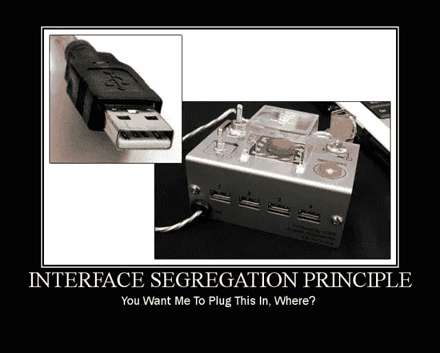

# 界面分离原理|坚如磐石

> 原文：<https://blog.devgenius.io/interface-segregation-principle-solid-as-a-rock-da0dde41f9a9?source=collection_archive---------12----------------------->



**I**interface**S**egradiation**P**principle 在 C++中是第四个&迄今为止最简单的一系列坚如磐石的设计原则。坚实的设计原则集中于开发易于维护、可重用和可扩展的软件。在本文中，我们将看到一个违反 ISP 的代码，一个相同代码的解决方案，指南&ISP 的好处。

> */！\:原载@*[](http://www.vishalchovatiya.com/category/design-patterns/)**。**

*顺便说一句，如果你还没有浏览过我以前关于设计原则的文章，下面是快速链接:*

1.  *[**S** RP —单一责任原则](http://www.vishalchovatiya.com/single-responsibility-principle-in-cpp-solid-as-a-rock/)*
2.  *[**O** CP —开启/关闭原理](http://www.vishalchovatiya.com/open-closed-principle-in-cpp-solid-as-a-rock/)*
3.  *[LSP—利斯科夫替代原理](http://www.vishalchovatiya.com/liskovs-substitution-principle-in-cpp-solid-as-a-rock/)*
4.  *[**I** SP —界面偏析原理](http://www.vishalchovatiya.com/interface-segregation-principle-in-cpp-solid-as-a-rock/)*
5.  *[**D** IP —依赖反转原理](http://www.vishalchovatiya.com/dependency-inversion-principle-in-cpp-solid-as-a-rock/)*

*您在这一系列文章中看到的代码片段是简化的，而不是复杂的。所以你经常看到我不使用像`override`、`final`、`public`(同时继承)这样的关键字，只是为了让代码紧凑&可消耗(大多数时候)在单一标准屏幕尺寸。我也更喜欢`struct`而不是`class`，只是为了节省代码行，有时不写`public:`，也故意忽略[虚析构函数](http://www.vishalchovatiya.com/part-3-all-about-virtual-keyword-in-c-how-virtual-destructor-works/)，构造函数[，复制构造函数](http://www.vishalchovatiya.com/all-about-copy-constructor-in-cpp-with-example/)，前缀`std::`，删除动态内存。我也认为自己是一个务实的人，希望用尽可能简单的方式，而不是标准的方式或使用术语来传达一个想法。*

****注:****

*   *如果你是在这里被直接绊倒的，那么我建议你浏览一下[什么是设计模式？](http://www.vishalchovatiya.com/what-is-design-pattern/)第一，哪怕是微不足道的小事。相信会鼓励你对这个话题进行更多的探索。*
*   *您在这一系列文章中遇到的所有代码都是使用 C++20 编译的(尽管我在大多数情况下使用了 C++17 的现代 C++特性)。因此，如果你没有最新的编译器，你可以使用已经预装了 boost 库的 https://wandbox.org/。*

# *目的*

> *不应该强迫客户依赖他们不使用的接口。*

*   *界面分离原则与单一责任原则密切相关。它真正的意思是，您应该总是以这样一种方式设计您的抽象，即使用公开方法的客户不必得到整个饼。把实现他们实际上不需要的方法的负担强加给客户。*

# *违反界面分离原则*

```
*struct Document;struct IMachine {
    virtual void print(Document &doc) = 0;
    virtual void fax(Document &doc) = 0;
    virtual void scan(Document &doc) = 0;
};struct MultiFunctionPrinter : IMachine {      // OK
    void print(Document &doc) override { }
    void fax(Document &doc) override { }
    void scan(Document &doc) override { }
};struct Scanner : IMachine {                   // Not OK
    void print(Document &doc) override { /* Blank */ }
    void fax(Document &doc) override { /* Blank */ }
    void scan(Document &doc) override {  
        // Do scanning ...
    }
};*
```

*   *如你所见，就`MultiFunctionPrinter`而言，实现由`IMachine`接口执行的`print()`、`fax()` & `scan()`方法是可以的。*
*   *但是如果你只需要一个`Scanner`或者`Printer`，一些开发者仍然继承了`IMachine` &将不必要的方法留空或者抛出`NotImplemented`异常，无论哪种方式，你都做错了。*

# *界面分离原理示例*

```
*/* -------------------------------- Interfaces ----------------------------- */
struct IPrinter {
    virtual void print(Document &doc) = 0;
};struct IScanner {
    virtual void scan(Document &doc) = 0;
};
/* ------------------------------------------------------------------------ */struct Printer : IPrinter {
    void print(Document &doc) override;
};struct Scanner : IScanner {
    void scan(Document &doc) override;
};struct IMachine : IPrinter, IScanner { };struct Machine : IMachine {
    IPrinter&   m_printer;
    IScanner&   m_scanner; Machine(IPrinter &p, IScanner &s) : printer{p}, scanner{s} { } void print(Document &doc) override { printer.print(doc); }
    void scan(Document &doc) override { scanner.scan(doc); }
};*
```

*   *这使得客户可以灵活地组合他们认为合适的抽象，并在没有不必要的负担的情况下提供实现。*
*   *如[中所解释的单一责任原则](http://www.vishalchovatiya.com/single-responsibility-principle-in-cpp-solid-as-a-rock/)。你应该避免具有多重职责的类&接口。因为它们经常变化，使你的软件难以维护。你应该试着 ***基于角色*** 将接口拆分成多个接口。*

# *利益*

# *= >更快的编译*

*   *如果你违反了 ISP 即在接口中把方法塞在一起，当方法签名改变时，你需要重新编译所有的派生类。这对于一些编译语言来说是一个重要的方面，比如 C++ ，它以[缓慢的编译](https://stackoverflow.com/questions/318398/why-does-c-compilation-take-so-long)而闻名。而另一种方式是自我解释。*

# *= >可重用性*

*   *[Martin](https://en.wikipedia.org/wiki/Robert_C._Martin) 还提到 ***“胖接口”——带有额外无用方法*** 的接口——会导致类之间的无意耦合。因此，有经验的开发人员知道耦合是可重用性的祸根。*

# *= >可维护性*

*   *ISP 更普遍的好处是，通过避免不必要的依赖，系统变得更容易理解；测试更轻；&更换更快。*
*   *类似地，对于你的代码的读者来说，从类声明行中了解你的类是做什么的会更加困难。因此，如果 dev 只看到一个继承了其他接口的 god 接口，这可能并不明显。比较*

```
*MyMachine : IMachine*
```

*到*

```
*MyMachine : IPrinter, IScanner, IFaxer*
```

*   *后者告诉你很多，前者最多让你猜测。*

# *尺度对工艺界面分离原理友好的软件*

*   *当你开始通过识别参与你的领域的主要角色来分解你的问题空间时，这个原则就自然而然地出现了。因此，它从来都不是一个机械动作。*
*   *问自己一个问题可能有助于你修正设计:*

> *我需要我正在使用的这个接口上的所有方法吗？*

# *结束语*

*尽管大接口是一个潜在的问题，ISP 并不关心接口的大小。相反，它是关于类是否使用它们所依赖的接口的方法。所以 ISP 在设计软件的时候是很差的指导，但却是它是否健康的绝佳指标。*

*[有什么建议，查询或者想说](http://www.vishalchovatiya.com/contact-2/) `[Hi](http://www.vishalchovatiya.com/contact-2/)` [？减轻压力，只需点击一下鼠标。](http://www.vishalchovatiya.com/contact-2/) 🖱️*