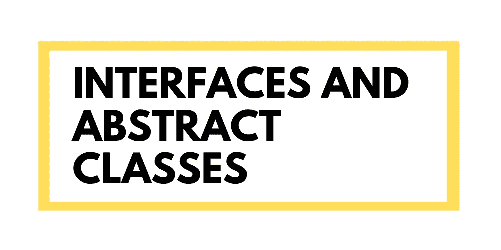
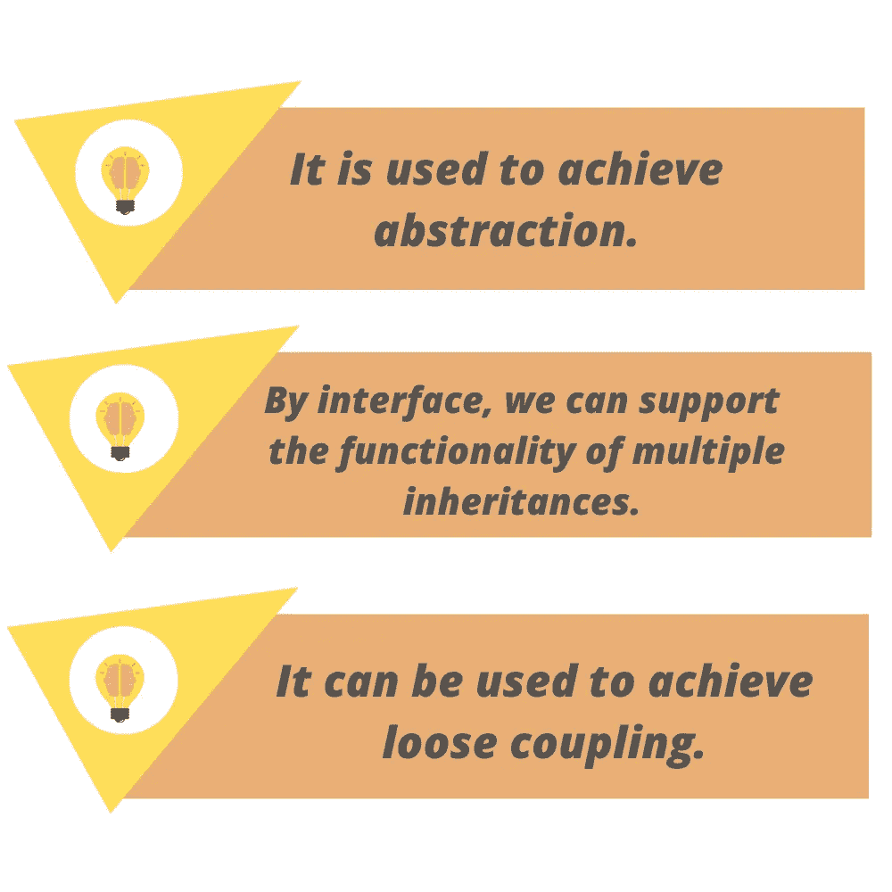
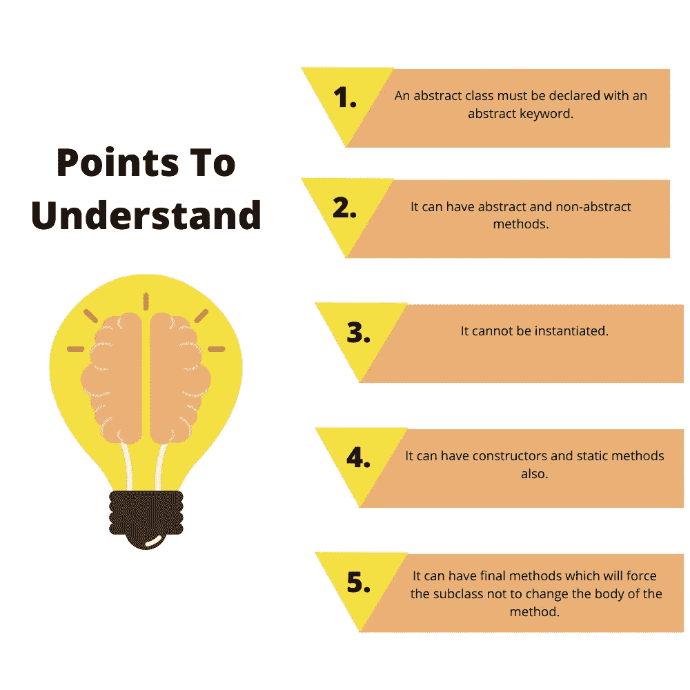

# JAVA 中的接口和抽象类

> 原文：<https://blog.devgenius.io/interfaces-and-abstract-classes-in-java-5329ef1e1343?source=collection_archive---------4----------------------->

作者:Atharva Sawaleshwarkar，Mohiddin Shikalgar，Tanmay Shah，Farhan Shaikh，Yash Shejwal



当我们学习 java 和它的概念时，我们肯定会遇到叫做接口的概念。接口是 java 的关键特性之一，每个 JAVA 开发人员都应该知道它的用途和应用。界面带来了许多优点和缺点。

让我们深入理解接口。当实现接口时，我们肯定会遇到被称为抽象类的术语。什么是抽象类？为什么需要它们？接口是什么？接口的用途是什么？为什么接口在其中使用抽象类？你会在这篇博文中得到所有答案。

# 什么是接口？

接口是 java 中的一种特殊机制，有助于实现抽象。实际上，接口是一个类的蓝图。它有静态常数和抽象方法。接口只能有抽象方法(只有没有主体的方法)。

但是目前，在 java 9 中，我们也可以在接口中使用**私有、默认和静态方法**。

让我们忽略技术词汇，去简单的逻辑理解用来实现 ***抽象*** 的接口。

# 什么是抽象？

举个现实生活中的例子，我们都在手机上使用 app。每当我们想使用任何应用程序时，我们都必须在其中创建一个帐户。在注册过程中，当我们用我们的电话号码注册时，OTP 就会出现在我们的手机上。

现在这里有一个抽象的答案，我们知道 OTP 是在点击应用程序中的“发送 OTP”按钮后出现的，但我们不知道该系统在后端是如何工作的。点击按钮后，实际发生了什么。这种成功完成任务而不向用户显示后端实际发生了什么的行为被称为抽象。

我们可以使用 java 中的接口和抽象类来实现抽象。

# 为什么要使用接口？

使用该界面主要有三个原因。它们在下面给出。

*   它用于实现抽象。
*   通过接口，我们可以支持多重继承的功能。
*   它可以用来实现松耦合。



# 如何使用界面？

该接口是使用“interface”关键字声明的。它提供了抽象，意味着它声明了类的结构。接口中的所有方法都是抽象的，默认情况下都被设置为 public、static 和 final。实现接口的任何类都必须实现接口中声明的所有方法。

```
interface <interface_name>{  

     // declare constant fields  
     // declare methods that abstract   
     // by default. 
 }
```

与接口类似，抽象也可以通过使用抽象类来实现。

# 什么是抽象类？

抽象类是前面带有“Abstract”关键字的类。它们既包含抽象方法，也包含具体方法(包含主体的方法)。抽象类不能被实例化，它们需要被扩展，它们的方法需要被实现。

要记住的要点

*   抽象类必须用 abstract 关键字声明。
*   它可以有抽象和非抽象的方法。
*   它不能被实例化。
*   它也可以有构造函数和静态方法。
*   它可以有最终的方法，强制子类不要改变方法的主体。



# 具有抽象方法的抽象类示例:

在这个例子中，Bike 是一个抽象类，只包含一个抽象方法运行。它的实现由 Honda 类提供。

```
abstract class Bike{  
  abstract void run();  
}  
class Honda4 extends Bike{  
void run(){System.out.println("running safely");}  
public static void main(String args[]){  
 Bike obj = new Honda4();  
 obj.run();  
}  
}
```

# 具有构造函数、数据成员和方法的抽象类:

抽象类可以有数据成员、抽象方法、方法体(非抽象方法)、构造函数，甚至 main()方法。

```
//Example of an abstract class that has abstract and non-abstract methods  
 abstract class Bike{  
   Bike(){System.out.println("bike is created");}  
   abstract void run();  
   void changeGear(){System.out.println("gear changed");}  
 }  
//Creating a Child class which inherits Abstract class  
 class Honda extends Bike{  
 void run(){System.out.println("running safely..");}  
 }  
//Creating a Test class which calls abstract and non-abstract methods  
 class TestAbstraction2{  
 public static void main(String args[]){  
  Bike obj = new Honda();  
  obj.run();  
  obj.changeGear();}
}
```

现在主要的问题出现了，接口和抽象类都有助于抽象，但是我们应该更多地使用哪一个呢？

Java 不像 c++那样支持多重继承。我们可以使用接口实现多重继承。

**用于抽象**:

抽象类帮助= 1 到 100%

界面帮助= 100%

# Java 接口示例

在这个例子中，Drawable 接口只有一个方法。它的实现由 Rectangle 和 Circle 类提供。在真实的场景中，接口由其他人定义，但其实现由不同的实现提供者提供。而且，是别人用的。使用该接口的用户隐藏了实现部分。

```
//Interface declaration: by first user  
interface Drawable{  
void draw();  
}  
//Implementation: by second user  
class Rectangle implements Drawable{  
public void draw(){System.out.println("drawing rectangle");}  
}  
class Circle implements Drawable{  
public void draw(){System.out.println("drawing circle");}  
}  
//Using interface: by third user  
class TestInterface1{  
public static void main(String args[]){  
Drawable d=new Circle();//In real scenario, object is provided by method e.g. getDrawable()  
d.draw();  
}}
```

# Java 中通过接口的多重继承

如果一个类实现了多个接口，或者一个接口扩展了多个接口，这就是所谓的多重继承。

```
interface Printable{  
void print();  
}  
interface Showable{  
void show();  
}  
class A7 implements Printable,Showable{  
public void print(){System.out.println("Hello");}  
public void show(){System.out.println("Welcome");}  

public static void main(String args[]){  
A7 obj = new A7();  
obj.print();  
obj.show();  
 }  
}
```

# java 中不支持通过类进行多重继承，但通过接口是可以的，为什么？

正如我们在继承中所解释的，由于不明确，在类的情况下不支持多重继承。

但是，在接口的情况下它是受支持的，因为没有歧义。因为它的实现是由实现类提供的。

我们希望你理解了接口背后的概念以及为什么使用它们？

留下评论，分享你的想法。

参考:

https://www.javatpoint.com/abstract-method-in-java

【https://www.javatpoint.com/class-and-interface-in-java 