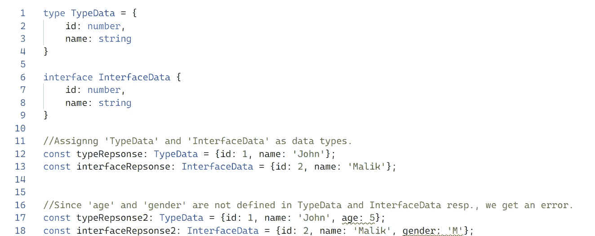

# 类型脚本中的接口与类型

> 原文：<https://blog.devgenius.io/interfaces-vs-types-in-typescript-7567ffe390cd?source=collection_archive---------2----------------------->

[詹姆斯·哈里森](https://unsplash.com/@jstrippa?utm_source=medium&utm_medium=referral)在[太空望远镜](https://unsplash.com?utm_source=medium&utm_medium=referral)上拍摄的照片

**接口**和**类型**(确切地说是类型别名)是 Typescript 中描述对象结构的两种方式。如果您熟悉任何一种面向对象语言(Java、C++、c#……)，那么您以前一定听说过/使用过接口。在这些语言中，接口通常作为任何类实现的蓝图。如果您以前没有见过或使用过接口，或者您不熟悉上述任何语言，这都没有关系。为了简单起见，我们可以假设类型和接口都用来定义对象的结构。这个物体可以是任何东西。它可能是您期望作为 API 响应的数据。它可以是一个用来保存一些常量值的对象，比如键、id 等等。

为对象定义特定结构的主要原因是在复杂数据的情况下使用静态类型检查(保存您的数据和您期望的数据的变量应该匹配)。例如，如果您从 API 中获取 id 和名称作为响应，那么您可以使用类型别名或接口来预定义数据的类型。

接口和类型示例

现在，出现的主要问题是——为什么我们需要两种不同的方式来实现同一个东西？虽然类型别名和接口大部分是可以互换的，但是根据 Typescript 文档，两者之间有一个关键的区别，那就是**一个类型不能被重新打开来添加新的属性，而接口总是可以扩展的。**话虽如此，类型可以通过交集间接扩展。让我们看一个例子。

扩展接口与相交类型

具有相同名称的两个接口被合并以形成具有相同名称的单个接口，而两种类型不会合并，因为类型在创建后不能更改。

接口与类型—合并

查看官方的类型脚本文档，了解更多关于接口、类型和类型脚本的详细信息。

 [## 文档-日常类型

### 在本章中，我们将介绍一些在 JavaScript 代码中最常见的值类型，并解释…

www.typescriptlang.org](https://www.typescriptlang.org/docs/handbook/2/everyday-types.html#type-aliases)