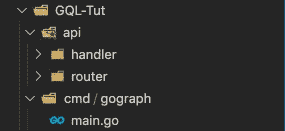
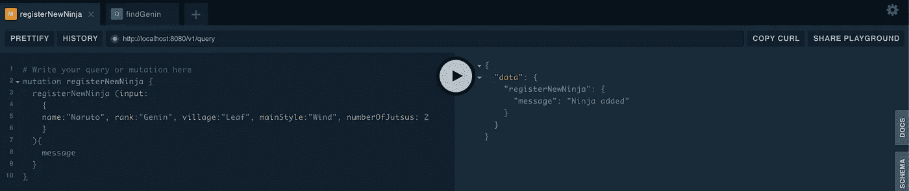
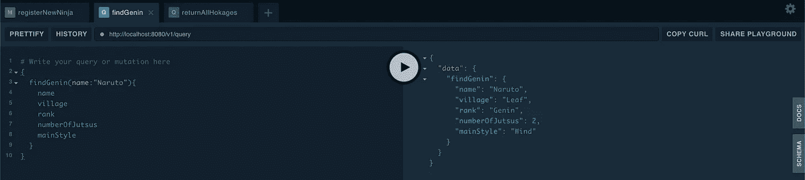
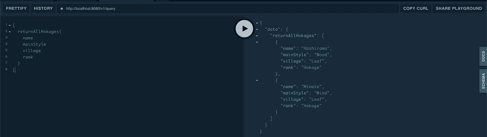

# 将 GraphQL 与 GoLang 集成:正确的方法

> 原文：<https://blog.devgenius.io/intergrating-graphql-with-golang-the-right-way-d6a27bf4cbf7?source=collection_archive---------2----------------------->

我们将构建一个由 Go-Chi 和 GqlGen 包驱动的 GoLang 服务器

在这样一个世界里，技术和框架开始覆盖更多的编程语言，因此用户群可能更加重要，在今天的故事中，我们将使用来自 99designs 的完整 [gqlgen](https://github.com/99designs/gqlgen) 包来集成 GraphQL 和 GoLang。

我们将介绍如何使用这个包，包括 go init 和 generate 命令、突变和查询，以及如何使用 go-chi 的处理程序作为我们的 HTTP go 包。

# 要求

*   我们将使用 GoLang，所以最好有一个语言的基础知识，因为基础知识不会一步一步地覆盖。
*   它不会涵盖 GraphQL 的原子信息，推荐使用基本概念的知识
*   GoLang 版本 1.12 或更高版本，Go 模块已激活

# 装置

首先，我们将继续在我们的系统中下载 gqlgen 和 go-chi 包

# 项目结构

我们将为 GoLang 使用“非官方的”标准项目[布局](https://github.com/golang-standards/project-layout)，它指明了我们项目中组织包和文件的方式。这个链接是项目的 GitHub [库](https://github.com/javiersoto15/GoGraph1),如果你想用指南编码的话

继续创建 cmd/gograph (gograph 是您的应用程序的名称，根据您的需要修改它)，并为我们的入口点添加 main.go 文件。

对于我们的 API 文件(路由器和处理程序)，我们将添加以下文件夹、API/路由器和 API/处理程序。这些文件夹将存放我们的 API 相关文件；这将有助于我们保持组织性。这应该是您现在的项目结构:



项目框架

在下一节中，所有其他内容都将从我们的 GQLGen 包中生成。

# 开始我们的图表

在我们的根文件夹(我的例子是 GQL-Tut)中，我们将在终端中运行以下命令来初始化我们的 Go 模块和 GQLGen 包:

```
go mod init
go run github.com/99designs/gqlgen init
```

继续删除 server.go，因为我们将使用 Go-Chi 创建我们的服务器文件。生成的文件如下

*   gqlgen.yml:表示 grapqhQL 将采用的配置，例如文件、标量等的位置。
*   graph 文件夹包含 schema.graphqls(这里我们声明我们的 GraphQL schemas)，模型的文件包含 go translated struct。我们的解析器(查询和突变)将在 schema.resolvers.go 中声明，其中将包含我们的逻辑。resolver.go 文件包含我们需要在解析器中实现的任何依赖项(如任何授权或数据库)

每次编辑 GraphQL 模式文件时，我们都需要在我们的根文件夹中运行这个命令:

```
go run github.com/99designs/gqlgen generate
```

现在，我们将让模式初始化我们的路由器和处理程序。

# 实现 Go-Chi 路由器和处理程序

现在，我们将创建处理程序和路由器文件，它们将为 GraphQL 服务器的 HTTP 端点提供服务。

首先，我们将创建我们的处理程序。我们将有两个端点，一个用于我们的 POST GraphQL 查询，另一个用于我们的操场。在 [api/handler](https://github.com/javiersoto15/GoGraph1/tree/master/api/handler) 下创建一个 handler.go 文件，并编写如下代码:

实现非常简单。我们将创建一个 Routes 函数，该函数初始化我们的端点并返回一个 Chi Mux 对象，我们将在路由器包中使用该对象。

内部函数(“graphQLHandler”)是任何 GraphQL 查询都会触发的函数。Go-Chi 使用 Post 和 Get 函数通过各自的方法设置我们的端点。第一个论点是我们的模式；第二个是 http。HandlerFunc，换句话说，任何返回 ResponseWriter 和请求的函数。

我们的 playground 函数将采用 graphql 处理程序端点(一旦我们到达代码的路由器部分，模式中的“v1”前缀就有意义了)来进行相应的调用。

确保您为我们的图形代码导入了各自的包。这将是我的路(对你来说可能不一样)

```
"github.com/temp/GQL-Tut/graph""github.com/temp/GQL-Tut/graph/generated"
```

现在，我们将在路由器文件夹下创建 router.go 文件，并复制以下代码:

从上到下，我们的 initialize 函数将用我们给出的特定配置(中间件和处理程序)实例化我们的 Chi 路由器。出于本教程的目的，我将使用最小的中间件。没有必要使用中间件，但是我推荐使用这个必备的中间件功能。

Chi 赋予我们的能力是能够使用标准化的前缀模式安装不同的端点。在这种情况下，它是“/v1”。这是我用来版本化我的 API 的惯例，我建议你也使用它。

我们的 Route 函数中的第二个参数，是我们实现我们创建的处理函数“Routes”的地方。然后我们的 ServeRouter 函数将在我们的主文件中使用。

这就是我们的服务器！

# 编辑我们的模式

作为一个火影忍者迷，这个教程的主题将是关于它的(不需要任何关于它的知识！).对于我们的第一个 GraphQL 代码，我们将关注我们的模式。我们将继续前进，转到位于 graph 文件夹中的 schema.graphqls。

我们将首先为我们的响应定义模型，该模型将被称为 Ninja，它包含以下字段。我们将对我们的两个查询(以及我们的变异)保持相同的响应

现在我们将开始创建两个名为 findGenin 的查询，它将返回我们正在寻找的基本级别 ninja，第二个查询将返回所有的图像，顾名思义，它将返回 API 知道的所有图像。

查询 findGenin 接收一个名称作为参数，并返回 ninja 对象。请注意，该名称包含一个“！”紧挨着他们。这意味着它不可为空，不能为空。对于忍者对象的数组，使用“！”意味着它将总是返回一个包含零个或多个元素的数组。

我们的最后一步是创建突变，通过我们的 API 来修改/创建数据。很简单，我们称它为 registerNewNinja，它接受一个 Ninja 输入类型并返回一个响应。

# 锅炉板代码的生成

gqlgen 的神奇之处就在这里。运行一个简单的命令，它将我们的解析器和模型生成到 Go 语言中。在我们的根文件夹中，运行以下命令:

```
go run github.com/99designs/gqlgen
```

检查您的 models_gen.go 是否包含新生成的以及 schema.resolvers.go 是否包含我们的查询和变异。

# 实施我们的解决方案

现在我们转向解析器来实现我们的逻辑。我们将从在 resolver.go 中的 resolver 对象中添加一个数组开始(这将作为我们对“数据库”的抽象)

接下来，我们转向我们的突变 registerNewNinja。这是不言自明的

我们的两个查询在语法上相似。两者都使用过滤器来操作数据，并根据查询返回一个对象或数组。

# 我们来试试吧！

为了完成我们的代码，我们需要在 main.go 中实现 ServeRouter 函数。

我们用下面的命令运行应用程序(如果您遵循项目结构，您可以复制和粘贴)

```
go run cmd/gograph/main.go
```

现在我们在浏览器中去操场

```
localhost:8080/v1/playground
```

这些是变异的例子:



在您用更多的突变填充了我们的“数据库”之后，您可以使用我们的两个查询:



# 结论

如您所见，将 graphQL 与 golang 集成一点也不困难。这是一个强大的组合，在我们的微服务时代，效果非常完美。希望所有的细节都能帮助你实现自己的想法。很快我们将使用 Docker 和 Kubernetes 部署！

感谢您的宝贵时间，记得查看 git 回购