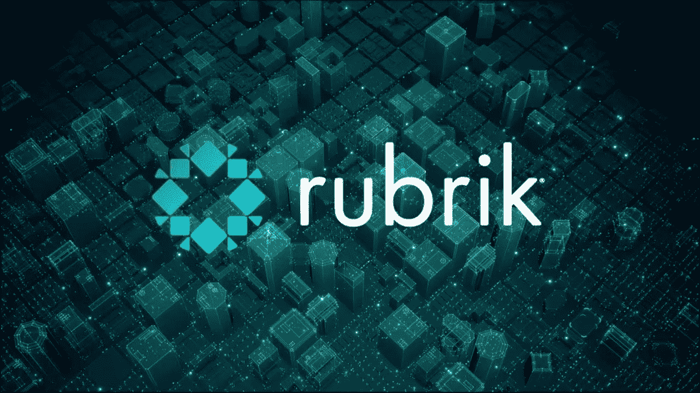

# 实习编年史 CDC 分会

> 原文：<https://blog.devgenius.io/internship-chronicles-the-cdc-chapter-948d1a1f5a51?source=collection_archive---------2----------------------->

终局

# **准备工作**

我在第一年的暑假(2017 年夏天)开始了少量的竞争性编程，但是，那时我并没有真正做很多。
CP 世界的基本知识和方法。在我的第三学期(2017 年秋季)，我参加了我的算法课程(CS21003)和我的算法实验室(CS29003)，这帮助我获得了不同基本数据结构的基本实现级别细节:- **堆、字典、二叉树(BST、AVL)和图**，以及**分治、贪婪和动态编程、线性时间排序、图算法和字符串匹配的算法范式。**
我还上过[纳文·加格的关于数据结构和算法的 NPTEL 课程](https://nptel.ac.in/courses/106102064/)，所以我也了解了**红黑树**。
所有这些都与数组、字符串、堆栈、队列、链表、排序和其他 PDS 主题的先前知识有关。

密集的理论课程让我接触到算法，课程让我接触到实际的实现，所以我有一个良好的基础来钻研寒假(2017 年 12 月)的竞争性编程。

CLRS 的[算法入门书可能是初学者的最佳书籍，我相信任何想要牢牢掌握这些概念的人都应该用这本书章节中的材料来补充他们的学习，并明确解决章节内的练习以及每章结尾的问题。罗格斯大学的](https://mcdtu.files.wordpress.com/2017/03/introduction-to-algorithms-3rd-edition-sep-2010.pdf)[的解决方案也可以在网上找到，它们相当不错。
所以在 12 月，我开始了一个彻底的竞争机制，首先让自己熟悉 C++14 的标准模板库。向量、字符串、集合、多重集合、映射、优先级队列、堆栈、队列是一些必需的基本容器。http://www.cplusplus.com](http://sites.math.rutgers.edu/~ajl213/CLRS/CLRS.html)在这方面很有帮助。然后我开始在 [CodeMonks，hackere earth](https://www.hackerearth.com/practice/codemonk/)上使用 STL 容器实现课堂上讲授的算法。我确实解决了与这个学习过程平行的 Codechef 和 Codeforces 竞赛，然后在我解决/尝试完这些问题后，我会参考这些社论。我在第四学期(2018 年春天)没有做太多的 CP，但在暑假(2018 年 5 月-7 月)又回到了最佳状态。我复习了一下过去的知识，然后开始解决面试问题。InterviewBit 和类似的面试专用编码平台的要点是，问题覆盖了广阔的水平区域，但垂直深度取决于你如何处理这些问题。我曾经用尽可能多的方法来解决每个问题，然后查看编辑的解决方案，从中获得灵感，然后用他们自己的方式解决问题。在这段时间里，我又一次解决了我的 clr 问题，同时还阅读了相关主题的 TopCoder 教程。Codechef 和 Codeforces 竞赛仍然与此密切相关。

# **编码回合**

我参加了 Nutanix、DEShaw、高盛、Rubrik、UBER 和微软的编码会议。我也给了 Google Kickstart D，这是 Google 的一个非正式编码回合，但在这方面表现不佳。此外，这些测试在实际第一天的前一周开始，这是我不知道的，所以只是把它放在那里，并在 HackerRank IDE 上进行，所以人们可能想让自己熟悉它。

有两个问题:1 小时，第一个是一个相当简单的实现问题，但第二个是一个有问题的问题。第二个问题的约束条件最多允许一个 O(NlogN)解，该解涉及[段树—范围最小查询](https://www.hackerearth.com/practice/data-structures/advanced-data-structures/segment-trees/practice-problems/algorithm/range-minimum-query/)，然而，在线裁判接受了 O(N*N)解。弱测试用例。

**DEShaw** —又是两个问题:1 个小时，第一个相当简单，第二个涉及使用 map 对字符串进行哈希的滚动实现。

**高盛** — 2 小时；一个编码问题，需要做一些工作来将问题简化为一个接受 O(N*N)解的[最长递增子序列](https://leetcode.com/problems/longest-increasing-subsequence/)问题——如果成功的话相当简单。其余的是一些关于概率统计的 mcq。

**Rubrik** — 2 小时:3 道编码题和 5 道 mcq。美丽的问题。mcq 测试的是基本的订单统计知识，3 个问题最终需要一些编码。第一个是二分搜索法问题，类似于 SPOJ 上的 [AGGRCOW。第二个需求是用一些给定的操作和它们各自的时间约束实现一个数据结构:一个简单的使用集合和映射的解决方案。第三个问题是一个组合学问题，它有一个 O(1)直接公式和一个 O(N)实现。需要一些](https://www.spoj.com/problems/AGGRCOW/)[模幂运算](https://www.geeksforgeeks.org/modular-exponentiation-power-in-modular-arithmetic/)的知识。

**优步** —最好的考试，漂亮的问题。3 个问题:1:45 小时，后来延长到 2:00 小时，所以如果你没有完成，请不要离开考场。
第一个问题有一些 BFS 实现，第二个问题有一个拓扑排序基础，可以通过 DFS 方式或 InDegree 方式完成。第三个问题是，思考一个相当简单的观察问题，尽管问题陈述可以更清楚。需要再次使用[模幂运算](https://www.geeksforgeeks.org/modular-exponentiation-power-in-modular-arithmetic/)来实现。

**微软** —最差考试。微软进行测试的 CoCubes IDE 非常糟糕，很难调试代码，也很难操作。有 3 个问题 A、B 和 C，为了防止作弊，他们有一个 A、B 和 C 的问题池，他们随机选择 3 个问题，生成多组问题。不可能保持同样的提问标准，糟糕的 IDE 更是雪上加霜。第一个问题是一个 PDS 级别的问题，其余的问题有简单到困难的链表、数组和字符串的实现。失望主要是因为微软是唯一一个在编码过程中对链表有疑问的公司，而我对链表的操作非常在行。但遗憾的是，我的座位上没有人，坐在我旁边的两个人都有我之前已经解决的问题。

# **第一天清晨**

第一天的面试在早上 7 点左右开始，我们需要在早上 6 点之前报道，所以需要在早上 5 点左右起床，结果在凌晨 3-4 点左右出来。所以最好的办法就是在前一天晚上尽快入睡，然后在早上 4:30 左右起床查看你的候选名单。这是一件重要的事情，因为在我大规模的面试之前，我一整天都没有睡觉。如果你被多家公司选中，无论如何你都会接到电话，所以我一睡着就被叫醒了。这个电话基本上是让你给出你被选中的公司的优先列表，你将按照这个特定的顺序参加他们的面试。所以你需要确定你的优先顺序，你是否被选中是一个不同的问题，你应该随时准备好你的订单。

因此，我在早上 6 点穿着西装来到那烂陀，我们坐的房间没有空调，很闷，3 件套西装和领带对我的事业没有帮助，过度包装的房间也没有，记得我也没有睡好。

所以我在早上 7 点左右被 Rubrik 叫到 NR200 走廊，我们被安排坐在一个较大的房间里。面试是按照编码过程中的表现顺序进行的，所以我是第一批被叫到的(我提到这一点是因为只有前三名被录用)。我想有两组采访同时进行。我进入一个 200 卢比的小房间进行第一次面试。

# **RUBRIK:面试回合**

**第一轮:**我和我那位相当年轻的面试官进行了一次简短的交谈，他对整个过程非常冷静和轻松，这让我很放松。我问他我能不能脱下外套，他说“拜托，我穿着 t 恤和牛仔裤，你不需要问我！”所以周围的空气很冷，简单介绍后，我们开始了问题陈述。

这基本上是另一个数据结构实现问题，我被告知需要存储的记录类型、需要执行的操作以及它们所需的时间复杂度。因此，这个问题在一开始看起来相当具有挑战性，但我没有失去理智，继续说下去，传达我对这个问题的理解。我最初提出了一个错误的解决方案，他很快提供了一个反例(这不是一个微不足道的错误，但这意味着他们真的做了很好的准备)，但这并没有让我陷入困境，我继续前进，并提出了正确的算法。向他解释完算法后，我被要求在纸上写下来。

我开始在纸上编码。我有一个优势，那就是我以一种相当有组织和模块化的方式编码。我的代码很整洁，间距很大，变量名是描述性的，我通常使用 camelCase。我相信有几件事可以让一个人的代码行业做好准备。所以我真的不需要记住这些东西，而是继续编写我的算法。

我没有意识到这一点，但我最终还是编码了一个 AVL(或 RB)树插入和删除以及旋转规范。

面试官印象相当深刻，面试结束时我对自己相当满意，因为我确实相信自己表现得很好。

采访者很开心，所以他的微笑没有透露太多。这是紧张的 45 分钟，我被留下休息 15 分钟。

**第二轮:**休息过后，第二轮面试开始了，就连这位面试官也和第一轮一样轻松愉快。所以他让我介绍我自己，我通过告诉他比我的简历更多的关于我自己的事情来延长聊天。在一些非正式的闲聊之后，我们深入研究了问题陈述。

问题陈述与此类似，其中我被告知我将拥有的记录类型、我需要执行的操作以及这些操作的预期时间复杂性。

这一次我很快就找到了算法，因为它与我几天前在脸书黑客杯上解决的问题相似。这是一个使用树的分离集合实现(我们在 Kruskal 的 MST 中使用的树)。

所以我很快就编好了代码，并继续向他解释代码。我已经在典型的实现中添加了一个变体，这将进一步降低时间复杂度，并且我继续向他解释在剩下的时间里。

他有点不相信最坏情况的改善，但我坚持我的话。最后，他告诉我，我的解决方案已经足够好了，但他想到了一个不同的解决方案，其中涉及到图形和连接组件。又一个 45 分钟的面试结束了，我回到了等候室。

等待:第三轮我被迫等了大约一个小时。周围的官员开始和我交谈，这是他们对我感兴趣的积极表现。

大约一个小时后，我被叫到 NC 240 的一个房间进行第三轮测试。

**第三轮:**这不是一轮技术谈判，更像是一轮人力资源谈判。我被问到我的简历，问我为什么不想去做研究，因为我有 CGPA。他让我解释我简历上的所有项目，甚至让我解释我是如何着手开发最终产品的。我有点意识到，他试图通过指出可能的实现缺陷和薄弱的功能来让我陷入困境，但我坚持自己的立场，平静地回答。他进一步问了我关于**他们**将如何从我的团队中受益，以及我将如何对待他们的工作和类似的问题。他说，我处理某些情况的方法和工作方式更适合一家老牌公司，而不是一家即将成长的初创公司。这让我有点被动，但我继续坚强，坚定地坚持我的观点。他给了我一些低调的产品管理和软件工程方面的问题，告诉我在一系列需要解决的情况下，如何才能把产品做得更好。经过一个小时左右的各种话题的闲聊，他的问题结束了，他开始回答我的问题。我问他们为什么不派实习生去美国，他告诉我为什么他们更喜欢实习生留在印度，但如果我想，他们不会说不。

我拒绝了我对 Bengaluru 没问题，尽管后来我对此有了一些新的想法，我认为出于个人原因，这对我是一个更好的选择。他曾向我保证，学习体验会完全一样，所以这并不是真正的损失，但去硅谷的机会非常诱人。

总的来说，面试持续了一个小时，到第一天中午的时候，我得到了一个 Rubrik 实习生的保证，那天剩下的面试都不用坐着了。

# **面试备注**

保持冷静，保持头脑清醒。相信你的技能，继续传达你的想法，这样就不会有长时间的沉默。在整个过程中保持愉快的表情，并在面试中保持完美的身体姿势和举止。

# **竞争编码备注**

我的目的不仅仅是面试，所以我的准备更加严格，这就是为什么我没有真正通读[极客对极客](https://www.geeksforgeeks.org/)的原因。我相信如果我在第四学期继续 CP 的话，我可能也有一个在谷歌的好机会。所以现在开始也不晚，春季学期有足够的时间好好掌握 CP，然后你有整个暑假的时间来准备。 [SPOJ](https://www.spoj.com/) 和 [A2OJ](https://a2oj.com/) 是另外两个你可能会感兴趣的网站。LeetCode 也有帮助。
你可以在这里的 [**GitHub**](https://github.com/shmundhra/Competitive-Codes) **，**上找到我的一些竞技代码，在这里的**可以找到我过去几年创建的一个算法资源库。**