# 用 Python 解释斐波那契数列

> 原文：<https://blog.devgenius.io/interpreting-fibonacci-series-in-python-9e373470885b?source=collection_archive---------3----------------------->

亚历克斯·埃克曼在 [Unsplash](https://unsplash.com?utm_source=medium&utm_medium=referral) 上的照片

斐波那契数列是初学者学习的最常见的算法之一，因为它是在任何最常用的编程语言中实现递归方法的一种方式。

斐波那契数列只不过是一个数列，其中 *𝑛𝑡ℎ* 项是该数列中前两项之和。

在数学中，通常表示为 *𝐹𝑛* 的斐波那契数列形成了一系列数字，称为*斐波那契数列*，这样每个数字都是前面两个数字的和，从 0 和 1 开始。那就是:

*𝐹* 0=0， *𝐹* 1=1

然后，

*𝐹𝑛*=*𝐹𝑛*—1+*𝐹𝑛*—2

这篇博客文章并不假装是关于这一系列重要数字的生成和数学含义的完整详细的指导和研究，而是假装是关于这一神奇的数学创造的历史的快速简历，关于更详细的文档，维基百科有一篇很好的[文章](https://en.wikipedia.org/wiki/Fibonacci_number)。

# 简史

斐波那契数列出现在印度数学中，与梵语韵律相关，在平加拉(约公元前 450 年-公元前 200 年)的梵语诗歌传统中

关于斐波那契数列的知识也是由巴拉塔·穆尼在他的《Natya Shastra 》(约公元前 100 年-约公元 350 年)中发现的。

在印度之外，斐波那契数列最早出现在莱昂纳多·德·比萨(又名斐波那契)的书 [Liber Abaci](https://es.wikipedia.org/wiki/Liber_abaci) (计算之书，1202)中，在那里这个数列被用来计算兔子数量的增长。

图片来自 Getty Images

# 兔子之谜

如今，斐波那契因发现了一些数字而更为人所知，这些数字现在被称为斐波那契数列，它是在他试图解决一个关于兔子交配习惯的谜时出现的。

假设一个农民有一对兔子。

兔子需要两个月才能成熟，之后每个月都会生下另一对兔子。

问题是如何知道一个月里会有多少对兔子。

然后:

*   在第一个月，你有一对兔子，因为它们还没有成熟，它们不能繁殖。
*   在第二个月，仍然有一对。
*   但在第 3 个月初，第一对夫妇第一次繁殖，所以有 2 对兔子。
*   第 4 个月初，第一对再次繁殖，但第二对还不够成熟，所以有 3 对。
*   第 5 个月再现第一对，第一次玩第二对，但是第三对还很年轻，所以有 5 对。

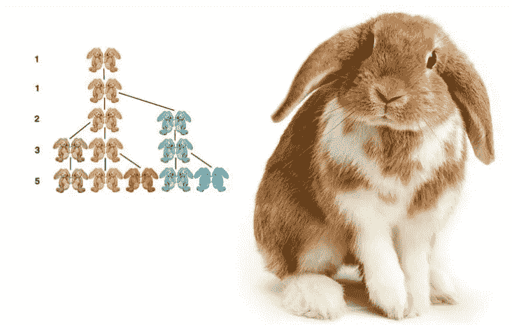

图片来自 [BBC](https://www.bbc.com/mundo/noticias-46926506)

交配的仪式还在继续，但是你很快就会注意到，在一个给定的月份中，你拥有的兔子夫妇的数量是你在之前两个月中每个月拥有的兔子夫妇的总和，所以序列继续，因为在第 5 个月的插图中，黄色、绿色和紫色的兔子对将能够交配，所以序列继续为 8，以此类推。

该序列表示为:

**1… 1… 2… 3… 5… 8… 13… 21… 34… 55…等等。**

# 与自然的联系和黄金分割率

斐波那契数在自然界中出现的频率足以证明它们反映了一些自然发生的模式，例如，它们出现在种子头、松果、水果和蔬菜中。甚至 DNA 分子也以某种方式存在这一系列数字，一个例子是，在双螺旋的每个完整周期中，单个分子的尺寸为 34×21 埃，这与斐波纳契数列中的 34 和 21 个连续数字相同。

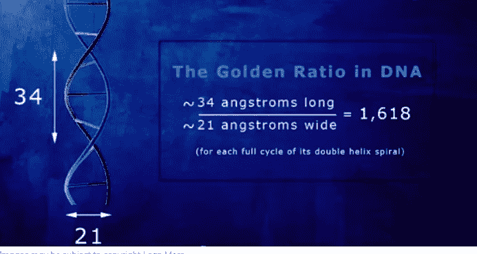

图片由[莱恩·摩尔](https://cute766.info/the-dna-golden-ratio-infra-structure/)

在艺术和建筑中，这种“黄金比例”也被称为[黄金比例](https://en.wikipedia.org/wiki/Golden_ratio)被用于建造吉萨大金字塔，也用于定义《最后的晚餐》、《维特鲁威人》和《蒙娜丽莎》中的所有比例。

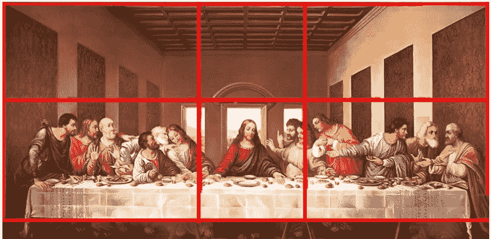

图片来自 Getty Images

# 生成斐波那契数列的代码

在 Python [网站](https://www.python.org/)你可以找到一种通过编码生成斐波那契数列的方法，在 Jupyter 笔记本中找到下面这段代码

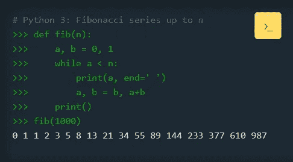

图片来自[python.org](https://www.python.org/)

作为该算法如何工作的一个示例，总是从由变量 a、b 定义的一对数字 0、1 开始，如果该序列一直到 5，它将总是对该序列上所有先前的数字执行求和，如下图所示。

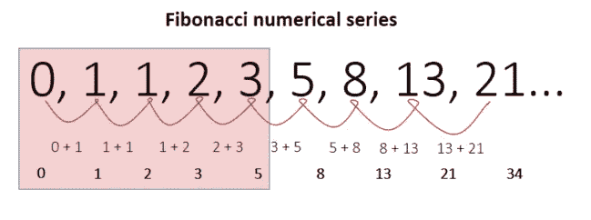

作者图片

python 中生成序列的传统方式是首先定义一个名为`fib`的函数，然后在函数内部声明变量 a，b 等于序列开始的前两个数字，0 和 1。之后，代码开始在`a`(表示 0)和设计给`n`的值之间循环数字，在本例中为 10，因此最初的一对数字:`a`从 0 开始变成了`b`(表示 1)，并且`a` + `b`(表示 0 + 1)之和= 1。这样第二对数字就是 0， **1，1** ...

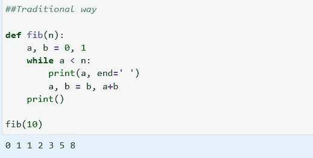

作者图片

一个非常实用的一步一步可视化代码执行的方法是[pythontutor.com](http://pythontutor.com/)，在下面找到 python 中[斐波那契数列执行的链接](http://pythontutor.com/visualize.html#code=def%20fib%28n%29%3A%0A%20%20%20%20a,%20b%20%3D%200,%201%0A%20%20%20%20while%20a%20%3C%20n%3A%0A%20%20%20%20%20%20%20%20print%28a,%20end%3D'%20'%29%0A%20%20%20%20%20%20%20%20a,%20b%20%3D%20b,%20a%2Bb%0A%20%20%20%20print%28%29%0A%20%20%20%20%0Afib%2810%29&cumulative=false&curInstr=15&heapPrimitives=nevernest&mode=display&origin=opt-frontend.js&py=3&rawInputLstJSON=%5B%5D&textReferences=false)

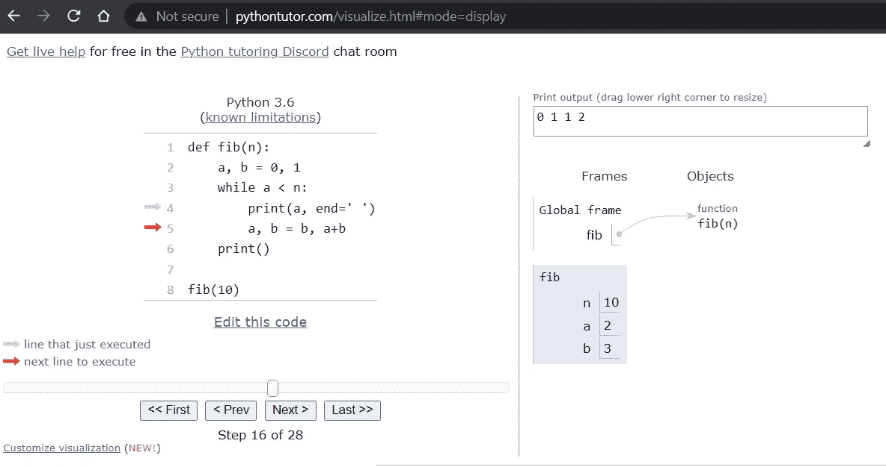

图片来自[pythontutor.com](http://pythontutor.com/)

# 生成斐波那契数列的其他方法

当然，在 python 中还有其他不同的方法来获得相同的结果，可以通过从 GitHub 克隆[笔记本](https://github.com/fvgm-spec/medium_notebooks/tree/main/fibonacci)来随意尝试这些代码块。

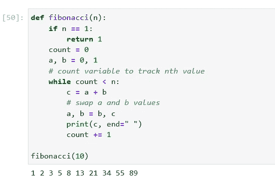

图片来自作者

# 递归方式

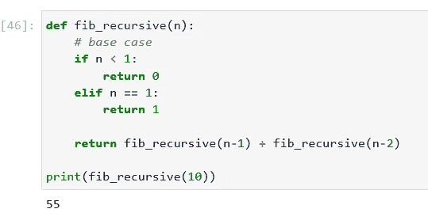

作者图片

# 使用列表

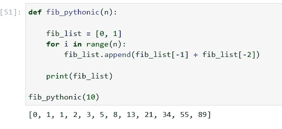

作者图片

# 通过一个循环

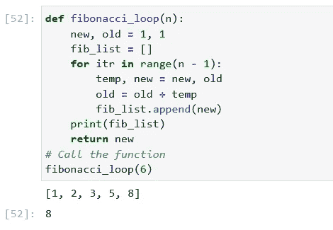

作者图片

通过本教程，我们了解了关于这个基本但非常重要的算法的一点历史，通过可视化它的一步一步的执行和分析，以及帮助我们从一开始就知道这个方法的原始用例。

干杯，编码快乐！！