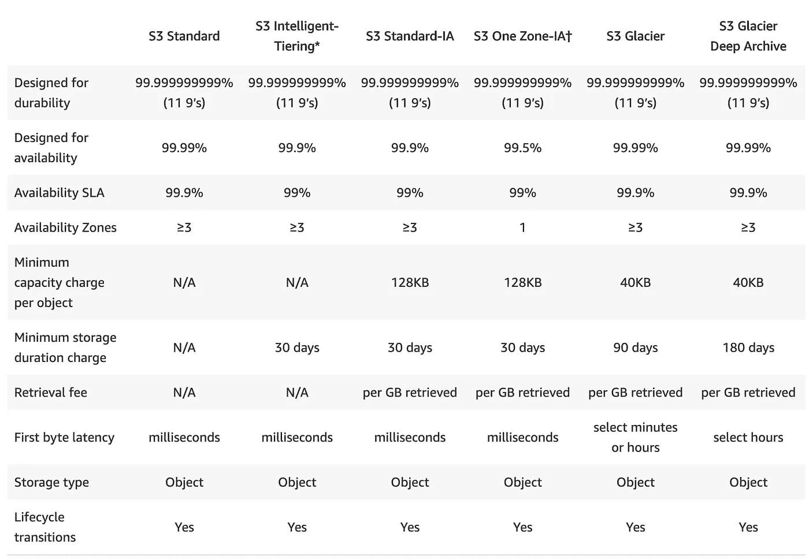

# Noobs 指南:亚马逊 S3

> 原文：<https://blog.devgenius.io/intro-to-amazon-s3-d8c140e96310?source=collection_archive---------17----------------------->

杰西卡·约翰斯顿在 [Unsplash](https://unsplash.com/s/photos/buckets?utm_source=unsplash&utm_medium=referral&utm_content=creditCopyText) 上的照片

这篇文章是为那些忙于学习 AWS 架构师认证的人准备的，无论是助理还是专业人员。这一个集中在你需要知道的关于 S3 的关键事情上。

# 亚马逊为什么要创造 S3？

我想每个人都应该明白事情的原委。在像 S3 这样的云服务出现之前，构建需要大量存储的应用程序非常复杂。您要么将大量驱动器连接到物理服务器，要么必须使用它来设置 NAS。我保证，两个都不好玩。

所以 S3 是一个巨大的进步，因为它:

*   **无限制**存储。
*   没有文件系统，因此没有驱动程序或兼容性问题。
*   **全球**上市。
*   99.99%的正常运行时间
*   成本非常低

# 大量

S3 的核心概念是“桶”。桶只是一个存储数据的空间。每个铲斗都有几个您必须知道的关键方面:

*   全局命名空间(所有名称必须是唯一的)
*   保存对象或文件夹(保存对象)。

## S3 物体

S3 的物品很容易理解。它们由一小组属性来标识:

*   对象关键字(包括文件夹路径)
*   值(您存储的数据本身)
*   对象版本 ID(如果存储桶未版本化，则为空)
*   [计]元数据

S3 对象的大小可以从零字节到 5TB 不等，因此它们非常灵活

# S3 存储类

照片由[斯蒂夫·约翰森](https://unsplash.com/@steve_j?utm_source=unsplash&utm_medium=referral&utm_content=creditCopyText)在 [Unsplash](https://unsplash.com/s/photos/storage?utm_source=unsplash&utm_medium=referral&utm_content=creditCopyText) 上拍摄

每个**对象都有一个存储类。**存储类别影响存储该对象的性能、耐用性和成本。

## 标准

*   快的
*   99.99%的可用性
*   **自动将**复制到 3 个可用性区域

## 不经常访问(IA)

*   仍然很快
*   基础成本比标准成本低 50%,但每次访问都要收费。

## 很少访问的单区域

*   速度很快，但数据只存储在**一个**可用区(99.5%的持久性)
*   比不常访问的标准存储便宜 20%。
*   耐用性和可用性降低，数据**可能会被破坏。**
*   额外检索费。

## 冰川

*   用于因法律原因或长期存档而需要保留的数据
*   检索可能需要**分钟到数小时。**

## **冰川深处档案**

*   用于您真的真的不希望经常查看的数据
*   数据**需要 12 个小时才能访问**，并且需要支付相关费用。
*   他们提供的最便宜的存储设备。

# 智能分层

AWS 将使用机器学习来评估您如何使用您的数据，并自动将数据存储在他们认为对您的用例来说最佳(最便宜)的存储类别中。

来自[https://aws.amazon.com/s3/storage-classes/](https://aws.amazon.com/s3/storage-classes/)

# 数据一致性

## 写入或更新时的对象一致性

当你**第一次上传**一个对象到 S3，你得到**写后读**一致性。换句话说，你可以立即读回数据。

然而，**更新对象的情况**并非如此。如果你用一个新版本覆盖一个对象，那么 S3 提供最终的一致性。AWS 跨可用性区域复制 S3 对象需要时间。立即读取仍可能返回旧对象。通常情况下，S3 只需要几秒钟就可以解决这种不一致，但 update 上的这种行为变化已经让不少工程师犯了错误。

## 跨区域复制(CRR)

AWS 提供了将数据自动复制到另一个地区甚至另一个帐户的选项。这提供了额外的备份、耐用性和灾难保护层。

为了使用 CRR，源和目的地**账户/桶**都需要**对象版本控制启用。**

# S3 对象版本控制

很多时候，您可能希望保留一个对象的多个版本。例如，如果您在 S3 保存了一个配置文件，那么能够跟踪随时间的变化或恢复旧版本可能会很有帮助。

S3 允许你这样做。您可以为**存储桶启用版本控制。**一旦启用，只能暂停，不能禁用。

启用版本控制后，对象的每个版本都将获得一个版本 id。默认情况下，获取该对象将返回最新的版本，除非您提供一个版本 id。

删除一个版本化对象的最新版本将意味着下一个最旧的版本将被用于将来的请求。

# 安全性—访问

过去，默认情况下，桶是不安全的。由于不安全的 S3 桶导致的多次安全漏洞，AWS 现在默认创建新的 S3 桶作为 **private。**这意味着它们根本不可用于公共互联网**。一般来说，你应该尽可能保持这种状态。**

有两种方法可以细化 S3 安全性。

## 访问控制列表(ACL)

ACL 是保护 S3 存储桶的原始方式，也是混乱和许多安全漏洞的来源之一。

## 木桶策略

机器可读(JSON)文档，描述了对 bucket 的一组更复杂的权限。

# 安全性—加密

AWS 允许您以多种方式加密数据。

## 传输中的加密

使用 S3，您可以加密服务器(包括不在 AWS 内的服务器/计算机)和 S3 服务之间的数据。这是通过标准 SSL/TLS 完成的。

## 静态数据

SSE-AES、SSE-KMS 和 SSE-C 是 AWS 提供的三个选项。

*   **SSE-AES** : AWS 使用 AES-256 算法为您管理所有密钥。最简单的选择。
*   **上交所-KMS** : AWS，你可以管理钥匙。稍微复杂一点，但也更灵活。
*   **SSE-C** :您通过上传的方式直接提供加密密钥。您需要手动负责密钥过期、轮换等。

上传到 S3 时，对象将被加密**。**这意味着，如果您打开了加密，并且之前已经上传了对象，那么这些旧对象将不会被加密**。**

## S3 安全-签名的 URL

最常见的 S3 用例之一是让**临时**访问一个文件。例如，如果你正在销售一本电子书，你可能想给一个购买者一个链接来访问一个可下载的 pdf，它在下载后停止工作。签名的 URL 允许你这样做。

一个签名的 URL 创建一个**有时间限制的** URL，允许公众访问私有的 S3 对象。因此，您可以创建一个仅在 5 秒内有效的 URL，以允许用户开始下载，然后该 URL 过期。

# S3 生命周期

在很多情况下，您存储在 S3 中的数据需要频繁访问，例如在创建之后，然后这些访问需求发生了变化。例如，法律文档可能会经历多次更改和更新，然后除了在法律诉讼的情况下，再也不会被查看。

在这种情况下，S3 的对象需要改变其存储类别，从标准访问变为不频繁访问，再变为 Glacier。一段时间后，文档可能完全不相关，并且可以安全地删除以节省成本。

像这样的序列是 S3 生命周期管理的一部分，它允许您声明**自动转换和事件**来更改存储类或删除 S3 对象。

## 生命周期规则

S3 生命周期通过**生命周期规则处理。**例如，您可以指定一个对象在一个月后自动移动到 glacier，并在一年后删除。

强烈建议使用这些生命周期规则来**节省成本**和**自动满足**需求。

# 摘要

了解本文中的所有内容并在 AWS 控制台中练习使用 S3 非常重要。我试图用粗体字突出关键概念或想法。

S3 是 AWS 提供的最简单、最容易和最古老的功能之一，并被其他 AWS 服务广泛使用。您必须熟悉 S3 的所有功能，这一点很重要。