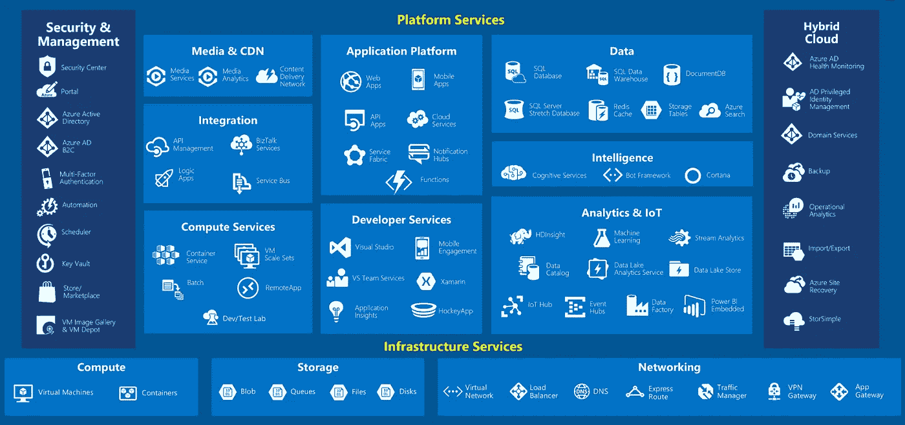
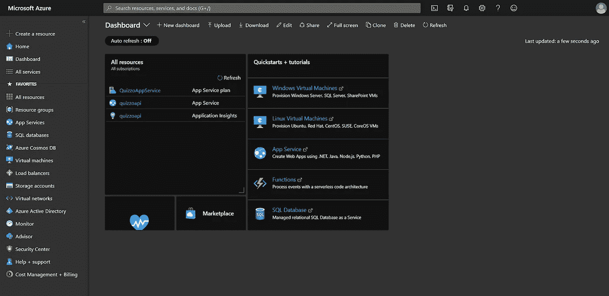
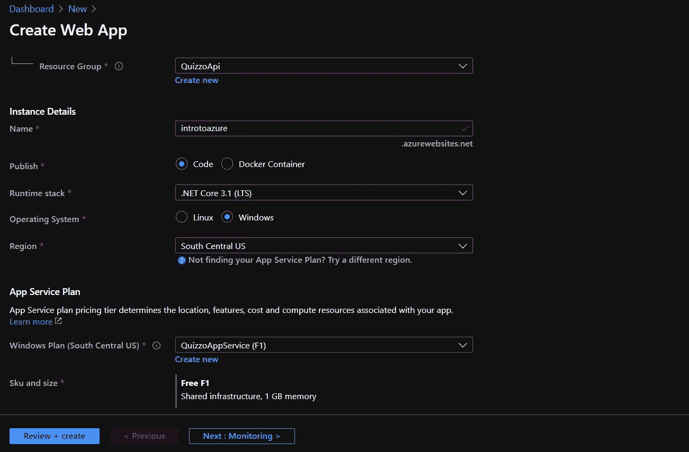
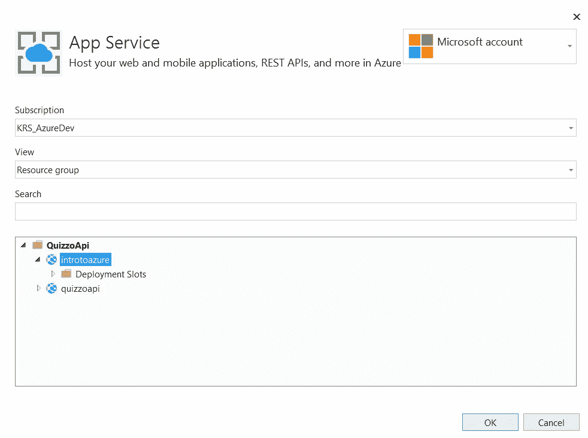

# Azure 简介

> 原文：<https://blog.devgenius.io/intro-to-azure-cb487907aa46?source=collection_archive---------18----------------------->

我使用 Azure services 已经有几年了，我看到了它的变化和大量新功能的加入，技术发展的速度超过了我的速度。这篇探索性的文章旨在让你大致了解一下 Azure 和云的世界。

我不会谈论 Azure/微软与其他公司的对比。你可以自由评估像 AWS，Google Cloud 等不同的云提供商，你可以挑选最适合你的解决方案。我喜欢 Azure，因为它很好地集成到了 Visual Studio 中，而且我一直致力于。NET 和 Visual Studio，我倾向于 Azure 是有道理的。走向云解决方案的好处在于，你可以为不同的用例选择不同的提供商，这样你就可以在 AWS 中托管数据库，在 Google Cloud 中托管媒体，在 Azure 中托管网络应用。当您评估云提供商时，请确保使用他们的定价评估工具来计算您的成本比较。

# 什么是 Azure？

Azure 是微软提供的云计算平台，提供各种云解决方案。

这说明不了什么，不是吗？我们需要先说说云计算。

云计算，基本上，是一堆可以通过互联网获得的计算资源。这意味着如果你需要数据库服务器之类的东西，你不需要有物理服务器，云提供商将通过互联网为你提供服务器。

这里的一个关键原则是这些服务的按需可用性，或者说是一个按需付费的模型。通常，对于云资源，您可以在需要时随时打开和关闭它，可以在需要时随时扩大和缩小规模，因此您肯定只会在需要时消耗(并支付)云资源。

另一个关键原则是用户没有直接或主动的资源管理。这意味着由云提供商来维护这些服务，您可以根据需要简单地使用它们。

云计算的一些优势如下:

**降低 IT 成本** —就像我之前说过的，如果您需要一个 web 服务器或数据库服务器，您不需要去购买和设置那些物理机器。您可以通过云提供商“租赁”它们，这比拥有您的内部基础架构要便宜得多，尤其是在大规模的情况下。硬件贵。我给你举个例子。假设您的公司在一个负载平衡的环境中使用了 100 多台 web 服务器来为您的 web 应用程序提供服务。您的数据中心有 100 多台物理服务器，需要定期维护和升级。现在想象别人会为你做这些。维护基础设施的责任落在了云提供商身上。

**可扩展性** —工程师总是说“哦，但是它可扩展吗？”擅长处理负载波动的软件被称为可伸缩的，这意味着如果负载量增加，您的应用程序和基础设施应该能够处理。假设你的业务是销售礼品或礼品卡。你的流量在假期会很高，但在一年中的其他时间不会那么高。如果您有一个本地解决方案，您会在假日季节购买几台新服务器，但这些服务器会浪费一年的剩余时间。现在，如果您的应用程序运行在云上，您无需购买物理服务器，只需将云资源设置为自动扩展即可，这意味着实例的数量会随着负载的增加而自动增加，当负载减少时会自动缩减。所以你能做的就是配置 Azure 说，嘿，如果我的应用程序上的负载超过 80%，再给它添加一个实例。如果下降到 80%以下，则删除额外的实例。

**可靠性和恢复** —云提供商通常有 SLA(服务水平协议)，要求他们的资源在 99.95%的时间内可用。这意味着停机时间非常短。您应该能够相信，您的云资源几乎会一直保持运行，当然，除非您的应用程序中存在缺陷，导致其停机。让我给你一个恢复选项的例子。如果您碰巧损坏了您的数据库，并且您想要及时从以前的稳定状态恢复它，Azure 允许您在数据库的保留期(7 到 35 天)内将您的数据库恢复到任何时间点，最长可达毫秒。这些功能由云解决方案提供，而内部解决方案需要更多的设置、配置或维护才能实现。

**灵活性**——大多数云提供商将允许你部署用任意数量的不同框架编写的应用程序，比如。NET，Java，Python，Node 等。这为您提供了快速设置应用程序的能力，而不必设置服务器来处理不同的框架。

云计算也有一些缺点。我不会把它们称为缺点，但是有一些因素会让组织对向云迁移犹豫不决。

最大的问题是安全和隐私。一些组织并不热衷于将他们的数据放在其他人的数据中心，这可能是由于他们与客户的合同协议，或者是由于世界各地各种各样的隐私和数据法律。

另一个问题是，一旦你已经设置好资源，就很难改变云提供商。假设你想从 AWS 迁移到 Azure，没有魔杖可以转移你的资源。当然，这只是一个可察觉的缺点，这是可以做到的。

对我来说，一个重要的因素是隐性成本。你必须非常小心地知道你在支付什么。由于这些资源是按需提供的，如果你创建了一个 web 应用程序，但你忘记了它，它没有被使用，它将继续向你收费。或者，假设您上个月扩大了规模，但没有启用自动扩展，也没有缩小规模，这将会让您付出代价。您需要确保跟踪您的资源消耗，并在选择云解决方案之前做大量的研究和成本比较。

好了，现在让我们看看 Azure 必须提供的一些特性。

哇，你可以看到有很多功能。截至 2020 年，Azure 提供了 200 多种产品。我曾经使用过其中的一些，但是让我们来谈谈一些流行的。

**App Service / web App** —这可能是最受欢迎的一个，它只不过是你的 Web 应用程序，所以无论你构建什么 MVC 或 React 应用程序，它都会被部署到 Web 应用程序中，并且可以在互联网上使用。

**Azure SQL 数据库** —是一个可扩展的关系数据库服务，托管在云上。当你在 Azure 上配置数据库服务器时，它会给你一个通过 SSMS 访问该服务器的 URL。

Azure Logic Apps —这些是工作流类型用例的容器，您可以使用触发器和动作来定义它们，因此它们适用于计划的作业。

Azure 功能是无服务器的应用。Azure 功能非常适合图像处理、处理订单、文件维护和运行预定任务等任务。像没有太多依赖的一次性工作这样的事情非常适合 Azure 函数。无服务器应用程序的好处是，只要代码运行，您就可以付费。让我们以一个电子邮件服务任务为例。您有一个接受电子邮件请求并发送电子邮件的服务，该过程运行 1 秒钟。你不需要完整的。此服务的. NET 应用程序。如果你的服务是一个 Azure 功能，你只需为流程运行的每一秒付费，而不是像你有一个 web 应用程序那样为一整天付费。

**Azure Active Directory** —这是微软的单点登录产品。什么是 SSO？在多个应用程序上使用相同的登录凭据是 SSO。

Azure blob—blob 非常适合存储文本或二进制数据等非结构化数据。我喜欢将我的应用程序的媒体文件像图像一样存储在 blob 存储中。以您之前拥有 100 多台 web 服务器的例子为例。在负载平衡的环境中，不能在 web 服务器上存储图像。您将需要设置共享服务器，并且如果您希望在主服务器出现故障的情况下在辅助服务器上复制您的文件，可以选择启用名为分布式文件系统的故障转移策略。如果您使用 blob 存储，您可以避免这些共享服务器，因为 Azure 将维护您的 blob，您甚至可以为这些 blob 配置复制策略。

**Application Insights** —这是你的网络应用的免费附件，它为你的网络应用提供了非常好的监控信息。它可以监控很多事情，比如流量、请求、错误等等。您还可以设置 App Insights 根据一些指标向您发送电子邮件，比如过去一小时的错误计数超过 90%，然后向管理员发送电子邮件。

**Azure DevOps** —以前叫做 Visual Studio Team Services，这是你的 CI/CD 管道、源代码控制集成、项目管理等等。想象一下，不用手动开始构建过程、单元/集成测试、scrum 任务更新等等。想象一下，只需单击一个发布到 Azure 按钮，就可以自动按顺序启动这些任务，并且您的更改可以在您的应用程序上使用，而无需您进行干预。整洁，对不对？

现在让我们简单看一下 [**Azure 门户**](https://portal.azure.com) 。

Azure 门户是你管理所有 Azure 资源的工具。从这里，您可以创建新的资源，如 Web 应用程序、数据库等等。您已经有 Azure 帐户了吗？如果是这样，那我们就快速创建一个 web app 吧。

点击**创建资源**并选择 **Web App** 。您将看到一个带有几个表单字段的向导。

选择或创建资源组。资源组是保存应用程序相关资源的逻辑容器。您可以根据对组织最有意义的方式来决定如何将资源组织到资源组中。

键入应用程序的名称。Azure 应用总是以 <appname>.azurewebsites.net 的形式出现，你的站点名称应该是唯一的。</appname>

选择您的运行时堆栈。你可以选择。NET、Java、Node、Python、PHP 或 Ruby，具体取决于您希望托管的应用程序。

选择一个区域。决定你应该选择哪个地区有各种各样的因素。Azure 在世界各地都有数据中心。这实现了地理冗余，这意味着如果由于自然灾害在世界的一个地方发生故障，可以从不同的区域获得资源。不同的地区也有不同的成本，所以在美国中南部托管的 web 应用程序比在印度南部托管的要便宜。现在，继续选择一个离你的物理位置最近的地区。

选择操作系统。Linux 操作系统比 Windows 便宜。如果您的应用程序运行在。NET 核心框架，您应该能够在 Linux 上托管它并节省一些钱。

选择或创建应用服务计划。我选择了一个**免费的**计划，所以这个资源不会花我一分钱。这对于演示应用程序来说非常酷。除了演示应用程序，你不能使用免费计划，因为 Azure 会在没有活动时让这些资源休眠。免费计划也意味着你不能添加一个自定义域名到你的应用程序。在你进入生产就绪系统之前，使用 [Azure 价格计算器](https://azure.microsoft.com/en-in/pricing/calculator/)来评估你的需求。

就是这样！点击**审核+创建**，你的申请应该在几分钟内准备好。

创建应用程序后，浏览至您选择的 URL。您将看到一条标准的 Microsoft 消息，欢迎您使用您的资源。您的应用程序现在已经准备好进行任何您想要的部署。

继续在 Visual Studio 中创建一个 web 应用程序。我已经创建了一个 ASP.NET 核心 Web 应用程序，其中包含几个 Razor 页面。我准备将这个应用程序部署到我在 Azure 的站点上。

右键点击项目，点击**发布**。点击**选择现有的**选项，并登录到您的 Azure 帐户(如果您尚未登录)。这样做现在应该可以从你的 Azure 帐户加载可用资源。

选择您刚刚创建的 Web 应用程序，然后单击**发布**。等待几分钟，瞧，你的应用程序将被部署并在互联网上可用！

我希望这对于那些开始探索 Azure 或云的人来说是一个很酷的小介绍。感谢阅读！