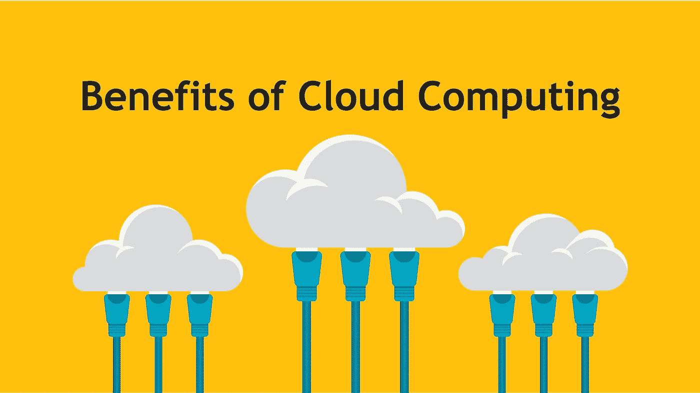
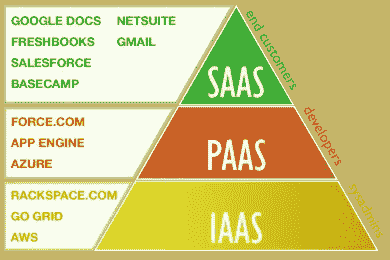
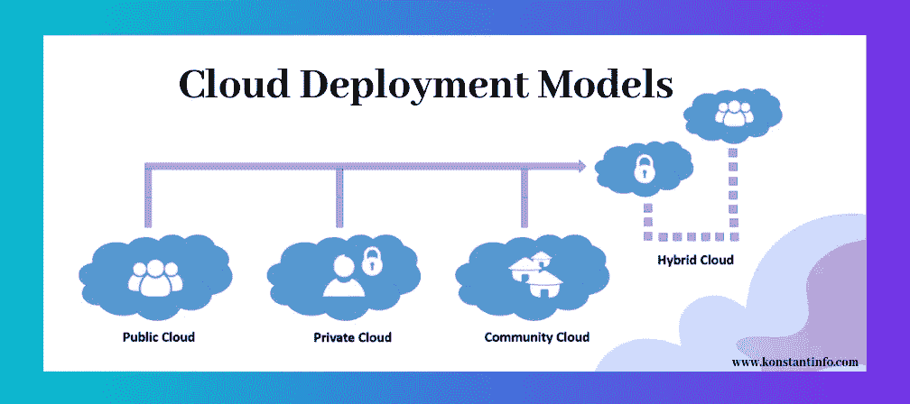

# 云 computi̇ng 简介

> 原文：<https://blog.devgenius.io/intro-to-cloud-computi%CC%87ng-3425dc6498fc?source=collection_archive---------28----------------------->

大家好！本周，我参加了来自 [Udacity](https://www.udacity.com/) 在线教育平台的[云计算介绍](https://classroom.udacity.com/courses/ud080)课程。我想和你分享我从教育中学到的笔记。希望有用。

云计算是由云提供商拥有、运行和维护的在线托管服务(尤其是数据存储和计算能力)的集合，不需要用户的直接主动管理。为您使用的东西付费。

## 云计算的优势

*   **敏捷*:云是敏捷的。基础设施资源可以在必要时加速运转。这些资源包括计算、存储、数据库、物联网(IoT)、机器学习、分析等等。
*   * *弹性*:当业务需求发生变化时，云能够通过增减资源来缩减或增加容量，从而自动按需处理高峰级别的业务活动。
*   **经济*:因为云计算去除了拥有和维护硬件的传统成本，并且只为使用付费，所以节省的成本非常大。最重要的是，云计算提供商为一些资源(如计算)提供大幅折扣，前提是这些资源上的工作流程可能会被中断。这进一步增加了在云中运行的成本节约。
*   * *可用性*:云计算提供商在一个地理区域内的许多地方以及全球的许多地方提供服务。这扩展了云服务的可用性和持久性。

## 云利益相关方

*   首席财务官会对在云中运行的预算和成本感兴趣。
*   开发者会对在云中构建应用或平台感兴趣。
*   IT 部门会对集中、扩展和预订内部数据感兴趣。
*   DevOps 对提高正常运行时间、响应能力和效率感兴趣。
*   营销和产品管理将对云的分析能力感兴趣。

# —servi̇ces 云的类型—

## *基础设施即服务(IaaS)*

IaaS 是高度可扩展和自动化的计算资源。IaaS 是完全自助式的，用于访问和监控计算机、网络、存储和其他服务。这种模式允许企业按需购买资源，而不是直接购买硬件。

## IaaS 特征:

*   资源以服务的形式提供。
*   费用因消费而异。
*   服务是高度可扩展的。
*   多个用户共享一个硬件。
*   组织保留对基础架构的控制。
*   动态灵活。

## 平台即服务(PaaS)

PaaS 允许开发人员基于一个框架来创建自定义应用程序。PaaS 提供商通过阻碍或隐藏服务器、存储和网络，帮助开发人员专注于管理其应用程序，而不是管理基础架构。Heroku 就是 PaaS 提供商的一个例子。

## PaaS 特性:

*   基于虚拟化技术构建，因此资源可以轻松地向上或向下扩展
*   提供各种服务以协助开发、测试和开发应用程序。
*   可由众多用户通过相同的开发应用程序访问。
*   集成 web 服务和数据库。

## 软件即服务(SaaS)

最常见的云使用选项，允许第三方供应商提供在浏览器中运行的应用程序，而无需任何安装。例如，G Suite 是浏览器中办公应用程序的 SaaS 解决方案。

## SaaS 特征:

*   从中心位置管理。
*   托管在远程服务器上。
*   可在浏览器中访问。
*   用户不负责硬件或软件更新。

# — CLOUD DEPLOYMENT MODELS —

## 公共部署

此模型是最常见的部署模型。服务面向互联网，在许多组织和租户之间共享硬件、网络和存储。

## 优势:

*   具有成本效益
*   您使用的现收现付薪酬资源
*   免维护云—云提供商负责

## 私有部署

此模型将每个部署限制在一个组织中。这种模型可以更好地控制网络安全。资源不会在组织和租户之间共享，这降低了风险。

私有云可以是内部部署，也可以由云提供商托管。即使部署由云提供商托管，所有硬件和软件也专用于一个组织。政府、金融机构或必须遵守严格监管协议的组织经常使用私有部署模型。

## 优势:

*   支持高度定制的网络
*   有助于加强安全性和隐私性
*   提供对基础架构的更大控制

## 社区部署

社区部署模型在很大程度上类似于私有模型；唯一的区别是用户的集合。虽然私有类型意味着只有一家公司拥有服务器，但在社区类型的情况下，具有类似背景的几个组织共享基础架构和相关资源。

如果企业有统一的安全、隐私和性能要求，这种多租户数据中心体系结构可以帮助企业实现其特定于业务的目标。这就是为什么社区模型特别适合从事联合项目的组织。在这种情况下，集中的云有助于项目开发、管理和实施。此外，成本由所有用户分摊。

## 优势:

*   成本降低
*   提高安全性、隐私性和可靠性
*   便于数据共享和协作

## 混合部署

该模型是公共和私有部署模型的混合，结合了两者的优点。这种模式提供了在私有基础架构上运行的灵活性，但在允许的情况下，该模式可以切换到公共云，以实现成本节约等好处。

在混合部署中，数据可以从私有云流向公共云，反之亦然。

## 优势:

*   提高安全性和隐私性
*   增强的可扩展性和灵活性
*   合理的价格

## *参考文献*

*   *乌达城*
*   【sam-solutions.com 

感谢您的阅读:)