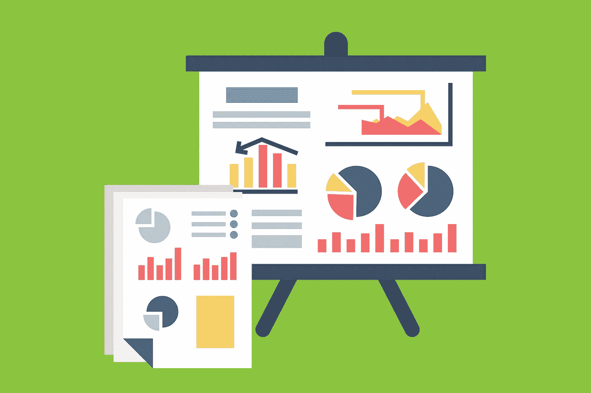

# 数据科学简介|第 1 部分

> 原文：<https://blog.devgenius.io/intro-to-data-science-part-1-6339230aa934?source=collection_archive---------13----------------------->

# 什么是数据科学？

简单来说，数据科学就是从数据中获得有意义的结论和见解。

收集的数据量与日俱增。人们通过分享帖子、发送电子邮件、进行交易、填写调查表格等方式为数据的增加做出贡献。

数据在许多方面对我们有用。其中一些是:-

*   预测天气
*   全球人口
*   检测欺诈交易
*   金融市场

流媒体服务(网飞、Youtube 等。)也应用数据科学技术向您推荐要观看的视频。

数据科学中的“科学”一词代表通过统计方法(如概率)分析各种数据来预测未来事件。

# 数据科学涉及的步骤

## 步骤 1 —收集数据

在这一步中，我们从各种事物中收集数据，如调查、公共数据集、交易和财务信息，然后安全地存储它们，以便以后可以方便地访问它们。

## 步骤 2 —清理数据

在这一步中，我们需要通过修复拼写错误、删除空值(空字段)或重复值以及将数据转换为有组织的格式来清理数据。

## 步骤 3-探索和可视化数据

在这一步中，我们探索我们拥有的数据，并尝试使用图形表示将从数据中获得的洞察力可视化为仪表板。仪表板通常跟踪时间序列数据和性能(使用关键性能指标，即 KPI)。

## 第 4 步—预测

在这一步，我们建立一个模型，用数据对其进行处理，并进一步对其进行预测。例如，预测下一天或下一周的天气。

让我们来看看数据科学的一些很酷的应用。

# 数据科学的应用

## 欺诈检测

在欺诈检测中，我们分析数据集并确定交易是否欺诈的概率。

为了确定概率，我们需要收集有关交易的信息，如日期、地点、时间、金额和卡用户的地址。

现在我们需要一个数据集形式的欺诈或有效交易的例子。这些记录通常被称为**训练数据。**

然后，训练数据被用于建立一种算法，该算法将给出交易是否是欺诈的概率。

## 互联网搜索

当我们希望在互联网上浏览一些东西时，我们通常会想到谷歌，但也有许多搜索引擎，如雅虎、DuckDuckGo、必应等。他们使用数据科学算法在几秒钟内根据我们的查询为我们提供最佳匹配结果。

结果不到半秒就上膛了！

## 推荐系统

像 Youtube 和网飞这样的视频流设备使用推荐系统算法向用户推荐最符合他们兴趣的视频。

# 数据科学角色和工作

数据科学中主要有 4 个角色:数据工程师、数据分析师、数据科学家和机器学习分析师。

## 数据工程师

数据工程师应该收集数据并将它们存储在数据库中。他们负责方便其他同事访问数据。

SQL 是数据工程师用来存储/组织数据的常用工具，并能熟练使用。它们用来处理数据的其他编程语言有 Java、Scala 和 Python。他们还需要熟悉云计算，以便能够存储大量数据。

## 数据分析师

数据分析师审查数据，以确定对企业客户的关键见解以及使用数据解决问题的方法。他们通常执行数据科学工作流程的**步骤— 2(清理数据)**和**步骤— 3(探索和可视化)。**

他们使用 **SQL** 来查询数据，使用电子表格进行简单的数据分析/清理，使用商业智能工具如 **Tableau、Power BI、**等来构建代表他们分析的仪表板。

## 数据科学家

数据科学家关注数据科学工作流的**步骤 2(清理数据)**、**步骤 3(探索和可视化)**和**步骤 4(预测)**。他们有很强的统计技能，在机器学习中用于预测和预报。

他们使用 **SQL** 并且精通编程语言 Python 和 R 中的一种或两种，这些语言提供了诸如 Python 中的 **pandas 和 R 中的 **tidyverse 等库。****

## 机器学习科学家

机器学习科学家与数据科学家的角色相似，也有机器学习方面的专长。他们使用训练数据来建立模型。例如，对包含猫的图像进行分类。他们关注数据科学工作流程的**步骤 2(清理数据)**、**步骤 3(探索和可视化)**和**步骤 4(预测)**。

他们使用 Python 或 R 之类的编程语言来创建他们的模型进行预测。一些流行的机器学习库有 TensorFlow、scikit — learn 等。

在第 2 部分中，我们将简要学习数据科学工作流的**步骤 1** 。下面提供了链接。

 [## 数据科学简介|第 2 部分

### 本博客关注数据科学工作流程的第一步，即收集数据。

iamjigyanshu.medium.com](https://iamjigyanshu.medium.com/intro-to-data-science-part-2-fe544e2f4a11)