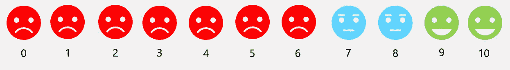
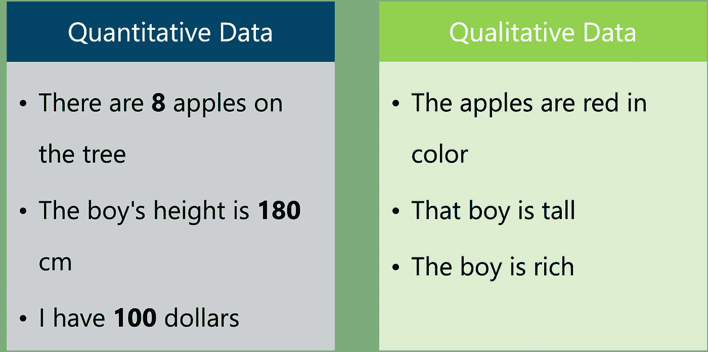
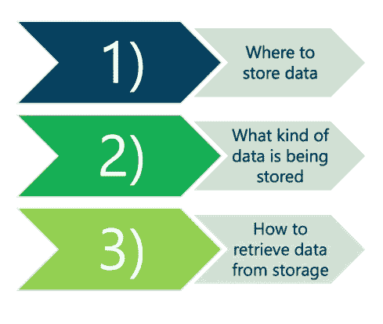

# 数据科学简介|第 2 部分

> 原文：<https://blog.devgenius.io/intro-to-data-science-part-2-fe544e2f4a11?source=collection_archive---------7----------------------->

本博客重点关注数据科学工作流程的第一步，即**收集数据**。

## 内容

*   数据来源
*   数据类型
*   数据存储和检索
*   数据管道

# 步骤 1:收集数据

在从数据中得出有意义的结论和见解之前，我们需要从不同的来源收集数据。

人们通过网上冲浪、访问网站、支付等方式为数据的指数级增长做出贡献。提供这些服务的公司收集用户的数据。利用这些数据，他们可以了解客户的需求和产品偏好。这也被称为数据驱动的决策。

# 数据来源

## 公司如何收集数据？

**网络数据:**当你访问一个网页或点击一个链接时，通常这些信息会被公司跟踪，以分析**转换率**(采取想要的行动的用户的百分比)或检查哪些内容是每个人在其网页上查看最多的。收集的数据的例子是页面的哪个 URL 被访问、它被访问了多少次、访问时间、访问它的用户等。

**调查数据:**该数据是由公司为征求人们的意见而进行的调查收集的。例如，民意测验、问卷调查等。

**净推介值:**这是一家公司非常常用的功能，用来询问用户向朋友、家人或同事推荐产品的可能性有多大。

在 10 分制中，您向朋友或家人推荐我们产品的可能性有多大

## 开放数据

有许多方法可以访问开放数据。有两种类型，**API**和**公共数据。**

**API:**代表应用编程接口。它用于通过互联网向第三方请求数据。许多公司使用公共 API，这样任何人都可以访问他们的数据。比如谷歌地图、雅虎、推特、维基百科等

**公共数据/记录:**这些信息免费使用，任何人都可以访问。一般都是政府机构收的。例如医院记录、图书馆记录、天气记录、人口数据等。

# 数据类型

在我们知道从哪里收集数据之后，我们还应该知道我们收集的数据的类型。

了解数据的类型很重要，这样才能以有组织的方式存储和分组数据。并非所有类型的数据都可以存储在一起，它们需要分开存储。

数据一般分为两类**定量**和**定性。**

**量化数据**可以计数、测量，并用数字表示。

**定性数据**是描述性和概念性的。

下面是每种方法的一个例子

除此之外，还有更多类型的数据，如图像、地理空间、网络、文本等。

**文本数据:**文本数据以电子邮件、信息、博客等形式出现在互联网上，甚至出现在你的智能手机上。

**图像数据:**图像是由像素组成的，这些像素给我们颜色和强度的信息。它们以包含数字的矩阵形式存储在计算机中。这些数字被称为**像素值**。

地理空间数据:它给了我们关于位置的信息。例如，谷歌地图向我们展示了每一条道路、街道、建筑和植被。它们属于地理空间数据。它们主要用于导航应用。

# 数据存储和检索

在收集数据时，很重要的一点是要方便地存储数据，以便授权人员可以访问。

存储数据时要记住的事项

## 位置:在哪里存储数据？

在从事数据科学项目时，我们必须处理大量数据。我们使用计算机或一组称为'**集群**或'**服务器**的计算机来存储这些数据。

我们也可以使用像“云”这样的在线服务来存储这些数据。云服务是基于现收现付的方法。按照这种方法，我们必须为我们使用的存储量付费。

一些常见的云服务提供商是谷歌云、微软 Azure 和亚马逊网络服务(AWS)。

## 数据存储的类型:存储的是什么类型的数据？

在存储数据时，您可能会遇到针对**表格数据**的关系数据库或针对**非结构化数据**的文档数据库。

**表格数据或结构化数据:**这包括具有预定义顺序并遵循持久顺序的数据。它也可以用表格的形式来表示，可以很容易地被人和程序访问。例如姓名、日期、地址、信用卡号、股票信息、地理位置等等。

**非结构化数据:**与结构化数据不同，这包括未按预定义顺序组织的数据。例如视频文件、电子邮件、图像等。

为了访问这些数据，我们需要一种查询语言，比如针对表格数据的 SQL T21 和针对非结构化数据的 NoSQL。

# 数据管道

数据不断进入系统，让数据工程师手动收集和存储数据将是一项令人疲惫不堪的任务。这就是数据管道的用武之地。

数据管道是一组工具和过程，它们自动在系统和数据仓库之间移动和转换数据。数据管道也需要监控。例如，如果存储器即将被填满，它必须发送警报，或者如果在接收数据时出现一些错误，等等。

并非所有的数据科学项目都需要数据管道。当从不同来源收集数据时，这是必需的。

管道没有特定的建造方式。它是根据数据和存储选项定制的。

最流行的数据管道框架是 **ETL** ，代表提取、转换和加载。

数据管道工作流(ETL)

## 提取

在这个阶段，我们从不同的来源收集数据。我们在上面讨论了不同的来源，如 API(通过互联网请求数据)、公共数据、物联网设备等。

## 改变

在这一阶段，我们转换数据以便对其进行组织，这样其他人就可以很容易地找到相关数据并使用它。

转换通过以下方式完成:

*   将不同来源的数据连接到一个数据集中。
*   转换传入数据的结构以适应数据库的模式。
    **数据库的模式**定义了数据在关系数据库中的组织方式。
*   删除不需要的数据

## 负荷

这是最后一个阶段，我们将数据加载到存储中，以便可以用于可视化。

## 自动化

现在我们将这些过程自动化。无论何时我们得到任何数据，它都会被收集，以某种方式转换，并存储在数据库的特定表中。

在第 3 部分中，我们将重点关注数据科学工作流的**步骤 2(清理数据)&步骤 3(探索和可视化)**。

要阅读博客的第一部分，请访问下面的链接

 [## 数据科学简介|第 1 部分

### 什么是数据科学？

iamjigyanshu.medium.com](https://iamjigyanshu.medium.com/intro-to-data-science-part-1-6339230aa934)