# 数据科学简介|第 3 部分

> 原文：<https://blog.devgenius.io/intro-to-data-science-part-3-339a9234bc86?source=collection_archive---------11----------------------->

本博客主要关注数据科学工作流程的第 2 步和第 3 步，即**清理数据**和**探索&可视化**。

## 内容

1.  清理数据
2.  探索性数据分析
3.  形象化

# 清理和准备数据

我们得到的数据在现实生活中是非常混乱和肮脏的。清洁它以避免得到任何错误或不正确的结果是非常重要的。

我们来试着清理一下这个名为“复仇者联盟”的样本数据。

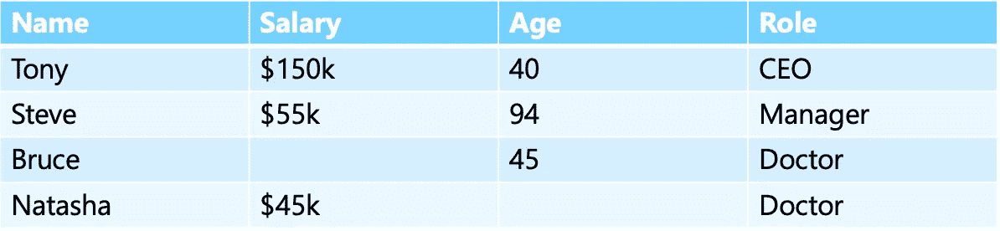

样本数据集

在复仇者数据集中，我们可以看到“薪金”和“年龄”列中缺少一些值。

Bruce 的工资缺失，我们可以通过取工资列的平均值、中间值或最大值来填充，Natasha 的年龄也可以类似地填充。为了填充缺失值，我们取“薪金”和“年龄栏”的平均值，分别为 83k 美元和 60 美元(近似值)。

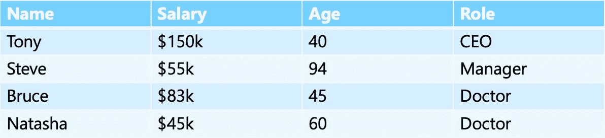

当有少数缺失值时，我们可以用这些聚合值来填充缺失值，但是当缺失值太多时，我们必须删除那些行。像这样删除数据意味着用于训练模型的数据更少。

我们还需要删除任何重复。

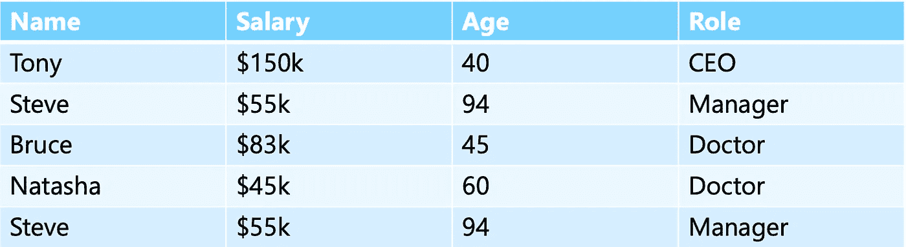

请注意，Steve 有一个重复的条目。

在上表中，我们可以看到 Steve 有一个重复的条目。所以我们删除了重复的条目。

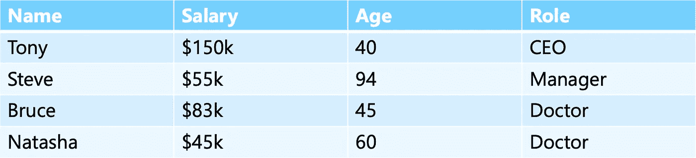

删除重复值后。

清理和准备数据的一些流行工具有 **R** 、 **Python** 和 **SQL** 。

# 探索性数据分析

EDA 是清理数据后的下一步。这是一个使用可视化技术探索和分析数据的过程。它可以揭示新事物，可能需要清洁。

让我们来看看这个有趣的数据集。

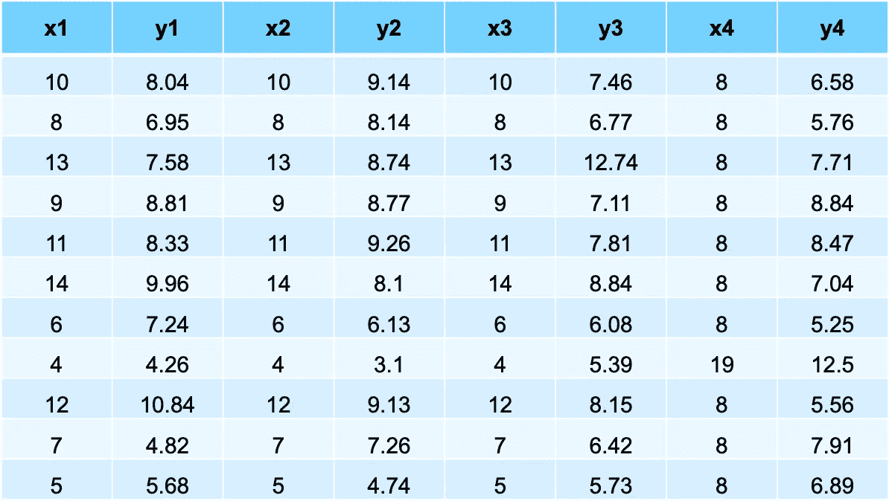

该数据集被称为 Anscombe 四重奏，其中所有 4 对
x 和 y:

*   x 的相同均值和方差
*   y 的相同均值和方差
*   相同相关系数
*   相同线性回归系数

如果你在理解上面的一些术语时有困难，这完全没关系，因为这是最基本的。

如果我们尝试将这些 x 和 y 对形象化，我们将得到下面的图:

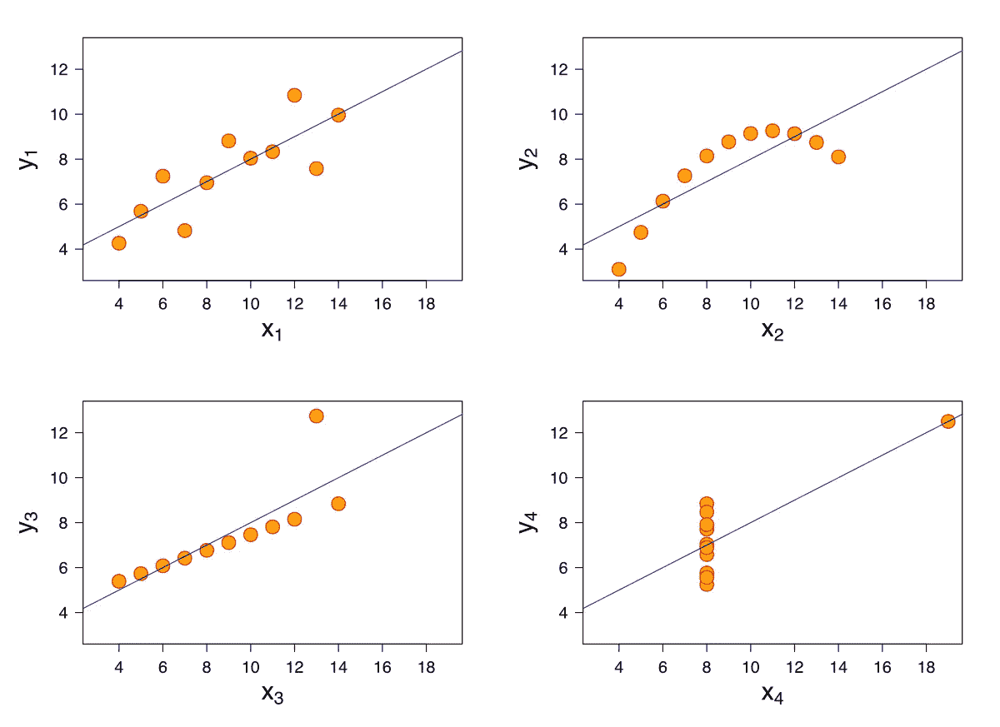

惊讶吧？尽管它们有相同的描述性统计数据，但在绘制图表时，它们有不同的图形。

**离群值**是远离其余数据的一段数据。

例如，让我们看看显示苹果重量分布的直方图。

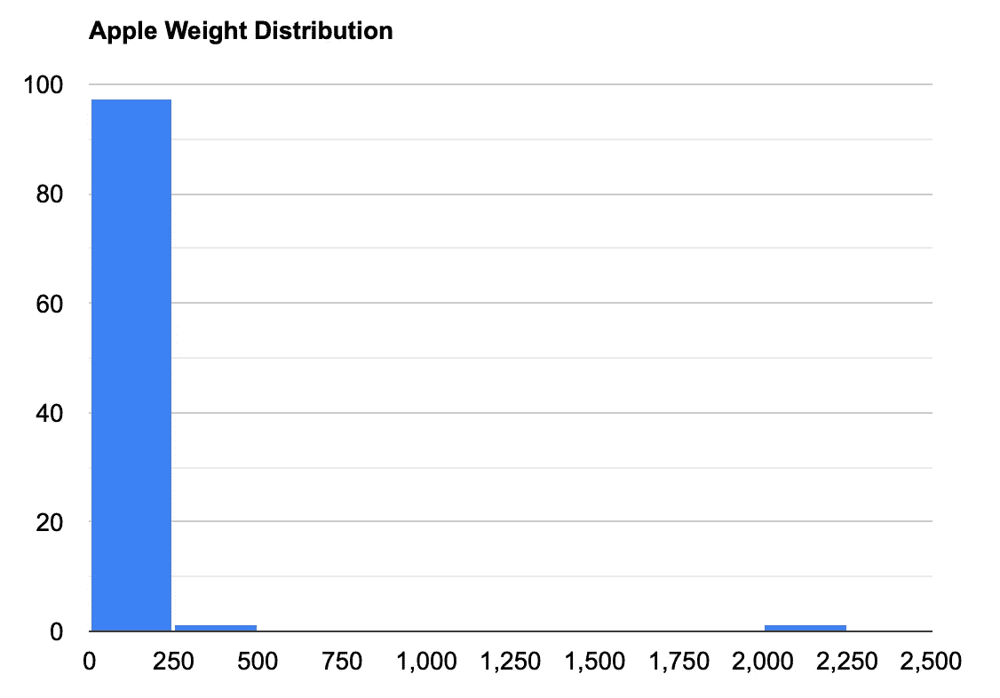

从这个图表中，我们可以看出，最大数量的苹果重量在 0-250 克之间，1 个苹果重量在 2000-2250 克之间。现在，这个苹果是一个异常值，因为一个苹果不可能有那么重。如果有人错误地添加了“0”，就可能会发生这种情况。因此，我们需要通过删除零来解决这个问题。

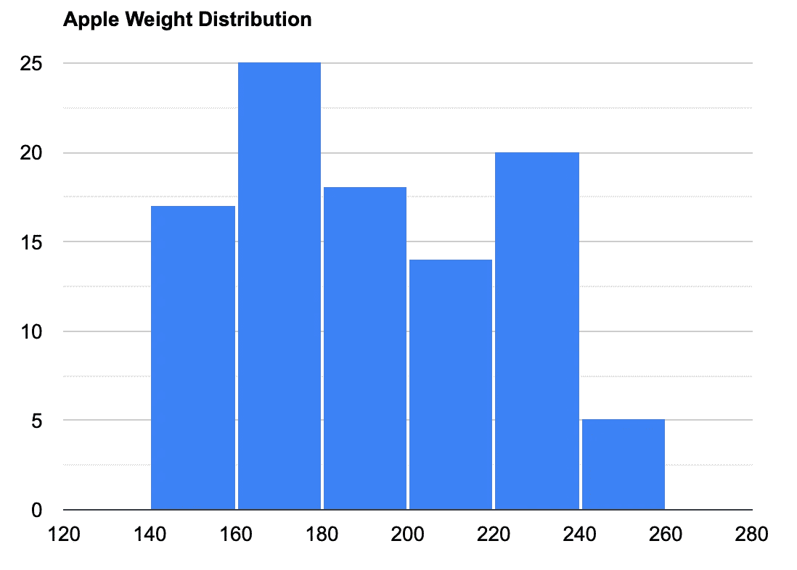

现在图表看起来很完美👍

识别异常值最常用的图是箱线图。
与之前相同示例的箱线图为:

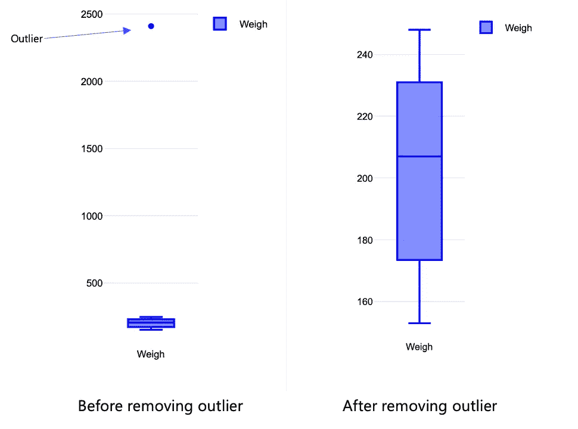

像 **Matplotlib、Seaborn 和 plotly** 这样的 Python 库可以用于 EDA。甚至可以使用像 **DataExplorer、GGally 和 SmartEDA** 这样的 R 包。

# 形象化

> 数据可视化有助于弥合数字和文字之间的鸿沟。
> —布里·安德森

清理和分析数据后的下一步是呈现数据。我们借助**仪表盘展示我们的发现。**

仪表板是我们所有数据的可视化显示。

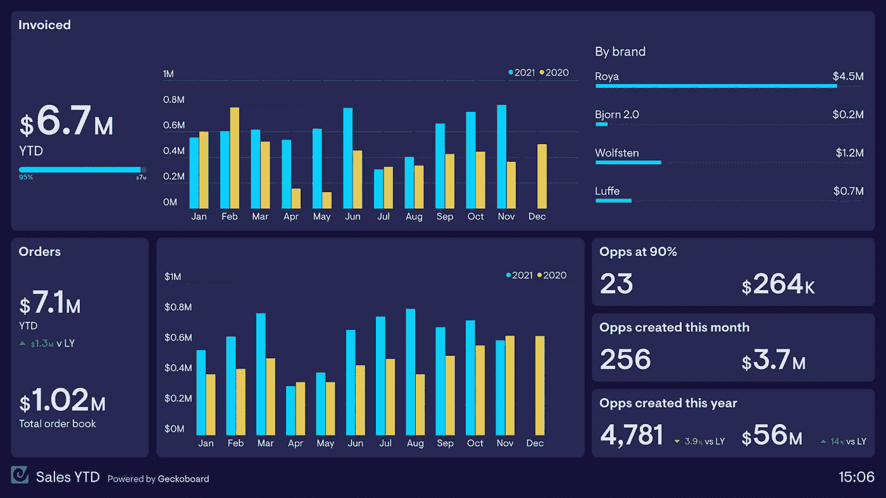

仪表板示例|图片来源:Geckoboard

制作仪表板/可视化时要记住的规则:

1.  有效地使用颜色:虽然颜色让视觉效果看起来很美，但是添加太多的颜色会让人不知所措，会让浏览者感到困惑。所以，**有目的地使用颜色**。
2.  色盲:普通人可以区分红色和绿色，但是色盲的人却不能。所以**避免使用红绿**组合，尝试色盲人士容易接受的不同调色板。比如蓝色和橙色。
3.  易读的字体:可视化的字体应该是观众可读的。在进行可视化时，通常推荐使用像 **sans-serif** 这样的字体。
4.  标签:标签使查看者更容易理解可视化图形。**图表标题**和**轴标签**帮助查看者理解他们正在查看的内容。
5.  轴:在某些情况下，如果要放大数据，可以从高于零的轴开始。但这可能会产生误导，因此建议**从零开始启动轴**。

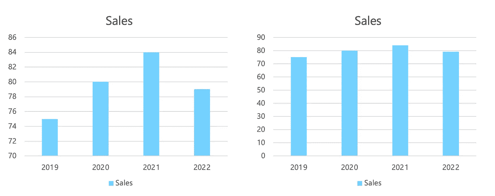

在上面的左图中，我们可以看到这些年来销售额的变化。请注意，轴从 70°开始。
当同一个图表设置坐标轴等于 0 时，那么我们可以看到全年的销售额变化并不多。

仪表板让我们完全了解数据，节省我们大量的时间，并帮助我们轻松理解分析。因此，它们是在一个地方展示我们所有发现的最佳方式。

一些流行且广泛使用的可视化工具有 **Power BI 和 Tableau。**

这里有一些来自 **tableau public** 的美丽可视化链接供你探索

[https://public . tableau . com/views/super store dashboard _ 16709573699130/super store dashboard？:language = en-GB&:display _ count = n&:origin = viz _ share _ link](https://public.tableau.com/views/SuperstoreDashboard_16709573699130/SuperstoreDashboard?:language=en-GB&:display_count=n&:origin=viz_share_link)

[https://public . tableau . com/views/retaildashboard regional comparison/viz？:language = en-GB&:display _ count = n&:origin = viz _ share _ link](https://public.tableau.com/views/RetailDashboardRegionalComparison/viz?:language=en-GB&:display_count=n&:origin=viz_share_link)

您可以使用下面的链接自己探索更多内容:

https://public.tableau.com/app/discover

在最后部分(4)，我们将重点关注数据科学工作流的**步骤— 4(预测)**。

第 1 部分和第 2 部分的链接如下:

 [## 数据科学简介|第 1 部分

### 什么是数据科学？

iamjigyanshu.medium.com](https://iamjigyanshu.medium.com/intro-to-data-science-part-1-6339230aa934)  [## 数据科学简介|第 2 部分

### 本博客关注数据科学工作流程的第一步，即收集数据。

iamjigyanshu.medium.com](https://iamjigyanshu.medium.com/intro-to-data-science-part-2-fe544e2f4a11)