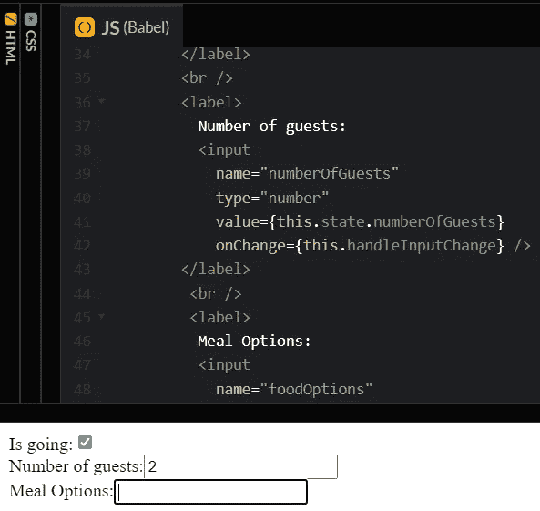
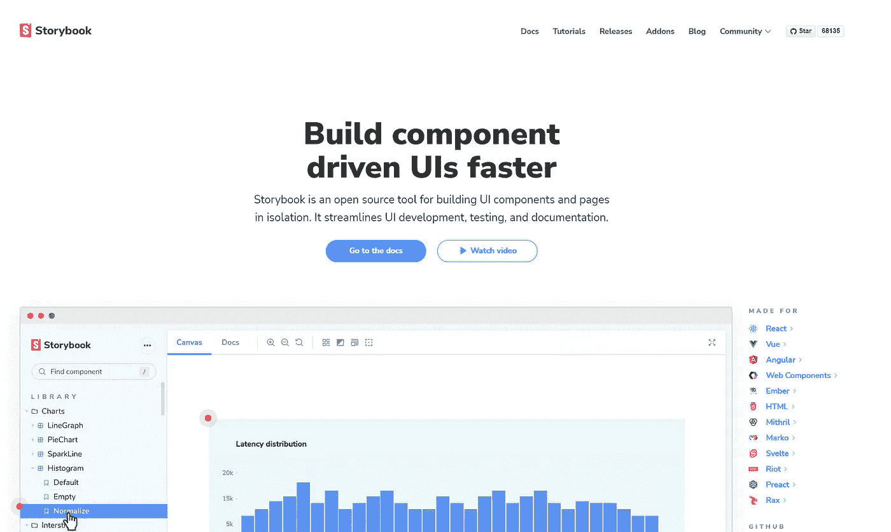
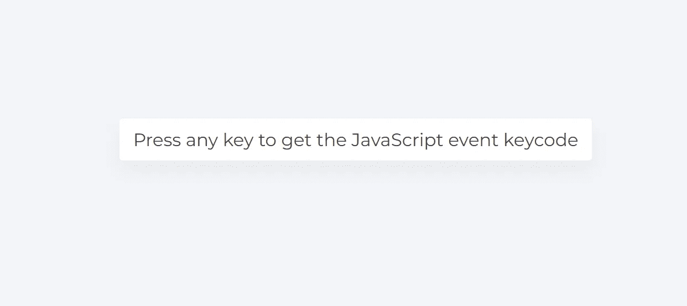
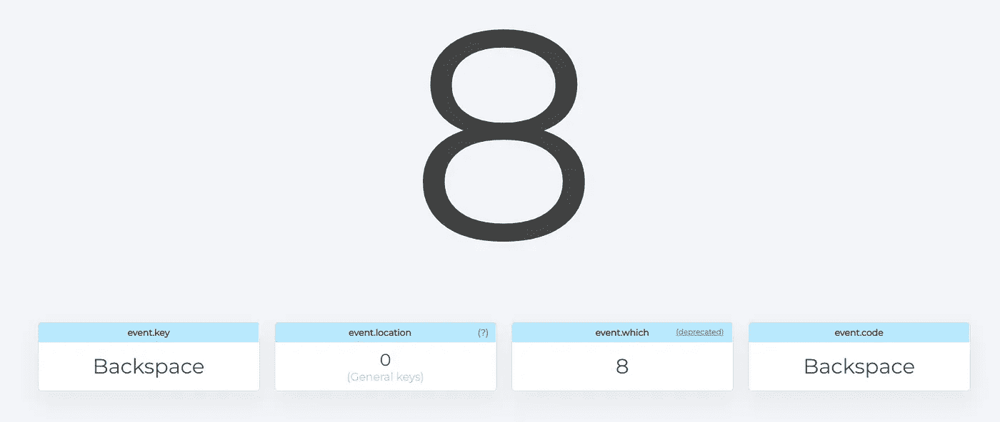
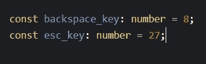
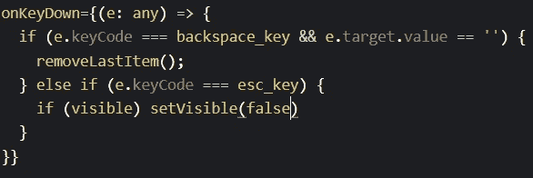

# Javascript 事件键码简介

> 原文：<https://blog.devgenius.io/intro-to-javascript-event-keycodes-91160c642cba?source=collection_archive---------19----------------------->

我最近的任务是为我们的应用程序创建一个使用分层树下拉菜单的表单。创建层次树比实现单列表多选下拉菜单更具挑战性，而且它本身就是一篇文章。然而，本文介绍了 Javascript 事件键码。当我的项目经理希望我们的用户/客户使用退格键删除已经选择的项目时，我遇到了这个概念。

[https://codepen.io/gaearon/pen/wgedvV?editors=0010](https://codepen.io/gaearon/pen/wgedvV?editors=0010)(带附加标签)

已经存在一些具有表单功能的库可供使用。在我们的应用程序中，我们在代码中使用了 Storybook，它有一个多选表单部分。我们的用户界面主要是在需要的时候用故事书导入的。

https://storybook.js.org/

然而，当实现我们的下拉列表时，我们的业务需求需要更多的定制。我们的 QA 团队 total beast 发现退格键在试图从列表中删除所选项目时不起作用。通过访问导入的表单库，我们仍然能够构建功能。这就是当我执行退格键时事件键码进入谷歌搜索的地方。

在现有表单中，backspace 键没有在此库中实现。在研究和阅读找到解决方案后，我发现了两个帮助我实现这个关键的链接。https://developer . Mozilla . org/en-US/docs/Web/API/Document/keydown _ event 和[https://keycode.info/](https://keycode.info/)在这个实现中被大量使用。

Keycode.info 会带你到一个页面，提示你按任意键

[https://keycode.info/](https://keycode.info/)

它将向我们返回一系列数据。例如,“退格”键将返回

[https://keycode.info/](https://keycode.info/)

这将允许我们实现值为 8 的 event.key。然而，干净的代码实践允许我们设置一个新的变量，并将该变量赋值为 8。这将使任何查看我们代码的开发人员更容易理解为什么会有 8。例如，下面的代码有两个新变量。一个用于退格键，一个用于 esc 键命名约定。这是变量应该做的。

现在我们为每个键分配了两个变量，当我们想要使用这些键时，onKeyDown 就是我们包含逻辑的地方。这就是 onChange 的相同逻辑。见下文:

如果有人问为什么我们要给值分配类型，这是因为我们的应用程序使用了 typescript。

当用户与用于处理特定用户输入的按键交互时，onKeyDown 被触发。有多个键盘事件都可以附加到一个 HTML 元素上。以上附在我们的输入元素中。因为我们将变量分配给两个键，所以事件将检查事件字符代码，在我们的例子中是 8 和 27，并且将在单击时触发。

希望这篇文章能让你导航到[https://keycode.info/](https://keycode.info/)，在这里你可以看到每个键所代表的不同值。如果你确实使用了一个表单，请记住，作为开发者，我们可以通过一些研究和测试来创建用户友好的体验。