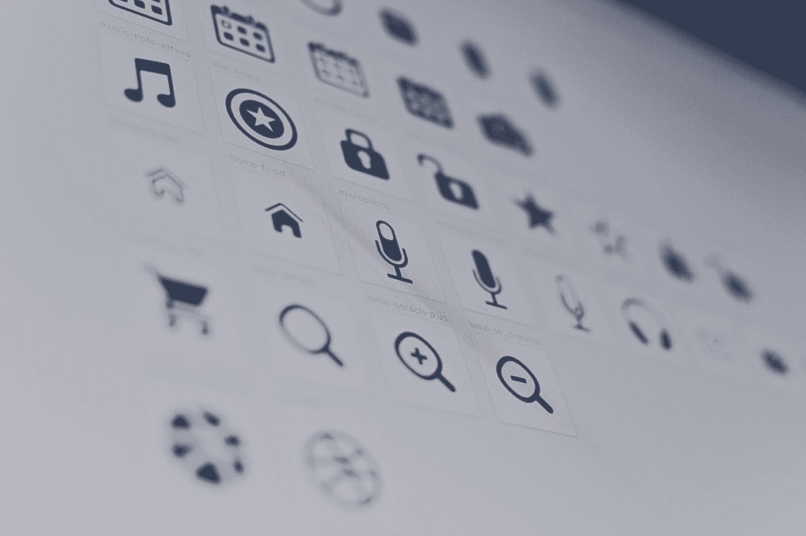

# 材质介绍-用户界面:基本组件

> 原文：<https://blog.devgenius.io/intro-to-material-ui-basic-components-22a9cb178d20?source=collection_archive---------13----------------------->



哈帕尔·辛格在 [Unsplash](https://unsplash.com?utm_source=medium&utm_medium=referral) 上的照片

在我的编程生涯中，我很早就学到了这一点:**即使你的应用程序有惊人的功能，如果它不好看，它也会被更好看的应用程序所掩盖。第一印象很重要，而且会延续到你的项目中。**

如果您正在使用 React， [Material-UI](https://material-ui.com/) 是一个强大的样式库。即使你以前没有使用过 Material-UI，你也可能会认出很多图标和组件，因为 [Material Design](https://material.io/) 是谷歌在 2014 年开发的。安装库后，您可以访问各种组件，您可以根据需要导入和调整这些组件。开箱即用，默认设置是非常干净和有凝聚力的。似乎确实有一点学习曲线——我花了几天的紧张工作才真正掌握它——但我认为最终结果是值得的。

在简要介绍了如何将 Material-UI 导入到项目中之后，我将概述一些最有用的组件。

我喜欢 Material-UI 的一点是他们的文档和例子非常优秀。在文档中，您可以选择调整主要/次要并实时查看样本。


您还可以搜索特定的组件，查看示例代码以及每个组件内置的属性/特性。将组件添加到您的网站就像将示例代码复制/粘贴到您的项目中一样简单。

在开始之前，您需要安装两个库。

首先，您需要导入核心组件。

```
// with npm
npm install @material-ui/core

// with yarn
yarn add @material-ui/core
```

第二(可选)，如果您想要访问材料设计图标，您需要单独导入图标。

```
// with npm
npm install @material-ui/icons

// with yarn
yarn add @material-ui/icons
```

**基本组件**
注意:点击侧面菜单/抽屉，转到“组件”，可以看到完整的组件列表

[应用程序栏](https://material-ui.com/components/app-bar/)
应用程序栏组件是你制作导航条所需要的。下面是他们网站上的一个基本示例(要查看完整代码，您需要点击< >图标)。正如您在这里看到的，他们还导入了一个工具栏和其他嵌套组件，我们稍后会谈到。


[PAPER](https://material-ui.com/components/paper/)
PAPER 组件是给定区域添加背景、轮廓或阴影的简单方法(如下图所示，带有“高度”属性的变体)。


[卡片](https://material-ui.com/components/cards/)
卡片组件类似纸张，但具有更多内置功能。下面的例子使用了 [CardHeader](https://material-ui.com/api/card-header/) (具有默认的字体大小/样式)、 [CardMedia](https://material-ui.com/api/card-media/) (图像、视频)、 [CardContent](https://material-ui.com/api/card-content/) (描述)、 [CardActions](https://material-ui.com/api/card-actions/) 、 [CardActionArea](https://material-ui.com/api/card-action-area/) (当在该区域中单击一个按钮时，整个区域将看起来“被单击”)


[排版](https://material-ui.com/components/typography/)
材质-UI 自带内置主题(可以覆盖)。以下是 variant 属性的变体示例。


[按钮&图标按钮](https://material-ui.com/components/buttons/)
如上图，按钮组件有默认的文本选项。除了纯文本，您还可以导入材质图标用作按钮。这里有几个例子。


网格容器和网格项目在创建其他组件的布局时非常有用。您可以根据屏幕大小选择容器的方向(行/列)、间距和网格项目的默认大小。对于更具体的布局，可以在其他网格容器中嵌套网格容器。Material-UI 网站上有一个非常有用的交互工具，可以让你测试一个网格容器的各种属性。


我希望这能让你对 Material-UI 中的一些可用组件有一个基本的了解，以及如何开始你的旅程。除了尝试使用 Material-UI 文档，我建议仔细阅读这个 [YouTube 系列](https://www.youtube.com/watch?v=pHclLuRolzE&t=60s)，它深入研究了这些组件(以及其他组件)。