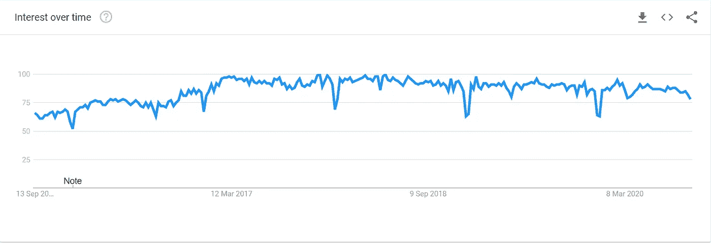

# 介绍 NodeJS 以及为什么需要学习它

> 原文：<https://blog.devgenius.io/intro-to-nodejs-and-why-you-need-to-learn-it-b4b629741a4c?source=collection_archive---------3----------------------->

## 做一个使用 Node 的后端开发者。

约翰·施诺布里奇在 [Unsplash](https://unsplash.com?utm_source=medium&utm_medium=referral) 上的照片

在当前的世界中，开发人员希望拥有几种不同的技能。公司想要多才多艺的开发者，很多开发者都是这样。

需要技能的开发人员有不同的职业道路。例如，Web 开发人员应该知道 HTML、CSS、JavaScript、React、Angular 或 Vue、Nodejs、Expressjs、SQL 或 NoSQL。如果网页开发人员知道 UI/UX，搜索引擎优化，网站维护就更好了。

这不是要打击你的积极性。这项技术正呈指数级增长，也许我们今天使用的技术在两年内就会过时。因此，程序员必须学习各种技术才能脱颖而出。最关键的技能之一是成为一名节点开发人员。你可以称之为后端开发者。

# 我必须学习后端吗？

这取决于你的技能和兴趣。

假设一个开发者知道前端的所有方面，不需要学习后端。

我见过许多前端开发人员和 UI/UX 设计师仅仅靠一项技能就能赚钱。是的，您也听说过全栈开发人员。所以这取决于你，你的欲望，以及一切。

# 为什么使用 Node？

我们可以使用 HTML 和 CSS 很容易地制作一个网站。但是对于一个电子商务网站来说，我们必须管理用户数据、产品细节，甚至更多。

所以，要做一个像电子商务网站，我们必须使用后端。对于后端，Node 是一个很好的选择。它是世界上使用最多的后端语言之一。此外，JavaScript 开发人员可以非常高效地学习它。

Node.js 是一个免费、开源、跨平台的 JavaScript 运行时环境，允许开发人员在浏览器之外编写命令行工具和服务器端脚本。

此外，JavaScript 是目前世界上最流行的语言之一。

# 我们看了很多但是 Node.js 是什么？

根据 [Nodejs 文档](https://nodejs.dev/learn)，Node.js 是一个开源的跨平台的 JavaScript 运行时环境。它几乎是任何项目的流行工具！Node.js 在浏览器之外运行 V8 JavaScript 引擎，这是谷歌 Chrome 的核心。它允许 Node.js 非常高效。

Node.js 是一个运行在服务器上的**开源 JavaScript 运行时环境。Node.js 只有十年的历史，是至关重要的运行时环境之一。它是一个轻量级的开源平台，主要用于开发服务器端的 web 应用程序。我们知道 JavaScript 是一种 Web 语言，Node.js 是一种 JavaScript 运行时环境，这使得它与其他语言相比非常突出。**

# Node.js 最适合于:

*   实时网络应用
*   流媒体应用
*   消息应用
*   聊天程序
*   社交媒体应用
*   虚拟仿真器
*   多人游戏
*   协作工具
*   应用程序接口
*   还有很多。

# 数量庞大的图书馆

2009 年 Node.js 诞生，是 NPM (Node Package Manager)的第一种形式，由于使用了 JavaScript 语言，它成为了全栈 Web 开发者的流行。一年之内，Express 和 socket.io 应运而生，并风靡网络世界。

# 去哪里学？

从新的开始？访问文档。

所以我们脑海中出现的第一个问题就是从哪里学？如果你似乎是一个新的程序员，想要学习任何东西，是的，我的意思是任何与代码相关的东西，你必须钻研它的文档。

没有人比它的文档更能教会你。例如，如果我们想学习 Node，我们会在互联网、Youtube 甚至 Medium 上寻找答案。我们甚至没有找到教我们关于 Node 的一切的好内容，我们只学到了一点点。一知半解总是危险的。

你也可以选择 Freecodecamp、w3schools、Youtube、udemy 等等。

# 为什么只有节点？

> “当前 JavaScript 宇宙中最令人兴奋的单一软件”，Ryan Dahl，软件工程师和 Node.js 的发明者。

根据 Google trends 的说法，Nodejs 是至关重要的 Javascript 运行时环境之一，根据开发人员的兴趣，自从它在全球发布以来，它一直在增长。

**根据 PayScale 的数据，美国 Node.js 的平均薪资从 6.7 万美元到 11.3 万美元不等，平均 10.5 万美元。**

我知道钱不是我们优先考虑的。学习、工作、然后挣钱似乎是一种激情。对我来说，学习和实现 Node.js 是一个巨大的回应。我敢肯定你也会喜欢的。谢谢你阅读它。