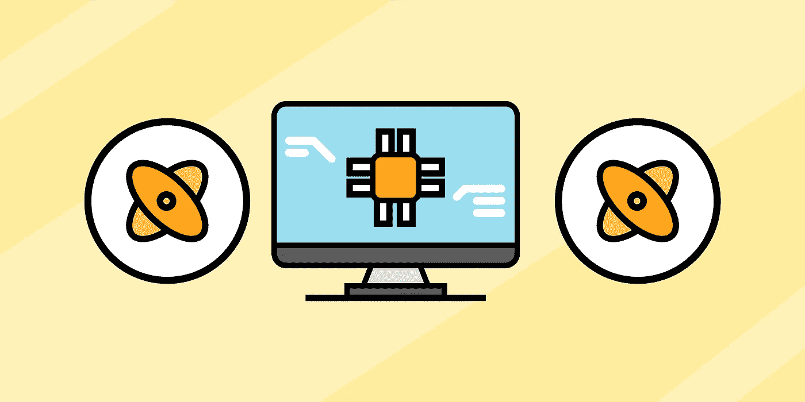

# 量子计算简介:量子位，叠加，等等

> 原文：<https://blog.devgenius.io/intro-to-quantum-computing-qubits-superposition-more-278239e9d1fa?source=collection_archive---------1----------------------->

量子计算是数学、物理和计算机科学的交叉。虽然它现在没有被广泛使用，但它有潜力成为许多不同行业中非常有用的工具。量子计算在许多不同方面优于经典计算，这意味着它可以用来帮助解决某些类型的复杂问题。今天，我们将探索量子计算的一些基本方面，如量子位、量子物理、用例等。

**我们将讲述**:

*   量子计算和量子计算机
*   量子计算机 vs 经典计算机
*   量子位
*   量子物理学的作用
*   量子计算用例
*   总结和后续步骤

# 量子计算和量子计算机

首先，让我们定义一下我们所说的*量子*是什么意思。*量子*这个术语来源于对量子力学的研究，量子力学是物理学的一个领域，在小原子和亚原子尺度上探索自然界的物理性质。它是量子物理学的基础。该领域的大量工作描述了原子、电子和光子等小粒子的行为和意义。

量子计算利用**量子态**的属性，比如纠缠和叠加，来进行计算。IBM、微软、英特尔和谷歌等主要科技公司正在采用和投资量子计算，并开展量子计算研究。关于量子世界，我们还有很多不了解的地方，但是我们知道量子计算有很大的潜力。据我们所知，量子计算机可以保存和处理大量数据，这意味着我们在需要复杂计算的领域有大量的计算能力。

量子计算机是用于执行量子计算的设备。量子计算机拥有量子处理器，可以分离量子粒子，以便对它们进行操纵和研究。有不同的方法来控制这些量子粒子。方法之一是将处理器冷却到冰点。另一种方法是用激光操纵粒子。

# 量子计算机是如何工作的？

量子计算机基于**量子叠加**。叠加允许量子物体同时存在于一个以上的状态或位置。这意味着一个对象可以同时处于两种状态，而仍然是一个对象。这允许我们探索更丰富的状态集合。

量子计算机利用量子比特的纠缠和叠加概率进行运算。这些操作可以被操纵，以使某些概率增加或减少，这导致我们寻找正确和不正确的答案。量子计算机有很大的容量，可以走很多不同的路。

量子计算机由三个主要部分组成:

*   保存量子位的部分
*   将信号传输到量子位的部分
*   能够运行程序并给出指令的经典计算机

如前所述，操纵量子粒子有不同的方式。在一些量子计算机中，保存量子位的部分保持在冷冻温度下，以增强相干性并最小化界面。在其他量子计算机中，保存量子位的部分被放在真空室中，以减少振动并帮助平衡量子位。量子计算机将信号传输到量子位的部分可以使用微波、激光和电压来发送这些信号。

> **什么是量子至上？** *许多参与量子计算的组织都在朝着量子霸权的目标努力。量子优势将展示一种量子设备，它可以解决一个经典计算机无法在可行的时间内解决的问题。虽然目前的量子计算机已经取得了一些惊人的成就，但我们仍然无法证明量子优势对于有用的现实世界的问题。*

# 量子计算机 vs 经典计算机

让我们来探讨一下量子计算机和经典计算机之间的一些主要区别。

*   **信息处理**:传统计算机依赖晶体管，代表二进制 *0* 或 *1* ，而量子计算机使用量子位。量子位遵循叠加原理，可以同时代表 *0* 和 *1* 。
*   **功率**:量子计算机的功率与链接在一起的量子位数量成指数增长。这与经典计算中发生的情况不同。传统计算机的能力随着晶体管数量的增加而线性增加。
*   **应用**:量子计算机更适合复杂的任务，比如优化问题、数据分析处理、模拟等。经典计算机更适合我们的日常处理需求。
*   **积木**:超导量子接口器件(SQUID)或量子晶体管是量子计算机的基本积木。经典计算机使用 CMOS 晶体管。
*   **数据处理**:在量子计算中，数据处理发生在量子处理单元(QPU)中，它由互连的量子位组成。在经典计算中，数据处理发生在中央处理器(CPU)中，CPU 由算术和逻辑单元(ALU、处理器寄存器和控制单元)组成。
*   **信息表示**:经典计算机使用比特，量子计算机使用量子比特。
*   **速度**:量子计算机解决某些问题的速度比传统计算机快上亿倍。例如，2019 年，谷歌的量子计算机在不到 4 分钟的时间内完成了世界上最强大的超级计算机需要 10，000 年才能完成的计算。

# 量子位

一个量子位，或称量子位，可以同时代表零、一或两者。它是量子信息的**基本单位，也是数字信息的最小可能单位。量子信息是量子态的数据。可以使用任何两级量子系统来构建量子位。有许多方法可以建立量子位。与经典计算中的晶体管不同，我们仍然不知道构建量子位的最佳方式。这是量子计算研究的一大焦点。**

我们可以操纵量子位的状态来进行有意义的量子计算。一个量子位可以有**许多不同的状态**。一个关键的方面是所有的量子操作都必须是可逆的。量子逻辑门是对少量量子比特进行操作的基本量子电路。它们是量子电路的构建模块，对量子位进行操作。量子电路由应用于某些量子位的多个量子门组合而成。

# 超导量子位

超导量子计算是量子计算的一种实现。谷歌、IBM、英特尔等公司都在研究超导量子计算。超导量子位具有更快的门速度，并且是固态制造的。它们是最先进的量子位技术，并且是使用现有的半导体技术建造的。

# 量子物理学的作用

现在，我们将进入量子物理的一些方面，以及它们如何在量子计算中发挥作用。

# 量子干涉

量子干涉是叠加的副产品。它允许我们将一个量子位的测量值偏向一个期望的状态或一组状态。记住一个量子位可以是零，也可以是一，或者两者都是，因为叠加。量子位有一定的概率坍缩到零或一，这取决于它们的排列。这个概率是由量子干涉决定的。简而言之，量子干涉允许我们影响一个量子位的状态，从而影响**预期结果**的概率。

# 量子纠缠

量子计算中涉及的量子特性之一叫做纠缠。量子纠缠允许两个或更多的量子粒子纠缠在一起。当这些粒子纠缠在一起时，它们就变成了一个**单一系统**。这意味着纠缠中的所有量子粒子被描述为一个单位。量子纠缠赋予了量子比特更多的计算能力，因为它给系统增加了更多的量子比特。每当我们对一个粒子进行操作时，它也会与其他纠缠的粒子产生关联。

# 量子退相干

量子退相干是量子物理学中**阻碍量子计算进展**的方面。当我们试图观察或测量量子粒子时，它可以坍缩叠加态。这就是所谓的退相干。量子退相干导致量子计算系统中的错误。这使得叠加态很难保持足够长的时间来进行实际有用的计算。

相干长度是指一个量子位可以保持其量子属性的时间量。为了增加这个长度并构建容错量子计算机，我们需要使用量子纠错(QEC)。我们可以利用 QEC 通过校正退相干误差来延长相干长度。

# 量子计算用例

量子计算有许多现实世界的应用。目前的研究人员正在寻找性能优于经典算法的最佳量子算法。虽然在大规模使用量子计算之前，我们还有很长的路要走，但我们已经知道一些领域和行业将受益于量子计算。让我们来看看它的一些潜在应用:

**搜索**

量子算法可以帮助加快非结构化数据搜索的解决方案。

**量子模拟**

量子计算机可以模拟其他量子系统，因为它们的计算中有量子现象。这意味着我们可以模拟更复杂的量子系统，如光合作用和超导。

**优化**

量子计算可以帮助我们解决优化问题。我们可以运行量子优化算法来帮助我们找到更好的方法来管理复杂的系统，如包裹递送和交通流量。

**密码术**

量子密码算法具有破解传统密码密钥的潜力，传统密码密钥目前太复杂，经典计算机无法破解。

**医疗保健**

量子计算有助于改善定价、诊断辅助、成像和精确医疗等方面。

**财务**

量子算法可以帮助加速重要的金融计算，这将有助于我们做出更明智的预测。

**化学与生物工程**

化学和生物工程由量子力学的运动和相互作用组成。模拟量子力学的能力是理查德·费曼建造量子计算机的主要动机之一。量子模拟可以帮助工程师预测新分子的特性，这将有助于我们发现材料和开发药物。

**人工智能**

量子计算可以帮助我们处理非常大量的数据，从而帮助我们在人工智能世界中做出更明智的决策和预测。量子机器学习是一个不断发展的领域，它专注于量子算法如何帮助加快人工智能的工作。

# 总结和后续步骤

祝贺你迈出量子计算的第一步！我们仍处于将量子计算变为现实的早期阶段。还有很多工作和研究要做。虽然量子计算还没有为这个世界做好准备，但它有可能成为许多不同行业的一个非常强大的工具。

我们只讲述了*一些*关于量子计算的基本信息。还有更多的东西需要学习，例如:

*   肖尔算法
*   模拟量子状态
*   量子计算库和框架

*快乐学习！*