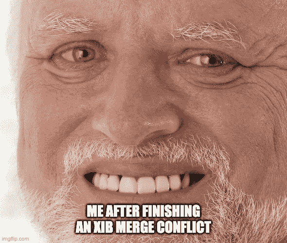
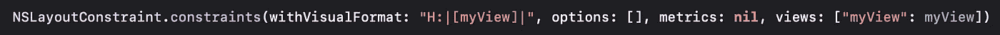
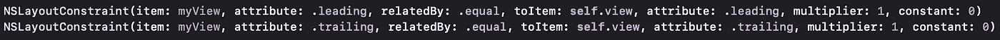
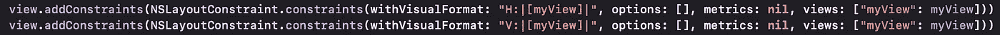
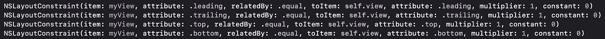
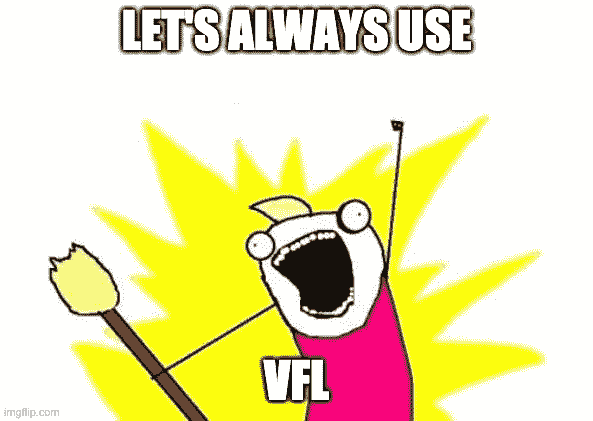
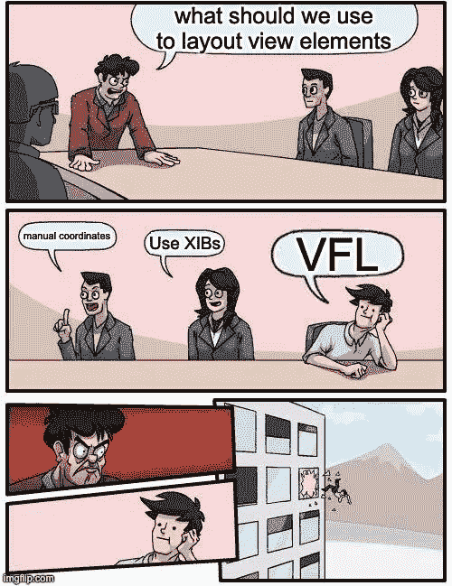
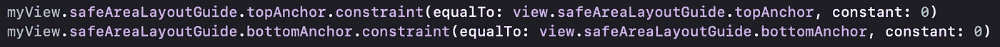
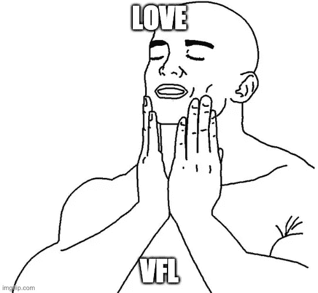

# Swift 可视化格式化语言简介——好的、坏的和 VFL

> 原文：<https://blog.devgenius.io/intro-to-swift-vfl-the-good-the-bad-and-the-vfl-6e59abbe410d?source=collection_archive---------23----------------------->

我记得早在 2008 年我第一次开始 iOS 开发时，我使用的是 xib，当时一片混乱！界面构建器很难使用，而且社区很小。但是，嘿，基本的 ui 很容易实现——只需拖放就可以了。太神奇了。

我在创建应用程序时注意到，你的项目越复杂，UI 创建就变得越困难。使用 Interface Builder，在视图中拖放 UI 元素最终会导致内容重叠。当你试图整理东西时，你可能会拖动一个不同的 UI 元素，导致整个布局混乱。最终，您将得到一个界面构建器 UI，并通过代码调整框架。

旋转手机时必须修改坐标和尺寸变得很麻烦(请注意，这只是一个单一尺寸的设备)。我有没有提到界面构建器在当时是如此的容易出错？我甚至还没有谈到我在与多个开发人员一起修改同一个 Xib 时所面临的问题。合并冲突太可怕了。



由于我在拖放 UI 元素时面临的所有问题，我厌倦了，决定只用代码做所有的事情。起初我认为我做了一个错误的决定，但是在我使用编程式 UI 做了一些应用之后，我更加喜欢它了。您可以很容易地识别视图中的元素，并且对元素有更多的控制权(至少我是这样感觉的)。它还膨胀了 ViewController，这是我愿意做出的牺牲。

那时候，为了布局一个元素，我们必须手动计算它的框架，开发和定位 ui 仍然是可管理的，因为你只有一个屏幕大小——一个屏幕大小🤯


拥有一个单一的屏幕使它变得简单了一些

从编程角度来说，创建 UI 有其优点和缺点，在我看来，优点大于缺点。

我在使用布局约束方面晚了几年。我记得是在 2015 年初，我第一次读到一个关于一个叫做 VFL 的新布局系统的帖子，因为我在管理不同的屏幕尺寸时遇到了困难。我想为什么不试试呢。

**好人**

输入***【VFL】****或* ***可视化格式化语言*** *。*来自[苹果的文档](https://developer.apple.com/library/archive/documentation/UserExperience/Conceptual/AutolayoutPG/ProgrammaticallyCreatingConstraints.html#//apple_ref/doc/uid/TP40010853-CH16-SW1):

> *“可视化格式语言允许你使用类似 ASCII 艺术的字符串来定义你的约束。这提供了约束的可视化描述性表示。*

让我们列出一些使用 VFL 的利与弊。

优点:

*   自动布局使用可视化格式语言将约束打印到控制台；因此，调试消息看起来非常类似于用于创建约束的代码。
*   可视化格式语言允许您使用非常简洁的表达式一次创建多个约束。
*   可视化格式语言允许您仅创建有效的约束。

缺点:

*   某些约束(例如，纵横比、安全区域)无法使用可视化格式语言创建。
*   编译器不会以任何方式验证字符串。您只能通过运行时测试来发现错误。

VFL 约束的一个例子



清单 1-a:如何设置 VFL 约束的例子

让我们把事情分解一下。

为了创建 VFL 约束，我们需要使用

## *nslayoutconstraint . constraints(with visual format:options:metrics:views)*

*返回 NSLayoutConstraints 列表的*类方法。不要和***NSLayoutConstraint(item:attribute:related by:to item:attribute:multiplier:constant)***

这给出了一个约束。

*nslayoutconstraint . constraints(with visual format:options:metrics:views)*

方法有 4 个主要参数:

> **withVisualFormat** :约束的格式规范
> 
> **选项**:描述可视化格式字符串中所有对象的属性和布局方向的选项。
> 
> **metrics** :出现在可视化格式字符串中的常量字典。字典的键必须是视觉格式字符串中使用的字符串值。它们的值必须是`NSNumber`对象。
> 
> **视图**:可视化格式字符串中出现的视图的字典。这些键必须是在可视格式字符串中使用的字符串值，并且这些值必须是视图对象。

这些参数在[苹果文档页面](https://developer.apple.com/documentation/uikit/nslayoutconstraint/1526944-constraints)有详细描述

描述 VFL 的 ASCII 表示形式

```
// Main components of a VFL ascii
// H:|[myView]|**H**          : orientation always followed by a colon(**:**)
**|**-first    : superview's leading
**[<myView>]** : the element we wanted to layout. It is enclosed in brackets
**|**-last     : superview's trailing
```

这个简单的 ASCII 表示被转换成 *NSLayoutConstraints* ，其表示方式如下:



清单 1-b: NSLayoutConstraint 相当于清单 1-a 中的 ascii 表示

我们已经可以看到 VFL 的不同和易用性。可读性得到了提高，更加简洁。

至少对我来说，阅读`H:|[myView]|`比记忆`myView.leading = superview.leading`和`myView.trailing = superview.trailing`更容易

让我们举一个如何使用 VFL 的例子。

如果我们想要一个视图和它的超级视图一样大，那么我们可以在 VFL 中用两行简单的代码实现它。



清单 2-a:使“我的视图”适合其超级视图的简单约束

相当于为所有边实现 NSLayoutConstraints。



清单 2-b: NSLayoutConstraint 相当于清单 2-a 中的 ascii 表示

如果我们使用 NSLayoutConstraint(如我们的示例清单 2-b ),并且我们向视图添加更多的元素，约束管理会变得更加棘手、复杂和难以维护。



一路 VFL！

**坏的**

在我们开始之前，VFL，让我们看看硬币的另一面。让我们谈谈使用 VFL 时可能会遇到的头痛问题。



***首先也是最重要的*** ，在运行应用程序之前，我们无法发现我们是否做了一个糟糕的 VFL 布局。您只会在查看屏幕时遇到错误的 VFL 语法，因为它只在运行时有效😢你马上就会知道这是一个错误，因为它崩溃了。

让我给你举个例子:

```
let’s say you have a view which is very deep in the view stack like 5 click deep (if I were you, I would rethink the UX if it’s that deep)or you need to wait for some special condition before the view appears and on that view you encounter a breakage in your VFL then you need to do it all over again. 
```

***其次*** ，VFL 不考虑器件的凹口。所以处理安全区域需要不同的处理方式。如果我工作的屏幕是在 UINavigationController 或 UITabBarController 中的**而不是**,那么我使用

```
*NSLayoutConstraint(item:attribute:relatedBy:toItem:attribute:multiplier:constant)*
```

来设置我的顶部和底部约束。



清单 3:设置安全的顶部和底部约束(这些还没有激活)

***最后一点*** ，让所有人都不愿使用编程 UI 创建的一点是，它会使视图创建过程变得臃肿。视图中有很多实体意味着有很多约束——如果你已经在使用手动约束，那么你会喜欢 VFL，它肯定会减少你的布局代码。

使用 VFL 可能会有其他的问题，但对我来说，这三件事是让你不爱 VFL 的主要原因。

## VFL

为了举例说明 VFL 的基本用法，让我们创建一个基本的登录屏幕。

登录屏幕将包含以下内容:

*   欢迎标题
*   常规文本字段
*   安全文本字段
*   登录按钮



我就说到这里，让你消化一下。这只是我对 VFL 的介绍。我使用 VFL 已经 5 年多了，我已经学会了如何喜欢它的怪癖，就像有人喜欢 XIB 的怪癖一样🤢

我将为高级 VFL 创建创建另一个内容，包括谓词、优先级、选项等。

完整的代码你可以在这里找到。