# 使用 Swift 和 Xcode 12 的测试驱动开发(TDD)简介

> 原文：<https://blog.devgenius.io/intro-to-test-driven-development-tdd-using-swift-and-xcode-12-f81f048923eb?source=collection_archive---------1----------------------->

## 让你的开发更上一层楼，用单元测试消除你的假设

## 存根->失败->实现->测试/实现/测试直到通过->重构->测试/重构/测试直到通过->重复

难道你不希望在每次修改时都有一种自动化的方法来测试你的代码吗？好消息！你知道。

如果你和我一样，当你开发软件时，你会做很多假设。此外，如果你和我一样，你可能直到最近才意识到，或者你仍然没有意识到。相信我，当我说，“假设你没有做假设是你能做的最糟糕的假设。”

在本文中，我将通过实现一个非常简单的*方法和测试用例，向您介绍测试驱动开发。比方说，我们正在开发一个电子商务应用程序，我们需要设计一种方法来增加购物车中的钱。遵循[单一责任原则](https://en.wikipedia.org/wiki/Single-responsibility_principle)，该方法将*仅*与添加到购物车有关。我们的假装应用程序将有一个假装方法，从购物车中移除资金，稍后由假装开发人员实现🤪*

*假设在这种情况下，编码之神向我们微笑，而我们足够幸运，只能处理整美元。很简单，我们只是把两个数字相加，对吗？伙计，这是有史以来最简单的编码工作！这似乎太容易了。让我们用测试驱动的方式来解决这个问题。*

# *什么是测试驱动开发？*

*在测试驱动开发(TDD)中，想法是编写失败的测试并重构它们，直到它们通过。您应该测试您能想到的每一个假设，尤其是在使用可能随时间变化的第三方框架时。如果您使用一种训练有素的 TDD 方法，它最终会简化您的开发过程，允许您的代码库保持灵活性，因为您可以随意添加和删除功能，知道您的测试在那里以确保一切仍按预期工作。要了解更多信息，[这是一个开始](https://www.agilealliance.org/glossary/tdd/)的好地方。让我们开始吧。*

# *删除您的购物车类*

*开始一个新项目。如果你选中单元测试框，你会得到单元测试和 UI 测试，我们不希望这样，因为它会降低我们的速度——我们现在只是在测试我们的逻辑，所以单元测试是足够的。如果您确实勾选了复选框，那就没问题。您可以移除 UI 测试目标并删除文件夹，或者只是删除所有的测试代码…或者让它在您的其他测试运行时运行，如果您是一个不怕惩罚的人。*

*继续在您的`<ProjectName>`文件夹中创建一个新文件，并将其命名为`Cart.swift`。出于本教程的目的，`Cart`只有一个方法，没有属性。像这样关掉你的`addToCart`方法，让我们继续单元测试！你马上就会明白为什么我们要返回 0。*

*目前只有一种方法*

## *添加单元测试*

*要向项目中添加单元测试，您需要添加一个测试目标。为此，点击项目导航器侧边栏中带有您的项目名称的蓝色图标*

*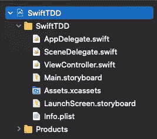*

*确保您选择了蓝色图标，而不是同名的文件夹*

**

*接下来，单击屏幕底部目标列表下的加号按钮。*

*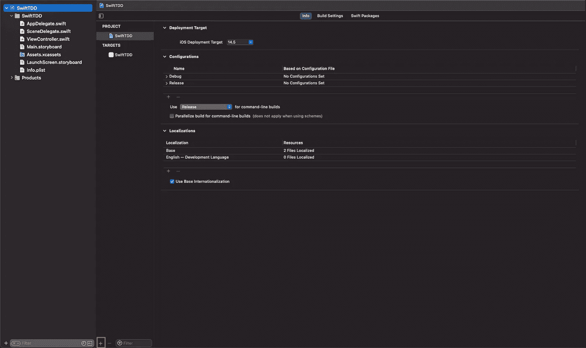*

*很容易错过加号按钮*

*选择`Unit Testing Bundle`。如果您在过滤器框中键入`unit test`，您将得到一个更容易管理的列表(1 个项目！).*

*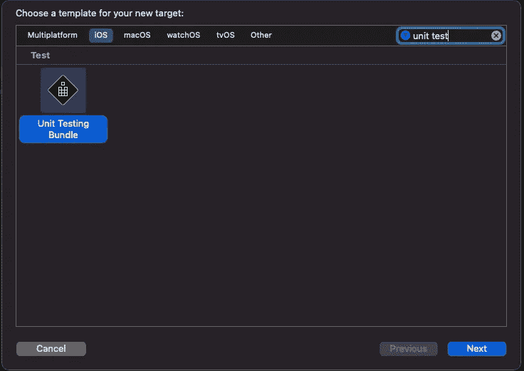*

*只有一个匹配项时更容易找到:)*

*您可以保留默认名称，也可以选择自己的名称。*

*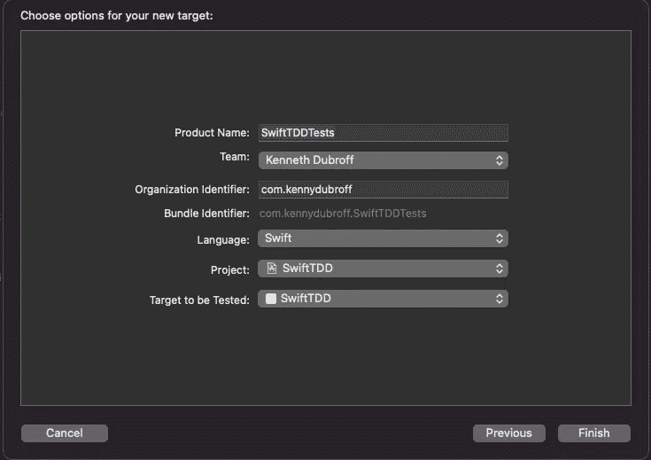*

*你可以点击完成*

*单击 Finish，您就有了一个单元测试包！*

*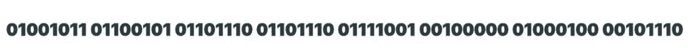*

*接下来，去掉 cruft。单元测试包附带的样板代码中有很多有用的东西，但是我们不会用到它们。您可以去掉除类名和括号之外的所有内容，然后用一个名为`testAddToCheckout()`的函数替换它。*

> *注意:所有的测试方法**必须**以单词 test 开始，以便被认为是与您的测试包一起运行的测试用例。*

*在这个函数中，我们将创建一个被测系统(SUT)。我们的非常简单，但是在将来，您可能会发现自己正在编写一个由不同组件组成的 SUT 来测试您的系统。如果您在函数中键入`let sut = Cart()`，您将得到一个编译器错误:“在作用域中找不到`Cart`”。*

# *存取管理*

*默认情况下，位于独立目标中的单元测试不能访问主模块(或其他目标)中的文件。有几种方法可以解决这个问题。我们将使用简单的方法，因为这是一个介绍。*

*在文件的顶部，您需要导入您的生产模块。如果你只是`import ProjectName`，你会有另一个编译错误。这是因为不同模块中的对象不能相互访问，除非它们被标记为 public。然后，您必须将您希望对其他目标公开的属性和方法标记出来。这是推荐的方法，但也更困难。*

## *@可测试*

*我们可以使用一个特殊的访问器:`@testable`，它使得我们的测试可以“免费”访问我们导入的模块。将它添加到 import 语句和 build 的开头，错误应该会消失。如果没有，尝试清洁和建设。如果它仍然停留在附近，你可能需要重新启动 Xcode…这一点可能有点错误。*

*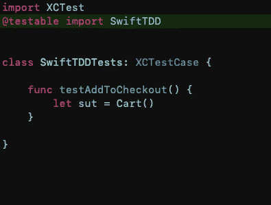*

*@testable 可以节省大量实现时间，但会暴露生产模块中的所有代码*

# *TDD 流程*

## *步骤 1:实现失败的测试*

*这部分绊倒了很多人。为什么我希望测试失败？这些测试的目的难道不是为了证明我的代码有效吗？是的，这是主要目的——证明代码库是有效的。为此，你不能证明你通过了测试，除非你证明你的测试可能会失败。*

*有些人认为这意味着写一个糟糕的测试。对我来说，这实际上意味着编写糟糕的实现代码，比如我们现在所拥有的。如果连一个存根都没有，这似乎是本末倒置。继续执行下面的测试。如果我们在生产中没有返回 0，这个测试就会通过。*

*点击测试名称旁边的菱形或按下`CMD + U`运行所有测试。测试应该像这样失败:*

*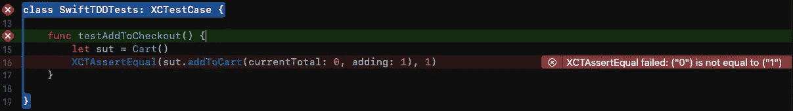*

*万岁失败！*

***XCTAssertEqual？***

*在`XCTest`框架中有许多具有不同用途的断言方法。有一个检查一个值是否为零，一个检查它是否不为零，一个检查相等，一个检查不相等，等等…*

*`XCTAssertEqual`正在检查 2 个变量是否相等。因为 0 不等于 1，所以我们的测试失败了。如果你把这个改成`XCTAssertNotEqual`，测试就通过了。但这不是我们想要测试的。如果你愿意，你可以试一试，但是记住之后要把它调回到`XCTAssertEqual`。*

## *步骤 2:修复您的生产代码*

*跳回到`Cart.swift`并将`addToCart`中的返回改为`return currentTotal + dollars`。*

*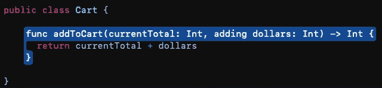*

*把 Int 加到 Int 上，会出什么问题？*

## *步骤 3:运行测试*

*您可以按 cmd + u 来运行所有测试(这是一个需要养成的好习惯),或者返回到您的测试目标并运行单独的测试。不管怎样，现在都应该过去了。如果失败，首先检查您的测试方法，确保逻辑匹配。然后查看您的生产代码(`Cart.swift`)，看看您是否遗漏了什么。*

*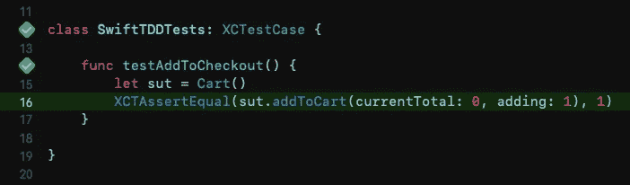*

*好了，通过测试，我们的任务完成了！对吗？*

*恭喜你，一言以蔽之就是 TDD！对于购物车，您甚至拥有 100%的代码覆盖率(这是一个度量您的目标中在测试期间执行的代码行的指标)!…*

*但是你在这里的工作还没有结束。我们实际上什么也没做，只是测试了我们的假设。失败案例呢？*

## *第四步？？继续这个过程，排除假设*

*你问这怎么会失败？我们只是把两个数字相加。*

*如果这是一个应用程序，用户自己设定他们想要为商品支付的价格，然后输入一个负数，会怎么样？或者如果我们的后端团队给了我们一个不好的价格呢？你也许应该为此做个测试…听起来这可能会让你被解雇😬*

*如果我们的购物车中添加了一个负数，我们可能希望显示一个错误或类似的东西。因为想象的能力还没有给我们任何细节，所以现在，如果传入的数字是负数，您可以假设您想要返回购物车被修改之前的总数，并保持不变。*

## *实现失败的测试*

*请记住，这是您希望在产品代码完成后通过的测试。所以假设它会通过就写吧。请注意，在下面的代码中，我改进了这个测试的语义，所以我们的意图更清楚了。稍后，我们将重构第一个测试，并确保它仍然通过。*

*这里您可能注意到的另一件事是函数的命名——这不是标准的 Swift 约定。这是因为我们想清楚地知道当我们运行这个测试时会发生什么，这使得我们的名字占据了很大的空间。也许`shouldFail`是一个糟糕的主意，但是我现在想不出更好的主意了。*

*因为显而易见会让事情变得更长，所以我使用下面的格式`test_actionCamelCased_ resultCamelCased`来提供更多的视觉中断。*

*你看到模式了吗？我们实现了一个失败的测试*

> *注意:虽然这个测试失败了，但是如果你的假设是正确的，并且测试确实通过了，你应该试着通过以一种逻辑的方式打破测试并且看到它失败来进一步证明你的假设。换句话说，你应该总是从两个方面来证明你的假设。*

## *好了，让我们来修正我们的生产代码*

*回到`Cart.swift`，想想如何防止一个负数毁了你的一天。有很多方法。例如:*

1.  *如果你喜欢直截了当，你可以`guard dollars is > 0 else { return currentTotal }`:*

*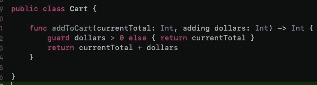*

*2.您可以将传入类型更改为 UInt，因为它不允许负数，编译器甚至不允许。但是，你也不能有效地写一个通过测试:*

*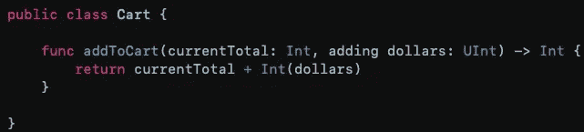*

*当负数传入时，UInt 溢出*

*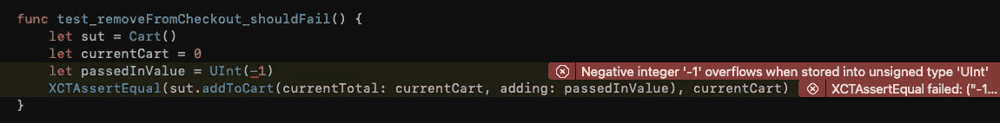*

*这是编译器级别的溢出*

*我选择了 1，因为我更喜欢明确，并且通过语义测试。*

*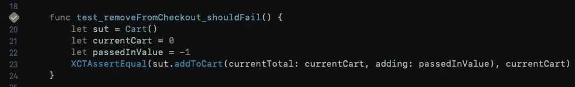*

*假设被打倒了！*

# *重构我们的测试*

*让我们遵循好的原则，重构我们的测试，因为它们已经开始工作了。首先，我不喜欢我前面提到的第一次测试的样子。它使用了神奇的数字，这是代码气味的标志。尽管这是一个非常简单的用例，但是命名变量使得测试中发生的事情和您期望的事情更加清楚。*

*此外，更改测试名称以遵循我前面提到的约定。使用你最清楚的措辞，不要太在意空间。当你在做的时候，继续重命名第二个测试，这样会更清楚一点。*

*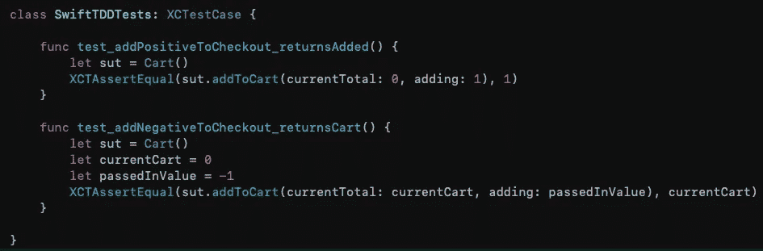*

*这就清楚多了*

*接下来，向第一个测试添加变量。我也决定重新命名我的名字。这应该是一个非常流畅/灵活/柔和的过程。*

*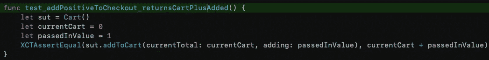*

*添加命名变量和更改上下文的函数名使它变得非常明确。你几乎不需要研究代码就能知道发生了什么*

*重构后，请确保再次运行测试。错误时有发生，这就是测试的目的！现在，每当您重构您的产品代码或添加一个特性时，您都应该运行测试以确保您没有破坏任何现有的特性。*

*尽管如此，我还是不喜欢最终的结果，有很多重复的地方。我们本质上运行相同的测试，但是传入不同的值。听起来像是一个助手方法的例子。我们可以做 SUT，也可以在那里做断言。然后我们只需调用它并传入值，我们的测试根据我们的预期通过或失败！*

*作为参数，我们的助手函数将需要`currentCart: Int, adding: Int`和`expectedEquality: Int`。*

*这几乎是完美的，但我不喜欢我们只是在那里制造一个`Cart`。随着这个代码库的扩展，我们很可能需要增加我们的 SUT。不一定这么快，但为了减少复制的代码，这通常是必要的。这很简单:*

*现在只要把`let sut = Cart()`改成`let sut = makeSUT()`，你就为未来做好了准备。好，现在让我们在测试中使用它。运行它们，它们应该仍然通过。如果没有，回过头来看看需要重构什么。*

## *助手出现冒泡错误*

*最后一部分也是很好的练习。如果您运行您的测试，现在它失败了，我们将在 helper 方法中看到失败。这并不一定能告诉我们测试失败的地方或原因。*

*谢天谢地，`XCTAssert`方法带有`file: StaticString`和`line: UInt`属性。将这些值以气泡的形式传递给调用错误的测试。因此，如果你加上`file: StaticString = #file`和`line: UInt = #line`，并将这些值传递给`XCTAssertEqual`，就会发生这种情况。*

*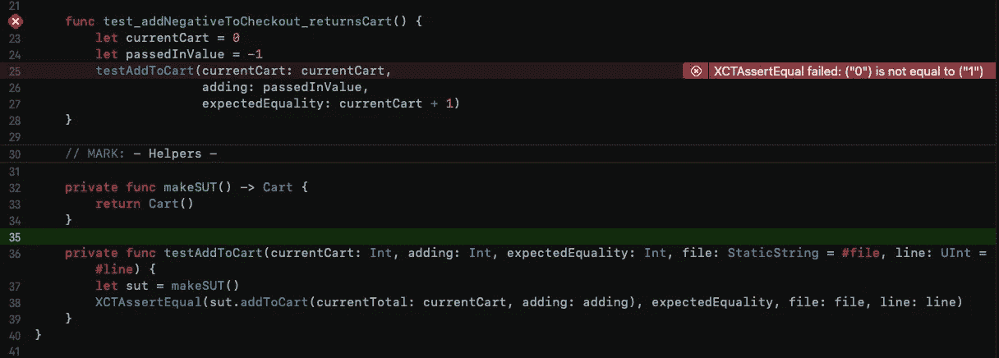*

*错误出现在调用位置*

**

*好了，这就是 Swift/Xcode 中 TDD 的基础。希望通过一点点实践和更多的研究，您能够在日常开发中自如地使用 TDD。在编写可工作和可伸缩的干净代码方面，这真的非常重要。如果你有一个很棒的测试套件，你可以确信新的特性不会破坏现有的。*

*这是最后一个测试类*

*对于你的下一步，你为什么不扩展这些测试？想想现实世界中还有什么东西会坏掉。也许你的公司有最低价格(大多数都有)。也许你有一个最高价格。你如何用 TDD 的方式来解决这些问题呢？*

*如果您遇到困难，请记住每个测试案例的过程:*

> *失败->实现->测试/实现/测试直到通过->重构->测试/重构/测试直到通过->重复*

*评论里见！⏬*