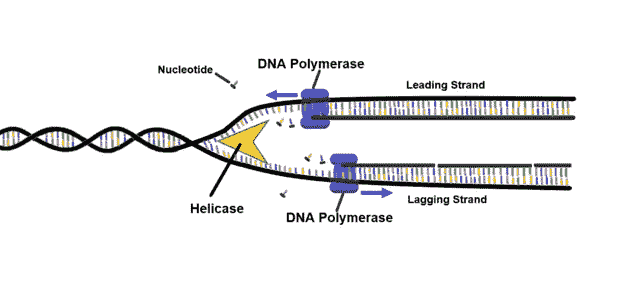

# 介绍 Algen:一个基于 Rust 的遗传算法运行器

> 原文：<https://blog.devgenius.io/introducing-algen-a-rust-based-genetic-algorithm-runner-9acde3bb0bdf?source=collection_archive---------2----------------------->

我想介绍一个我刚刚部署的新库:Algen。实际上它只是一些特征+一个穿风衣的模特，但是这个小库仍然非常强大。在这篇文章中，我将探索如何成功地使用 Algen，并谈到我计划在未来的修订中把它带到哪里。



艺人:[克里斯蒂米勒](https://commons.wikimedia.org/wiki/User:Christinelmiller)

我假设你熟悉遗传算法。如果你想了解更多，这里有一些很好的资源:

*   [遗传算法—维基百科](https://en.wikipedia.org/wiki/Genetic_algorithm)
*   [遗传算法——GeeksforGeeks](https://www.geeksforgeeks.org/genetic-algorithms/)
*   [遗传算法教程(ai-junkie.com)](http://www.ai-junkie.com/ga/intro/gat1.html)

# 源代码

*   板条箱:[https://crates.io/crates/algen](https://crates.io/crates/algen)
*   代码:[https://github.com/SharpCoder/algen](https://github.com/SharpCoder/algen)
*   文档:[algen-Rust(docs . RS)](https://docs.rs/algen/latest/algen/)

# **奔跑者**

从本质上来说，阿尔根是一个遗传算法运行者。如果你给它提供一些 trait 绑定的对象，它将执行以下操作(按顺序):

*   创建初始群体
*   评估群体中的每个解决方案(并行)
*   提取最佳和最差的解决方案(精英策略)
*   使用锦标赛选择来重新组合解决方案，以填充剩余的池(并行)
*   检查获胜条件
*   环

这段代码并不特别值得注意，但它是我过去写了一百万次的东西。我想到，也许它作为图书馆会很好。用这些代码创建一个库的行为鼓励了我对遗传算法架构进行更深思熟虑的设计。Algen 非常通用，所以让我们看看它所期望的一些对象和特征。

# **类型**

跑步者需要三种不同的类型:

*   input type——这是测试数据的形状，每个解决方案都将基于它。
*   OutputType 这是您的解决方案将生成的输出形状。
*   溶液——这是组成溶液的染色体的形状。

除了这些类型，您还需要实现以下特征:

*   算法——这是你的解决方案背后的核心逻辑。它知道如何获取染色体和一些数据，并尝试解决手头的问题。
*   分析器—此模块将评估算法输出并为其分配分数。

一旦实现了这些特征，就可以使用 Algen 了。让我们看一个实现这些东西的真实例子。

# 一个例子

在这个简单的例子中，我们将创建一个非常基本的遗传算法，该算法试图搜索拼出“Hello，world！”所需的正确字符转换。因此，让我们定义几个关键类型:

```
type Unit = i16;
type InputType = [Unit; 13];
type OutputType = String;

#[derive(Clone)]
struct Solution {
    shifts: InputType,
}
```

在 Algen 世界中，我们已经定义了代表我们期望的输入的别名`InputType`。我们的测试数据将是一个随机的 13 个字符的 ascii 字符串。

同样，我们的*解决方案*将是 13 个字符(i16)。这些代表向上或向下移动。

最后，我们算法的输出是一个字符串。

有了这些类型定义，我们就可以开始实现遗传算法本身了。这是我们需要填写的存根:

```
use algen::models::algorithm::Algorithm;
use algen::models::node::Node;
use algen::models::test_parameters::TestParameters;

struct GeneticAlgorithm {}
impl Algorithm<InputType, OutputType, Solution> for GeneticAlgorithm {
    fn allocate_node(&self, params: &TestParameters) -> Node<Solution> {

    }

    fn output(
        &self,
        node: &mut Node<Solution>,
        input: &InputType,
        params: &TestParameters,
    ) -> OutputType {

    }

    fn combine_node(
        &self,
        left: Node<Solution>,
        right: Node<Solution>,
        params: &TestParameters,
    ) -> Node<StringSolution> {

    }

}
```

让我们一次处理一个函数。我们将实现的第一个是`allocate_node`,这是跑步者将如何填充我们的解决方案池。`allocate_node`简单地返回一个随机的解。因为我们正在搜索字符移位，+/- 128(半个字节)应该可以。

```
fn allocate_node(&self, params: &TestParameters) -> Node<Solution> {
      let mut rng = rand::thread_rng();
      let mut solution = Solution { shifts: [0; 13] };

      for idx in 0..13 {
          solution.shifts[idx] = rng.gen_range(-128..128);
      }

      return Node {
          id: 0,
          score: f32::MIN,
          solution: solution,
      };
  }
```

接下来让我们看看尝试解决这个问题是什么样子的。因为我们正在对字节移位进行编码，所以让我们针对输入数据来推断这些移位，以尝试解决这个问题。

```
 fn output(
      &self,
      node: &mut Node<Solution>,
      input: &InputType,
      params: &TestParameters,
  ) -> OutputType {
      let mut output: [u8; 13] = [0; 13];
      for i in 0..13 {
          let byte = input[i] + node.solution.shifts[i];
          if byte < 0 {
              output[i] = (255 - byte) as u8;
          } else if byte > 255 {
              output[i] = (byte - 255) as u8;
          } else {
              output[i] = byte as u8;
          }
      }

      return String::from_str(std::str::from_utf8(&output.to_vec()).unwrap()).unwrap();
  }
```

太好了，现在我们剩下要做的就是探索当两个解结合时算法会做什么。当群体产生新一代时，将调用该方法。在这个例子中，我实现了交叉算法和变异。这些方法的因素来自测试参数。

```
 fn combine_node(
      &self,
      left: Node<Solution>,
      right: Node<Solution>,
      params: &TestParameters,
  ) -> Node<Solution> {
      let mut rng = rand::thread_rng();
      let mut next_solution: InputType = [0; 13];

      for i in 0..13 {
          if rng.gen_bool(params.crossover_factor as f64) {
              next_solution[i] = left.solution.shifts[i];
          } else {
              next_solution[i] = right.solution.shifts[i];
          }

          if rng.gen_bool(params.mutation_factor as f64) {
              next_solution[i] = rng.gen_range(-128..128)
          }
      }

      return Node {
          id: 0,
          score: f32::MIN,
          solution: Solution {
              shifts: next_solution,
          },
      };
  }
```

算法到此为止！接下来让我们探索一下分析器。

为什么分析器是它自己的结构，与算法分开？这背后的原因是，您可能会尝试多种方法来解决同一个问题。将解决方案的评估从安排它的实际代码中分离出来是有意义的。

这个分析器简单地将我们从算法中输出的字符串与`Hello, world!`进行比较，得到的分数就是有多少字符是正确的。

```
use algen::models::analyzer::Analyzer;

struct GeneticAnalyzer {}
impl Analyzer<InputType, OutputType> for GeneticAnalyzer {
    fn evaluate(&self, input: &InputType, output: OutputType, params: &TestParameters) -> f32 {
        let mut score = 0.0;
        let template = b"Hello, world!";
        let output_bytes = output.as_bytes();

        for i in 0..13 {
            if template[i] == output_bytes[i] {
                score += 1.0 / 13.0;
            }
        }

        return score;
    }
}
```

综上所述，我们得到了这个简单的切入点:

```
use algen::run_algorithm;

fn main() {
    let test_data: [Unit; 13] = [0; 13];
    let parameters: TestParameters = TestParameters {
        generations: 1000,
        population: 5000,
        elitism_factor: 0.05,
        crossover_factor: 0.15,
        mutation_factor: 0.02,
        tournament_size: 6,
        feature_flage: Vec::new(),
    };

    let algo = GeneticAlgorithm {};
    let analyzer = GeneticAnalyzer {};

    run_algorithm(
        &parameters,
        test_data,
        algo,
        analyzer,
        Some(after_generation),
    );
}

fn after_generation(output: OutputType) -> bool {
    println!("{output}");

    if output.eq("Hello, world!") {
        return true;
    } else {
        return false;
    }
}
```

就是这样！你现在可以用这个锤子解决一个简单的数学问题，几代之后，你应该会拼写“你好，世界！”

# 接下来去哪里？

虽然这个例子很傻，但我认为遗传算法的通用定义很有价值。runner 非常简单，但是它以并行方式实现了一切，这使得它非常快(与我的其他实现相比)。

还有，是铁锈。

我怀疑我在这里设计的界面可能会有一点变化，但这种感觉应该在库的后续版本中保持不变。

我接下来真正想解决的是遥测技术。我想提出一种机制来报告每个部分的时间，以及报告给定一代人的最佳和最差解决方案。如果有足够的数据输出来创建正在进行的工作的实时可视化，那就太好了。

请在评论中告诉我你的想法！我希望这对其他人有用，我愿意接受改进的建议。我想建立一个伟大的框架来实现简单的遗传算法。