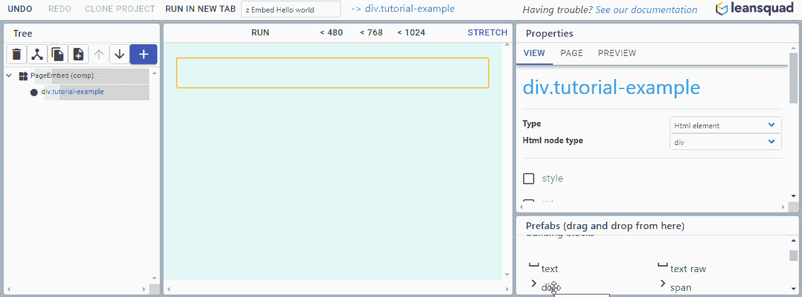
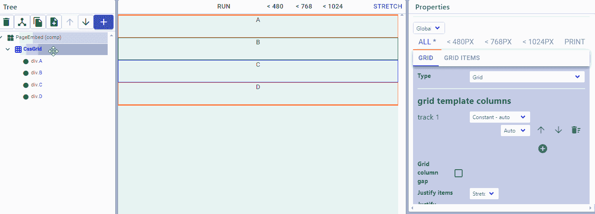
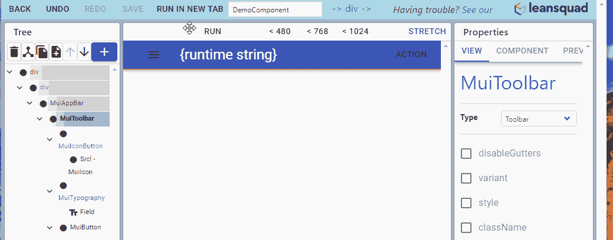
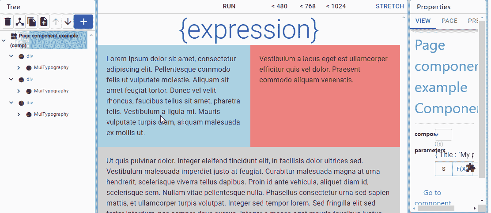
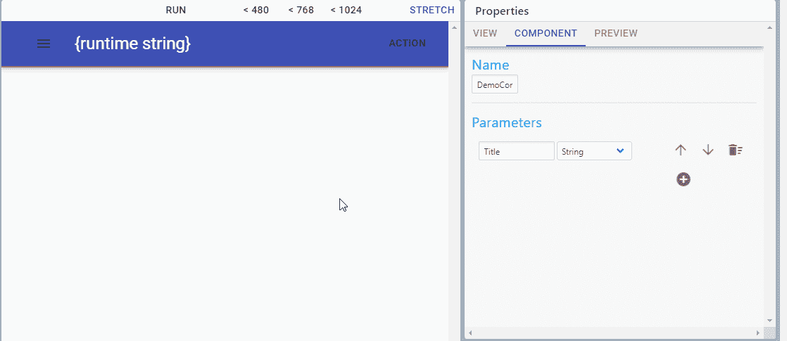
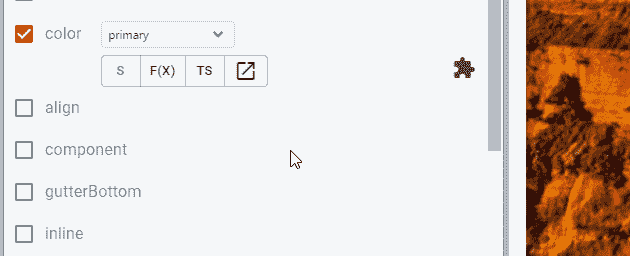
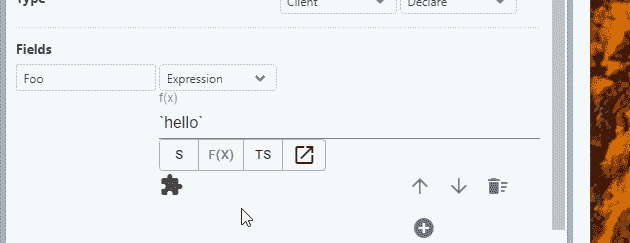

# BIGKit 简介

> 原文：<https://blog.devgenius.io/introducing-bigkit-95dc874ee689?source=collection_archive---------21----------------------->

BIGKit 是一个诞生于挫折的工具。作为一名软件工程师，我花了太多的时间编写数据访问代码、管理 GUI、验证逻辑、序列化和编组代码等。有清晰的模式不断重复出现，但不知何故，每一次似乎都以独特的方式显现，有足够的分歧，所有以前的进步都不可转移。

我个人的观点是，这些问题中有许多是由于可用的工具被定义在太低的抽象层次上。许多这些常见的问题需要访问复杂的库和框架，允许足够的控制成为可能，因此随之而来的是复杂性。

许多现有的高级工具在 CMS/页面生成器和真正的手工开发的应用程序之间架起了一座桥梁，这些工具似乎在某种程度上妥协了。这里很大一部分问题是我们经常从页面编辑器的基础开始，许多更高级的功能，虽然可能，但不被认为是一等公民。

# 那么，什么是 BIGKit？

Bigkit 建立在 [dotnet core](https://dotnet.microsoft.com/) 、 [S.A.F.E](https://safe-stack.github.io/) 栈和 [React](https://reactjs.org/) 之上，试图在以发布为中心的 CMS 和真正的应用程序开发之间架起一座桥梁。它是从头开始构建的，包含了像我这样固执己见的软件工程师对系统构建者的一些核心原则:

*   一个可视化组件和页面生成器(这里没有什么新东西)
*   组件和组合是一级概念。组成的单元(节点)应该是简单的，只做一件事。
*   到处都是分层作用域的类型
*   尽可能进行类型推断
*   能够在任何地方编写和运行代码，而不需要处理文件、构建管道、绑定器、在边界之间编组类型等。代码应该是类型安全的，并允许对 api 的类型化访问，以防止整类令人沮丧的运行时错误。代码应该是一等公民，而不是事后添加的东西。
*   双向数据绑定和更改跟踪
*   默认情况下，一切都是被动的，甚至数据访问代码也是如此
*   用户和用户权限是第一类概念
*   功能原理:不变性，单向流动，表达式无处不在，反应性。
*   通过拥有某种一流的集成重新投影引擎，不必牺牲未来读取性能的横向扩展潜力。我应该不需要参与 Kafka、消息总线、actors 或任何其他基于事件引擎的核心服务器，只需要能够保持两个读取重投影同步。
*   从这一点来看，开箱即用的事件，至少在字段更新增量级别允许审计和数据时间旅行。这当然也可以用于重新投影。
*   一般来说，平凡的可重复任务应该大大减少，或者如果可能的话:不存在，允许开发人员将精力集中在真正的系统或领域问题上，而不是整天推动像素。

# 页面生成器

页面是一种视觉化的终端用户体验，所以从视觉上解决这个问题是有意义的。不必求助于代码来制作页面，可以缩短迭代周期，并允许您立即看到任何更改将如何影响最终结果。

任何 BIGKit 应用程序一般都从页面开始。每个页面由排列在树中的多个节点组成。有许多可用的节点类型，有些只是可视化的(比如文本或网格容器)，有些允许复杂的数据检索。每个节点都有许多可以配置的属性，这些属性将改变相关节点的行为。

网格节点构建在 CSSGrid 之上，允许细粒度的布局控制

能够快速看到应用程序如何响应编辑是很重要的，不幸的是，WYSIWYG 编辑器只能带你到这里。它毕竟是页面的概念表示，所以存在无法可视化的运行时构造。

在运行模式下，应用程序从编辑器订阅更改，从而允许您将更改推入正在执行的预览。这相当于 React 或 Angular 开发人员所说的 [HMR](https://webpack.js.org/guides/hot-module-replacement/) (热模块替换)。这既可以在内嵌预览中工作，也可以跨选项卡工作。

然后，许多页面可以通过导航快速串在一起，进入用户的旅程。因为所有页面实际上都是数据，所以我们可以很容易地开始理解我们的页面在实际系统中是如何组合在一起的(而不是一些必须单独管理的过时文档)。

来自我们 Headroom 客户端的旅行地图示例。通过遍历所有导航节点，我们可以了解您的应用程序是如何组合在一起的

# 成分

相同的 WYSIWYG 编辑器在组件模式中做了一些修改，这是一种构造可重用构建块(如页面布局或菜单栏)的方法。

*目前组件有一些限制，比如不能使用示波器，但目的是及时解除这个限制。*

像页面一样，组件可以接受参数。这些参数可以是原语，也可以是复杂的对象图，可以绑定到整个组件。

组件还可以包含一个或多个呈现占位符，允许您定义区域来呈现相关组件的子组件。

我们的页面组件有 3 个占位符，允许在组件主体的特定点注入子树。

# 探索性测试

尽管我们还没有进行低层次测试的方法，但是很多 UI 工作通常会从更具探索性的方法中受益。为了促进这一点，并在某种程度上受[故事书](https://storybook.js.org/)的启发，我们有了运行案例的概念。

运行案例允许您定义一个案例列表，每个案例都允许对组件或页面的输入参数进行显式配置。然后就可以点击并快速评估各种场景，查看页面/组件的行为。我们目前确实对运行情况下的用户模拟提供了有限的支持，但是在这方面还有很大的扩展潜力。这方面的一些例子包括模仿数据、创建可自动验证的预期等。

# 到处都是类型

“类型”这个词对于开发世界中的许多人来说可能意味着许多事情。我想特别指出的是，这里我们指的是数据的“形状”。当您定义任何数据构造时，它会被赋予一个基于系统期望的数据形状的类型。当类型在表达式中被使用并被传递到应用程序的不同部分时，该类型信息也被传递。这使我们能够推断在应用程序的任何一点上我们可以预期什么样的数据。我们可以验证这一点——例如，传递给实体范围的 id 实际上是一个 id，而不是一个购物清单。

类型还允许我们更好地理解数据是如何被使用的，从而打开了一扇门，让我们可以根据绑定的字段来隐式地计算出实体上应该加载哪些字段，以及其他令人兴奋的事情。

这里，分配给查询的列选择器是由子树中引用该实体的任何表达式推断出来的。

尽管对于类型的绝对值仍有一些争论，但普遍认为类型能够防止所有类型的错误。也有[的经验证据](https://blog.acolyer.org/2017/09/19/to-type-or-not-to-type-quantifying-detectable-bugs-in-javascript/)来支持这一点。

使用类型的部分痛苦在于实现这一点需要额外的仪式。在 Leansquad，我们所有的核心产品都使用 F#,而 [Hindley Milner](https://en.wikipedia.org/wiki/Hindley%E2%80%93Milner_type_system) 类型系统可能是如何正确进行[类型推理](https://fsharpforfunandprofit.com/posts/type-inference/)的主要例子。BIGKit 使用一个更简单的类型推断算法，该算法只支持出站类型推断，但是这对于我们特定的单向流情况来说已经足够了。

*也有可能在真实的类型脚本表达式之间桥接这些类型，反之亦然。我们将在后面的文章中讨论这方面的细节。*

# 部署和开发运维

虽然这仍处于初级阶段，但我们目前可以将整个应用程序部署在某种类似于其他内容发布平台的一键发布的地方。在此基础上，我们正在开发工具，如页面级日志和分析，以帮助管理您部署的应用程序。

这里还有很多工作要做，但是绝对可以节省成本，因为不必管理复杂的构建和部署管道。

# 摘要

感谢您加入我们对 BIGKit 现状的旋风之旅的第一部分。下一次，我们将深入探讨一些更高级的概念，比如输入、处理持久数据、反应性、代码集成等等。加入是在未来几周，我们将进入更多的细节。

我们欢迎您来查看我们的[样品](https://documentation.leansquad.co.uk/demo/hello-world)，[创建一个免费账户](https://www.leansquad.co.uk/)，并给我们您的[反馈](https://request-features.leansquad.co.uk/)！

我们认为，确保软件兑现承诺的最快方法是狗粮。我们的 [*主站点*](https://leansquad.co.uk) *，* [*文档站点*](https://documentation.leansquad.co.uk/) *，* [*功能请求站点*](https://request-features.leansquad.co.uk/) *，以及我们客户的站点***都是完全使用 BIGKit 构建的。**