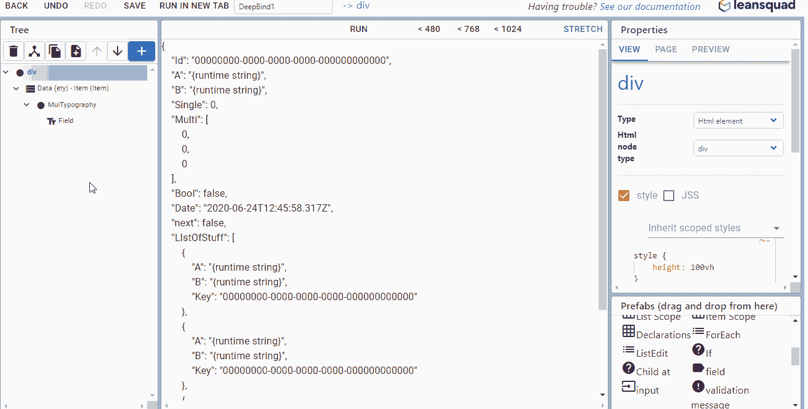
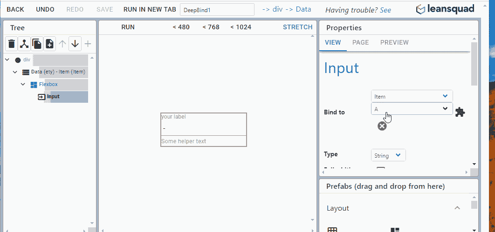
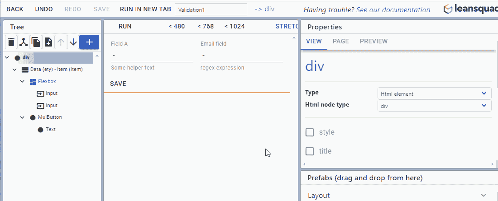
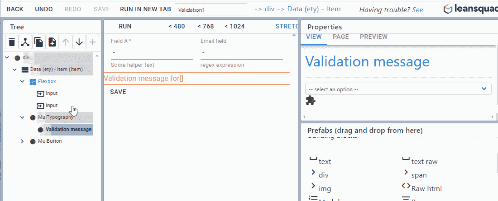
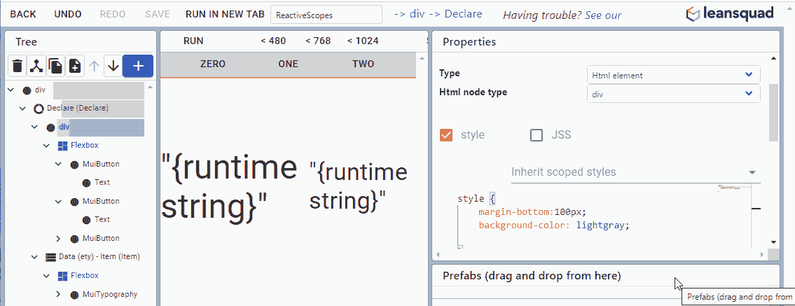

# 介绍 BIGKit 第 2 部分

> 原文：<https://blog.devgenius.io/introducing-bigkit-part-2-8136678c55a9?source=collection_archive---------33----------------------->

[之前](https://medium.com/dev-genius/introducing-bigkit-95dc874ee689)我们讨论了平台的一些基础方面，比如以页面为中心的设计流程。这一次我们将深入研究数据绑定的世界，以及我们的一些高级抽象如何帮助减少一些传统的棘手问题。

# 双向数据绑定

数据绑定并不是一个新概念，向流程中添加双向对称的概念在智能 ORM 的早期就已经存在，例如[实体框架](https://en.wikipedia.org/wiki/Entity_Framework)。实体框架由于其相当独特的在线变更跟踪特性而特别有趣。它的承诺是，您可以用访问内存集合时使用的查询语言读出数据，就地修改数据，然后简单地调用“save ”,您的编辑会神奇地传播回数据库。

不幸的是，像这样的工具总是受到[阻抗不匹配](https://en.wikipedia.org/wiki/Object-relational_impedance_mismatch#:~:text=The%20object%2Drelational%20impedance%20mismatch,oriented%20programming%20language%20or%20style%2C)问题的困扰。当许多应用程序变成无状态的 web 应用程序时，该过程变得更加难以获益，从而从根本上削弱了这种现有的仅服务器端构造连贯地管理变更跟踪的能力。

BIGKit 试图从一个不同的起点重新想象这个概念。应用程序是建立在 Elmish 架构之上的，这里要注意的关键区别是整个模型是不可变的，因此使得任何类型的抽象变更跟踪都不是微不足道的。通常，开发人员可能必须花费合理的时间来解决如何组成[透镜/棱镜](https://medium.com/@gcanti/introduction-to-optics-lenses-and-prisms-3230e73bfcfe)来更新特定字段更新的嵌套状态。如果这个过程是对称的(似乎经常如此)，这可能会令人沮丧，因为每次编辑都必须手动进行。

为了解决这个痛点，我们有效地建立了一个系统，为你的表情建立一个隐含的镜头。结果是，您可以双向绑定到深度图(包含对象/列表等的东西)中的任何跟踪字段，而无需任何仪式。

有了范围内的跟踪数据，使用输入来快速创建带验证的交互式表单就变得很简单了。我们的输入组件构建在奇妙的 [material-ui](https://material-ui.com/) 库之上，并且对绑定的数据类型是上下文敏感的。这为日期、多选、复选框列表等提供了广泛的样式化和带注释的控件。除此之外，您不需要封送更高的类型(如日期)或在字符串之间选择选项，因为所有转换都是双向自动完成的。还内置了节流来减少 UI 变动，并在集成反应式查询范围时平滑用户体验。

传统应用程序框架中认知开销的另一个来源是验证，因为一般来说，规则需要远离消费组件，比如在一个 reducer 上。BIGKit 通过在您期望的输入上直接定义规则来绕过这种间接方式。在幕后，聪明的事情发生了，允许验证规则成为中央变更跟踪系统的一部分。

验证器规则也可以有友好的名称，可以递归地收集整个子树，并显示在摘要中。

最后，当您对修改后的数据感到满意时，您可以发起一个“保存”操作，所有跟踪的更改都将保持不变。虽然我们最终希望在这方面提供更多的控制，但是验证目前只是作为一个入口。

# 一切都是被动的

反应式编程如此成功的原因是这样一个简单的事实，即以这种方式编写的程序更容易推理。在反应式程序中，只有不可变的状态和该状态的函数。举一个具体的例子，这个星球上最成功的应用之一——[Excel](https://www.microsoft.com/en-gb/microsoft-365/excel?SilentAuth=1&wa=wsignin1.0)，本质上确实是一个反应式应用。

在传统的有状态应用程序中，外部动作可以在任何不确定的时间点改变任何其他东西的状态。不可能知道这是什么时候发生的，也不可能知道你应该什么时候重画你的 GUI。如果对该字段的依赖关系发生了变化，应该在什么时候重新计算？深度图呢？框架(像 WPF 和[INotifyPropertyChanged abstraction)](https://gunnarpeipman.com/inotifypropertychanged/)已经在某种程度上让最终用户感到困惑方面取得了进展，但是底线是这是一个非常复杂的来源，并且很难解决错误。

这些年来，抽象已经进化(例如，[击倒可观察的](https://knockoutjs.com/documentation/observables.html)， [Rxjs](https://rxjs-dev.firebaseapp.com/guide/overview) )以允许依赖者理解某些事情已经改变，并相应地“做出反应”。像 [Elmish](https://elmish.github.io/elmish/#:~:text=Elmish%20implements%20core%20abstractions%20that,as%20made%20famous%20by%20Elm.&text=This%20is%20a%20snapshot%20of,as%20an%20immutable%20data%20structure.) 或 [Redux](https://redux.js.org/) 这样的高级架构更进了一步，规定所有的状态计算都由一个中心可观察对象——商店来驱动。无论哪种方式，前提都是相同的，新的状态被输入到系统(或区域/组件)的顶部，其他的一切都被计算为该状态的重新投影，包括视图。我们不再需要担心如何将复杂的输出 A 转换成复杂的输出 B，我们只需要担心如何从输入中计算出输出。

我们采用反应性的概念，并尽可能地应用它。称为作用域的特定数据访问节点可用于从服务器读取(和跟踪)数据。当然，这个过程是异步的，这意味着在您提供查询参数和收到返回的结果之间有一段时间间隔。这在反应式系统中经常是个问题，因为我们的视图渲染功能本质上是一个同步功能，所以你可能不得不处理抽象，比如 promises、 [switchmaps](https://rxjs-dev.firebaseapp.com/api/operators/switchMap) 和 [flatmaps](https://rxjs-dev.firebaseapp.com/api/operators/flatMap) ，或者它们的 UI 库等价物，比如 [async actions。](https://redux.js.org/advanced/async-actions)

BIGKit 通过有效地管理异步组件来解决这个问题，并在准备就绪时向限定了作用域的子树提供完整的值。正在讨论的范围节点可以在子树中呈现一个占位符微调器(意味着您可以只关注快乐的路径)，或者如果您想要更多的控制，它可以将“IsLoading”和“Result”数据直接暴露给嵌套的子树。

这里，Id 由一个限定了作用域的“变量”控制。然后，这被输入到项目范围的 Id 参数中，并用于驱动查询。

作用域也可以接受参数，并且结果被自动存储。这是非常强大的，因为它允许您只关注向作用域提供参数，然后它将决定参数是否是新的组合，因此它是否需要往返服务器。因为结构等式是 BIGKit 体系结构的一个基本租户，这将与任何开箱即用的深度图一起工作，而不必编写特殊的内存化函数。

# 用户是一个一流的概念

今天的许多系统都是以用户为中心的。尽管通常存在用户领域之外的数据结构，但访问控制的焦点通常围绕用户及其各自的角色。

我们为登录提供 [OIDC](https://en.wikipedia.org/wiki/OpenID_Connect) 集成，因此允许您快速连接您的 OIDC 端点。这为低配置方式打开了大门，让您的用户能够通过几个潜在的社交网络帐户中的任何一个，甚至是企业帐户登录。OIDC 配置通常仍然是一个令人沮丧的复杂过程，因为您的客户端和服务器都需要了解端点的上下文，必须正确处理重定向，必须验证返回令牌的签名，并提取任何有意义的信息。尽管这一切仍在幕后进行，但我们觉得我们已经成功地大幅缩减了配置的故事。大多数配置是从元数据端点自动解析的，因此从构建者的角度来看，最少的配置是必需的(目前只需要 2 个选项)。

至于可用的特定提供商，我们在内部使用 [Azure B2C](https://azure.microsoft.com/en-gb/pricing/details/active-directory-b2c/#:~:text=Azure%20Active%20Directory%20B2C%20is,facing%20web%20and%20mobile%20applications.&text=Built%20on%20an%20enterprise%2Dgrade,business%20and%20your%20consumers%20protected.) ，但是有许多很好的选项，如 [Okta](https://www.okta.com/?utm_campaign=search_google_emea_uki_ao_it_branded-okta_exact&utm_medium=cpc&utm_source=google&utm_term=okta&utm_page={url}&gclid=Cj0KCQjw0Mb3BRCaARIsAPSNGpW5mBi0UqhW1N-LEiQv9Zos9uCCBCRrZlXfB2Qb-Cd3mpSj-WyqQzIaAo4TEALw_wcB) 或 [Auth0](https://auth0.com/) ，它们都可以与 BIGKit 一起工作。根据用户需求，我们可能会在未来重新审视这一点，通过拥有我们自己的内部托管 OIDC 端点来提供更好的集成体验。

连接 OIDC 提供商后，您可以通过启用“要求身份”复选框来控制对页面的访问。还可以在租户级别定义角色，这也可以用作页面访问的额外过滤器。我们还有一个构建级的用户访问管理区域来为每个用户配置这些角色，尽管这也可以通过编程来完成。

# 访问控制

围绕这些角色，还可以限制数据读写权限(逐个字段)。我们有一个“实体所有者”的概念，因此允许一个用户独占某一部分数据，同时让其他方有更多的有限访问权。

页面本身也可以使用相同的机制进行约束，允许某些区域只对特定用户可用。

登录的用户标识和相关的元数据也可以在任何地方进行编程访问，并自动添加到事件和日志中。

# 摘要

感谢您加入我们 BIGKit 现状之旅的第二部分。下一次我们将深入探讨代码扩展点和 typescript 集成。

我们欢迎您来查看我们的[样品](https://documentation.leansquad.co.uk/demo/hello-world)，[创建一个免费账户](https://www.leansquad.co.uk/)，并给我们您的[反馈](https://request-features.leansquad.co.uk/)！