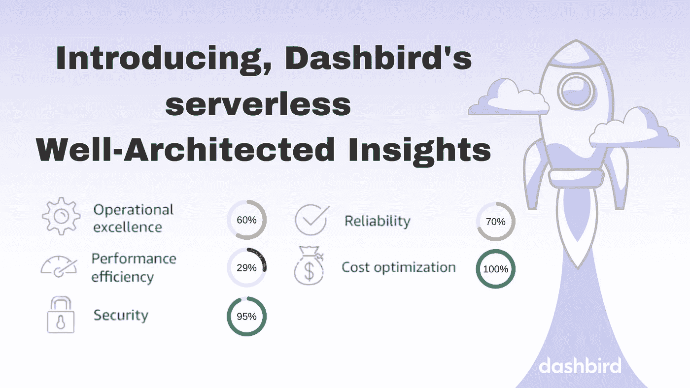
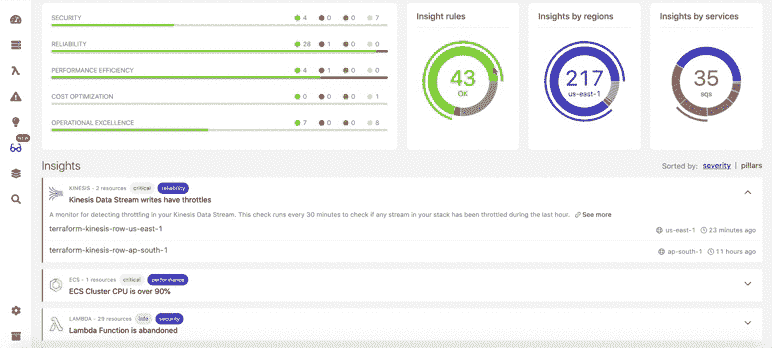

# 简介:Dashbird 的无服务器、架构良好的 Insights 功能

> 原文：<https://blog.devgenius.io/introducing-dashbirds-serverless-well-architected-insights-feature-463603cf674a?source=collection_archive---------5----------------------->

现在，Dashbird 会扫描您的无服务器基础设施，寻找行业最佳实践。这是混乱的解药。

我们很高兴推出**dash bird Well-Architected Insights**—一款结合了良好架构报告的持续洞察扫描仪。新特性为无服务器开发人员提供了**见解和建议**到**持续改进他们的应用**和**保持他们的安全性、合规性、优化性和高效性**。

Dashbird 已经为其用户保存了所有数据，作为一个具有故障检测功能的端到端可观察性平台，在此基础上构建下一个抽象层是合乎逻辑的下一步，几乎就像一个**受信任的顾问，持续监督应用程序的姿态和状态。**

在过去的三年里，我们已经与数千家公司合作，在云中构建无服务器应用，帮助他们更好地扩展和运营他们的在线服务。在我们任职期间，我们已经观察到，随着云应用程序**日益复杂**，管理安全性、成本和性能、、遵守最佳实践以及保持环境态势变得越来越困难**。**

这些挑战的原因有两个:基础设施中的大量移动部件和跨工程团队的最佳实践知识的缺乏。

# 深深植根于社区知识和架构良好的框架

受 AWS 架构良好的框架 的 [**最佳实践的启发，Dashbird 不断地针对用户的无服务器基础设施运行 **80 项检查**，就如何**改进他们的应用**向他们提供**可行的建议**，以便**在其五大支柱中的每一个支柱中与架构良好的最佳实践**保持一致:**](https://dashbird.io/blog/building-complex-well-architected-serverless-architectures/)

*   成本优化
*   安全性
*   可靠性
*   性能优化
*   卓越运营

检查的性质**涵盖从检测指标异常**到**配置设置**和**状态**，例如未使用的资源或缺乏安全措施。

检查按**关键程度和垂直**分类，为用户提供调查结果的结构化概览和单一控制台的清晰概览。

所有的检查都在事件库中[发布，详细描述了时间间隔、条件、推理以及一些见解和补救步骤。](https://dashbird.io/event-library)

# 在单一控制台报告中即时发现云堆栈中风险高、效率低的部分

当扫描器在 AWS Lambda、API Gateway、DynamoDB、ECS、Step-Functions、SQS、Kinesis 流中发现**错误配置**、**违反最佳实践**、**低效或有问题的资源**时，它会将其汇总到一个报告中。

对于每个检测到的细节，用户还会看到问题的解释和故障排除的逐步指南。

该报告按照架构良好的框架的五大支柱 T11 进行细分，在进度条 T12 上向您显示每个支柱的进展情况，以及按照地区和服务对资源进行细分的情况，让您清楚地了解您在哪个地区或服务中遇到的问题最多。此外，您可以看到详细列出的所有可扩展事件，以及您在使用时遇到困难的**确切资源。**

Dashbird 不断对您的系统运行的所有检查的结果:其中有多少成功通过，有多少是关键的，您应该关注什么。

# 用知识武装团队，消除繁重的工作

当与我们的用户一起测试早期版本的报告时，我们看到团队内部的**知识显著增加**，工程师变得越来越**了解他们的应用程序的状态**和**如何构建无服务器产品**。

完成**架构良好的白皮书**并在组织内部消化它们需要付出大量的努力。因此，推出这一新功能的主要原因之一是**将知识分解成小块**以使其尽可能容易理解**并且**通过做**来学习无服务器最佳实践。我们已经看到，这在各个领域对我们的用户群进行了培训，有助于提高安全性、可靠性和合规性。**

用户体验到的另一个好处是**手动任务的减少** —在拥有数百甚至数千资源的复杂云环境中，检查每个资源的指标、日志、配置和工作情况是一个**巨大的挑战**并且经常**问题被忽视**。在许多情况下，开发人员也很难**检测到浪费或潜在威胁**，这使得以短时间间隔运行的**自动检查**变得至关重要。

# 良好架构的重要性和好处:

1.  **更快地构建和部署可靠的系统**

通常，客户从实验开始，工作负载往往会随着增加而自然发展。在这个成长过程中，偏离最佳实践是很常见的。因此，将您已经拥有的东西与行业最佳实践结合起来以确保更快的部署和更好的安全状况非常重要。

1.  **降低或减轻风险**

风险跨越架构完善的框架的所有五个支柱(可靠性、性能、卓越运营、成本和安全性)，持续优化您的系统以获得最佳性能将在一段时间内降低或减轻风险。对于无服务器用户来说，不知道他们的风险状况是什么是很常见的，这对于开始询问“我们在我们的风险状况中处于什么位置”的 C 级用户来说是一个很大的担忧以及“我们如何在 6-12 个月的时间内减少这种情况？”

1.  **做出明智的决策**

跟踪系统的活动、运行状况、性能、成本和其他关键指标，可以实现数据驱动的决策制定。了解基础设施的变化如何影响系统面向客户的属性至关重要。**这也是 Dashbird 功能的核心。**

1.  **了解 AWS 最佳实践**

我们发现最快乐的无服务器用户是那些感觉受过良好教育的人。通过灌输最终鼓励无服务器的最佳实践，Dashbird 良好架构的见解是一种简单的方法，可以通过实践不断了解如何构建真正有弹性的无服务器基础架构，而不必花费数小时或数天时间阅读冗长的白皮书。

# Dashbird 是市场上领先的无服务器监控平台

Dashbird 成立于三年前，是一个端到端监控平台，用于调试、故障排除、监控和优化无服务器应用程序。到目前为止，该平台已经吸引了成千上万的无服务器爱好者，并被依赖无服务器的领先企业所采用。该平台是市场上唯一完全无摩擦的服务，完全依赖于系统的输出，不需要任何代码工具。客户喜欢 **2 分钟的设置过程**，直观的用户界面和预建的警报和洞察力；并且能够在[注册](https://dashbird.io/register/)后立即开始调试和处理他们的数据。