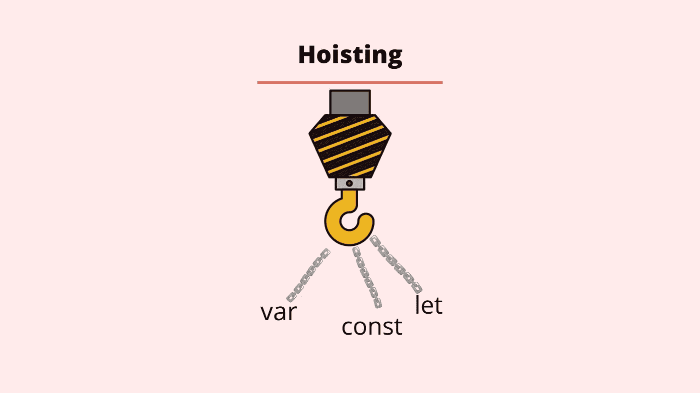
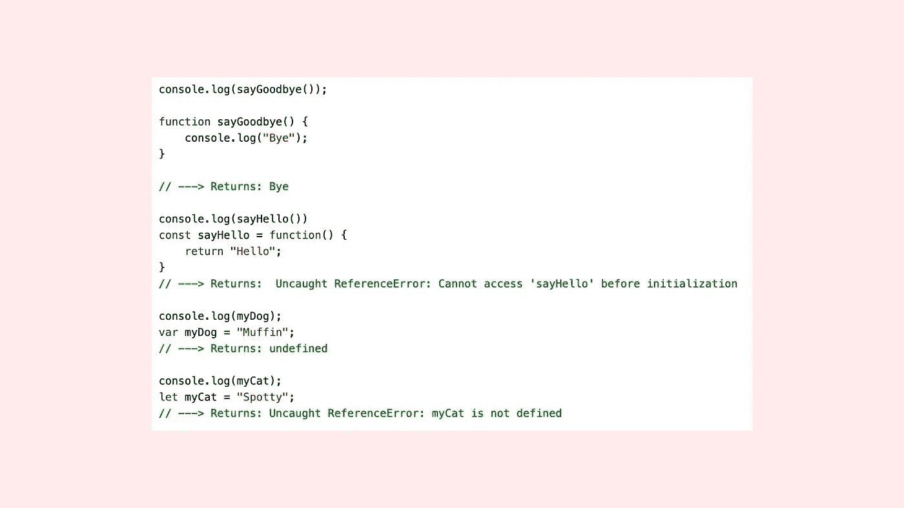

# JavaScript 中的提升简介

> 原文：<https://blog.devgenius.io/introducing-hoisting-in-javascript-922faf4b37c9?source=collection_archive---------8----------------------->



**介绍吊装**

当我们在英语中使用“提升”这个词时，我们描述的是举起或拉起某物的动作。我们可以说一面旗帜被悬挂在建筑物上，或者一辆汽车被吊出了河。

JavaScript 中的提升描述了在代码执行之前，变量和函数声明(名称)何时被提升或提升到其局部范围的顶部。实际上没有代码被移动，但这是 JavaScript 编译器读取代码的方式。让我们先看一个基本的例子。

```
console.log(myDog);
var myDog = "Muffin";//Returns ---> undefined
```

在上面的例子中，我们首先使用控制台日志来记录我们还没有创建的变量。接下来，我们声明这个名为 *myDog* 的变量，并将字符串 *Muffin* 赋值。当代码执行(运行)时，返回*未定义的*。

提升是我们在运行这段代码时没有得到错误的原因。JavaScript 解释器将变量创建的声明(var myDog)和赋值(= "Muffin)阶段分开。在代码执行之前，声明部分被提升到当前作用域的顶部，并被初始赋值为 *undefined* 。这意味着 *myDog* 变量可以在初始化之前使用。

## let 和 const 呢？

我们已经看了一个用 *var* 声明变量的例子，现在我们来看看用 *let* 或 *const* 声明变量会发生什么。当你用 *let* 或 *const* 声明一个变量时，变量实际上仍然是被提升的。然而，不同之处在于，当我们使用 *var* 时，声明最初被赋值为 undefined，直到我们定义的赋值所在的行出现。此时，变量被赋予我们所赋予的值。

用*让*变量最初不赋值。如果我们使用 let 重复上面的例子，我们可以看到一个这样的例子。

```
console.log(myDog);
let myDog = "Muffin";//Returns ---> Uncaught ReferenceError: myDog is not defined
    at <anonymous>:1:13
```

在上面的例子中，我们控制台记录了 *myDog* 变量，然后我们声明并给这个变量赋值 string *Muffin* 。

这一次，当代码运行时，声明(let myDog)被编译器提升到作用域的顶部，但是变量最初是未初始化的，这与 var 不同，var 最初是用 undefined 初始化的。当代码执行(运行)时，控制台日志发生在我们给变量赋值之前，所以我们得到上面的引用错误。用 const 声明变量也是同样的方式。

这种情况背后的原因被称为*时间死区*。*暂时死区*描述了变量不能使用的暂时不活动状态。

这是因为 JavaScript 在执行代码之前会编译代码。如果你在超市收银台，你处于一种中间状态，在你整理好所有的杂货后，你可能会在家里准备好空间。但是，你还没有拥有它们，所以在你完成超市的结账阶段之前，你不能实际使用它们。让我们以一些最后的例子来结束。



我希望你喜欢这篇文章，请随时发表任何意见，问题或反馈，并关注我的更多内容！