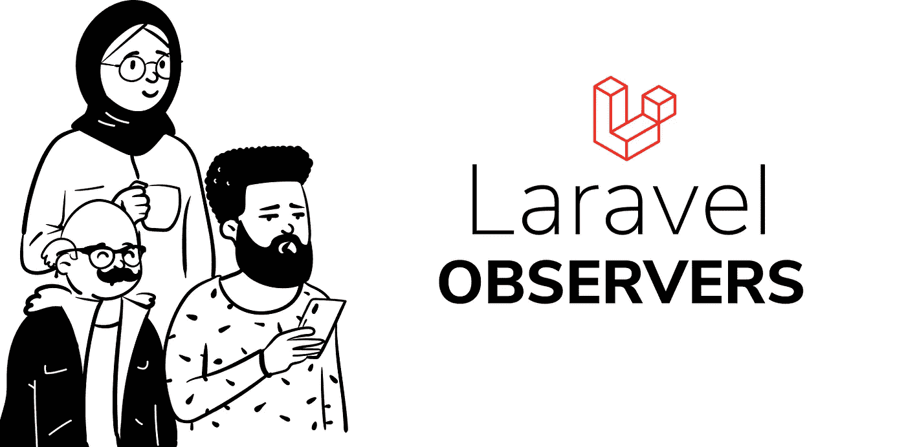

# 介绍拉弗尔观察员。

> 原文：<https://blog.devgenius.io/introducing-laravel-observers-8f0198c6c9c?source=collection_archive---------0----------------------->



拉勒韦尔观察家报

Laravel 框架有很多令人敬畏的特性，对我来说最突出的是模型**观察者**。

根据 Laravel 框架的文档:

> 如果您正在监听一个给定模型上的许多事件，您可以使用观察器将所有的监听器分组到一个类中。观察者类的方法名反映了你希望听到的有说服力的事件。这些方法都将模型作为唯一的参数。Artisan 命令是创建一个新的观察者类的最简单的方法。

observers 帮助我清理我的控制器中的清理代码，我可能必须在创建模型事件之前或之后运行这些代码，它还为我提供了一种方法来插入模型事件的生命周期，并运行我认为合适的任何逻辑。

可以观察到的模型事件分布在模型的 CRUD 中，包括:

*   恢复
*   创造
*   创造
*   更新
*   更新
*   节约
*   获救的
*   删除
*   删除
*   恢复
*   修复

对于 Laravel 框架中的每个模型和附加到它的业务逻辑，都可以观察到上述事件，您还可以从观察器调度定制事件，并从应用程序的其他部分监听它。

你可能还没有看到自己使用 observer 类，这很好，对它有一定的了解也很好。

在此之前，要创建一个观察者类，运行:

> php 工匠制作:观察者<observername></observername>
> 
> (用您正在观察的模型的名称替换 observerName)。

这将在您的应用程序的 app 目录中创建一个名为*观察者*的文件夹，并存储观察者类。

```
<?php

namespace App\Observers;

class BankObserver
{
    // an empty observer class
}
```

在这里，您可以使用与我前面列出的事件相匹配的方法来填充类，值得注意的是，您可以在创建观察器时将模型附加到观察器，就像:

> php 工匠制作:观察者 <observername>-m=<modelname></modelname></observername>

这将创建一个默认填充了一些方法的类，如下所示。

```
<?php

namespace App\Observers;

use App\Task;

class Task
{
    */**
     * Handle the task "created" event.
     *
     ** ***@param*** *\App\Task  $task
     ** ***@return*** *void
     */* public function created(Task $task)
    {
        //
    }

    */**
     * Handle the task "updated" event.
     *
     ** ***@param*** *\App\Task  $task
     ** ***@return*** *void
     */* public function updated(Task $task)
    {
        //
    }

    */**
     * Handle the task "deleted" event.
     *
     ** ***@param*** *\App\Task  $task
     ** ***@return*** *void
     */* public function deleted(Task $task)
    {
        //
    }

    */**
     * Handle the task "restored" event.
     *
     ** ***@param*** *\App\Task  $task
     ** ***@return*** *void
     */* public function restored(Task $task)
    {
        //
    }

    */**
     * Handle the task "force deleted" event.
     *
     ** ***@param*** *\App\Task  $task
     ** ***@return*** *void
     */* public function forceDeleted(Task $task)
    {
        //
    }
}
```

您可能想知道什么样的模型动作触发什么样的观察者动作，我将简要解释不同的方法以及触发它们的原因。

*   retrieved-当从数据库中检索模型记录时，调用此观察器方法。

> model::findOrFail($ id)；//这会触发 observer 类中检索到的方法

*   creating——当模型记录处于创建过程中且尚未存储到数据库中时，会调用此观察器方法，这是在为模型生成 id 和默认时间戳之前，此时您可以动态检查缺失的列并为其分配默认值。
*   created-在成功创建模型记录后调用此 observer 方法。如果在创建过程中出现错误，比如说缺少列数据，这个方法就不会被调用。

> model::create([])；//这将首先触发创建方法，然后触发 observer 类中的创建方法。

*   更新-当模型记录处于更新过程中时，调用此观察器方法，此时，更新尚未持久化到数据库中。
*   updated-在模型记录成功更新后调用此 observer 方法。如果在更新过程中出现错误，这个方法不会被调用。

> 模型::更新([])；//这将首先触发创建方法，然后触发 observer 类中的创建方法。

*   保存和保存-这些模型观察器方法可能看起来有点像瑞士军刀，它在任何需要将数据持久化到数据库的事件之前和之后被调用，因此如果您正在创建一个新的模型记录，保存方法首先运行，然后是创建方法，然后是创建的方法，最后是保存的方法，在更新模型时应用相同的例程，保存，更新，更新，保存。
*   删除-当模型记录处于删除过程中时，调用此观察器方法，此时，记录尚未从数据库中删除，使用其 id 从数据库中检索它将返回适当的数据。
*   deleted-在成功删除模型记录后调用此 observer 方法，此时，该记录已从数据库中删除。

> model::destroy($ id)；

*   恢复和已恢复-当已删除的模型记录被恢复(使用软删除实现)时，调用这些观察器方法

**重要注意事项:**

*   updating 和 updated 方法仅在更新更改数据库中模型的列时运行，因此，如果更新请求没有影响更改，则不会触发 updating 和 updated 观察器，只会触发 saving 和 saved 方法。
*   当恢复一个被删除的记录时，一系列的方法一个接一个地被触发，检索，恢复，保存，更新，更新，保存，然后恢复。

在任何情况下，如果您想创建一个模型事件而不触发任何观察器方法，您可以保存它而不包含观察器事件。在不触发任何事件的情况下创建模型时使用的方法示例:

```
public function saveQuietly(array $options = [])
{
    return static::*withoutEvents*(function () use ($options) {
        return $this->save($options);
    });
}Note: This method should be added in the respective model.
```

如有必要，您可以重构它以适应其他模型事件。

最后，最后一部分，将观察者绑定到一个特定的模型。

这可以在 AppServiceProvider 的类的 boot 方法中完成:

```
*/**
 * Bootstrap any application services.
 *
 ** ***@return*** *void
 */* public function boot()
{
    Model::*observe*(Observer::class);
}Model is the model to be observed and observer is the observer class
```

对 Laravel 观察者的介绍到此结束，希望对您有所启发。

> 在推特上关注我:【https://twitter.com/drumzminister 
> 
> 韩语版:【https://laravel-semipro.tistory.com/6[翻译](https://laravel-semipro.tistory.com/6)https://twitter.com/rzip84[翻译](https://twitter.com/rzip84)