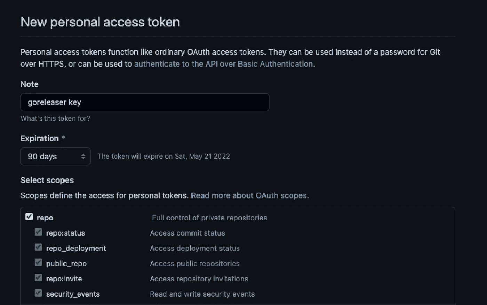

# 介绍 Medium-auto-post |将您的 Hugo 内容整合到 Medium.com

> 原文：<https://blog.devgenius.io/introducing-medium-auto-post-syndicate-your-hugo-content-to-medium-com-3fd760ce09?source=collection_archive---------9----------------------->


MediumAutoPost 简介

在之前的一篇文章中，我概述了如何建立你的 Hugo 网站，这样你就可以轻松地将你的文章整合到 medium.com。我还提供了一个 Postman 集合，它可以完成发布新内容的繁重工作。虽然这样做很好，但我想做得更好。

 [## 自动生成一个 Medium.com REST API 有效负载，与 Hugo 联合发布帖子

### 通过自动为…生成 API 有效负载，使用 hugo 轻松将您的网站或博客文章整合到 medium.com

askcloudarchitech.com](https://askcloudarchitech.com/posts/tutorials/auto-generate-post-payload-medium-com/) 

也就是说，我想做这些改进:

1.  删除 postman 集合，并用可以在终端中使用的 CLI 工具替换它
2.  不再需要提供你想发送到 medium.com 的文章的网址
3.  跟踪和存储哪些文章已经被整合，以避免发布重复的内容
4.  只需一个简单的命令就可以完成所有这些工作

所以…为了实现这个目标，我创建了[媒体自动邮报](https://github.com/askcloudarchitech/mediumautopost)！这是一个用 Go 编写的 CLI 工具，完成了我上面列出的所有改进。本文将涵盖让这一切正常工作所需的所有一次性设置步骤。我们开始吧！

[](https://github.com/askcloudarchitech/mediumautopost) [## GitHub-askclouarchitech/mediumautofost

### Mediumautopost 是一个 CLI 工具(和一个 Go 软件包),它会自动将您网站的文章发布到 medium.com 作为…

github.com](https://github.com/askcloudarchitech/mediumautopost) 

## 第一步:安装 mediumautopost

安装工具很容易！如果你的 mac 上安装了家酿软件，只需运行这两个步骤:

```
brew tap askcloudarchitech/askcloudarchitech 
brew install mediumautopost
```

如果你没有自制软件或者你更喜欢手动安装应用程序，你也可以在这里获取二进制文件

## 第二步:创建一个保存发布状态的地方

MediumAutoPost 最好的特性之一是它能够记住哪些邮件已经发送到 medium.com。由于 mediumautopost 是为 Hugo 设计的，而 Hugo 实际上没有能力保存内容的状态(因为它是一个静态生成内容的工具)，我们需要建立一个永久的地方来存储单个帖子的发布状态。

在构建这个工具时，我将这个发布信息存储在一个 git repo 中。我选择这个有几个原因:

1.  Github 是一个非常通用的工具，很多人都在使用
2.  免费的！如果你还没有注意到，我在这里做的一切从虚拟主机到出版物和自动化都是完全免费的。这对我维护一个非常低成本的内容发布解决方案非常重要。

这个过程非常简单。去 github.com 创建一个新的回购协议。我称我的媒体发布状态，如果你想看一个例子，你可以在这里看到它。您甚至不需要向这个回购添加任何文件。MediumAutoPost 将为您完成所有这些工作。

接下来，您需要创建一个 Github 个人访问令牌，这样程序就有权限更新 repo。前往 https://github.com/settings/tokens[点击“生成新令牌”按钮。在“注释”字段中提供名称，选择到期日期并选中“回购”旁边的框，然后点击底部的“生成令牌”。复制令牌，暂时放在安全的地方。注意:对这个令牌保密。](https://github.com/settings/tokens)



在 GitHub 上创建个人访问令牌

我还应该补充一点，如果你不想做 Github 状态设置，你也可以在你的计算机上本地存储状态文件。我将在下一步中介绍这一点。只是一个警告:如果您选择本地存储选项，请小心。如果你丢失了文件，程序将不知道它已经在 medium.com 发布了什么帖子。

## 第三步:填充环境变量

运行该命令之前的最后一步是创建设置文件。以下是该文件的一个示例:

```
MEDIUM_ENDPOINT_PREFIX="https://api.medium.com/v1"
MEDIUM_BEARER_TOKEN="get token from medium. paste here"
WEBSITE_JSON_INDEX_URL="path to your json index file"
GITHUB_PERSONAL_TOKEN="generate a personal access token and paste here"
GITHUB_STATUS_REPO_OWNER="your Github account name"
GITHUB_STATUS_REPO="repo name for storing the status of posts to medium.com"
STORAGE_TYPE=""
STORAGE_FILE_PATH="/OPTIONAL/PATH/TO/STATUS/FILE.json"
```

这些设置指导 MediumAutoPost 如何提取您的文章并将其发布到 medium.com。让我们浏览一下这些台词，并逐一讨论。

MEDIUM_ENDPOINT_PREFIX:这只是 medium API 的 URL 的开始。您可以保持原样
媒体承载令牌:[在之前的文章](https://askcloudarchitech.com/posts/tutorials/auto-generate-post-payload-medium-com/#step-1-generate-a-mediumcom-access-token)中，我解释了如何获得媒体承载令牌。将您的令牌放在这里
WEBSITE_JSON_INDEX_URL:同样，在第一篇文章中，我概述了这个步骤。将您的索引文件的 URL 放在这里
Github_PERSONAL_TOKEN:如果您使用 GITHUB 来存储您的发布状态，请将您的个人访问令牌放在这里
GITHUB_STATUS_REPO_OWNER:这应该是您的 GITHUB 用户名。例如，在我的例子中，它是 askclouarchitech
GITHUB _ STATUS _ REPO:这应该是您使用上面概述的步骤创建的 REPO 的名称
STORAGE_TYPE:如果使用 GITHUB 存储您的状态，您可以将其留空。如果您想使用本地文件方法，将其设置为“FILE”
STORAGE _ FILE _ PATH:如果使用本地文件方法，键入您想要保存状态文件的路径

现在您已经创建了设置文件，只需将它保存在某个地方并记下文件的路径。

## 第四步:运行工具并发布你的内容

最后一步是运行命令。从您的终端，运行`mediumautopost -e /path/to/your/.env`，用您在上面创建的设置文件的实际路径替换命令中的路径。如果一切顺利，您应该会看到一些输出，告诉您您的帖子已经提交！

现在前往 medium.com，登录你的账户。去你的草稿区，你会看到你的文章。您可以进行任何必要的调整，然后发布。

最后，检查你的状态报告。应该有一个名为 status.json 的文件，其中包含发布到 medium 的每篇文章的详细信息。该文件将在以后的运行中使用，以确保这些相同的帖子不会发布两次。