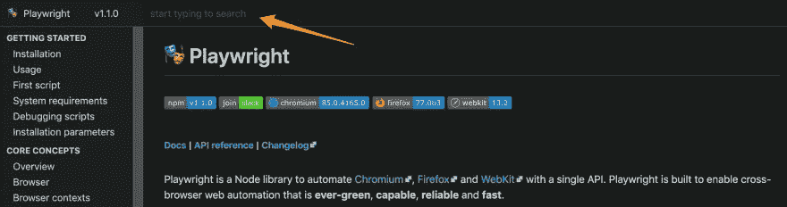

# 介绍剧作家🎭

> 原文：<https://blog.devgenius.io/introducing-playwright-e0d035575afb?source=collection_archive---------8----------------------->


介绍剧作家，一个最新且发展最快的无头自动化库。由微软于 2020 年 1 月发布的剧作家是一个 Node.js 库，宣传高性能、可靠和自由的浏览器自动化。

# 迷人的浏览器品质🐈

与其他类似的解决方案相比，你会发现剧作家的一个主要优势是它可以编排的浏览器的**范围**。它支持 Linux、Windows 和 Mac 操作系统上基于 Chromium、Firefox 和 WebKit 的浏览器。是的，你没听错，你可以在 Linux 或 Windows 上运行“类似 Safari”的浏览器；没什么新的，只是[的 WebKit](https://webkit.org/) 。协议驱动的浏览器库的速度和可靠性与真正广泛的浏览器覆盖范围相结合，这是一个惊人的优势。
*剧作家是如何做到打破常规的*？

如上所述，对于基于 Chromium 的浏览器，以与 Puppeteer 类似的方式，下载 Chromium/Chrome 版本，并使用 [Chrome DevTools 协议](https://chromedevtools.github.io/devtools-protocol/)来编排浏览器实例。对于 Firefox 和 WebKit 引擎，剧作家所做的是再次下载实际的浏览器，但**扩展了他们的调试协议能力**以提供统一的 API 和功能。没有对实际的浏览器进行修改，因此它在测试中和真实用户的浏览器中的工作是完全一样的。
*要得到一个填充的“补丁”你大概可以看一下* [*下的资源库 _patches 文件夹*](https://github.com/microsoft/playwright) *。*

# 从木偶师开始💼

如果你过去使用过[木偶剧](https://pptr.dev/)并且对它的精彩部分感到兴奋，剧作家承诺它会更有力量。只要看一眼剧作家官方网站上的 API，你会很快注意到它看起来和木偶师的 API 有点像。你当然是对的，这不是偶然的。
事实是**制作《木偶师》的同一个团队，现在已经转移到微软，继续从《木偶师》衍生出剧作家**👀

剧作家团队并不觉得有必要卷入*公司政治*或*开源动态*，他们承诺提供一个更好、更易于测试的 API，以及针对多页面场景性能、云原生操作和其他好处的重大改进。与此同时，保留来自木偶师代码库的迁移场景，这几乎是一项“机械的”和简单的任务。

那我们跳进去吧！

# 安装步骤

*首先确保你所在的机器安装了 Node.js > =v10.15.0，这样我们就可以使用当前的剧作家版本。*

创建一个名为**剧作家示例**的新项目文件夹，这样我们就可以开始烹饪了🍳

```
mkdir playwright-example
  cd playwright-example
```

现在来设置我们的 Node.js 项目。

```
npm init -y
```

预先设置(*有趣的是，我们有这些东西*😅)准备就绪，现在进行实际设置:

```
npm install playwright
```

正如你在控制台上看到的那样，安装剧作家会拉出特定版本的 Chromium、Firefox 和 WebKit。在你的机器缓存中的一个特殊位置有额外的大约 250mb 的下载，你就获得了图书馆正当宣传的浏览器支持。

## 小迂回🏝

为了缓解你可能因为这个想法而产生的紧张情绪，我们将绕一个小弯:

> *这个 WebKit 是什么，我如何才能确信它在 Linux/Windows 上的表现类似于 Safari？*

首先讲一些基础知识。你所知道的“商业”浏览器，如谷歌 Chrome、Mozilla Firefox、苹果 Safari 和其他浏览器，是建立在渲染/浏览器引擎之上的，每个供应商都为其用户群添加了一些好东西。最知名的引擎是分别被 Chrome/Chromium/Microsoft Edge/Opera、Firefox 和 Safari 使用的 Blink、Gecko 和 WebKit。换句话说，它是浏览器主要功能的基础。

您可以在 Windows/Linux 上使用剧作家运行 WebKit，并期望在真正的 Safari 浏览器上获得类似的结果，因为页面布局和 JavaScript 执行(*由*[*JavaScript core*](https://developer.apple.com/documentation/javascriptcore))基本相同。在渲染工作方式、性能、音频、视频和图像等更专业的领域可能会有所不同，但可能会适合您的使用情况。

如果你想了解更多或了解剧作家的最新消息，请继续关注 [*阿琼·阿塔姆*](https://twitter.com/arjunattam) *，你不会失望的。*

# 发射台🚀

让我们用最基本的命令来创建我们的启动板，以便启动并运行剧作家。

*触摸*一个包含以下内容的`index.js`文件:

```
const playwright = require("playwright");(async function(){
  const browser = await playwright.webkit.launch({ headless: false }); // Non-headless mode to feel comfy
  const context = await browser.newContext(); // So much to say, but another time
  const page = await context.newPage(); // Create a new Page instance which handles most of your needs await page.goto("https://playwright.dev"); // Navigate to the Playwright webpage
  await page.waitForTimeout(5000); // Rest your eyes for five seconds
  await browser.close(); // Close the browser
})();
```

# 从简单的事情开始

为了体验一下，我们打算在剧作家官方网站上测试自动完成搜索功能。搜索组件供用户搜索主题、文档和 API 方法或剧作家。我们的目标是模拟用户浏览页面并使用该组件搜索特定方法的场景。



在一个*单页应用*类型的网站中，结构良好、动态更新的组件，对于一个试驾者来说，这看起来真的是一笔不错的交易。我们的第一个目标是建立用户需要采取的步骤，以达到找到她正在寻找的 API 方法的目标。

# 用户期望🥂

**1。**打开页面
**2。**尝试查找自动完成搜索
**3。**为他正在寻找的 API 方法键入他的查询
**4。**点击列表中最相关的结果
**5。**期望看到包含他所选项目的部分

现在让我们看看我们期望用户采取的*步骤*如何被翻译成剧作家的命令。

```
/* Somewhere else... */
const Homepage = {
  autocompleteSearchInput: "search-view input",
};
const apiSearchTerm = "context"; // The API method we are looking for
/* ... */await page.goto("https://playwright.dev", { waitUntil: "networkidle" });
await page.type(Homepage.autocompleteSearchInput, apiSearchTerm);// Check for 'methods' that have the specific search term 
await page.click(`//search-suggestions/a[contains(@href, 'api.md')]//mark[.='${apiSearchTerm}']`);// Find the method name title using XPath
const $apiMethod = await page.$("xpath=//header-with-link//h4[contains(.,'context')]");// Check if this method name section is actually visible on the viewport
const isApiMethodVisible = await $apiMethod.boundingBox();
assert.notEqual(isApiMethodVisible, null);
```

正如你在上面看到的，将用户交互表达成代码的 API 至少在我看来非常直观。与 Puppeteer 类似，您可以预期用户可以采取的大多数操作都被翻译成直接的页面实例方法( *type、click、dblclick 等……*)。

我们可以考虑的一点是用于检测我们正在寻找的 API 方法是否确实在浏览器视窗中的命令组合。在这个领域有经验的人知道，要断言这个事实，你要么创建你自己的定制命令(*进行视口尺寸计算*)要么依赖一个已经为我们实现的框架命令。

这里的区别因素是，我们直接从剧作家那里获得的命令可以被认为是最可靠的，仅仅因为它是由平台本身提供的。

# 少了一两件东西🙈

在我们都同意 API 相当直观且易于使用之后，我们可以回顾并提及一些在使我们的开发体验变得更好方面似乎“缺失”的东西。

## 1)用关键字`async`填充你的代码

正如你肯定观察到的，有这个 *async* 关键字，你必须把它撒在你的代码中，至少对我来说感觉有点嘈杂。这个关键字是必需的，因为浏览器 API 具有事件驱动的特性。用 JavaScript 围绕异步和事件驱动平台编码的方法是使用[承诺](https://developer.mozilla.org/en-US/docs/Web/JavaScript/Reference/Global_Objects/Promise)来建模你的操作，而剧作家已经做到了。

为了减轻处理这些异步操作的痛苦，JavaScript 在语言语法中添加了一些新的关键字。这些关键字是你在我们的代码上看到的[异步&等待](https://developer.mozilla.org/en-US/docs/Web/JavaScript/Reference/Statements/async_function)。因为剧作家的 API 需要使用承诺，所以我们编写代码的最佳方式是对大多数命令使用这种 *async/await* 语法。

## 2)尚无可用的链接

由于一些设计决策和库的性质，正如我们在上面提到的，目前还不支持我们所谓的*方法链接*。有了这种能力，我们的代码阅读起来会更加流畅。想象一下:

```
await page.$("search-view input").click().type("context").submit();
```

但在某个时刻，我们可能会到达那里！

# 关闭🧘‍♂️

所以这是让你开始写你的第一个剧作家剧本来断言一个实际的用户场景的一瞥。每个命令和功能都有很多值得一提的地方，但是我们会在 Web 自动化之家[的菜谱中看到它们。](https://www.thehomeofwebautomation.com/)

特别是剧作家宣传的 *BrowserContext* 是一种抽象，可以使用本地或甚至来自云的并行化来释放更多的能力和性能。很兴奋能尝试一下！

剧作家可能对这个领域来说似乎是新的，但相反，正如我们前面提到的，它有着悠久的历史。如果你想用它来对抗另一个工具，或者把它作为*‘X 杀手’*来介绍，抱歉，我们在这里不这么做。我至少可以说，如果您的应用程序拥有相当多的基于 WebKit 的浏览器用户，那么尝试一下剧作家吧，您的用户会为此感谢您的💪

和其他工具一样，从任何能吸引你的注意力、让你感觉舒服并能以更简单的方式满足你实际需求的东西开始。

*十字贴来自*[*Web 自动化之家*](https://www.thehomeofwebautomation.com/getting-started-playwright/)

*图像由* [*提婆*](https://pixabay.com/users/Devanath-1785462/?utm_source=link-attribution&utm_medium=referral&utm_campaign=image&utm_content=1248088) *从* [*Pixabay*](https://pixabay.com/?utm_source=link-attribution&utm_medium=referral&utm_campaign=image&utm_content=1248088)